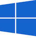

# Moddable SDK – Getting Started
### A guide to installing the Moddable SDK and building its tools
Copyright 2016-2023 Moddable Tech, Inc.<BR>
Revised: January 9, 2023

This document provides instructions to install the Moddable SDK and build its tools on the computer you use for development.

## Table of Contents

* [Overview](#overview) <pl style="background-color:yellow;">(start here!)</pl>
* Setup instructions

	| [](#mac) | [](#windows) | [](#linux) |
	| :--- | :--- | :--- |
	| •  [System requirements](#mac-requirements)<BR>•  [Installing](#mac-instructions)<BR>•  [Troubleshooting](#mac-troubleshooting)<BR>•  [Updating](#mac-update) | •  [System requirements](#win-requirements)<BR>•  [Installing](#win-instructions)<BR>•  [Troubleshooting](#win-troubleshooting)<BR>•  [Updating](#win-update) | •  [System requirements](#lin-requirements)<BR>•  [Installing](#lin-instructions)<BR>•  [Updating](#lin-update)

* [What's Next](#dev-boards-and-mcus): Building and Running Apps on Development Boards and MCUs

<a id="overview"></a>
## Overview

To get started with the Moddable SDK, take the following steps:

#### Step 1: Build the Moddable SDK tools 

Follow the **Installing** instructions in the section below for your computer's OS. These instructions will have you verify your setup by running the `helloworld` example on a desktop simulator using `mcconfig`, a command line tool that builds and runs Moddable applications. 

> For more information about the desktop simulator, see the **Simulator** section of the [tools documentation](./tools/tools.md#simulator).

You will also learn how to open `xsbug`, the JavaScript source level debugger that is built as part of the Moddable SDK tools. `xsbug` is a full featured debugger that supports debugging modules and applications for XS platforms.

Similar to other debuggers, `xsbug` supports setting breakpoints, browsing source code, the call stack and variables. The `xsbug` debugger additionally provides real-time instrumentation to track memory usage and profile application and resource consumption.

> For more information abut `xsbug`, see the [xsbug](./xs/xsbug.md) documentation.


#### Step 2: Install tools for your target platform(s)

To run applications on a device, you have to install the required SDKs, drivers and development tools for your target platform. The `devices` folder contains instructions for all MCUs supported by the Moddable SDK. See the [What's Next](#dev-boards-and-mcus): Building and Running Apps on Development Boards and MCUs section of this document for more details and links to instructions for your target platform.

#### Step 3: Try out some examples

This repository includes over [150 example apps](./../examples) that demonstrate how to use many features of the Moddable SDK. Many are less than one page of source code to focus on demonstrating how to use a specific capability. 

#### Step 4: Build your own apps

When you are ready to customize the example apps or build your own from scratch, documentation and source code for all of the JavaScript APIs is available. All documentation is provided in markdown format. Software modules that make up the runtime of the Moddable SDK are in the [modules](./../modules) directory.

The **documentation**, **examples**, and **modules** directories share a common structure to make it straightforward to locate information.

- **base**: Fundamental runtime capabilities including time, timer, debug, instrumentation, and UUID
- **commodetto**: Bitmap graphics library
- **crypt**: Cryptographic primitives and TLS
- **data**: Base64 and hex encoding
- **drivers**: Device drivers for displays, touch inputs, sensors, and expanders
- **files**: Storage capabilities including files, flash, preferences, resources, and zip
- **network**: Network socket and protocols built on socket including HTTP, WebSockets, DNS, SNTP, telnet, and TLS; also, Wi-Fi and BLE APIs.
- **pins**: Hardware protocols including digital (GPIO), analog, PWM, and I2C
- **piu**: User interface framework

<a id="mac"></a>
## macOS

<a id="mac-requirements"></a>
### System Requirements

The Moddable SDK requires macOS Sierra (Version 10.12) or newer and a full installation of Xcode version 9 or newer.

<a id="mac-instructions"></a>
### Installing

1. Download and install [Xcode](https://developer.apple.com/xcode/). Launch Xcode to install additional command line components when prompted.

2. Create a `Projects` directory in your home directory at `~/Projects` for the Moddable SDK repository.

	> Note: The Moddable SDK repository can be downloaded to any directory. These instructions assume the Moddable SDK is downloaded to the `~/Projects` directory.
	
3. Download the [Moddable repository](https://github.com/Moddable-OpenSource/moddable), or use the `git` command line tool as follows:

	```text
	cd ~/Projects
	git clone https://github.com/Moddable-OpenSource/moddable
	```

4. Open your shell startup/initialization file. 

	For macOS Mojave and earlier, the default shell is `bash`, so you should open `~/.profile`. 

	```text
	open ~/.profile
	```
	
	Starting with macOS Catalina, the [default shell is `zsh`](https://support.apple.com/en-us/HT208050), so you should open `~/.zshrc`.
	
	```text
	open ~/.zshrc
	```

	> Note: If executing the above command gives you an error saying that your shell startup/initializaiton file does not exist, you can create the appropriate file using the `touch` command. For example, `touch ~/.zshrc`.

5. Add the following lines to the file you just opened and save. This sets up the `MODDABLE` environment variable to point at your local Moddable SDK repository directory and edits the `PATH` environment variable to include the build directory.

	```text
	export MODDABLE="/Users/<user>/Projects/moddable"
	export PATH="${MODDABLE}/build/bin/mac/release:$PATH"
	```

5. Adding the export statements to your `~/.profile` or `~/.zshrc` does not update the environment variables in active shell instances, so open a new shell instance (by opening a new tab/window) or manually run the export statements in your shell before proceeding.
	
6. Build the Moddable command line tools, simulator, and debugger from the command line:

	```text
	cd ${MODDABLE}/build/makefiles/mac
	make
	```
	
7. Launch the `xsbug` debugger from the command line:

	```text
	open ${MODDABLE}/build/bin/mac/release/xsbug.app
	```

8. Verify the host environment setup by building the starter `helloworld` application for the desktop simulator target:

	```text
	cd ${MODDABLE}/examples/helloworld
	mcconfig -d -m -p mac
	```

9. **IMPORTANT:** You can now build and run applications for the desktop simulator. To build and run applications on a development board or MCU, you need to install additional SDKs, drivers, and development tools for your target platform. See the [What's Next](#dev-boards-and-mcus) (Building and Running Apps on Development Boards and MCUs) section of this document for more details and links to instructions.

<a id="mac-troubleshooting"></a>
### Troubleshooting

- If the Moddable SDK build fails with an error like "`xcode-select: error: tool 'ibtool' requires Xcode, but active developer directory '/Library/Developer/CommandLineTools' is a command line tools instance.`" there are three potential issues and fixes:
	 1. You may have a command line tools-only Xcode installation. The Moddable SDK build requires a full installation of Xcode. 
	 2. You may need to launch the Xcode application to accept Xcode's license agreement and install the command line components. 
	 3. If you have a full Xcode installation but your build fails with this error, you need to use the `xcode-select` utility to select your full Xcode installation. This can be done with this command, with the path adjusted as necessary for your environment: `sudo xcode-select -s /Applications/Xcode.app/Contents/Developer`

<a id="mac-update"></a>
### Updating

The Moddable SDK tools are frequently updated with improvements and added functionality. You should occasionally update your host environment by following these steps:
	
1. Update your local clone of the [Moddable repository](https://github.com/Moddable-OpenSource/moddable):

	```text
	cd $MODDABLE
	git pull
	```

	> Note that if you have any local changes to Moddable repository files, you may need to stash your changes and then reapply them after pulling:

	```text
	cd $MODDABLE
	git stash push
	git pull
	git stash pop
	```
	
2. Delete any existing Moddable SDK build outputs:

	```text
	cd $MODDABLE
	rm -rf build/bin
   rm -rf build/tmp
	```
	
3. Build the Moddable command line tools, simulator, and debugger:

	```text
	cd ${MODDABLE}/build/makefiles/mac
	make
	```

4. Verify the host environment setup by building the starter `helloworld` application for the desktop simulator target:

	```text
	cd ${MODDABLE}/examples/helloworld
	mcconfig -d -m -p mac
	```
	
<a id="windows"></a>
## Windows

<a id="win-requirements"></a>
### System Requirements

The Moddable SDK requires Windows 8.1 or newer and Microsoft Visual Studio Community 2017 or newer. We recommend Windows 10 or Windows 11 and Microsoft Visual Studio Community 2022.

<a id="win-instructions"></a>
### Installing

1. Download the [Microsoft Visual Studio 2022 Community installer](https://www.visualstudio.com/downloads/). 

2. Launch the installer. On the "Workloads" tab, select the "Desktop development for C++" option. On the "Individual Components" tab, select "Windows 10 SDK (10.0.19041.0)" (this should be preselected on Windows 10 systems but must be manually included on Windows 11 systems). Proceed with the installation as configured.

3. Create a `Projects` directory in your `%USERPROFILE%` directory, e.g. `C:\Users\<your-user-name>` for the Moddable SDK repository.

	> Note: The Moddable SDK repository can be downloaded to any directory. These instructions assume the Moddable SDK is downloaded to the `%USERPROFILE%` directory.

4. Download the [Moddable repository](https://github.com/Moddable-OpenSource/moddable), or use the `git` command line tool as follows:

	```text
	cd %USERPROFILE%\Projects
	git clone https://github.com/Moddable-OpenSource/moddable
	```

5. Open the "Environment Variables" dialog of the Control Panel app by following [these instructions](https://www.architectryan.com/2018/08/31/how-to-change-environment-variables-on-windows-10/). From that dialog:
 - Create a User Variable called `MODDABLE` and set it to point at your local Moddable SDK repository directory. Update the path as necessary for you system by navigating to the Moddable SDK folder using the "Browse Directory..." button.
	- Variable Name: `MODDABLE` 
	- Variable Value: `%USERPROFILE%\Projects\moddable`

 - Edit the User Variable `Path` to include the Moddable SDK tools directory. Update the path as necessary for your system by navigating to the correct folder using the "Browse..." button.
	- Variable Name: `Path`
	- Variable Value (add to the existing list): `%USERPROFILE%\Projects\moddable\build\bin\win\release`

	> Note: The `%USERPROFILE%\Projects\moddable\build\bin\win\release` directory will be created in the next step. It is safe to set the environment variable now or to come back after Step 6 to add it to the `Path`.

	> Note: Make sure you open a new Command Prompt after setting the environment variables. The new environment settings will not take effect in existing Command Prompt instances.
	
6. Launch the "x86 Native Tools Command Prompt for VS 2022" command line console. Build the Moddable command line tools, simulator, and debugger from the command line:

	```text
	cd %MODDABLE%\build\makefiles\win
	build
	```
	
	> Note: There is an alternative build batch file called `parallel_build.bat` that can be used on multi-core systems to significantly speed up the Moddable SDK build. It is, however, more difficult to see diagnostic error messages when using this batch file. If `build.bat` works correctly on your system, consider using `parallel_build.bat` for future Moddable SDK builds.
	

7. Launch the `xsbug` debugger from the command line:

	```text
	xsbug
	```
	
8. Verify the host environment setup by building the starter `helloworld` application for the desktop simulator target:

	```text
	cd %MODDABLE%\examples\helloworld
	mcconfig -d -m -p win
	```

9. **IMPORTANT:** You can now build and run applications for the desktop simulator. To build and run applications on a development board or MCU, you need to install additional SDKs, drivers, and development tools for your target platform. See the [What's Next](#dev-boards-and-mcus) (Building and Running Apps on Development Boards and MCUs) section of this document for more details and links to instructions.

<a id="win-troubleshooting"></a>
### Troubleshooting

 - If the Moddable SDK build fails with an error like "`LINK : fatal error LNK1104: cannot open file '<Moddable path>\build\bin\win\release\<tool name>.exe'`", it most likely indicates a conflict with antivirus software as described in [this document from Microsoft](https://docs.microsoft.com/en-us/cpp/error-messages/tool-errors/linker-tools-error-lnk1104?view=vs-2019). Please try excluding the `%MODDABLE%` directory from your antivirus software's live scanning capability during the build process.

 - If the Moddable SDK build fails with the error "`'nmake' is not recognized as an internal or external command, operable program or batch file.`" there are three potential issues and fixes:
	1. You may not have Visual Studio installed. We recommend using the [Microsoft Visual Studio 2022 Community Edition installer](https://www.visualstudio.com/downloads/).
	2. When you installed Visual Studio, you may not have chosen the "Desktop development for C++" workload option. Re-run [the installer](https://www.visualstudio.com/downloads/) and choose that workload for installation.
	3. You may have inadvertently attempted the build in the default Command Prompt rather than the "x86 Native Tools Command Prompt for VS 2022." This Command Prompt sets important environment variables for the build and can be found by searching for "x86 Native Tools" in the Start Menu.

 - If the Moddable SDK build fails with an error like "`fatal error LNK1112: module machine type 'x64' conflicts with target machine type 'x86'`", you have most likely attempted the build in the "x64 Native Tools Command Prompt for VS 2022" rather than the correct "x86 Native Tools Command Prompt for VS 2022." This Command Prompt sets important environment variables for the build and can be found by searching for "x86 Native Tools" in the Start Menu.

<a id="win-update"></a>
### Updating

The Moddable SDK tools are frequently updated with improvements and added functionality. You should occasionally update your host environment by following these steps.

	> Note: The following commands should all be run in the "x86 Native Tools Command Prompt for VS 2022" command line console.

1. Update your local clone of the [Moddable repository](https://github.com/Moddable-OpenSource/moddable):

	```text
	cd %MODDABLE%
	git pull
	```

	> Note that if you have any local changes to Moddable repository files, you may need to stash your changes and then reapply them after pulling:

	```text
	cd %MODDABLE%
	git stash push
	git pull
	git stash pop
	```

2. Delete any existing Moddable SDK build outputs:

	```text
	cd %MODDABLE%\build\makefiles\win
	build clean
	```

3. Build the Moddable command line tools, simulator, and debugger:

	```text
	cd %MODDABLE%\build\makefiles\win
	build
	```

	> Note: There is an alternative build batch file called `parallel_build.bat` that can be used on multi-core systems to significantly speed up the Moddable SDK build. It is, however, more difficult to see diagnostic error messages when using this batch file. If `build.bat` works correctly on your system, consider using `parallel_build.bat` for future Moddable SDK builds.
		
4. Verify the host environment setup by building the starter `helloworld` application for the desktop simulator target:

	```text
	cd %MODDABLE%\examples\helloworld
	mcconfig -d -m -p win
	```
	
<a id="linux"></a>
## Linux

<a id="lin-requirements"></a>
### System Requirements

The Moddable SDK has been tested on the Ubuntu 16.04 LTS (64-bit) and Raspberry Pi Desktop (32-bit) operating systems. These instructions assume that a GCC toolchain has already been installed.

<a id="lin-instructions"></a>
### Installing

1. Install or update the packages required to compile:

	```text
	sudo apt-get install gcc git wget make libncurses-dev flex bison gperf
	```

2. Install the development version of the GTK+ 3 library:

	```text
	sudo apt-get install libgtk-3-dev
	```

3. Create a `Projects` directory in your home directory at `~/Projects` for the Moddable SDK repository.

	> Note: The Moddable SDK repository can be downloaded to any directory. These instructions assume the Moddable SDK is downloaded to the `~/Projects` directory.

4. Download the [Moddable repository](https://github.com/Moddable-OpenSource/moddable), or use the `git` command line tool as follows:

	```text
	cd ~/Projects
	git clone https://github.com/Moddable-OpenSource/moddable
	```

5. Setup the `MODDABLE` environment variable in your `~/.bashrc` file to point at your local Moddable SDK repository directory:

	```text
	MODDABLE=~/Projects/moddable
	export MODDABLE
	```

	> Note: You must open a new shell instance or manually run the export statements in your shell before proceeding. Adding the export statements to your `~/.profile` does not update the environment variables in active shell instances.

6. Build the Moddable command line tools, simulator, and debugger from the command line:

	```text
	cd $MODDABLE/build/makefiles/lin
	make
	```
	
7. Update the `PATH` environment variable in your `~/.bashrc` to include the tools directory:

	```text
	export PATH=$PATH:$MODDABLE/build/bin/lin/release
	```

	> Note: You must open a new shell instance or manually run the export statements in your shell before proceeding. Adding the export statements to your `~/.profile` does not update the environment variables in active shell instances.

8. Install the desktop simulator and `xsbug` debugger applications:

	```text
	cd $MODDABLE/build/makefiles/lin
	make install
	```

	When prompted, enter your `sudo` password to copy the application's desktop, executable and icon files into the standard `/usr/share/applications`, `/usr/bin`, and `/usr/share/icon/hicolor` directories.
	
9. Launch the `xsbug` debugger from the command line:

	```text
	xsbug
	```
	
10. Verify the host environment setup by building the starter `helloworld` application for the desktop simulator target:

	```text
	cd $MODDABLE/examples/helloworld
	mcconfig -d -m -p lin
	```

11. **IMPORTANT:** You can now build and run applications for the desktop simulator. To build and run applications on a development board or MCU, you need to install additional SDKs, drivers, and development tools for your target platform. See the [What's Next](#dev-boards-and-mcus) (Building and Running Apps on Development Boards and MCUs) section of this document for more details and links to instructions.

<!--<a id="lin-troubleshooting"></a>
### Troubleshooting
-->

<a id="lin-update"></a>
### Updating

The Moddable SDK tools are frequently updated with improvements and added functionality. You should occasionally update your host environment by following these steps:

1. Ensure that the development version of the GTK+ 3 library is installed and up to date:

	```text
	sudo apt-get update
	sudo apt-get install libgtk-3-dev
	sudo apt-get upgrade libgtk-3-dev
	```
	
2. Update your local clone of the [Moddable repository](https://github.com/Moddable-OpenSource/moddable):

	```text
	cd $MODDABLE
	git pull
	```

	> Note that if you have any local changes to Moddable repository files, you may need to stash your changes and then reapply them after pulling:

	```text
	cd $MODDABLE
	git stash push
	git pull
	git stash pop
	```

3. Delete any existing Moddable SDK build outputs:

	```text
	cd $MODDABLE
	rm -rf build/tmp
	rm -rf build/bin
	```
	
4. Build the Moddable command line tools, simulator, and debugger:

	```text
	cd $MODDABLE/build/makefiles/lin
	make
	```

5. Install the desktop simulator and `xsbug` debugger applications:

	```text
	cd $MODDABLE/build/makefiles/lin
	make install
	```

	When prompted, enter your `sudo` password to copy the application's desktop, executable and icon files into the standard `/usr/share/applications`, `/usr/bin`, and `/usr/share/icon/hicolor` directories.
		
6. Verify the host environment setup by building the starter `helloworld` application for the desktop simulator target:

	```text
	cd $MODDABLE/examples/helloworld
	mcconfig -d -m -p lin
	```

<a id="dev-boards-and-mcus"></a>
## What's Next: Building and Running Apps on Development Boards and MCUs

To build and run applications on a development board or MCU, you will need to install additional SDKs, drivers, and development tools for your target platform. These tools are provided by the manufacturer of the MCU and are not part of the Moddable SDK, but the `devices` folder contains instructions we wrote to guide you through the installation process. 

The table below links to some of the documents in the `devices` folder to help you quickly find instructions for your target platform:

| Device | Documents |
| :---: | :--- |
| ESP32 or ESP32-based products<BR>including Moddable Two, NodeMCU ESP32,<BR>and M5Stack development boards | [Using the Moddable SDK with ESP32](./devices/esp32.md)
| ESP8266 or ESP8266-based products<BR>including Moddable One, Moddable Three,<BR> and NodeMCU ESP8266 | [Using the Moddable SDK with ESP8266](./devices/esp8266.md)
| Giant Gecko, Mighty Gecko,<BR>Thunderboard Sense 2, or Blue Gecko | [Using the Moddable SDK with Gecko](https://github.com/Moddable-OpenSource/moddable/blob/public/documentation/devices/gecko/GeckoBuild.md)
| QCA4020 | [Using the Moddable SDK with QCA4020](./devices/qca4020/README.md)
| Raspberry Pi Pico | [Using the Moddable SDK with Pico](./devices/pico.md) |
