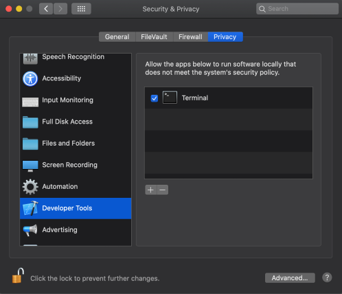

# Moddable SDK – Keeping Up To Date
Copyright 2020 Moddable Tech, Inc.<BR>
Revised: August 27, 2020

This document describes the steps that you should take to update the Moddable SDK. By following the steps in this guide, you can update your Moddable SDK git repository, rebuild the Moddable SDK tools, and update the target-specific build environments needed for the ESP8266 and ESP32.

These instructions assume that you have already completed the initial installation steps for your host environment and target platform (e.g. ESP8266 or ESP32). If you are just getting started with the Moddable SDK or a new target platform, use the [Getting Started](Moddable%20SDK%20-%20Getting%20Started.md) document instead.


## Table of Contents

* [macOS](#mac)
	* [Host environment update](#host-mac)
	* [ESP8266](#esp8266-mac)
	* [ESP32](#esp32-mac)
* [Windows](#windows)
	* [Host environment update](#host-windows)
	* [ESP8266](#esp8266-windows)
	* [ESP32](#esp32-windows)
* [Linux](#linux)
	* [Host environment update](#host-linux)
	* [ESP8266](#esp8266-linux)
	* [ESP32](#esp32-linux)

<a id="mac"></a>
## macOS

<a id="host-mac"></a>
### Host environment update

> The Moddable SDK requires macOS Sierra version 10.12 or newer and Xcode version 9 or newer. Beta releases of Xcode are not supported.

The Moddable SDK tools are frequently updated with improvements and added functionality. You should occasionally update your host environment by following these steps:
	
1. Update your local clone of the [Moddable repository](https://github.com/Moddable-OpenSource/moddable):

	```text
	cd $MODDABLE
	git pull
	```

	> Note that if you have any local changes to Moddable repository files, you may need to stash your changes and then reapply them after pulling:

	```text
	cd $MODDABLE
	git stash push
	git pull
	git stash pop
	```
	
2. Delete any existing Moddable SDK build outputs:

	```text
	cd $MODDABLE
	rm -rf build/bin
    rm -rf build/tmp
	```
	
3. Build the Moddable command line tools, simulator, and debugger:

	```text
	cd ${MODDABLE}/build/makefiles/mac
	make
	```

4. Verify the host environment setup by building the starter `helloworld` application for the desktop simulator target:

	```text
	cd ${MODDABLE}/examples/helloworld
	mcconfig -d -m -p mac
	```

<a id="esp8266-mac"></a>
### ESP8266 update

The Moddable SDK build for ESP8266 currently uses ESP8266 Arduino Core 2.3.0 and ESP8266_RTOS_SDK v3.2. 

To ensure that your build environment is up to date, perform the following steps:

1. Download the [ESP8266 core for Arduino repository](https://github.com/esp8266/Arduino/releases/download/2.3.0/esp8266-2.3.0.zip). Copy the extracted `esp8266-2.3.0` folder into your `~/esp` directory.

2. Update your cloned copy of the [ESP8266 SDK based on FreeRTOS](https://github.com/espressif/ESP8266_RTOS_SDK) and select the release/v3.2 branch:

	```text
	cd ~/esp/ESP8266_RTOS_SDK
    git fetch
    git checkout release/v3.2
    git pull
	```

3. If you have existing ESP8266 build output in `$MODDABLE/build/bin/esp` or `$MODDABLE/build/tmp/esp`, delete those directories:

    ```text
    cd $MODDABLE/build
    rm -rf bin/esp
    rm -rf tmp/esp
    ```

4. If you have updated to macOS Catalina (version 10.15), add an exemption to allow Terminal (or your alternate terminal application of choice) to run software locally that does not meet the system's security policy. Without this setting, the precompiled Xtensa toolchain used in builds for the ESP8266 will not be permitted to run. 

	To set the security policy exemption for Terminal, go into the Security & Privacy System Preferences, select the Privacy tab, choose Developer Tools from the list on the left, and then tick the checkbox for Terminal or the alternate terminal application from which you will be building Moddable SDK apps. The end result should look like this:

	

5. Verify the setup by building `helloworld` for the `esp` target:

	```text
	cd ${MODDABLE}/examples/helloworld
	mcconfig -d -m -p esp
	```

<a id="esp32-mac"></a>
### ESP32 update

The Moddable SDK build for ESP32 currently uses ESP-IDF v3.3.2 and the CMake option of Espressif's [`idf.py` tool](https://github.com/espressif/esp-idf/blob/master/tools/idf.py). 

To ensure that your build environment is up to date, perform the following steps:

1. Update your cloned copy of the ESP-IDF and select the v3.3.2 tag:

    ```text
    cd ~/esp32/esp-idf
    git fetch
    git checkout --recurse-submodules v3.3.2
    ```
	
2. Update homebrew and then verify that you have all the necessary tools and that they are up to date:

	```text
	brew update
	brew install python cmake ninja
	brew upgrade python cmake ninja
	sudo easy_install pip
	```
	
3. Each version of the ESP-IDF comes with an updated set of python dependencies. To keep up to date, run this command to install the required Python packages:

	```text
	python -m pip install --user -r ~/esp32/esp-idf/requirements.txt
	```
		
4. Verify the `IDF_PATH` and `PATH` environment variables are set correctly in your shell's user profile file (e.g. `~/.profile` or `~/.zshrc`, depending on your shell). Update the paths for your system.

	```
	export IDF_PATH=$HOME/esp32/esp-idf
	export PATH=$PATH:$HOME/esp32/xtensa-esp32-elf/bin:$IDF_PATH/tools
	```

	There are two optional environment variables for advanced users: `UPLOAD_PORT` and `ESP32_CMAKE`.<br><br>
	The ESP-IDF build/config tool `idf.py` automatically detects the serial port in most cases. If it does not, set the path of the port to use in the `UPLOAD_PORT` environment variable.

	```
	export UPLOAD_PORT=/dev/cu.SLAB_USBtoUART
	```

	The `UPLOAD_PORT` can also be specified on the `mcconfig` command line, which is useful when deploying to multiple ESP32 devices.
	
	```
	UPLOAD_PORT=/dev/cu.SLAB_USBtoUART mcconfig -d -m -p esp32
	```

	The `ESP32_CMAKE` environment variable controls whether the ESP-IDF is built using the newer CMake or older `make`-based tools. The default is 1, which builds with CMake. Set `ESP32_CMAKE` to 0 to use the older `make`-based build. Support for `make`-based builds will be removed in a future Moddable SDK update.

	> Note: You must open a new shell instance or manually run the export statements in your shell before proceeding. Adding the export statements to your `~/.profile` does not update the environment variables in active shell instances.

5. If you have existing ESP32 build output in `$MODDABLE/build/bin/esp32` or `$MODDABLE/build/tmp/esp32`, delete those directories:

    ```text
    cd $MODDABLE/build
    rm -rf bin/esp32
    rm -rf tmp/esp32
    ```

6. Verify the setup by building `helloworld` for the `esp32` target:

	```text
	cd ${MODDABLE}/examples/helloworld
	mcconfig -d -m -p esp32
	```
	
	> Note that the first time you build an application for the ESP32 target, the toolchain may prompt you to enter configuration options. If this happens, accept the defaults.

	> If you encounter SSL certificate errors while building the ESP-IDF, you may need to install Python 2.7 and the required packages manually. We've used [brew](https://brew.sh/) and [pip](https://pypi.org/project/pip/) to install the additional components:
	>
	```text
	brew install python
	brew install python@2
	pip install future
	pip install pyserial
	pip install cryptography
	```
    

<a id="windows"></a>
## Windows

<a id="host-windows"></a>
### Host environment update

The Moddable SDK tools are frequently updated with improvements and added functionality. You should occasionally update your host environment by following these steps:

1. Update your local clone of the [Moddable repository](https://github.com/Moddable-OpenSource/moddable). For instance, using `Git Bash`:

	```text
	cd $MODDABLE
	git pull
	```

	> Note that if you have any local changes to Moddable repository files, you may need to stash your changes and then reapply them after pulling:

	```text
	cd $MODDABLE
	git stash push
	git pull
	git stash pop
	```

2. Launch the "x86 Native Tools Command Prompt for VS 2019" command line console. Delete any existing Moddable SDK build outputs:

    ```text
    cd %MODDABLE%
    rmdir /S /Q build\tmp
    rmdir /S /Q build\bin
    ```

3. In the "x86 Native Tools Command Prompt for VS 2019" command line console, build the Moddable command line tools, simulator, and debugger:

	```text
	cd %MODDABLE%\build\makefiles\win
	build
	```
		
4. Verify the host environment setup by building the starter `helloworld` application for the desktop simulator target:

	```text
	cd %MODDABLE%\examples\helloworld
	mcconfig -d -m -p win
	```

<a id="esp8266-windows"></a>
### ESP8266 update

The Moddable SDK build for ESP8266 currently uses ESP8266 Arduino Core 2.3.0 and ESP8266_RTOS_SDK v3.2. 

To ensure that your build environment is up to date, perform the following steps:

1. Download the [ESP8266 core for Arduino repository](https://github.com/esp8266/Arduino/releases/download/2.3.0/esp8266-2.3.0.zip). Copy the extracted `esp8266-2.3.0` folder into your `esp` directory.

2. Update your cloned copy of the [ESP8266 SDK based on FreeRTOS](https://github.com/espressif/ESP8266_RTOS_SDK) and select the release/v3.2 branch. For instance, using `Git Bash`:

	```text
	cd ~/esp/ESP8266_RTOS_SDK
    git fetch
    git checkout release/v3.2
    git pull
	```

3. If you have existing ESP8266 build output in `%MODDABLE%\build\bin\esp` or `%MODDABLE%\build\tmp\esp`, delete those directories. For instance, using the "x86 Native Tools Command Prompt for VS 2019" command line console:

    ```text
    cd %MODDABLE%\build
    rmdir /S /Q bin\esp
    rmdir /S /Q tmp\esp
    ```

4. Launch the "x86 Native Tools Command Prompt for VS 2019" command line console. Verify the setup by building `helloworld` for the `esp` target:

	```text
	cd %MODDABLE%\examples\helloworld
	mcconfig -d -m -p esp
	```

<a id="esp32-windows"></a>	
### ESP32 update

The Moddable SDK build for ESP32 currently uses ESP-IDF v3.3.2 and the CMake option of Espressif's [`idf.py` tool](https://github.com/espressif/esp-idf/blob/master/tools/idf.py). 

To ensure that your build environment is up to date, perform the following steps:

1. Download and run the Espressif [ESP-IDF Tools Installer](https://dl.espressif.com/dl/esp-idf-tools-setup-1.2.exe). This will install or update the ESP32 Xtensa gcc toolchain, Ninja Build, and a Windows-based kconfig tool. This tool will also set your `PATH` to include the newly downloaded tools, as necessary.

    It is safe to accept all of the default options in the installer, or to change install locations as necessary.

    If you do not already have CMake or Python 2.7, the installer will also prompt you to download and install those tools (you should do so if needed).

2. Update your cloned copy of the ESP-IDF and select the v3.3.2 tag. For instance, with `Git Bash`:

    ```text
    cd ~/esp32/esp-idf
    git fetch
    git checkout --recurse-submodules v3.3.2
    ```

3. Verify the `IDF_PATH` and `PATH` Windows environment variables are set correctly. Update the paths for your system and remember to open a new shell instance to pick up these changes before proceeding. Setting environment variables in Windows is generally done [through System Properties](https://www.architectryan.com/2018/08/31/how-to-change-environment-variables-on-windows-10/).

    - `IDF_PATH`: the directory where you cloned the ESP-IDF, e.g. `%userprofile%\esp32\esp-idf`
    - `PATH`: Add the directory `%IDF_PATH%\tools` to your `PATH`.

	There are two optional environment variables for advanced users: `UPLOAD_PORT` and `ESP32_CMAKE`.<br><br>
	The ESP-IDF build/config tool `idf.py` automatically detects the serial port in most cases. If it does not, set the path of the port to use in the `UPLOAD_PORT` environment variable.

    - `UPLOAD_PORT`: the COM port for your device, e.g. `COM3`

	The `ESP32_CMAKE` environment variable controls whether the ESP-IDF is built using the newer CMake or older `MinGW`-based tools. The default is 1, which builds with CMake. Set `ESP32_CMAKE` to 0 to use the older `MinGW`-based build. Support for `MinGW`-based builds will be removed in a future Moddable SDK update.

	> Note: Remember to open a new Command Prompt before proceeding. Setting the environment variables in System Properties does not update the environment variables in active Command Prompt instances.

4. If you have existing ESP32 build output in `%MODDABLE%\build\bin\esp32` or `%MODDABLE%\build\tmp\esp32`, delete those directories. For instance, using the "x86 Native Tools Command Prompt for VS 2019" command line console:

    ```text
    cd %MODDABLE%\build
    rmdir /S /Q bin\esp32
    rmdir /S /Q tmp\esp32
    ```

5. Launch the "x86 Native Tools Command Prompt for VS 2019" command line console. Verify the setup by building `helloworld` for the `esp32` target:

	```text
	cd %MODDABLE%\examples\helloworld
	mcconfig -d -m -p esp32
	```

**Troubleshooting:**
 - If you get an error about Python dependencies not being installed, it means that the ESP-IDF installer failed to update Python. This usually happens due to permissions issues on your machine. To correct it, run `python -m pip install --user -r %IDF_PATH%\requirements.txt` from the "x86 Native Tools Command Prompt for VS 2019."	

<a id="linux"></a>
## Linux

<a id="host-linux"></a>
### Host environment update

> The Moddable SDK has been tested on the Ubuntu 16.04 LTS (64-bit) and Raspberry Pi Desktop (32-bit) operating systems. These instructions assume that a GCC toolchain has already been installed.

The Moddable SDK tools are frequently updated with improvements and added functionality. You should occasionally update your host environment by following these steps:

1. Ensure that the development version of the GTK+ 3 library is installed and up to date:

	```text
    sudo apt-get update
	sudo apt-get install libgtk-3-dev
    sudo apt-get upgrade libgtk-3-dev
	```
	
2. Update your local clone of the [Moddable repository](https://github.com/Moddable-OpenSource/moddable):

	```text
	cd $MODDABLE
	git pull
	```

	> Note that if you have any local changes to Moddable repository files, you may need to stash your changes and then reapply them after pulling:

	```text
	cd $MODDABLE
	git stash push
	git pull
	git stash pop
	```

3. Delete any existing Moddable SDK build outputs:

    ```text
    cd $MODDABLE
    rm -rf build/tmp
    rm -rf build/bin
    ```
	
4. Build the Moddable command line tools, simulator, and debugger:

	```text
	cd $MODDABLE/build/makefiles/lin
	make
	```

5. Install the Screen Test desktop simulator and `xsbug` debugger applications:

	```text
	cd $MODDABLE/build/makefiles/lin
	make install
	```

	When prompted, enter your `sudo` password to copy the application's desktop, executable and icon files into the standard `/usr/share/applications`, `/usr/bin`, and `/usr/share/icon/hicolor` directories.
		
6. Verify the host environment setup by building the starter `helloworld` application for the desktop simulator target:

	```text
	cd $MODDABLE/examples/helloworld
	mcconfig -d -m -p lin
	```

<a id="esp8266-linux"></a>
### ESP8266 update

The Moddable SDK build for ESP8266 currently uses ESP8266 Arduino Core 2.3.0 and ESP8266_RTOS_SDK v3.2. 

To ensure that your build environment is up to date, perform the following steps:

1. Download the [ESP8266 core for Arduino repository](https://github.com/esp8266/Arduino/releases/download/2.3.0/esp8266-2.3.0.zip). Copy the extracted `esp8266-2.3.0` folder into your `~/esp` directory.

2. Update your cloned copy of the [ESP8266 SDK based on FreeRTOS](https://github.com/espressif/ESP8266_RTOS_SDK) and select the release/v3.2 branch:

	```text
	cd ~/esp/ESP8266_RTOS_SDK
    git fetch
    git checkout release/v3.2
    git pull
	```

3. If you have existing ESP8266 build output in `$MODDABLE/build/bin/esp` or `$MODDABLE/build/tmp/esp`, delete those directories:

    ```text
    cd $MODDABLE/build
    rm -rf bin/esp
    rm -rf tmp/esp
    ```

4. Verify the setup by building `helloworld` for the `esp` target:

	```text
	cd $MODDABLE/examples/helloworld
	mcconfig -d -m -p esp
	```

	> The ESP8266 communicates with the Linux host via the ttyUSB0 device. On Ubuntu Linux the ttyUSB0 device is owned by the `dialout` group. If you get a **permission denied error** when flashing the ESP8266, add your user to the `dialout` group:
	> 
	```text
	sudo adduser <username> dialout 
	sudo reboot
	```

<a id="esp32-linux"></a>
### ESP32 update

The Moddable SDK build for ESP32 currently uses ESP-IDF v3.3.2 and the CMake option of Espressif's [`idf.py` tool](https://github.com/espressif/esp-idf/blob/master/tools/idf.py). 

To ensure that your build environment is up to date, perform the following steps:

1. Update your cloned copy of the ESP-IDF and select the v3.3.2 tag:

    ```text
    cd ~/esp32/esp-idf
    git fetch
    git checkout --recurse-submodules v3.3.2
    ```

2. Update apt, then install any missing packages (and upgrade existing packages) required to compile with the `ESP-IDF`:

	```text
    sudo apt-get update
	sudo apt-get install gcc git wget make libncurses-dev flex bison gperf python python-pip python-setuptools python-serial cmake ninja-build
    sudo apt-get upgrade gcc git wget make libncurses-dev flex bison gperf python python-pip python-setuptools python-serial cmake ninja-build
	```

3. Verify the `IDF_PATH` and `PATH` environment variables are set correctly in your shell's user profile file (e.g. `~/.profile` or `~/.zshrc`, depending on your shell). Update the paths for your system.

	```
    export IDF_PATH=~/esp32/esp-idf
	export PATH=$PATH:~/esp32/xtensa-esp32-elf/bin:$IDF_PATH/tools
	```

	There are two optional environment variables for advanced users: `UPLOAD_PORT` and `ESP32_CMAKE`.<br><br>
	The ESP-IDF build/config tool `idf.py` automatically detects the serial port in most cases. If it does not, set the path of the port to use in the `UPLOAD_PORT` environment variable.

	```
	export UPLOAD_PORT=/dev/ttyUSB0
	```

	The `UPLOAD_PORT` can also be specified on the `mcconfig` command line, which is useful when deploying to multiple ESP32 devices.
	
	```
	UPLOAD_PORT=/dev/ttyUSB0 mcconfig -d -m -p esp32
	```
	
	The `ESP32_CMAKE` environment variable controls whether the ESP-IDF is built using the newer CMake or older `make`-based tools. The default is 1, which builds with CMake. Set `ESP32_CMAKE` to 0 to use the older `make`-based build. Support for `make`-based builds will be removed in a future Moddable SDK update.

	> Note: You must open a new shell instance or manually run the export statements in your shell before proceeding. Adding the export statements to your `~/.profile` does not update the environment variables in active shell instances.

4. Each version of the ESP-IDF comes with an updated set of python dependencies. To keep up to date, run this command to install the required Python packages::

	```text
	python -m pip install --user -r $IDF_PATH/requirements.txt
	```

5. If you have existing ESP32 build output in `$MODDABLE/build/bin/esp32` or `$MODDABLE/build/tmp/esp32`, delete those directories:

    ```text
    cd $MODDABLE/build
    rm -rf bin/esp32
    rm -rf tmp/esp32
    ```

6. Verify the setup by building `helloworld` for the `esp32` target:

	```text
	cd $MODDABLE/examples/helloworld
	mcconfig -d -m -p esp32
	```

	> The ESP32 communicates with the Linux host via the ttyUSB0 device. On Ubuntu Linux the ttyUSB0 device is owned by the `dialout` group. If you get a **permission denied error** when flashing the ESP32, add your user to the `dialout` group:
	> 
	```text
	sudo adduser <username> dialout 
	sudo reboot
	```

	> Note that the first time you build an application for the ESP32 target, the toolchain may prompt you to enter configuration options. If this happens, accept the defaults.
