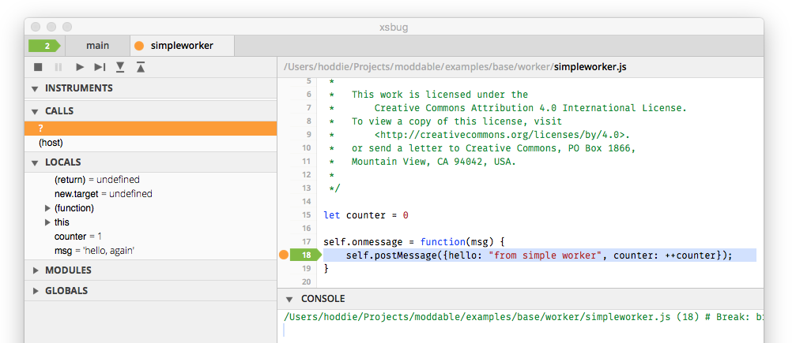

# Worker
Copyright 2018-2023 Moddable Tech, Inc.<BR>
Revised: March 16, 2023

The Moddable runtime integrates with XS to allow a multiple virtual machines to co-exist on a single microcontroller. The majority of projects use only a single virtual machine. However, there are situations where the several independent runtime contexts provided by having several virtual machines is advantageous. This isolation is useful to fully separate a particular set of scripts, for example user installed modules, from the core project functionality for security, privacy, and reliability reasons. Another useful situation is to allow scripts to perform blocking operations in one virtual machine while scripts in another virtual machine remain fully responsive. On microcontrollers with multiple CPU cores, workers can execute in parallel to take full advantage of the available CPU power.

Undertake the use of multiple virtual machines in a project with care. Each virtual machine requires additional RAM, and RAM is the most limited resource on most microcontroller deployments. In addition, the asynchronous nature of communication between virtual machines adds complexity to the overall system. Still, having multiple virtual machines is useful, even essential, in some circumstances. The remainder of this document describes how to use multiple virtual machines with the Moddable SDK together with some implementation details.

## Web Workers
The `Worker` class is an API for working with virtual machines. The implementation is based on the [Web Workers](https://www.w3.org/TR/workers/) API from the web with some differences:

- The implementation is a small subset of the Web Workers API.
- Workers are always launched from a module, never from a script file.
- One addition has been made to specify the memory configuration of a new worker.
- Posting a message to a worker throws in additional situations.

Those familiar with Web Workers are strongly advised to read this document to understand the implementation differences that may be relevant to their use of workers.

This document contains a standalone description of the `Worker` class implemented in the Moddable SDK. The [`worker` example](../../examples/base/worker/) is a simple example of using the `Worker` class.

## class Worker
Scripts import the `Worker` class to be able to create a new worker.

	import Worker from "worker";

### Launching a worker
To launch a worker, create an instance of the `Worker` class, passing the name of the module to invoke when the worker starts to run. In the following example, the module run at worker start is `simpleworker`.

	let aWorker = new Worker("simpleworker");
	
The call to the `Worker` constructor returns only after execution of the specified module completes. If the worker module generates an exception during this step, an exception is propagated so that the call to `new Worker` throws an exception. This behavior means that the invoking virtual machine blocks until the new worker virtual machine has fully completely initialization. Consequently, any operations performed in a newly instantiated virtual machine should be relatively brief.

### Launching a worker with memory configuration
The previous example launches the worker with the default memory configuration. This may not be large enough for the worker, or may allocate more RAM than needed by the worker. An optional configuration object allows the script instantiating a new virtual machine to set the memory use.

	let aWorker = new Worker("simpleworker",
			{allocation: 8192, stackCount: 64, slotCount: 64});

### Sending a message to a worker
Messages to workers are JavaScript objects and binary data. The JavaScript objects can be considered equivalent to JSON. The binary data is an `ArrayBuffer`.

	aWorker.postMessage({hello: "world", count: 12});
	aWorker.postMessage(new ArrayBuffer(12));

Internally, workers use the XS marshalling feature which supports sending some types of data that fail in browser implementations of workers. If an object cannot be serialized, `postMessage` throws an exception.

Messages are passed by copy, so the size of the message should be as small as practical.  If the memory allocation fails, `postMessage` throws an exception.

### Receiving a message from a worker
The worker instance has an `onmessage` function which receives all messages from the worker. It is typically assigned immediately after the worker is constructed:

	aWorker.onmessage = function(message) {
		trace(message, "\n");
	}

An alternative approach is to create a subclass of `Worker` which contains the `onmessage` function. This uses less memory and runs somewhat faster.

	class MyWorker extends Worker {
		onmessage(message) {
			trace(message, "\n");
		}
	}
	...
	let aWorker = new MyWorker("simpleworker");

### Terminating a worker
The script that instantiates a worker may terminate the worker.

	aWorker.terminate();

Once a worker is terminated, no further calls should be made to the worker instance. Attempting to post a message to a terminated work throws an exception.

### Worker script start-up
When the Worker constructor is called, the module at the path specified (`simpleworker` in the preceding examples) is loaded and run. The worker itself typically performs two tasks. The first is initialization and the second is installing a function to receive messages. The receiving function is installed on the global object `self` and is named `onmessage`.

	let count = 1;
	let state = INITIALIZED;
	
	self.onmessage = function (message) {
		trace(message, "\n");
	}

### Sending a message from worker script
The messages sent by a worker script may be a JavaScript object or an `ArrayBuffer`, just as with messages sent to a worker script. Messages are sent using the `postMessage` function on the global object `self`.

	self.postMessage({hello: "from  worker", counter: count++});

### Worker script terminating itself
A worker script terminates itself by calling `close` on the global object `self`.  This is equivalent to the instantiating script calling `terminate` on the worker instance.

	self.close()

### API Reference
#### constructor(modulePath[, dictionary])
The `Worker` constructor takes a path to the module used to initialize the new worker instance.

	let aWorker = new Worker("simpleworker");

An optional dictionary contains configuration properties for the new worker. If the dictionary is not provided, the default parameters are used. These defaults vary by host runtime, so it is recommended to always provide a memory configuration.

	let aWorker = new Worker("simpleworker",
			{allocation: 8192, stackCount: 64, slotCount: 64});

The `allocation` property is the total memory shared by the new virtual machine for its chunk heap, slot heap, and stack. The `stackCount` property is the number of slot entries on the virtual machine's stack. The `slotCount` property is the initial number of slots in the virtual machine's slot heap.

If an error occurs or an exception is thrown during execution of the module, the `Worker` constructor also throws an error.

#### terminate()
The `terminate` function immediately ends execution of the worker instance, freeing all resources owned by the worker.

	aWorker.terminate();

Once a worker has been terminated, no further calls should be made to it.

#### postMessage(msg)
The `postMessage` function queues a message for delivery to the worker. Messages are either a JavaScript object, roughly equivalent to JSON objects, or an `ArrayBuffer`.

	aWorker.postMessage("hello");
	aWorker.postMessage({msg: "hello", when: Date.now()});
	aWorker.postMessage(new ArrayBuffer(8));

Messages are passed by copy, so they should be in small in size as practical. Messages are  delivered in the same order they were sent.

#### onmessage property
The worker `onmessage` property contains a function which receives messages from the worker.

	aWorker.onmessage = function(msg) {
		trace(msg, "\n");
	}

## Shared Workers
The `SharedWorker` class is an API for working with shared virtual machines. The implementation is based on the [Shared Workers](https://html.spec.whatwg.org/multipage/workers.html#shared-workers-introduction) API from the web with some differences, including:

- The `close` function on the message port is not yet implemented, so Shared Workers cannot be terminated
- Workers are always launched from a module, never from a script file.


## class SharedWorker
Scripts import the `SharedWorker` class to be able to connect to a shared worker, creating the shared worker if it is not currently instantiated.

	import {SharedWorker} from "worker";
	
**Note**: Examples and documentation needed.

## Scheduling
Depending on the host runtime, workers may be preemptively scheduled (e.g. run in parallel to each other and the main virtual machine, or they may be cooperatively scheduled (e.g. other virtual machines may only run after the current virtual machine yields). Cooperative scheduling is useful for isolating scripts but does not prevent one virtual machine from blocking another.

The Web Worker specification requires assumes that all Workers are preemptively scheduled. On some microcontrollers, preemptive scheduling is impractical (too much memory required) or nearly impossible (not supported by the host RTOS).

Each host of the Moddable SDK runtime decided whether to support multiple virtual machines. If it does, it then decides whether to support preemptive or cooperative scheduling.  The ESP8266 runtime is built on a cooperative task model and so implements cooperative scheduling of virtual machines. The ESP32 is built on FreeRTOS, a preemptively scheduled RTOS, an so supports preemptive scheduling. When deciding whether to use multiple virtual machines in a project, check to see what is supported by the host runtime.

## xsbug support
The debugger for the XS virtual machine, `xsbug`, supports working with multiple virtual machines simultaneously. Each virtual machine appears in a separate tab with the name of the module path used to initialize the worker.



## Shared Memory and Atomics
The ECMAScript 2016 standard includes support for Shared Memory and Atomics. These are powerful tools for efficient communication between virtual machines. The XS virtual machine fully implements these features. They are supported on some microcontrollers (ESP32) but not all (ESP8266).

## Configuration Options
The Web Workers implementation uses `modMessagePostToMachine()`, the native IPC facility of the Moddable SDK, to pass messages between threads. On ESP32 this is implemented using FreeRTOS queues.

By default the message queue has 10 elements. A message is posted while the queue is full blocks until space become available in the queue. This behavior generally works well as the number of messages being posted is relatively infrequent. If many messages are being sent between the sender and receiver, a deadlock is possible. Two build options are available in the manifest to help if necessary.

```json
"defines": {
	"task": {
		"queueLength": 20,
		"queueWait": 100
	}
}
```
The `queueLength` property changes the size of the message queues to the value specified. The `queueWait` property allows posting messages to fail after the specified timeout (given in milliseconds). If a message cannot be enqueued after this timeout period, `postMessage` throws an exception.

By default, a debug build sets `queueWait` to 1000 milliseconds. In a well-balanced system, messages should enqueue instantaneously and certainly shouldn't block for more than a few millisecond. This default allows debugging of potential queue related issues by throwing instead of deadlocking when message sends take unexpectedly long. By default, release and instrumented builds have an infinite wait for `queueWait` and so never time out.
