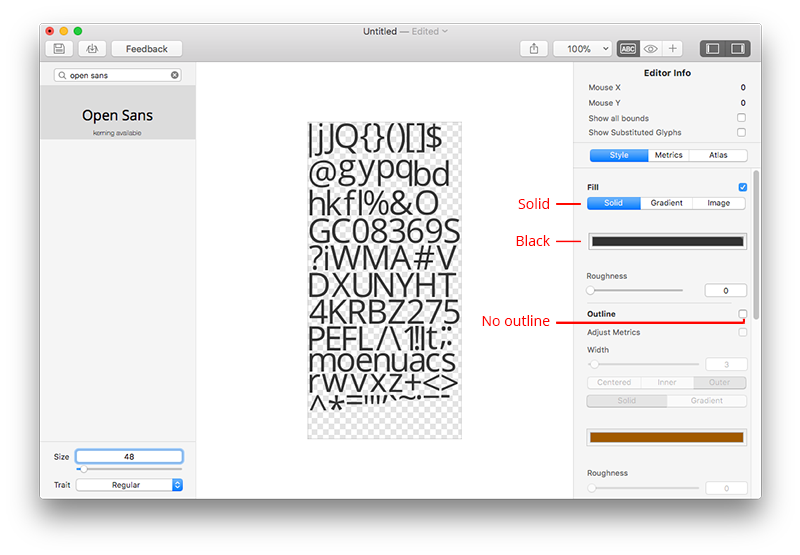
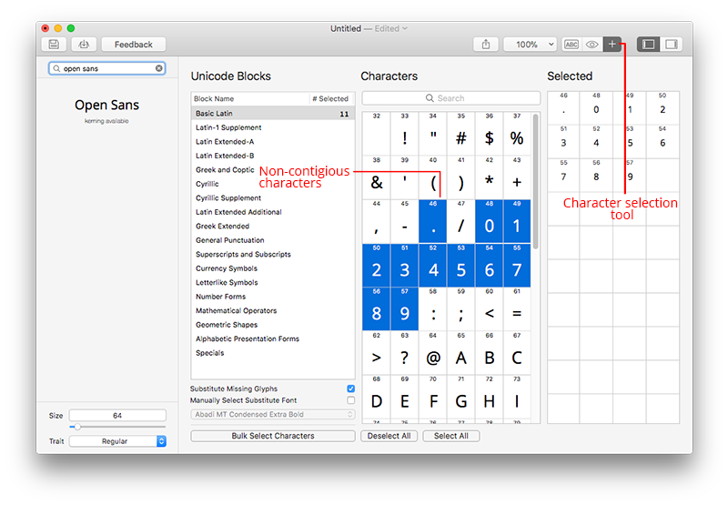
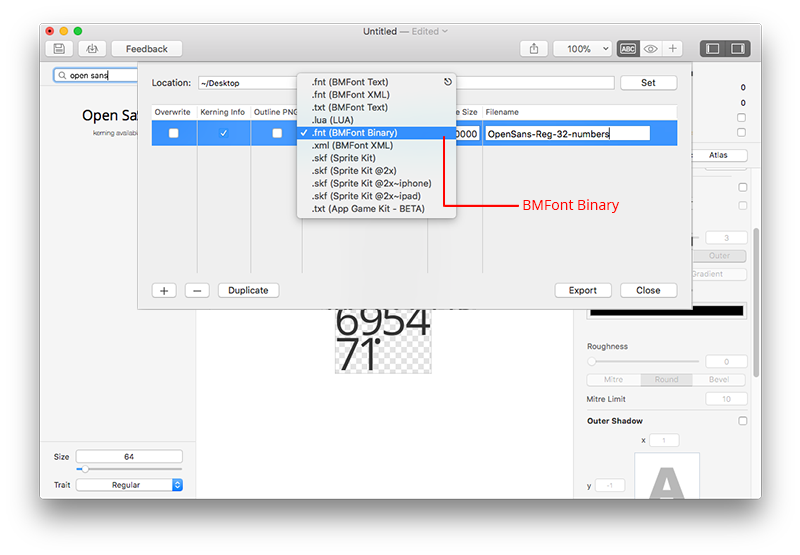

# Creating fonts for applications built on the Moddable SDK
Copyright 2017-2023 Moddable Tech, Inc.<BR>
Revised: March 28, 2023

Moddable uses the [BMFont](http://www.angelcode.com/products/bmfont/doc/file_format.html) format for fonts

The Moddable SDK supports any input character (up to 4-byte UTF-8 values) making it possible to render the glyphs for any language written with glyphs having a Unicode representation.

Each font asset consists of a (.png) glyph file and a corresponding font metrics file (.fnt) saved in BMFont Binary format.

This allows anti-aliased or non-anti-aliased font sets to be generated as desired. The Poco renderer in the Moddable SDK does not implement a font scaler. Consequently, each required font size/weight must be generated and included as an asset in the application.

BMFont allows an arbitrary number of glyphs in the font.
Moddable supports non-contiguous glyph ranges allowing the developer or graphic designer to create an efficient font asset with just the characters needed for the application. This can significantly reduce asset storage size.

Fonts are generated in black. This allows the Moddable SDK build tools to create alpha masks of the characters. To render the fonts in color, applications apply styles.

There are many tools available for converting TrueType and OpenType fonts on the BMFont format. The Moddable team often uses [Glyph Designer](https://71squared.com/glyphdesigner) (macOS). Another good options is the [fontbm](https://github.com/vladimirgamalyan/fontbm) command line tool by Vladimir Gamalyan. Instructions for using both are provided below.

## Glyph Designer instructions

Select font and weight. Set font color to black and no outline.



Using the character selection tool select needed characters.



Export .png glyph and .fnt font metrics files in the BMFont Binary format.



## fontbm instructions

To use fontbm, you must first install it on your system. For Windows users, a binary is [available for download](https://github.com/vladimirgamalyan/fontbm/releases/latest). Instructions are provided for [macOS](https://github.com/vladimirgamalyan/fontbm#building-macos) and [Linux](https://github.com/vladimirgamalyan/fontbm#building-linux) users must currently build it from source code following the instructions.

Once you have fontbm, you may use it from the command line to generate the .fnt and .png files needed to add fonts to the Moddable SDK.

The Moddable SDK project manifest.json file may be used invoke fontbm automatically as part of building a project. This makes it much easier to use different fonts and font sizes in your projects. To use fontbm support in `mcconfig` or `mcrun`, you must first set the environment variable `FONTBM` to the path to the fontbm executable to allow the Moddable SDK build tools to find fontbm.

### fontbm in manifest.json

Adding TrueType fonts to a manifest is similar to adding pre-built BMFonts. Here's what a compressed BMFont looks like in the manifest:

```json
"resources":{
	"*-mask": [
		"$(MODDABLE)/examples/assets/fonts/OpenSans-Regular-20"
	]
}
```
To use a TrueType font, it looks like this:

```json
"resources": {
	"*-mask": [
		{
			"source": "$(MODDABLE)/tools/xsbug/fonts/OpenSans-Regular",
			"size": 20
		}
	]
}
```

This generates two resources, `OpenSans-Regular-20.fnt` and  `OpenSans-Regular-20-alpha.bmp`. The `size` property is required: there is no default size.

Similarly, a pre-built uncompressed BMFont looks like this:

```json
"resources":{
	"*-alpha": [
		"$(MODDABLE)/examples/assets/fonts/OpenSans-Regular-24"
	]
}
```

To use a TrueType font, it looks like this:

```json
"resources": {
	"*-alpha": [
		{
			"source": "$(MODDABLE)/tools/xsbug/fonts/OpenSans-Regular",
			"size": 24
		}
	]
}
```

This generates one resource, `OpenSans-Regular-20.bm4`.

#### Naming
Often the name of a TrueType font file isn't exactly how you want to name your font resources. The `name` property allows you specify a name to be used instead:

```json
"resources": {
	"*-mask": [
		{
			"source": "$(MODDABLE)/tools/xsbug/fonts/segoe",
			"size": 22,
			"name": "Segoe-Regular"
		}
	]
}
```
This generates one resource, `Segoe-Regular-22.bm4`.

#### Selecting Glyphs to Include
By default, the font output by the conversion process includes Unicode characters from 32 to 127 (inclusive). There are three properties you can use to override this behavior: `characters`, `blocks`, and `localization`. If more than one of these properties is present, all the characters they select are included.

##### Character List
The `characters` property is a string that indicates which characters to include. This example include only the characters used to display decimal numbers:

```json
"resources": {
	"*-mask": [
		{
			"source": "$(MODDABLE)/tools/xsbug/fonts/OpenSans-Regular",
			"size": 72,
			"characters": "0123456789-+.e"
		}
	]
}
```

##### Unicode Blocks
The `blocks` property is an array of [Unicode block](https://en.wikipedia.org/wiki/Unicode_block) names. These are a convenient way to include groups of characters. For example, here blocks is used to include Basic Latin 1 and Cyrillic characters:

```json
"resources": {
	"*-mask": [
		{
			"source": "$(MODDABLE)/tools/xsbug/fonts/OpenSans-Regular",
			"size": 24,
			"blocks": ["Basic Latin", "Cyrillic"],
		}
	]
}
```

##### Localization Character Summary
The Piu user interface framework has built-in support for localization. As part of building the localization maps for a Piu, the `mclocal` tool also generates a list of all characters used in the localization table. This list can be used to select the glyphs included in a font by setting the `localization` property to `true`:

```json
"resources": {
	"*-mask": [
		{
			"source": "$(MODDABLE)/tools/xsbug/fonts/OpenSans-Regular",
			"size": 24,
			"localization": true
		}
	]
}
```


#### Kerning
By default, kerning tables are not output. Kerning is enabled by setting the `kern` property to `true`:

```json
"resources": {
	"*-mask": [
		{
			"source": "$(MODDABLE)/tools/xsbug/fonts/OpenSans-Regular",
			"size": 24,
			"kern": true
		}
	]
}
```
The Poco renderer does not kern by default in order to maximize performance. Kerning support is be enabled in the manifest with the following setting:

```json
"defines": {
	"cfe": {
		"kern": true
	}
}
```

#### Monochrome
By default, the glyphs output are anti-aliased. Monochrome output can be generated (perfect for 1-bit displays like Moddable Three) by setting the `monochrome` property to `true`:

```json
"resources": {
	"*-mask": [
		{
			"source": "$(MODDABLE)/tools/xsbug/fonts/OpenSans-Regular",
			"size": 24,
			"monochrome": true
		}
	]
}
```


