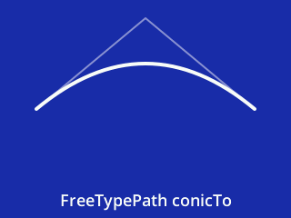
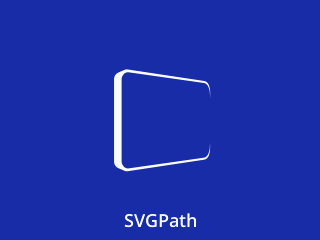

# Outlines
Copyright 2020-2022 Moddable Tech, Inc.<BR>
Revised: February 13, 2022

## Overview

The Moddable SDK now supports 2D vector graphics: Poco and Piu can render anti-aliased shapes in color with blending.

There are three steps to rendering an 2D vector graphics. This document explains each.

1. Build a path for the shape. Several APIs are provided to define the path.
2. Create an outline from the path. The outline is created by either stroking or filling the path.
3. Draw the outline. Both the Piu user interface framework and Poco renderer can draw outlines.

Familiar programming interfaces are supported to define the shapes:

- Canvas paths to build shapes programatically.
- SVG paths to use shapes built with vector graphics tools.

The rendering implementation is based on FreeType [Outline Processing](https://freetype.org/freetype2/docs/reference/ft2-outline_processing.html) API.

There are three new modules:

- `commodetto/outline` – defines the `Outline` class, with static methods to build paths and to create outlines by filling or stroking a path
- `commodetto/PocoOutline` – extends the Poco renderer to render outlines
- `piu/shape` – extends Piu with a shape object that displays outlines

**Outlines** are host objects that encapsulate FreeType outline data. Outlines are created by filling or stroking a path. Outlines can be cloned, rotated, scaled, and translated.

**Paths** are arrays of subpaths. **Subpaths** are sequences of curves and lines, stored into array buffers as commands and points. Subpaths can be open or closed.

Projects using Outlines with Piu should include the `manifest_outline_piu.json` manifest; projects using Poco, the `manifest_outline_poco.json` manifest.

> All animated figures in this document are generated by mods. A link to the source code of the mod appears next to the figure it generates.  Each mod exports a Piu behavior that is assigned to a Piu shape by the app (aka host) that runs the mod.

## Building Paths

The `Outline` class has several different ways to build paths. 

```
import Outline from "commodetto/outline";
```

#### `Outline.CanvasPath()`

A constructor that returns a new instance of `Outline.CanvasPath.prototype`. Use the instance to build a path with the [`CanvasPath` ](https://html.spec.whatwg.org/multipage/canvas.html#canvaspath) programming interface.

The `Outline.CanvasPath.prototype` supports the following methods:

- `arc(x, y, radius, startAngle, endAngle, counterclockwise)`
- `arcTo(x1, y1, x2, y2, r)`
- `bezierCurveTo(cp1x, cp1y, cp2x, cp2y, x, y)`
- `closePath()`
- `ellipse(x, y, radiusX, radiusY, rotation, startAngle, endAngle, counterclockwise)`
- `lineTo(x, y)`
- `moveTo(x, y)`
- `quadraticCurveTo(cpx, cpy, x, y)`
- `rect(x, y, w, h)`
	
These methods are documented in  the HTML specification under [Building Paths](https://html.spec.whatwg.org/multipage/canvas.html#building-paths). 

 [source](../../../examples/piu/outline/figures/CanvasPath/mod.js)

#### `Outline.FreeTypePath()`

A constructor that returns a new instance of `Outline.FreeTypePath.prototype`. Use the instance to build a path with a programming interface inspired by FreeType's [Glyph Stroker](https://freetype.org/freetype2/docs/reference/ft2-glyph_stroker.html) API.

The `Outline.FreeTypePath.prototype` has the following methods:

- `beginSubpath(x, y, open)`:
	- `x`, `y`: the start point
	- `open`: `true` to build an open subpath
	- see [`FT_Stroker_BeginSubPath`](https://freetype.org/freetype2/docs/reference/ft2-glyph_stroker.html#ft_stroker_beginsubpath)
- `conicTo(cx, cy, x, y)`:
	- `cx`, `cy`: the Bezier control point
	- `x`, `y`: the destination point
	- see [`FT_Stroker_ConicTo`](https://freetype.org/freetype2/docs/reference/ft2-glyph_stroker.html#ft_stroker_conicto)
- `cubicTo(c1x, c1y, c2x, c2y, x, y`;
	- `c1x`, `c1y`: the first Bezier control point
	- `c2x`, `c2y`: the second Bezier control point
	- `x`, `y`: the destination point
	- see [`FT_Stroker_CubicTo`](https://freetype.org/freetype2/docs/reference/ft2-glyph_stroker.html#ft_stroker_cubicto)
- `endSubpath()`:
	- see [`FT_Stroker_EndSubPath`](https://freetype.org/freetype2/docs/reference/ft2-glyph_stroker.html#ft_stroker_endsubpath)
- `lineTo(x, y)`: 
	- `x`, `y`: the destination point
	- see [`FT_Stroker_LineTo`](https://freetype.org/freetype2/docs/reference/ft2-glyph_stroker.html#ft_stroker_lineto)

 [source](../../../examples/piu/outline/figures/FreeTypePath/mod.js)

#### `Outline.PolygonPath(x0, y0, x1, y1 /* etc */)`

A static method that creates a polygon from a list of coordinates.

| Argument | Type | Description |
| --- | --- | --- |
| x0, y0, x1, y1 /* etc */ | number | the coordinates of the polygon vertices |

Returns a new path. 

 [source](../../../examples/piu/outline/figures/PolygonPath/mod.js)

#### `Outline.RoundRectPath(x, y, width, height, radius)`

A static method that creates a rectangle with rounded corners.

| Argument | Type | Description |
| --- | --- | --- |
| x, y, width, height | number | the coordinates of the rectangle |
| radius | number | the radius of the rounded corners |

Returns a new path. 

 [source](../../../examples/piu/outline/figures/RoundRectPath/mod.js)

#### `Outline.SVGPath(data)`

A static method that creates a path from an SVG path string.

| Argument | Type | Description |
| --- | --- | --- |
| data | string | [the SVG path data](https://svgwg.org/svg2-draft/paths.html#PathData)  |

Returns a new path. 

The SVG path data parser supports the following commands:

- close path [(Z, z)](https://svgwg.org/svg2-draft/paths.html#PathDataClosePathCommand)
- cubic Bézier [(C, c, S, s)](https://svgwg.org/svg2-draft/paths.html#PathDataCubicBezierCommands)
- elliptical arc [(A, a)](https://svgwg.org/svg2-draft/paths.html#PathDataEllipticalArcCommands)
- line to [(L, l, H, h, V, v)](https://svgwg.org/svg2-draft/paths.html#PathDataLinetoCommands)
- move to [(M, m)](https://svgwg.org/svg2-draft/paths.html#PathDataMovetoCommands)
- quadratic Bézier [(Q, q, T, t)](https://svgwg.org/svg2-draft/paths.html#PathDataQuadraticBezierCommands)

Since a path is an array, if there are multiple paths in the SVG element, use `Outline.SVGPath` for each path data, then use `Array.prototype.concat` to combine the paths.

 [source](../../../examples/piu/outline/figures/SVGPath/mod.js)

## Creating Outlines

The `Outline` class has static methods to create outlines by filling or stroking a path. 

#### `Outline.fill(path, rule)`

| Argument | Type | Description |
| --- | --- | --- |
| path | object | a path returned by one of the building paths static methods |
| rule | number | `Outline.NON_ZERO_RULE` for the [non zero rule](https://en.wikipedia.org/wiki/Nonzero-rule), `Outline.EVEN_ODD_RULE` for the [even-odd rule](https://en.wikipedia.org/wiki/Even–odd_rule). Defaults to `Outline.NON_ZERO_RULE`. |

Returns a new outline, an instance of `Outline.prototype`.

 [source](../../../examples/piu/outline/figures/rules/mod.js)

#### `Outline.stroke(path, weight, linecap, linejoin, miterLimit)`

| Argument | Type | Description |
| --- | --- | --- |
| path | object | a path returned by one of the building paths static methods |
| weight | number | the weight of the lines, defaults to 1 pixel |
| linecap | number | `Outline.LINECAP_BUTT` for a full stop on the last point itself, `Outline.LINECAP_ROUND` for a half-circle around the last point, `Outline.LINECAP_SQUARE` for square around the last point. Defaults to `Outline.LINECAP_ROUND`. |
| linejoin | number | `Outline.LINEJOIN_ROUND` for rounded line joins, `Outline.LINEJOIN_BEVEL` for beveled line joins, `Outline.LINEJOIN_MITER` for mitered line joins. Defaults to `Outline.LINEJOIN_ROUND`. |
| miterLimit | number | the miter limit. Defaults to `weight`. |

Returns a new outline, an instance of `Outline.prototype`.

 [source](../../../examples/piu/outline/figures/linecaps/mod.js)

 [source](../../../examples/piu/outline/figures/linejoins/mod.js)

## Transforming Outlines

The `Outline` prototype has one getter to get the bounds of the outline, one method to clone outlines and three methods to transform outlines.

All transformations modify the outline's data and therefore can be irreversible because of the precision of coordinates. 

#### `Outline.prototype.get bounds()`

Returns a the bounds of the outline, an object with `x`, `y`, `width` and `height` properties.

#### `Outline.prototype.clone()`

Returns a copy of the outline.

#### `Outline.prototype.rotate(angle, cx, cy)`

| Argument | Type | Description |
| --- | --- | :--- |
| `angle` | number | the rotation angle in radians |
| `cx`, `cy` | number | the rotation center. Defaults to `0, 0`. |

Returns the outline.

 [source](../../../examples/piu/outline/figures/rotate/mod.js)

#### `Outline.prototype.scale(x, y)`

| Argument | Type | Description |
| --- | --- | :--- |
| `x` | number | the horizontal scaling factor |
| `y` | number | the vertical scaling factor. Defaults to `x` |

Returns the outline.

 [source](../../../examples/piu/outline/figures/scale/mod.js)

#### `Outline.prototype.translate(x, y)`

| Argument | Type | Description |
| --- | --- | :--- |
| `x` | number | the horizontal distance in pixels |
| `y` | number | the vertical distance in pixels |

Returns the outline.

 [source](../../../examples/piu/outline/figures/translate/mod.js)

## Draw using Poco

The [Poco renderer](https://github.com/Moddable-OpenSource/moddable/blob/public/documentation/commodetto/poco.md) has one method to render outlines and one method to render polygons.

#### `Poco.prototype.blendOutline(color, blend, outline, x, y)`

| Argument | Type | Description |
| --- | --- | :--- |
| `color` | number | the rendering color, a value returned by `Poco.prototype.makeColor`  |
| `blend` | number | the level of blending, from a value of 0 for transparent to a value of 255 for opaque |
| `outline` | number | the outline to render, an instance of `Outline.prototype` |
| `x`, `y` | number | where to render the outline |

#### `Poco.prototype.blendPolygon(color, blend, x0, y0, x1, y1 /* etc */)`

| Argument | Type | Description |
| --- | --- | :--- |
| `color` | number | the rendering color, a value returned by `Poco.prototype.makeColor`  |
| `blend` | number | the level of blending, from a value of 0 for transparent to a value of 255 for opaque |
| `x0, y0, x1, y1 /* etc */` | number | the coordinates of the polygon vertices |

## Example using Poco

Let us use outlines to build a simple oscilloscope.


First, we need to import modules, to initialize Poco itself and to make background and foreground colors.

```javascript
import Poco from "commodetto/Poco";
import {Outline} from "commodetto/outline";
import Timer from "timer";

let poco = new Poco(screen, {rotation:90});
let background = poco.makeColor(0, 0, 0);
let foreground = poco.makeColor(0, 255, 0);
```

### First Channel

For the first channel, we define a function that draw samples by filling a polygon path.

```javascript
function drawSamplesPolygon(samples, length, y, h) {
	const delta = poco.width / (length - 1);
	const points = new Array(2 * length);
	for (let i = 0; i < length; i++) {
		let j = i << 1;
		points[j] = delta * i;
		points[j + 1] = y + ((samples[i] / 255) * h);
	}
	const path = Outline.PolygonPath(0, y, ...points, poco.width, y);
	const outline = Outline.fill(path);
	poco.begin(0, 0, poco.width, 120);
		poco.fillRectangle(background, 0, 0, poco.width, poco.height);
		poco.blendOutline(foreground, 255, outline);
	poco.end();
}
```

### Second Channel

For the first channel, we define a function that draw samples by stroking a FreeType path. The path is slightly smoothed with `conicTo`.

```javascript
function drawSamplesOutline(samples, length, y, h) {
	const dx = poco.width / (length - 1);
	const cx = dx / 3;
	let px = 0;
	let py = y + ((samples[0] / 255) * h);
	const path = new Outline.FreeTypePath();
	path.beginSubpath(px, py, true);
	for (let i = 1; i < length; i++) {
		let qx = px + dx;
		let qy =  y + ((samples[i] / 255) * h);
		path.conicTo(px + cx, py, qx - cx, qy, qx, qy);
		px = qx;
		py = qy;
	}
	path.endSubpath();
	const outline = Outline.stroke(path, 2);
	poco.begin(0, 120, poco.width, 120);
		poco.fillRectangle(background, 0, 120, poco.width, 120);
		poco.blendOutline(foreground, 255, outline);
	poco.end();
}
```

### Sampling

Eventually we use a timer to shift old samples and set a new sample.

```javascript
const h = poco.height / 4;
const length = 33;
const samples = new Int8Array(length).fill(0);
Timer.repeat(function() {
	samples.copyWithin(0, 1);
	samples[length - 1] = Math.floor(255 * Math.random()) - 128;
	drawSamplesPolygon(samples, length, h, h);
	drawSamplesOutline(samples, length, 3 * h, h);
}, 50);
```

In this example, samples are random values but could of course be generated by a sensor.

## Draw using Piu Shape Object

The Piu `shape` object is a `content` object that uses the fill color and the stroke color of its skin to display a fill outline and a stroke outline. The stroke outline is displayed above the fill outline.

By default, a `shape` object is empty, its fill outline and stroke outlines are `null`. Set the `fillOutline` or `strokeOutline` properties to change its fill outline or its stroke outline.

The measured width of a shape object is the maximum of its fill outline and stroke outline widths. The measured height of a shape object is the maximum of its fill outline and stroke outline heights. So changing the fill outline or the stroke outline of a `shape` object can reflow the layout of its containers. 

> Usually the same path is used to create the fill outline with `Outline.fill` and the stroke outline with `Outline.stroke`. However, the `shape` object assumes no relationships between the two outlines.

#### Constructor Description

##### `Shape([behaviorData, dictionary])`

| Argument | Type | Description |
| --- | --- | :--- |
| `behaviorData` | `*` | A parameter that is passed into the `onCreate` function of this shape's `behavior`. This may be any type of object, including `null` or a dictionary with arbitrary parameters.
| `dictionary` | `object` | An object with properties to initialize the result. Same as for `content` object (see [Dictionary](https://github.com/Moddable-OpenSource/moddable/blob/public/documentation/piu/piu.md#content-dictionary) in the section [Content Object](https://github.com/Moddable-OpenSource/moddable/blob/public/documentation/piu/piu.md#content-object)).

Returns an `shape ` instance, an object that inherits from `Shape.prototype`

#### Prototype Description

Prototype inherits from `Content.prototype`.

##### Properties

| Name | Type | Default Value | Read Only | Description |
| --- | --- | --- | --- | :--- |
| `fillOutline` | `object` | `null` | | The outline object to display with the fill color |
| `strokeOutline` | `object` | `null` | | The outline object to display with the stroke color |

## Example using Piu

Let us use shapes to build a simple analog clock.


First, we need to import modules.

```javascript
import {} from "piu/MC";
import {} from "piu/shape";
import {Outline} from "commodetto/outline";
```
Then we define the shapes outlines in the `onCreate` method of their behavior. 

### Frame and Dial

The frame is just a white circle.

```javascript
class FrameBehavior extends Behavior {
	onCreate(shape) {
		const path = new Outline.CanvasPath();
		path.arc(120, 120, 120, 0, 2 * Math.PI);	
		shape.fillOutline = Outline.fill(path);
	}
}
```

The dial uses one outline for the minute ticks and one outline for the hour ticks.

```javascript
class DialBehavior extends Behavior {
	onCreate(shape) {
		const fillPath = new Outline.CanvasPath();
		const strokePath = new Outline.CanvasPath();
		for (let i = 0; i < 60; i++) {
			const a = 6 * i  * Math.PI / 180;
			const dx = Math.cos(a);
			const dy = Math.sin(a);
			if (i % 5) {
				fillPath.moveTo(120 * dx, 120 * dy);
				fillPath.lineTo(114 * dx, 114 * dy);
			}
			else {
				strokePath.moveTo(120 * dx, 120 * dy);
				strokePath.lineTo(95 * dx, 95 * dy);
			}
		}
		shape.fillOutline = Outline.stroke(fillPath, 3, Outline.LINECAP_BUTT).translate(120, 120);
		shape.strokeOutline = Outline.stroke(strokePath, 7, Outline.LINECAP_BUTT).translate(120, 120);
	}
}
```
### Hands

The hands inherit a behavior to rotate their outline.

> Notice how the outline is cloned before being rotated in order to keep the coordinates precise.

```javascript
class HandBehavior extends Behavior {
	onClockChanged(shape, tick) {
		const a = ((90 - (tick * 6)) % 360) * Math.PI / 180;
		const cx = shape.width >> 1;
		const cy = shape.height >> 1;
		shape.fillOutline = this.outline.clone().rotate(a).translate(cx, cy);
	}
}
```

Each hand has a different outline. All outlines are centered on `0,0` to be rotated and translated by `onClockChanged`.

```javascript
class HourBehavior extends HandBehavior {
	onCreate(shape) {
		const path = new Outline.CanvasPath();
		path.moveTo(-7, -22);
		path.lineTo(7, -22);
		path.lineTo(6, 65);
		path.lineTo(-6, 65);
		path.lineTo(-7, -22);
		path.closePath();
		this.outline = Outline.fill(path);
	}
}
class MinuteBehavior extends HandBehavior {
	onCreate(shape) {
		const path = new Outline.CanvasPath();
		path.moveTo(-7, -22);
		path.lineTo(7, -22);
		path.lineTo(4, 98);
		path.lineTo(-4, 98);
		path.lineTo(-7, -22);
		path.closePath();
		this.outline = Outline.fill(path);
	}
}
class SecondBehavior extends HandBehavior {
	onCreate(shape) {
		const path = new Outline.CanvasPath();
		path.rect(-1, -30, 2, 96);
		path.arc(0, 0, 4, 0, 2 * Math.PI);
		path.closePath();
		path.arc(0, 67, 6, 0, 2 * Math.PI);
		path.closePath();
		this.outline = Outline.fill(path);
	}
}
```
### Application

Eventually we define the application behavior and template.

The application behavior uses anchors to distribute hour, minute and second ticks to the hands.

```javascript
class ClockApplicationBehavior extends Behavior {
	onCreate(application, $) {
		this.$ = $;
		application.interval = 500;
		application.start();
	}
	onTimeChanged(application) {
		const date = new Date();
		const hours = date.getHours() % 12;
		const minutes = date.getMinutes();
		const seconds = date.getSeconds();
		const $ = this.$;
		$.HOURS.delegate("onClockChanged", (hours * 5) + (minutes / 12));
		$.MINUTES.delegate("onClockChanged", minutes);
		$.SECONDS.delegate("onClockChanged", seconds);
	}
}
```
The application template creates the Piu hierarchy and binds shapes to their behaviors and skins.

```javascript
let ClockApplication = Application.template($ => ({
	Behavior: ClockApplicationBehavior, skin:{ fill:"black" },
	contents: [
		Shape($, { width:240, height:240, Behavior:FrameBehavior, skin:{ fill:"white", stroke:"black" } } ),
		Shape($, { width:240, height:240, Behavior:DialBehavior, skin:{ fill:"black", stroke:"black" } } ),
		Shape($, { anchor:"HOURS", width:240, height:240, Behavior:HourBehavior, skin:{ fill:"black" } } ),
		Shape($, { anchor:"MINUTES", width:240, height:240, Behavior:MinuteBehavior, skin:{ fill:"black" } } ),
		Shape($, { anchor:"SECONDS", width:240, height:240, Behavior:SecondBehavior, skin:{ fill:"red" } } ),
	]
}));
export default new ClockApplication({}, { displayListLength:4096, touchCount:1, pixels: 240 * 64 });
```

