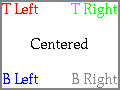
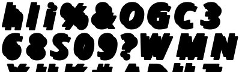

# Poco
Copyright 2016-2020 Moddable Tech, Inc.<BR>
Revised: November 4, 2020

## About This Document

This document describes the Poco renderer, starting with a set of examples that introduce many of the main concepts of working with Poco. Following the examples is the reference for Poco, which fully describes each function call.

## Table of Contents

* [Examples](#examples)
	* [Rectangle](#rectangle)
	* [Origin](#origin)
	* [Clip](#clip)
	* [Monochrome Bitmap](#monochrome-bitmap)
	* [Color Bitmap](#color-bitmap)
	* [Pattern](#pattern)
	* [Gray Bitmap](#gray-bitmap)
	* [Offscreen Bitmap](#offscreen-bitmap)
	* [Alpha](#alpha)
	* [JPEG](#jpeg)
	* [Text](#text)
* [Pixel formats](#pixel-formats)
	* [Destination pixel formats](#destination-pixel-formats)
	* [Display pixel format](#display-pixel-format)
	* [Source bitmap pixel formats](#source-bitmap-pixel-formats)
	* [Compressed pixel formats](#compressed-pixel-formats)
* [Immediate mode rendering](#immediate-mode-rendering)
* [Rotation](#rotation)
* [JavaScript API Reference](#javascript-api-reference)
	* [Functions](#js-functions)
	* [Properties](#js-properties)
* [C API Reference](#c-api-reference)
	* [Data structures](#c-data-structures)
	* [Functions](#c-functions)
* [Odds and Ends](#odds-and-ends)

<a id="examples"></a>
## Examples

These examples illustrate working with the Poco renderer. They all use the JavaScript API, and they also use asset loaders and other capabilities of Commodetto.

To keep the following examples concise and focused, the code makes several assumptions:

- The examples assume a `PixelsOut` object in the global variable `screen`.

- They assume that the following color variables are defined:

	```javascript
	let white = poco.makeColor(255, 255, 255);
	let black = poco.makeColor(0, 0, 0);
	let gray = poco.makeColor(128, 128, 128);
	let red = poco.makeColor(255, 0, 0);
	let green = poco.makeColor(0, 255, 0);
	let blue = poco.makeColor(0, 0, 255);
	```

- They assume that the drawing commands occur between calls to `begin` and `end`.

	```javascript
	let poco = new Poco(screen);
	poco.begin();
	...	// example code here
	poco.end();
	```

Each example includes the image rendered by the code. The images are scaled 150% here to make them easier to see; this scaling causes some blurring and introduces some jaggedness that is not in the actual image.

***

<a id="rectangle"></a>
### Rectangle

This example fills `screen` with gray pixels, covers the left half with red pixels, and then uses a 50% blending level (128) to draw blue pixels over the middle half of the screen.

```javascript
poco.fillRectangle(gray, 0, 0, poco.width, poco.height);
poco.fillRectangle(red, 0, 0, poco.width / 2, poco.height);
poco.blendRectangle(blue, 128, poco.width / 4, 0, poco.width / 2, poco.height);
```


***

<a id="origin"></a>
### Origin

This example shows how to move the drawing origin. Poco maintains an origin stack that is pushed when the origin changes and popped when `origin` is called with no arguments. Each change to the origin offsets the previous origin. The origin stack is convenient for building container-based user interfaces.

```javascript
poco.fillRectangle(gray, 0, 0, poco.width, poco.height);

poco.origin(10, 10);
poco.fillRectangle(red, 0, 0, 40, 20);

poco.origin(25, 25);
poco.fillRectangle(green, 0, 0, 40, 20);

poco.origin(25, 25);
poco.fillRectangle(blue, 0, 0, 40, 20);

poco.blendRectangle(black, 128, -4, -4, 20, 10);
poco.origin();

poco.blendRectangle(black, 128, -4, -4, 20, 10);
poco.origin();

poco.blendRectangle(black, 128, -4, -4, 20, 10);
poco.origin();
```


***

<a id="clip"></a>
### Clip

This example shows how to use the drawing clip. Poco maintains a clip stack that is pushed when the clip changes and popped when `clip` is called with no arguments. Each change intersects the clip with the previous clip. The clip stack is convenient for building container-based user interfaces.

```javascript
poco.fillRectangle(gray, 0, 0, poco.width, poco.height);

poco.clip(20, 20, poco.width - 40, poco.height - 40);
poco.fillRectangle(green, 0, 0, poco.width, poco.height);

poco.clip(0, 0, 40, 40);
poco.fillRectangle(blue, 0, 0, poco.width, poco.height);

poco.fillRectangle(white, 26, 0, 2, poco.height);

poco.clip();
poco.fillRectangle(red, 30, 0, 2, poco.height);

poco.clip();
poco.fillRectangle(black, 34, 0, 2, poco.height);
```


***

<a id="monochrome-bitmap"></a>
### Monochrome Bitmap

This example draws a monochrome bitmap (in which all pixels are either black or white) of an envelope. It shows how to control the color of the foreground and background pixels, as well as whether each is drawn. The bitmap is stored in a 1-bit BMP file with dimensions of 32 x 23.

```javascript
poco.fillRectangle(gray, 0, 0, poco.width, poco.height);

let envelope = parseBMP(new Resource("envelope.bmp"));
poco.drawMonochrome(envelope, black, white, 14, 10);
poco.drawMonochrome(envelope, red, white, 14, 55);
poco.drawMonochrome(envelope, green, undefined, 74, 10);
poco.drawMonochrome(envelope, undefined, blue, 74, 55);
```


***

<a id="color-bitmap"></a>
### Color Bitmap

This example draws a color bitmap image of a face in two ways using `drawBitmap`: on the left side of the screen, it draws the full image; on the right side, it draws only the eyes and mouth, using the optional source rectangle parameters of `drawBitmap`.

```javascript
poco.fillRectangle(gray, 0, 0, poco.width, poco.height);

let image = parseBMP(new Resource("lvb.bmp"));

let x = 0;
let y = Math.round((poco.height - image.height) / 2);
poco.drawBitmap(image, x, y);

x = image.width;
poco.drawBitmap(image, x + 25, y + 38, 25, 38, 11, 7);   // left eye
poco.drawBitmap(image, x +  7, y + 40,  7, 40, 10, 6);   // right eye
poco.drawBitmap(image, x + 15, y + 56, 15, 56, 16, 6);   // mouth
```


***

<a id="pattern"></a>
### Pattern

This examples uses `fillPattern` to draw a single 30-pixel-square pattern in two ways: first the entire pattern is used to fill the screen; then a 7-pixel-square area of the pattern is used to fill the center part of the screen.

Unlike the previous examples, this one does not first call `fillRectangle` to clear the screen, because the first call to `fillPattern` covers all the screen's pixels.

```javascript
let pattern = parseBMP(new Resource("pattern1.bmp"));
poco.fillPattern(pattern, 0, 0, poco.width, poco.height);
poco.fillPattern(pattern, 28, 28, 63, 35, 21, 14, 7, 7);
```


***

<a id="gray-bitmap"></a>
### Gray Bitmap

This example uses `drawGray` to draw a 16-level gray image in several colors. `drawGray` treats the pixel values as alpha blending levels, blending the specified color with the background. 

```javascript
poco.fillRectangle(gray, 0, 0, poco.width, poco.height);

let image = parseBMP(new Resource("envelope-gray.bmp"));

poco.drawGray(image, black, 10, 2);
poco.drawGray(image, white, 10, 47);

poco.drawGray(image, black, 70, 2);
poco.drawGray(image, green, 70 + 2, 2 + 2);

poco.drawGray(image, white, 70, 47);
poco.drawGray(image, red, 70 + 2, 47 + 2);
```


***

<a id="offscreen-bitmap"></a>
### Offscreen Bitmap

This example uses `BufferOut` to create an offscreen bitmap, fills the bitmap with a series of inset squares, and then uses the offscreen bitmap as a pattern to fill the screen. It uses two instances of `Poco`: the first to draw to the offscreen bitmap and the second to draw to the screen.

```javascript
import BufferOut from "commodetto/BufferOut";

let offscreen = new BufferOut({width: 30, height: 30, pixelFormat: poco.pixelsOut.pixelFormat});
let pocoOff = new Poco(offscreen);
pocoOff.begin();
	pocoOff.fillRectangle(gray, 0, 0, 30, 30);
	pocoOff.fillRectangle(red, 2, 2, 26, 26);
	pocoOff.fillRectangle(black, 4, 4, 22, 22);
	pocoOff.fillRectangle(blue, 6, 6, 18, 18);
	pocoOff.fillRectangle(white, 8, 8, 14, 14);
	pocoOff.fillRectangle(green, 10, 10, 10, 10);
	pocoOff.fillRectangle(gray, 13, 13, 4, 4);
pocoOff.end();

poco.fillPattern(offscreen.bitmap, 0, 0, poco.width, poco.height);
```


***

<a id="alpha"></a>
### Alpha

This example shows how to draw a bitmap through an alpha mask. The bitmap to draw and the mask are in separate bitmaps, enabling an image to be drawn using more than one alpha mask. The example draws one bitmap through both a circle and a square mask, and also draws the original image and mask.

```javascript
poco.fillRectangle(gray, 0, 0, poco.width, poco.height);

let girl = parseBMP(new Resource("girl.bmp"));
let circle = parseBMP(new Resource("mask_circle.bmp"));
let square = parseBMP(new Resource("mask_square.bmp"));

poco.drawBitmap(girl, 0, 2);
poco.drawGray(circle, black, 40, 2);
poco.drawMasked(girl, 80, 2, 0, 0,
				circle.width, circle.height, circle, 0, 0);

poco.drawBitmap(girl, 0, 47);
poco.drawGray(square, black, 40, 47);
poco.drawMasked(girl, 80, 47, 0, 0,
				square.width, square.height, square, 0, 0);
```


***

<a id="jpeg"></a>
### JPEG

These two examples show different methods for working with JPEG images. The first example decompresses the full JPEG into a bitmap in memory and then renders the bitmap to the screen. The call to `trace` shows how to access the bitmap's width and height.

```javascript
import JPEG from "commodetto/readJPEG";

let piano = JPEG.decompress(new Resource("piano.jpg"));
trace(`width ${piano.width}, height ${piano.height}\n`);
poco.drawBitmap(piano, 0, 0);
```

The second example decodes the JPEG image one block at a time, drawing the block to the screen before decoding the next block. The advantage of this approach is that only a single JPEG block (typically 8 x 8 or 16 x 16 pixels) need be in memory at a time. The disadvantage is that the JPEG image appears to the user one block at a time rather than all at once.

```javascript
let jpeg = new JPEG(new Resource("piano.jpg"));
let block;
while (block = jpeg.read()) {
	poco.begin(block.x, block.y, block.width, block.height);
		poco.drawBitmap(block, block.x, block.y);
	poco.end();
}
```

When complete, each approach generates the same result.


***

<a id="text"></a>
### Text

Poco supports the BMPFont format for fonts used to rendering text. BMFont is a gray or color font used in games for anti-aliased fonts. A BMFont consists of two files: the font metrics and the font image. 

The following example loads and draws a 36-point Palatino BMFont.

```javascript
import parseBMF from "commodetto/parseBMF";

poco.fillRectangle(gray, 0, 0, poco.width, poco.height);
poco.fillRectangle(white, 2, 2, poco.width - 4, poco.height - 4);

let palatino36 = parseBMF(new Resource("palatino_36.fnt"));
palatino36.bitmap = parseBMP(new Resource("palatino_36.bmp"));

poco.drawText("Hello.", palatino36, black, 4, 20);
poco.drawText("Hello.", palatino36, green, 4, 55);
```


To truncate text when rendering, provide the optional `width` argument to `drawText` indicating the horizontal space available for the text.

```javascript
poco.fillRectangle(gray, 0, 0, poco.width, poco.height);
poco.fillRectangle(white, 2, 2, poco.width - 4, poco.height - 4);

let palatino36 = parseBMF(new Resource("palatino_36.fnt"));
palatino36.bitmap = parseBMP(new Resource("palatino_36.bmp"));

poco.drawText("Hello, world. This is long.", palatino36, red, 2, 10);
poco.drawText("Hello, world. This is long.", palatino36, green, 2, 45, poco.width - 2);
```


Text is horizontally and vertically aligned using the `height` property of the font and measuring the width of strings using `getTextWidth`.

```javascript
poco.fillRectangle(gray, 0, 0, poco.width, poco.height);
poco.fillRectangle(white, 2, 2, poco.width - 4, poco.height - 4);

let palatino12 = parseBMF(new Resource("OpenSans-SemiboldItalic-18.fnt"));
palatino12.bitmap = parseBMP(new Resource("OpenSans-SemiboldItalic-18.bmp"));

poco.drawText("T Left", palatino12, red,
			  2, 2);
poco.drawText("T Right", palatino12, green,
			  poco.width - 2 - poco.getTextWidth("T Right", palatino12), 2);

poco.drawText("B Left", palatino12, blue,
			  2, poco.height - 2 - palatino12.height);
poco.drawText("B Right", palatino12, gray,
			  poco.width - 2 - poco.getTextWidth("B Right", palatino12),
			  poco.height - 2 - palatino12.height);

poco.drawText("Centered", palatino12, black,
			  (poco.width - poco.getTextWidth("Centered", palatino12)) / 2,
			  (poco.height - palatino12.height) / 2);
```



The `drawText` function also accepts a 16-gray-level alpha bitmap in the `color` argument. This bitmap is used to draw fonts that consist of multiple colors. The following example shows drawing Open Sans Bold Italic with both black and white pixels in the glyph images.

```javascript
poco.fillRectangle(green, 0, 0, screen.width, screen.height);

let openSans52 = parseBMF(new Resource("OpenSans-BoldItalic-52.fnt"));
openSans52.bitmap = parseBMP(new Resource("OpenSans-BoldItalic-52-color.bmp"));
openSans52.mask = parseBMP(new Resource("OpenSans-BoldItalic-52-alpha.bmp"));

poco.drawText("Poco", openSans52, openSans52.mask, 0, 5);
```


The following image is a section of the `OpenSans-BoldItalic-52.bmp` file, which contains the glyph images.


This is a section of the `OpenSans-BoldItalic-52-alpha.bmp` file, which contains the alpha channel of the glyph images:



***

<a id="pixel-formats"></a>
## Pixel formats

<a id="destination-pixel-formats"></a>
### Destination pixel formats
Poco renders to the following pixel formats:

- 16-bit RGB565 little-endian
- 8-bit RGB332
- 8-bit gray
- 4-bit indexed color
- 4-bit gray

To keep the size of the code deployed to the target device small, Poco is configured at build time to render only one of these pixel formats.

<a id="display-pixel-format"></a>
### Display pixel format
For displays that require a different output format, the display driver is responsible for converting between a supported rendering format and the hardware required format. For example, many common LCD controllers require 16-bit RGB565 big-endian pixels. The display drivers for these controllers accept Poco rendered 16-bit RGB565 little-endian pixels and convert them to big-endian while transmitting to the LCD controller. Similarly, many displays are monochrome (1-bit). Their display driver accept pixels rendered in 4-bit or 8-bit gray and converts them to 1-bit for the monochrome display.

<a id="source-bitmap-pixel-formats"></a>
### Source bitmap pixel formats
Poco supports 1-bit monochrome and 4-bit gray bitmaps as sources for rendering to all pixel formats. In addition, the configured destination pixel format is always supported as a source format. For example, when the rendering pixel format is 16-bit RGB565 little-endian, supported source pixel formats are 1-bit monochrome, 4-bit gray, and 16-bit RGB565 little-endian.

<a id="compressed-pixel-formats"></a>
### Compressed pixel formats
Poco implements support for two compressed pixel formats.

The first is a weighted run-length compression of 4-bit gray bitmaps. These are commonly used for anti-aliased fonts and image masks. They use the `CommodettoBitmap` and `PocoBitmap` data structures with the pixel format set to `(kCommodettoBitmapGray16 | kCommodettoBitmapPacked)`.

The second is a variant of the ColorCell algorithm used to compress full color images. These are not referenced by the `CommodettoBitmap` and `PocoBitmap` data structures, but treated as an image file in the same way as BMP, PNG, and JPEG. ColorCell images use 16-bit RGB565 little-endian pixels and consequently may only be rendered to 16-bit RGB565 little-endian destinations.

***

<a id="immediate-mode-rendering"></a>
## Immediate mode rendering
By default, Poco is a scanline display list renderer. That means it stores all the drawing commands and then renders them all at once when all drawing commands for a given frame have been queued. When used with a display that has full frame buffers stored in memory accessible to Poco and is double buffered (e.g. has two frame buffers it flips between), scanline display list rendering is less efficient than immediate mode rendering, which executes each drawing command as it is received.

Poco optionally supports immediate mode rendering. To enable this support, define `kPocoFrameBuffer` to 1 when building Poco, and use `PocoDrawingBeginFrameBuffer`/`PocoDrawingEndFrameBuffer` in place of `PocoDrawingBegin`/`PocoDrawingEnd` in the C code. No changes are required to JavaScript code to use immediate mode.

***

<a id="rotation"></a>
## Rotation
Poco provides support for rendering to a `PixelsOut` at 0, 90, 180, or 270 degree rotations. This support allows use of a display in any orientation, independent of the natural scan order of the hardware.

The rotation is selected at build time, not run time, by defining `kPocoRotation` to the target rotation (e.g. 90). The default rotation value is 0. The rotation is applied to the coordinates, both destination and source, of all drawing operations. Any assets (e.g. stored bitmaps and fonts) must be rotated prior to being passed to Poco. This is done either manually (e.g. in Photoshop) or automatically (e.g. by the png2bmp tool in the Moddable SDK).

This approach to rotation allows rendering of rotated output at the same performance level as unrotated images, and without requiring an intermediate bitmap buffer.

***

<a id="javascript-api-reference"></a>
## JavaScript API Reference

Poco is a renderer, a subclass of the Commodetto `Render` class.

```javascript
class Poco extends Render
```

<a id="js-functions"></a>
### Functions

#### `constructor(pixelsOut, dictionary)`

Poco extends the `Render` dictionary with the `displayListLength` property, which specifies the size of the display list buffer in bytes. Applications typically use the default display list length. Poco detects when a drawing operation would overflow the display list, ignores the drawing operation, and throws an exception when `end` is called.

```javascript
import Poco from "commodetto/Poco";
	
let screen = ... // SPIOut instance
let poco = new Poco(screen, {displayListLength: 4096});
```

***

#### `close()`

Frees all memory allocated by Poco. No other functions on the instance may be called after calling `close`.

***

#### `clip(x, y, width, height)`

Poco maintains a clip rectangle that is applied to all drawing operations.

When `begin` is called, the clip rectangle is set to the update area passed to `begin`. Poco maintains a clip stack, eliminating the need for applications to save and restore the current clip. Calling `clip` with four arguments intersects the current clip with the area contained by the arguments; calling it with no arguments pops the clip stack, restoring the previous clip.

```javascript
poco.clip(10, 10, 10, 10);
poco.clip();
```

The clip stack holds several clips, as follows:

```javascript
poco.begin();			// Clip is entire PixelsOut area
poco.clip(10, 10, 10, 10);	// Clip is {x: 10, y: 10, w: 10, h: 10}
poco.clip(0, 0, 15, 15);	// Clip is {x: 10, y: 10, w: 5, h: 5}
poco.clip();			// Clip is {x: 10, y: 10, w: 10, h: 10}
poco.clip()			// Clip is entire PixelsOut area
poco.end();
```

If the clip stack overflows or underflows, an exception is thrown from `end`. The clip stack must be empty when `end` is called or an exception is thrown. 

When calling `clip` with four arguments, the return value is `true` if the resulting area contains one or more pixels and `undefined` if the clip area is empty. 

> **Note:** `clip` and `origin` share the same stack, and so must be popped in the order they were pushed.

***

#### `origin(x, y)`

Poco maintains an origin that is applied to all drawing operations. 

When `begin` is called, the origin is set to `{x: 0, y: 0}`. Poco maintains an origin stack, eliminating the need for applications to save and restore the current origin. Calling `origin` with two arguments offsets the current origin by the arguments; calling it with no arguments pops the origin stack, restoring the previous origin.

```javascript
poco.begin();			// Origin is {x: 0, y: 0}
poco.origin(10, 10);		// Origin is {x: 10, y: 10}
poco.origin(5, 5);		// Origin is {x: 15, y: 15}
poco.origin();			// Origin is {x: 10, y: 10}
poco.origin();			// Origin is {x: 0, y: 0}
poco.end();
```

If the origin stack overflows or underflows, an exception is thrown from `end`. The origin stack must be empty when `end` is called, or an exception will be thrown. 

> **Note:** Changing the origin does not change the clip rectangle. Note too that `clip` and `origin` share the same stack, and so must be popped in the order they were pushed.

***

#### `makeColor(r, g, b)`

The `makeColor` function takes red, green, and blue values from 0 to 255 and returns the corresponding pixel value. The returned pixel is in the format of the `PixelsOut` instance bound to the `Poco` instance.

```javascript
let red = poco.makeColor(255, 0, 0);
let green = poco.makeColor(0, 255, 0);
let blue = poco.makeColor(0, 0, 255);
let black = poco.makeColor(0, 0, 0);
let white = poco.makeColor(255, 255, 255);
let gray = poco.makeColor(127, 127, 127);
```

Many rendering functions take a color as an argument. Use `makeColor` to calculate the color to avoid a dependency on the pixel format.

***

#### `fillRectangle(color, x, y, width, height)`

The `fillRectangle` function fills the area specified by the `x`, `y`, `width`, and `height` arguments with the specified color.

```javascript
poco.fillRectangle(green, 10, 20, 40, 40);
```

***

#### `blendRectangle(color, blend, x, y, width, height)`

The `blendRectangle` function blends the specified color with the pixels in the area specified by the `x`, `y`, `width`, and `height` arguments. The `blend` argument determines the level of blending, from a value of 0 for transparent to a value of 255 for opaque.

The following code draws 16 horizontal green lines with increasing opacity.

```javascript
let green = poco.makeColor(0, 255, 0);
for (let blend = 15, y = 0; blend < 256; blend += 16, y += 1)
	poco.blendRectangle(green, blend, 0, y, pixelsOut.width, 1);
```

***

#### `drawPixel(color, x, y)`

The `drawPixel` function draws a single pixel of the specified color at the location specified by the `x` and `y` arguments.

```javascript
poco.drawPixel(poco.makeColor(0, 0, 127), 5, 5);
```

> **Note:** Making many calls to `drawPixel` in a single frame can quickly fill the display list.

***

#### `drawBitmap(bits, x, y, sx, sy, sw, sh)`

The `drawBitmap` function draws all or part of a bitmap with pixels of type `Bitmap.Default`. The bitmap is specified by the `bits` argument, and the location to draw the bitmap is specified by the `x` and `y` arguments. The following code draws the entire image at location `{x: 10, y: 5}`.

```javascript
let image = parseBMP(new Resource("image.bmp"));
poco.drawBitmap(image, 10, 5);
```

The optional `sx`, `sy`, `sw`, and `sh` arguments specify the area of the bitmap to draw. If they are omitted, the entire bitmap is drawn.

The following code draws the bottom half of the bitmap at location `{x: 0, y: 0}`.

```javascript
poco.drawBitmap(image, 0, 0, 0, image.height / 2, image.width, image.height / 2);
```

***

#### `drawMonochrome(monochrome, fore, back, x, y, sx, sy, sw, sh)`

The `drawMonochrome` function draws all or part of a bitmap with pixels of type `Bitmap.Monochrome`. The bitmap is specified by the `bits` argument, and the location to draw the bitmap is specified by the `x` and `y` arguments.

The `fore` and `back` arguments specify the foreground and background colors to apply to the black and white pixels of the bitmap. If `fore` is `undefined`, the foreground pixels are not drawn; if `back` is `undefined`, the background pixels are not drawn.

```javascript
let red = poco.makeColor(255, 0, 0);
let gray = poco.makeColor(128, 128, 128);
let white = poco.makeColor(255, 255, 255);
let icon = parseBMP(new Resource("icon.bmp"));
	
poco.drawMonochrome(icon, red, white, 0, 5);  // red foreground and white background
poco.drawMonochrome(icon, gray, undefined, 0, 5);  // only foreground pixels in gray
poco.drawMonochrome(icon, undefined, red, 0, 5);  // only background pixels in red
```

The optional `sx`, `sy`, `sw`, and `sh` arguments specify the area of the bitmap to draw. If they are omitted, the entire bitmap is drawn.

***

#### `drawGray(bits, color, x, y, sx, sy, sw, sh[, blend])`

The `drawGray` function draws all or part of a bitmap with pixels of type `Bitmap.Gray16`. The bitmap is specified by the `bits` argument, and the location to draw the bitmap is specified by the `x` and `y` arguments. The pixels of the bitmap are treated as alpha values and are blended with the background. The `color` argument specifies the color to apply when blending.

The optional `sx`, `sy`, `sw`, and `sh` arguments specify the area of the bitmap to draw. If they are omitted, the entire bitmap is drawn.

The optional `blend` argument applies an additional blend level to all pixels in the bitmap prior to blending with the background. The `blend` value ranges from 0 for transparent to 255 for opaque.

***

#### `drawMasked(bits, x, y, sx, sy, sw, sh, mask, mask_sx, mask_sy[, blend])`

The `drawMasked` function uses two bitmaps--an image and the alpha channel--to alpha-blend the image through the mask onto the destination. The image, specified by the `bits` argument, is in `Bitmap.Default` format. The alpha channel, specified by the `mask` argument, is in `Bitmap.Gray16` format.

The `x` and `y` arguments specify where to locate the merged image in the output. The `sx`, `sy`, `sw`, and `sh` arguments specify the area of the image to use. The `mask_sx` and `mask_sy` arguments specify the top-left corner of the mask bitmap to use; the dimensions of the mask bitmap area are taken from the `sw` and `sh` arguments.

The following example draws a button image with an alpha channel. The image and alpha channel are stored in separate files, each previously extracted from a PNG file with an alpha channel.

```javascript
let buttonImage = parseBMP(new Resource("button_image.bmp"));
let buttonAlpha = parseBMP(new Resource("button_alpha.bmp"));
poco.drawMasked(buttonImage, 0, 0, 0, 0,
	buttonImage.width, buttonImage.height, buttonAlpha, 0, 0);
```

Storing the alpha channel separately from the image is unusual, and has benefits for resource constrained devices:

* The alpha channel image can be 4 bits per pixel, which gives good results at half the size.
* The image can be rendered with and without an alpha channel.
* A single mask can be applied to any image, allowing for effects and animations.

The optional `blend` argument applies an additional blend level to all pixels in the alpha channel bitmap prior to blending with the background. The `blend` value ranges from 0 for transparent to 255 for opaque.

***

#### `fillPattern(bits, x, y, w, h [, sx, sx, sx, sh])`

The `fillPattern` function fills an area by repeatedly drawing all or part of a bitmap with pixels of type `Bitmap.Default`. The bitmap is specified by the `bits` argument. The location of the area to fill is specified by the `x` and `y` arguments, and the dimensions of the area are specified by the `w` and `h` arguments.

```javascript
let pattern = parseBMP(new Resource("pattern.bmp"));
poco.fillPattern(pattern, 10, 10, 90, 90);
```

The optional `sx`, `sy`, `sw`, and `sh` arguments specify the area of the bitmap to use. If they are omitted, the entire bitmap is used.

```javascript
poco.fillPattern(pattern, 10, 10, 90, 90, 0, 0, 8, 8);
```

***

#### `drawText(text, font, color, x, y[, width])`

The `drawText` function draws the `text` string using the BMFont in the `font` argument. The text is drawn in the color of the `color` argument at the location of the `x` and `y` arguments. Text is drawn using top-left alignment.

The following code draws the string `"Hello, world"` twice: first in the top-left corner of the screen using the Chicago font in black, and then beneath that string using the Palatino 36 font in red.

```javascript
poco.drawText("Hello, world", chicagoFont, black, 0, 0);
poco.drawText("Hello, world", palatino36, red, 0, chicagoFont.height);
```

If the optional `width` argument is provided, the text is truncated on the right edge when it is too long to fit unclipped in the available width. When truncation occurs, three periods (`...`) are drawn at the end of the string.

Characters in the text string that are not part of the font are ignored.

To draw full-color text with anti-aliased edges, use a BMFont with a bitmap in `Bitmap.Default` format. In place of the `color` argument, pass a mask bitmap in the `Bitmap.Gray16` format. The mask must be at least as large as the BMFont's glyph atlas. When each glyph is drawn, the pixels in the mask image corresponding to the glyph in the font image are used to alpha-blend each glyph with the destination.

***

#### `getTextWidth(text, font)`

The `getTextWidth` function calculates the width in pixels of the `text` string when rendered using `font`.

The following code draws the string `"Hello, world"` horizontally centered at the top of display.

```javascript
let text = "Hello, world";
let width = poco.getTextWidth(text, palatino36);
poco.drawText(text, palatino36, green, (pixelsOut.width - width) / 2, 0);
```

The height of the font is available in the `font.height` property.

Characters in the text string that are not part of the font are not rendered.

***

#### `drawFrame(frame, dictionary, x, y)`

The `drawFrame` function renders the ColorCell compressed image referenced by the `frame` argument at the location specified by the `x` and `y` arguments. The `dictionary` argument is an `Object` that contains width and height properties that indicate the source dimensions of the image.

***

<a id="js-properties"></a>
### Properties

#### `height`

The logical height in pixels of the Poco instance after rotation is applied. When rotation is 0 or 180, this is equal to the `PixelsOut` instance's height; when rotation is 90 or 270, it is equal to the `PixelsOut` instance's width.

***

#### `width`

The logical width in pixels of the Poco instance after rotation is applied. When rotation is 0 or 180, this is equal to the `PixelsOut` instance's width; when rotation is 90 or 270, it is equal to the `PixelsOut` instance's height.

***

<a id="c-api-reference"></a>
## C API Reference

The Poco C API is a low-level rendering engine. It is based on a display list, meaning that all drawing calls are queued to a list prior to rendering. A display list enables the renderer to generate as little as a single scanline of fully composed output at a time, minimizing memory use by eliminating the need for a frame buffer in the memory of the application processor.

The Poco C API may be used independently of Commodetto and its JavaScript API. It makes no allocations and almost no external calls (only to `memcpy`), relying on the caller to provide memory.

<a id="c-data-structures"></a>
### Data Structures

<a id="poco-record"></a>
##### `PocoRecord`

`PocoRecord` maintains state for Poco. Many of the fields are private to the implementation and should not be accessed directly by users of the library. The `PocoRecord` data structure should be initialized to 0, and the same `PocoRecord` structure must be passed to all Poco function calls.

The following fields in `PocoRecord` are public and can be accessed by users of the library. Poco expects these fields to be initialized by the users of the library before the first call to Poco is made. 

| Field | Description |
| :---: | :--- |
| `width` | width of output in pixels
| `height` | height of output in pixels
| `displayList` | pointer to start of memory for display list
| `displayListEnd` | pointer to end of memory for display list
| `pixelsLength` | size in bytes of pixels array

The following fields are available to read from the `PocoRecord` structure between calls to `PocoDrawingBegin` and `PocoDrawingEnd`:

| Field | Description |
| :---: | :--- |
| `xOrigin` | *x* coordinate of drawing origin
| `yOrigin` | *y* coordinate of drawing origin
| `x` | *x* coordinate of drawing clip
| `y` | *y* coordinate of drawing clip
| `w` | width of drawing clip
| `h` | height of drawing clip
| `xMax` | right coordinate of drawing clip, `x + w`
| `yMax` | bottom coordinate of drawing clip, `y + h`

***

##### `PocoCoordinate`

`PocoCoordinate` is a signed integer value. When used in Commodetto, it is aliased to `CommodettoCoordinate`. See the description of `CommodettoCoordinate` in the [Commodetto documentation](./commodetto.md) for additional information.

***

##### `PocoDimension`

`PocoDimension` is an unsigned integer value. When used in Commodetto, it is aliased to `CommodettoDimension`. See the description of `CommodettoDimension` in the [Commodetto documentation](./commodetto.md) for additional information.

***

##### `PocoPixel`

`PocoPixel` is an integer value. When used in Commodetto, it is aliased to `CommodettoPixel`. See the description of `CommodettoPixel` in the [Commodetto documentation](./commodetto.md) for additional information.

***

##### `PocoBitmapFormat`

`PocoBitmapFormat` is an integer value. When used in Commodetto, it is aliased to `CommodettoBitmapFormat`. See the description of `CommodettoBitmapFormat` in the [Commodetto documentation](./commodetto.md) for additional information.

***

##### `PocoRectangle`

`PocoRectangle` defines the area enclosed by a rectangle, with the top-left coordinate and the dimensions.

```c
typedef struct {
	PocoCoordinate	x;
	PocoCoordinate	y;
	PocoDimension	w;
	PocoDimension	h;
} PocoRectangleRecord, *PocoRectangle;
```

***

##### `PocoBitmap`

The `PocoBitmap` structure contains the width and height of the bitmap in pixels, the format of the pixels in the bitmap, and a pointer to the pixel data. 

```c
typedef struct PocoBitmapRecord {
	PocoDimension			width;
	PocoDimension			height;
	PocoBitmapFormat		format;
	PocoPixel				*pixels;
} PocoBitmapRecord, *PocoBitmap;
```

The pixels are organized left to right, top to bottom, with no padding between rows. There is no `rowBytes` or `stride` field in `PocoBitmap`.

> **Note:** Unlike `CommodettoBitmap`, `PocoBitmap` does not have an option to store an offset in place of the pixels pointer.

***

<a id="c-functions"></a>
### Functions

Before calls to Poco can be made, a `PocoRecord` structure must be allocated and initialized. See [`PocoRecord`](#poco-record) for details.

##### `PocoMakeColor`

```c
PocoPixel PocoMakeColor(Poco poco, uint8_t r, uint8_t g, uint8_t b);
```

`PocoMakeColor` takes red, green, and blue values from 0 to 255 and returns a `PocoPixel` value. The returned pixel value can be used as a color argument in some rendering calls.

> **Note:** In the current implementation the poco parameter is unused because Poco is always built with support for only a single output pixel format.

***

##### `PocoDrawingBegin`

```c
void PocoDrawingBegin(Poco poco, PocoCoordinate x, PocoCoordinate y,
	PocoDimension w, PocoDimension h);
```

`PocoDrawingBegin` begins the rendering process for an update area of pixels bounded by the `x`, `y`, `w`, and `h` parameters. Calls to draw can only be made between calls to `PocoDrawingBegin` and `PocoDrawingEnd`.

> **Important:** The caller of `PocoDrawingBegin` is responsible for ensuring that the drawing calls cover all pixels in the update area. Poco does not maintain the previous frame. Any pixels that are not drawn will contain unpredictable values.

***

##### `PocoDrawingEnd`

```c
int PocoDrawingEnd(Poco poco, PocoPixel *pixels, int byteLength,
	PocoRenderedPixelsReceiver pixelReceiver, void *refCon);

typedef void (*PocoRenderedPixelsReceiver)(PocoPixel *pixels,
	int byteCount, void *refCon);
```

`PocoDrawingEnd` renders the drawing commands added to the display list since the call to `PocoDrawingBegin`.

The caller of `PocoDrawingEnd` provides a buffer for the rendered pixels in the `pixels` and `byteLength` arguments. Poco renders as many rows of pixels as possible into the buffer and then calls the `pixelReceiver` function to output the pixels. The buffer need be only large enough to hold a single row of pixels. A buffer that can hold several rows of pixels reduces rendering overhead.

If an error occurs, adding commands to the display list as the result of drawing calls or in the execution of `PocoDrawingEnd`, `PocoDrawingEnd` returns a nonzero result:

* 1 -- display list overflow
* 2 -- clip and origin stack overflow
* 3 -- clip and origin stack underflow or out-of-sequence pop

***

##### `PocoRectangleFill`

```c
void PocoRectangleFill(Poco poco, PocoPixel color, uint8_t blend,
	PocoCoordinate x, PocoCoordinate y, PocoDimension w, PocoDimension h);
```

`PocoRectangleFill` fills the area defined by the `x`, `y`, `w`, and `h` arguments as specified by `color`. If the level specified by `blend` is `kPocoOpaque` (255), the color is drawn over with the background without blending; for other blending levels the color is blended proportionally with the background.

***

##### `PocoPixelDraw`

```c
void PocoPixelDraw(Poco poco, PocoPixel color,
		PocoCoordinate x, PocoCoordinate y);
```

`PocoPixelDraw` renders a single pixel at the location specified by `x` and `y` in the specified color.

***

##### `PocoBitmapDraw`

```c
PocoCommand PocoBitmapDraw(Poco poco, PocoBitmap bits,
			PocoCoordinate x, PocoCoordinate y,
			PocoDimension sx, PocoDimension sy,
			PocoDimension sw, PocoDimension sh);
```

`PocoBitmapDraw` renders all or part of the bitmap `bits`, of type `kCommodettoBitmapDefault`, at the location specified by `x` and `y`. The `sx`, `sy`, `sw`, and `sh` arguments define the area of the bitmap to render.

***

##### `PocoMonochromeBitmapDraw`

```c
void PocoMonochromeBitmapDraw(Poco poco, PocoBitmap bits,
		PocoMonochromeMode mode, PocoPixel fgColor, PocoPixel bgColor,
		PocoCoordinate x, PocoCoordinate y,
		PocoDimension sx, PocoDimension sy,
		PocoDimension sw, PocoDimension sh);
```

`PocoMonochromeBitmapDraw` renders all or part of bitmap `bits` of type `kCommodettoBitmapMonochrome` at the location specified by `x` and `y`. The `sx`, `sy`, `sw`, and `sh` arguments define the area of the bitmap to render. The `mode` argument determines which pixels are drawn:

* `kPocoMonochromeForeground` -- Only foreground pixels are drawn (1 pixels in the bitmap).
* `kPocoMonochromeBackground` -- Only background pixels are drawn (0 pixels in the bitmap).
* `kPocoMonochromeForeAndBackground` -- Both foreground and background pixels are drawn.

The `fgColor` and `bgColor` arguments specify the colors to use to render the foreground and background pixels.

##### `PocoGrayBitmapDraw`

```c
void PocoGrayBitmapDraw(Poco poco, PocoBitmap bits,
		PocoPixel color, uint8_t blend,
		PocoCoordinate x, PocoCoordinate y,
		PocoDimension sx, PocoDimension sy,
		PocoDimension sw, PocoDimension sh);
```

`PocoGrayBitmapDraw` renders all or part of bitmap `bits`, of type `kCommodettoBitmapGray16`, at the location specified by `x` and `y`. The `sx`, `sy`, `sw`, and `sh` arguments define the area of the bitmap to render. The pixels of the bitmap are treated as alpha blending levels and are used to blend the `color` argument with the background pixels. The `blend` argument is applied to the blend level of each pixel, with values ranging from 0 for transparent to 255 for opaque.

***

##### `PocoBitmapDrawMasked`

```c
void PocoBitmapDrawMasked(Poco poco, PocoBitmap bits, uint8_t blend,
		PocoCoordinate x, PocoCoordinate y,
		PocoDimension sx, PocoDimension sy,
		PocoDimension sw, PocoDimension sh,
		PocoBitmap mask, PocoDimension mask_sx, PocoDimension mask_sy);
```

`PocoBitmapDrawMasked` renders the pixels of bitmap `bits`, of type `kCommodettoBitmapDefault`, enclosed by `sx`, `sy`, `sw`, and `sh` at the location specified by `x` and `y`. The pixels are drawn using the corresponding pixels of the bitmap `mask`, of type `kCommodettoBitmapGray16`, enclosed by `mask_x`, `mask_y`, `sw`, and `sh` as alpha blending levels. The `blend` argument is applied to the blend level of each pixel, with values ranging from 0 for transparent to 255 for opaque.

***

##### `PocoBitmapPattern`

```c
void PocoBitmapPattern(Poco poco, PocoBitmap bits,
		PocoCoordinate x, PocoCoordinate y,
		PocoDimension w, PocoDimension h,
		PocoDimension sx, PocoDimension sy,
		PocoDimension sw, PocoDimension sh);
```

`PocoBitmapPattern ` fills the area enclosed by the `x`, `y`, `w`, and `h` arguments with repeating copies of the area of the bitmap `bits` enclosed by the `sx`, `sy`, `sw`, and `sh` arguments. The bitmap must be of type `kCommodettoBitmapDefault`.

***

##### `PocoDrawFrame`

```c
void PocoDrawFrame(Poco poco,
	uint8_t *data, uint32_t dataSize,
	PocoCoordinate x, PocoCoordinate y,
	PocoDimension w, PocoDimension h);
```

`PocoDrawFrame` renders a compressed image stored in the Moddable variant of the ColorCell algorithm. The image to render is pointed to by the `data` argument with a byte count specified by the `dataSize` argument. The image is rendered at the location specified by the `x` and `y` arguments. The source dimensions (unclipped size) of the compressed image are given by the `w` and `h` arguments.

***

##### `PocoClipPush`

```c
void PocoClipPush(Poco poco, PocoCoordinate x, PocoCoordinate y,
		 PocoDimension w, PocoDimension h);
```

`PocoClipPush` pushes the current clip area on the stack and then replaces the current clip with the intersection of the current clip and the area enclosed by the `x`, `y`, `w`, and `h` arguments.

***

##### `PocoClipPop`

```c
void PocoClipPop(Poco poco);
```

`PocoClipPop` pops the clip from the stack and replaces the current clip with the popped value.

***

##### `PocoOriginPush`

```c
void PocoOriginPush(Poco poco, PocoCoordinate x, PocoCoordinate y);
```

`PocoOriginPush` pushes the current origin on the stack and then offsets the current origin by the `x` and `y` arguments.

***

##### `PocoOriginPop`

```c
void PocoOriginPop(Poco poco);
```

`PocoOriginPop` pops the origin from the stack and replaces the current origin with the popped value.

***

##### `PocoDrawingBeginFrameBuffer`

```c
void PocoDrawingBeginFrameBuffer(Poco poco, PocoCoordinate x, PocoCoordinate y,
	PocoDimension w, PocoDimension h,
	PocoPixel *pixels, int16_t rowBytes);
```

`PocoDrawingBeginFrameBuffer ` begins the immediate mode rendering process for an update area of pixels bounded by the `x`, `y`, `w`, and `h` parameters. The `pixels` parameter points to the first scanline of output pixels. The `rowBytes` parameters is the stride in bytes between each scanline.

***

##### `PocoDrawingEndFrameBuffer`

```c
int PocoDrawingEndFrameBuffer(Poco poco;
```

`PocoDrawingEndFrameBuffer ` indicates that all drawing is complete for the current frame.

***

##### `PocoDrawExternal`


```c
void PocoDrawExternal(Poco poco, PocoRenderExternal doDrawExternal,
	uint8_t *data, uint8_t dataSize,
	PocoCoordinate x, PocoCoordinate y,
	PocoDimension w, PocoDimension h);

typedef void (*PocoRenderExternal)(Poco poco, uint8_t *data,
	PocoPixel *dst, PocoDimension w, PocoDimension h, uint8_t xphase);
```

`PocoDrawExternal` installs a custom rendering element into the current Poco display list. The `data` argument points to a block of data of `dataSize` bytes in length that describes the drawing operation. This data is copied into the Poco display list, and so should be as compact as possible. The bounds of the drawing operation are defined by the `x`, `y`, `w`, and `h` arguments. The `doDrawExternal` callback function is called to render the custom element, one or more scanlines at a time.

Poco does not perform clipping or rotation on the rendering operation. These must be applied by the code that creates the rendering data and/or the rendering callback function.

When drawing to pixel formats with multiple pixels per byte, `xphase` indicates the pixel where drawing begins. For example, for a pixel format that uses 4-bits per pixel, xphase is 0 for the first pixel in the byte and 1 for the second.

> **Note**: Implementing custom rendering elements is an advanced technique that requires familiarity with the implementation of the Poco rendering engine.

***

<a id="odds-and-ends"></a>
## Odds and Ends

### Relationship to Commodetto

The C API of Poco may be used independently from Commodetto. Poco is the first renderer integrated into Commodetto. Poco runs on all hardware capable of supporting Commodetto--in particular the XS JavaScript engine. The Poco C API can also run on considerably less powerful hardware than Commodetto.

### About the Name "Poco"

The word *poco* is a term used in music meaning "a little."
