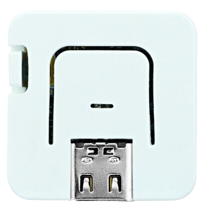

# Using the Moddable SDK with ESP32
Copyright 2016-2023 Moddable Tech, Inc.<BR>
Revised: March 3, 2023

This document provides a guide to building apps for the ESP32 line of SoCs from Espressif. The Moddable SDK supports [ESP32](https://www.espressif.com/en/products/socs/esp32), [ESP32-S2](https://www.espressif.com/en/products/socs/esp32-s2), [ESP32-S3](https://www.espressif.com/en/products/socs/esp32-s3), and [ESP32-C3](https://www.espressif.com/en/products/socs/esp32-c3).

## Table of Contents

* [Overview](#overview)
* [Platforms](#platforms)
	* [ESP32](#platforms-esp32)
	* [ESP32-S2](#platforms-esp32-s2)
	* [ESP32-S3](#platforms-esp32-s3)
	* [ESP32-C3](#platforms-esp32-c3)
	* [Specifying ESP32 Subclass in Manifest](#platforms-manifest)
* [Build Types](#builds)
	* [Debug](#build-debug)
	* [Instrumented](#build-instrumented)
	* [Release](#build-release)
* Setup instructions

	| [](#mac) | [](#win) | [](#lin) |
	| :--- | :--- | :--- |
	| •  [Installing](#mac-instructions)<BR>•  [Troubleshooting](#mac-troubleshooting)<BR>•  [Updating](#mac-update) | •  [Installing](#win-instructions)<BR>•  [Troubleshooting](#win-troubleshooting)<BR>•  [Updating](#win-update) | •  [Installing](#lin-instructions)<BR>•  [Troubleshooting](#lin-troubleshooting)<BR>•  [Updating](#lin-update)

* [Troubleshooting](#troubleshooting)

<a id="overview"></a>
## Overview

Before you can build applications, you need to:

- Install the Moddable SDK and build its tools
- Install the required drivers and development tools for the ESP32 platform

The instructions below will have you verify your setup by running the `helloworld` example on your device using `mcconfig`, a command line tool that builds and runs Moddable applications.

> See the [Tools documentation](./../tools/tools.md) for more information about `mcconfig`


When building with `mcconfig`, you specify your device target by providing the **platform identifier** of your development board to the `-p` argument. For example, use the following command to build for Moddable Two:

```text
mcconfig -d -m -p esp32/moddable_two
```

A list of available ESP32 and ESP32-S2 subplatforms and their platform identifiers is provided in the **Platforms** section below.

<a id="platforms"></a>
## Platforms

<a id="platforms-esp32"></a>
### ESP32

ESP32 has the following features:

- 240 MHz processor
- Dual core
- Wi-Fi
- BLE
- 520 KB RAM
- 4 MB flash

The Moddable SDK supports many devices built on ESP32. The following table lists each device, its platform identifier, a list of key features specific to the device, and links to additional resources.

| Name | Platform identifier | Key features | Links |
| :---: | :--- | :--- | :--- |
| <BR>Moddable Two | `esp32/moddable_two`<BR>`simulator/moddable_two` | **2.4" IPS display**<BR>240 x 320 QVGA<BR>16-bit color<BR>Capacitive touch<BR><BR>20 External pins  | <li>[Moddable Two developer guide](./moddable-two.md)</li><li>[Moddable product page](https://www.moddable.com/purchase.php)</li> |
| <BR>Node MCU ESP32 | `esp32/nodemcu` | | 
| <BR> M5Stack | `esp32/m5stack`<BR>`esp32/m5stack_core2` | **1.8" LCD display**<BR>320 x 240 QVGA<BR>16-bit color<BR><BR>Audio playback<BR>Accelerometer<BR>NeoPixels  | <li>[Product page](https://m5stack.com/collections/m5-core/products/basic-core-iot-development-kit)</li> |
| <BR>M5Stack Fire | `esp32/m5stack_fire` | **1.8" LCD display**<BR>320 x 240 QVGA<BR>16-bit color<BR><BR>Audio playback<BR>Accelerometer<BR>NeoPixels | <li>[Product page](https://m5stack.com/collections/m5-core/products/fire-iot-development-kit?variant=16804798169178)</li> |
| <BR>M5Stick C | `esp32/m5stick_c`<BR>`simulator/m5stick_c` | **0.96" LCD display**<BR>80 x 160<BR>16-bit color<BR><BR>IMU<BR>Microphone | <li>[Product page](https://m5stack.com/collections/m5-core/products/stick-c?variant=17203451265114)</li> |
| <BR>M5Stick C PLUS | `esp32/m5stick_cplus` | **1.14" LCD display**<BR>135 x 240<BR>16-bit color<BR><BR>IMU<BR>Microphone | <li>[Product page](https://docs.m5stack.com/en/core/m5stickc_plus)</li> |
|  <BR>M5Atom | `esp32/m5atom_echo`<BR>`esp32/m5atom_lite`<BR>`esp32/m5atom_matrix` | 5 x 5 RGB LED matrix panel<BR><BR>MPU6886 Inertial Sensor<BR>6 External Pins | <li>[Product page](https://m5stack.com/collections/m5-atom/products/atom-matrix-esp32-development-kit)</li> |
|  <BR>M5AtomU | `esp32/m5atom_u` | Neopixel, 1 button<BR>Microphone<BR>6 External Pins | <li>[Product page](https://docs.m5stack.com/en/core/atom_us)</li> |
|  <BR>M5 Paper | `esp32/m5paper`<BR>`simulator/m5paper` | **960 x 540 ePaper touch screen**<BR>Temperature sensor | <li>[Product page](https://shop.m5stack.com/products/m5paper-esp32-development-kit-960x540-4-7-eink-display-235-ppi?variant=37595977908396)</li><li>[Moddable SDK docs](./m5paper.md)</li> |
| <BR>M5Core Ink | `esp32/m5core_ink ` | **200 x 200 ePaper display**<BR>Buzzer<BR>Dial | <li>[Product page](https://shop.m5stack.com/products/m5stack-esp32-core-ink-development-kit1-54-elnk-display)</li><li>[Moddable SDK docs](./m5core_ink.md)</li> |
|  <BR> Heltec WiFi Kit 32 | `esp32/heltec_wifi_kit_32` | **128 x 64 OLED display** | <li>[Product page](https://heltec.org/project/wifi-kit-32/)</li> |
|  <BR> Wemos OLED Lolin32 | `esp32/wemos_oled_lolin32` | **128 x 64 OLED display**<BR>No built-in LED's | <li>[Additional information](https://randomnerdtutorials.com/esp32-built-in-oled-ssd1306/)</li> |
|  <BR>SparkFun Thing | `esp32/esp32_thing` | | <li>[Product page](https://www.sparkfun.com/products/13907)</li> |
|  <BR>SparkFun Thing Plus | `esp32/esp32_thing_plus ` | | <li>[Product page](https://www.sparkfun.com/products/15663)</li> |
| <BR>ESP32 WRover Kit | `esp32/wrover_kit` | | <li>[Product page](https://www.adafruit.com/product/3384)</li> |
|  <BR> Wireless Tag WT32-ETH01 | `esp32/wt32_eth01` | **Built-in Ethernet** | <li>[Product page](http://www.wireless-tag.com/portfolio/wt32-eth01/)</li> |
| Moddable Zero | `esp32/moddable_zero` | | <li>[Wiring guide](../displays/wiring-guide-generic-2.4-spi-esp32.md)</li> |


<a id="platforms-esp32-s2"></a>
### ESP32-S2

ESP32-S2 has the following features:

- 240 MHz processor
- Wi-Fi
- 320 KB RAM
- External SRAM support
- 4 MB flash on popular modules

The Moddable SDK supports two ESP32-S2 development kits from Espressif. The following table lists each device, its platform identifier, a list of key features specific to the device, and links to additional resources.

| Name | Platform identifier | Key features | Links |
| :---: | :--- | :--- | :--- |
|  <BR>Kaluga | `esp32/kaluga` | **3.2" LCD display**<BR>320 x 240 QVGA<BR>16-bit color<BR><BR>2 MB SRAM<BR>Speaker and Audio Playback<BR>Touch Pad Panel<BR>NeoPixel LED | <li>[Moddable blog post](https://blog.moddable.com/blog/espidf42/)</li><li>[Product page](https://docs.espressif.com/projects/esp-idf/en/latest/esp32s2/hw-reference/esp32s2/user-guide-esp32-s2-kaluga-1-kit.html)</li> |
|  <BR>Saola<BR>(WROOM & WROVER versions) | `esp32/saola_wroom` <BR> `esp32/saola_wrover`| NeoPixel LED<BR>2 MB SRAM (WROVER version only)| <li>[Moddable blog post](https://blog.moddable.com/blog/espidf42/)</li><li>[Product page](https://docs.espressif.com/projects/esp-idf/en/latest/esp32s2/hw-reference/esp32s2/user-guide-saola-1-v1.2.html)</li> |

<a id="platforms-esp32-s3"></a>
### ESP32-S3

ESP32-S3 is the successor to the original ESP32. It has the following features:

- 240 MHz processor (two cores)
- Wi-Fi
- BLE
- 512 KB RAM
- External PSRAM support
- 8 MB flash on popular modules

The Moddable SDK supports devices built on ESP32-S3. The following table lists each device, its platform identifier, a list of key features specific to the device, and links to additional resources.

| Name | Platform identifier | Key features | Links |
| :---: | :--- | :--- | :--- |
|  <BR>ESP32-S3-DevKitC-1-N8 | `esp32/esp32s3` | |<li>[Product page](https://docs.espressif.com/projects/esp-idf/en/latest/esp32s3/hw-reference/esp32s3/user-guide-devkitc-1.html)</li> |
|  <BR>Adafruit QT Py ESP32-S3 | `esp32/qtpys3` |  | <li>[Product page](https://www.adafruit.com/product/5426)</li> |
|  <BR>Adafruit ESP32-S3 TFT Feather | `esp32/s3_tft_feather` | 1.14" TFT display<BR> 240 x 135 16-bit color | <li>[Product page](https://www.adafruit.com/product/5483)</li>|
|<BR>AtomS3| `esp32/m5atom_s3` |  0.85" IPS display<BR> 128 x 128 16-bit color<BR> 1 button<BR> IMU |<li>[Product page](https://docs.m5stack.com/en/core/AtomS3)</li>| 
|<BR>AtomS3 Lite| `esp32/m5atom_s3_lite` | Neopixel, 1 button |<li>[Product page](https://docs.m5stack.com/en/core/AtomS3%20Lite)</li>|

<a id="platforms-esp32-c3"></a>
### ESP32-C3

ESP32-C3 has the following features:

- 160 MHz RISC-V MCU
- Wi-Fi
- BLE
- 400 KB RAM
- 4 MB flash on popular modules

The Moddable SDK supports three ESP32-C3 development kits:

| Name | Platform identifier | Key features | Links |
| :---: | :--- | :--- | :--- |
|  <BR>ESP32-C3-DevKitM-1 | `esp32/esp32c3` |  | <li>[Product page](https://docs.espressif.com/projects/esp-idf/en/latest/esp32c3/hw-reference/esp32c3/user-guide-devkitm-1.html)</li> |
| AI Thinker ESP-C3-32S-Kit <BR> (1 MB and 2 MB versions) | `esp32/c3_32s_kit` <BR> `esp32/c3_32s_kit_2m`| RGB LED  | <li>[Product specification](https://docs.ai-thinker.com/_media/esp32/docs/esp-c3-32s-kit-v1.0_specification.pdf)</li> |

<a id="platforms-manifest"></a>
### Specifying ESP32 Subclass in Manifest

The target ESP32 subclass for a build is specified using the `ESP32_SUBCLASS` property in the `build` section of the manifest. This is usually set by the manifest for the target build device. The following example shows how to set the subclass to ESP32-S2. Use `"esp32s3"` for the ESP32-S3 and `"esp32"` for the original ESP32.


```
"build":{
	"ESP32_SUBCLASS": "esp32s2"
},
``` 

<a id="builds"></a>
## Build Types
The ESP32 supports three kinds of builds: debug, instrumented, and release. Each is appropriate for different stages in the product development process. You select which kind of build you want from the command line.

<a id="build-debug"></a>
### Debug
A debug build is used for debugging JavaScript. In a debug build, the ESP-IDF logging is disabled and the GDB stub is not present.

The `-d` option on the `mcconfig` command line selects a debug build.

<a id="build-instrumented"></a>
### Instrumented
A debug build is used for debugging native code. In an instrumented build, the ESP-IDF logging is enabled and the GDB stub is present. The JavaScript debugger is disabled. The instrumentation data usually available in xsbug is output to the serial console once a second.

The `-i` option on the `mcconfig` command line selects an instrumented build.

<a id="build-release"></a>
### Release
A release build is for production. In a release build, the ESP-IDF logging is disabled, the GDB stub is not present, the JavaScript debugger is disabled, instrumentation statistics are not collected, and serial console output is suppressed.

Omitting the `-d` and `-i` options on the `mcconfig` command line selects a release. Note that `-r` specifies rotation rather than selecting a release build.

<a id="mac"></a>
## macOS

The Moddable SDK build for ESP32 currently uses ESP-IDF v4.4.3 (commit `6407ecb`) and the CMake option of Espressif's [`idf.py` tool](https://github.com/espressif/esp-idf/blob/master/tools/idf.py). 

<a id="mac-instructions"></a>
### Installing

1. Install the Moddable SDK tools by following the instructions in the [Getting Started document](./../Moddable%20SDK%20-%20Getting%20Started.md).

2. Create an `esp32` directory in your home directory at `~/esp32` for required third party SDKs and tools. 

3. If you are running macOS 10.15 (Catalina) or earlier, download and install the Silicon Labs [CP210x USB to UART VCP driver](https://www.silabs.com/products/development-tools/software/usb-to-uart-bridge-vcp-drivers). 

	If you run macOS Catalina, an extra step is required to enable the VCP driver. If you see a popup that says "System Extension Blocked" during installation, follow the instructions in the dialog to enable the extension in Security & Privacy System Preferences.
	
	If you are using macOS 10.16 (Big Sur) or later, you do not need to install the VCP driver.

4. If this is your first install, clone the `ESP-IDF` GitHub repository into your `~/esp32` directory. Make sure to specify the `--recursive` option. Then checkout the `v4.4.3` tag:

	```text
	cd ~/esp32
	git clone --recursive https://github.com/espressif/esp-idf.git
	cd esp-idf
	git checkout v4.4.3
	git submodule update --init --recursive
	```

	If you already have a clone of the ESP-IDF, update to the `v4.4.3` tag`:

	```text
	cd ~/esp32/esp-idf
	git fetch --all --tags
	git checkout v4.4.3
	git submodule update --init --recursive
	```

5. Update homebrew and then install Python, cmake, ninja, the pip package management system, and pyserial. Also run a `brew upgrade` on those packages, in case you already had older versions installed:

	```text
	brew update
	brew install python3 cmake ninja dfu-util
	brew upgrade python3 cmake ninja dfu-util
	pip install pyserial
	```

6. Connect the ESP32 device to your macOS host with a USB cable.

7. Open your shell startup/initialization file. 

	For macOS Mojave and earlier, the default shell is `bash`, so you should open `~/.profile`. 

	```text
	open ~/.profile
	```
	
	Starting with macOS Catalina, the [default shell is `zsh`](https://support.apple.com/en-us/HT208050), so you should open `~/.zshrc`.
	
	```text
	open ~/.zshrc
	```
		
8. Add the following line to the file you just opened and save. This sets the `IDF_PATH` environment variable to point at your ESP-IDF directory.

	```text
	export IDF_PATH=$HOME/esp32/esp-idf
	```

	There is one optional environment variables for advanced users: `UPLOAD_PORT`.

	The ESP-IDF build/config tool `idf.py` automatically detects the serial port in most cases. If it does not, set the path of the port to use in the `UPLOAD_PORT` environment variable.

	```text
	export UPLOAD_PORT=/dev/cu.SLAB_USBtoUART
	```

	To identify the proper serial port, examine the list of serial devices in macOS before and after plugging in your ESP32 device and note the new serial port that shows up. To see a list of serial device files, use the following command in Terminal:
	
	```text
	ls /dev/cu.*
	```

	The `UPLOAD_PORT` can also be specified on the `mcconfig` command line, which is useful when deploying to multiple ESP32 devices.
	
	```text
	UPLOAD_PORT=/dev/cu.SLAB_USBtoUART mcconfig -d -m -p esp32
	```

9. Adding the export statements to your `~/.profile` or `~/.zshrc` does not update the environment variables in active shell instances, so open a new shell instance (by opening a new tab/window) or manually run the export statement in your shell before proceeding.

10. Run the ESP-IDF install script. This will install the proper cross-compilation toolchain and utilities needed for the ESP-IDF build.

	```text
	cd $IDF_PATH
	./install.sh
	```
	
	If you are using a Mac with an M1 chip, you will have to take some additional steps before you can run the install script because the ESP-IDF does not yet have proper support for Darwin-arm64 hosts. [This comment](https://github.com/espressif/esp-idf/issues/6113#issuecomment-756335935) provides step by step instructions that you can follow to work around this issue.

11. Set up your build environment by sourcing the ESP-IDF `export.sh` script. **This must be run __every time__ you open a new shell instance,** either manually or by a startup script. 

	```text
	source $IDF_PATH/export.sh
	```

	If you prefer to automate this process for new shell instances, follow the instructions from Steps 7-9 above and add the `source` command at the end of your shell startup/initialization script. Make sure it is after the `export IDF_PATH` command.

12. Verify the setup by building `helloworld` for your device target:


	```text
	cd ${MODDABLE}/examples/helloworld
	mcconfig -d -m -p esp32/<YOUR_SUBPLATFORM_HERE>
	```
	
	> Note that the first time you build an application for the ESP32 target, the toolchain may prompt you to enter configuration options. If this happens, accept the defaults.

<a id="mac-troubleshooting"></a>
### Troubleshooting

When you're trying to install applications, you may experience roadblocks in the form of errors or warnings; this section explains some common issues on macOS and how to resolve them.

For other issues that are common on macOS, Windows, and Linux, see the [Troubleshooting section](#troubleshooting) at the bottom of this document.


#### SSL certificate errors

Espressif is encouraging moving to Python 3 as 2.7 is not recommended.

However, if you are using Python 2.7 and  encounter SSL certificate errors while building the ESP-IDF, you may need to install Python 2.7 and the required packages manually. We've used [brew](https://brew.sh/) and [pip](https://pypi.org/project/pip/) to install the additional components:

```text
brew install python
brew install python@2
pip install future
pip install pyserial
pip install cryptography
```
	
#### Device not connected/recognized

The following error messages mean that the device is not connected to your computer or the computer doesn't recognize the device.

```text
error: cannot access /dev/cu.SLAB_USBtoUART
error: cannot access /dev/usbserial-0001
```

There are a few reasons this can happen:
 
1. Your device is not plugged into your computer. Make sure it's plugged in when you run the build commands. 
2. You have a USB cable that is power only. Make sure you're using a data sync-capable USB cable.
3. The computer does not recognize your device. To fix this problem, follow the instructions below.


Unplug the device and enter the following command.

```text
ls /dev/cu*
```

Then plug in the device and repeat the same command. If nothing new appears in the terminal output, the device isn't being recognized by your computer.

If you are running macOS 10.15 or earlier, make sure you have the correct VCP driver installed.  If you are running macOS 10.16 or earlier, you do not need to install the VCP driver. 

If it is recognized, you now have the device name and you need to edit the `UPLOAD_PORT` environment variable. Enter the following command, replacing `/dev/cu.SLAB_USBtoUART` with the name of the device on your system.

```text
export UPLOAD_PORT=/dev/cu.SLAB_USBtoUART
```

<a id="mac-update"></a>	
### Updating

1. If you already have a clone of the ESP-IDF, update to the `v4.4.3` tag.

	```text
	cd ~/esp32/esp-idf
	git fetch --all --tags
	git checkout v4.4.3
	git submodule update --init --recursive
	```

	If you experience any problems updating the ESP-IDF, you can simply delete the `esp-idf` directory and re-clone it instead:

	```text
	cd ~/esp32
	rm -rf esp-idf
	git clone --recursive https://github.com/espressif/esp-idf.git
	cd esp-idf
	git checkout v4.4.3
	git submodule update --init --recursive
	```
	
2. Update homebrew and then verify that you have all the necessary tools and that they are up to date:

	```text
	brew update
	brew install python cmake ninja
	brew upgrade python cmake ninja
	pip install pyserial
	```	
		
3. Verify the `IDF_PATH` environment variable is set correctly in your shell's user profile file (e.g. `~/.profile` or `~/.zshrc`, depending on your shell).

	```text
   export IDF_PATH=$HOME/esp32/esp-idf
	```

4. Run the ESP-IDF install script. This will install the proper cross-compilation toolchain and utilities needed for the ESP-IDF build.

	```text
	cd $IDF_PATH
	./install.sh
	```

5. Set up your build environment by sourcing the ESP-IDF `export.sh` script. **This must be run every time you open a new shell instance,** either manually or by a startup script. 

	```text
	source $IDF_PATH/export.sh
	```

	If you prefer to automate this process for new shell instances, follow the instructions from Step 3 above and add the `source` command at the end of your shell startup/initialization script. Make sure it is after the `export IDF_PATH` command.
	
6. If you have existing ESP32 build output in `$MODDABLE/build/bin/esp32` or `$MODDABLE/build/tmp/esp32`, delete those directories:

    ```text
    cd $MODDABLE/build
    rm -rf bin/esp32
    rm -rf tmp/esp32
    ```

7. Verify the setup by building `helloworld` for your device target:

	```text
	cd ${MODDABLE}/examples/helloworld
	mcconfig -d -m -p esp32/<YOUR_SUBPLATFORM_HERE>
	```
	
	> Note that the first time you build an application for the ESP32 target, the toolchain may prompt you to enter configuration options. If this happens, accept the defaults.


<a id="win"></a>	
## Windows

The Moddable SDK build for ESP32 currently uses ESP-IDF v4.4.3 (commit `6407ecb`) and the CMake option of Espressif's [`idf.py` tool](https://github.com/espressif/esp-idf/blob/master/tools/idf.py). 

<a id="win-instructions"></a>
### Installing

1. Install the Moddable SDK tools by following the instructions in the [Getting Started document](./../Moddable%20SDK%20-%20Getting%20Started.md).

2. Download and install the Silicon Labs [CP210x USB to UART VCP driver](https://www.silabs.com/products/development-tools/software/usb-to-uart-bridge-vcp-drivers). The driver zip file contains x64 and x86 versions of the installer. Most modern PCs run 64-bit Windows and should use the x64 version of the VCP driver. If you run a 32-bit version of Windows, use the x86 version of the driver. (You can determine if your computer is running a 64-bit version of Windows by checking "About your PC" in System Settings.)

3. Download and run the Espressif [ESP-IDF Windows Installer](https://dl.espressif.com/dl/esp-idf/?idf=4.4). This will install the ESP32 Xtensa gcc toolchain, Ninja Build, OpenOCD, and a KConfig Frontend. This tool will also set your `PATH` to include the newly downloaded tools, as necessary.

    It is safe to accept all of the default options in the installer, or to change install locations as necessary.

    If you do not already have CMake or Python, the installer will also prompt you to download and install those tools (you should do so if needed).

	The installer will offer to clone the ESP-IDF git repository for you. If you choose this option, select the "v4.4.3 (release version)" option and clone into a directory called `esp32\esp-idf` within your home folder.


4. If you did not clone the ESP-IDF using the ESP-IDF Windows Installer, create an `esp32` directory in your home folder, either from File Explorer or a Command Prompt:

    ```text
    cd %USERPROFILE%
    mkdir esp32
    ```

5. If you did not clone the ESP-IDF using the ESP-IDF Windows Installer, clone the `ESP-IDF` Github repository into your `~/esp32` directory. Make sure to specify the `--recursive` option. Then checkout the `v4.4.3` tag:

    ```text
    cd %USERPROFILE%\esp32
    git clone --recursive https://github.com/espressif/esp-idf.git
	cd esp-idf
	git checkout v4.4.3
	git submodule update --init --recursive
    ```

	If you already have a cloned copy of the ESP-IDF, the simplest way to do the update is to delete the existing `esp-idf` folder and clone it again. [See Espressif's Get ESP-IDF](https://docs.espressif.com/projects/esp-idf/en/v4.3/esp32/get-started/index.html#get-started-get-esp-idf)

6. Connect the ESP32 device to your Windows host with a USB cable.
	
7. Open the "Environment Variables" dialog of the Control Panel app by following [these instructions](https://www.architectryan.com/2018/08/31/how-to-change-environment-variables-on-windows-10/). From that dialog:
	- Create a User Variable called `IDF_PATH` and set it to the directory where you cloned the ESP-IDF, e.g.:
		- Variable name: `IDF_PATH`
		- Variable value (Use the "Browse Directory..." button to make this selection): `C:\Users\<user>\esp32\esp-idf`

	There is one optional environment variable for advanced users: `UPLOAD_PORT`.<br><br>
	The ESP-IDF build/config tool `idf.py` automatically detects the serial port in most cases. If it does not, set the path of the port to use in the `UPLOAD_PORT` environment variable following the same procedure as above.

    - `UPLOAD_PORT`: the COM port for your device, e.g. `COM3`

	To identify the correct serial port, launch the Windows Device Manager. Open the "Ports (COM & LPT)" section, verify the "Silicon Labs CP210x USB to UART Bridge" is displayed, and note the associated COM port (e.g. COM3).

8. Newly-set environment variables will not take effect in existing Command Prompt instances, so be sure to open a new Command Prompt instance after applying these changes.

9. Run the ESP-IDF install batch file. This will configure utilities used by the ESP-IDF build for your machine.

	```text
	cd %IDF_PATH%
	install.bat
	```
	
10. The ESP-IDF Windows Installer provides a command prompt called "ESP-IDF 4.4 CMD" that automatically sets important environment variables and paths. We recommend building ESP32 projects with "ESP-IDF 4.4 CMD." In each new command prompt instance you will need to run the Visual Studio x86 initialization batch file manually. Adjust the path as necessary for your system.

	```text
	"C:\Program Files\Microsoft Visual Studio\2022\Community\VC\Auxiliary\Build\vcvars32.bat"
	```

	**Note for experts:** If you are comfortable editing Windows shortcuts, a convenient alternative to this manual process is to modify the "ESP-IDF 4.4 CMD" shortcut to initialize both the ESP-IDF environment and the Visual Studio x86 environment. To do this, right-click the "ESP-IDF 4.4 CMD" shortcut and select "Properties." In the "Target" field of the Properties window, you should see a command that looks like:

	```text
	C:\WINDOWS\system32\cmd.exe /k "C:\Users\<username>\.espressif\idf_cmd_init.bat"
	```

	You can change the Target to include the path to `vcvars32.bat` as follows. Adjust the paths as necessary for your system.

	```text
	%comspec% /k ""%ProgramFiles%\Microsoft Visual Studio\2022\Community\VC\Auxiliary\Build\vcvars32.bat" && pushd %IDF_PATH% && "%IDF_TOOLS_PATH%\idf_cmd_init.bat" && popd"
	```

	It is also convenient to update the "Start in" field of the shortcut to `%MODDABLE%` to start your Command Prompt session in the Moddable SDK directory.

	> Note: These instructions assume you only have one copy of the ESP-IDF installed. `idf_cmd_init.bat` can also take an argument to specify a particular ESP-IDF installation, if necessary. This argument should be set up in the default "ESP-IDF 4.4 CMD" shortcut.

11. In the "ESP-IDF 4.4 CMD" command prompt, verify the setup by building `helloworld` for your device target:

	```text
	cd %MODDABLE%\examples\helloworld
	mcconfig -d -m -p esp32/<YOUR_SUBPLATFORM_HERE>
	```
	
<a id="win-troubleshooting"></a>
### Troubleshooting

When you're trying to install applications, you may experience roadblocks in the form of errors or warnings; this section explains some common issues on Windows and how to resolve them.

For other issues that are common on macOS, Windows, and Linux, see the [Troubleshooting section](#troubleshooting) at the bottom of this document.

#### ESP-IDF Build is Extremely Slow

The built-in anti-virus software included with Windows 10 and 11 (Microsoft Defender, formerly Windows Defender) can significantly slow down ESP-IDF builds. Espressif's [ESP-IDF Windows Installer](https://dl.espressif.com/dl/esp-idf/?idf=4.4) includes an option to automatically configure Microsoft Defender with all the exclusions needed to bypass realtime scanning during builds. If your build is slow, try re-running the ESP-IDF Windows Installer to verify that that option is selected. You may also need to manually exclude your Moddable build folder or other custom build output directories by following [these instructions](https://support.microsoft.com/en-us/windows/add-an-exclusion-to-windows-security-811816c0-4dfd-af4a-47e4-c301afe13b26).

#### Python Versions

Espressif recommends using Python 3.9 or later when building with ESP-IDF v4.4. Python 3.9 will be installed by the ESP-IDF Windows Installer.

If you had a previous version of Python (such as Python 2.7) installed on your system, you may need to remove it from the System PATH so that Python 3.9 is chosen by default. Look for entries like `C:\Python27\` or `C:\Python27\Scripts\` in your PATH and remove them if you encounter Python errors during the build process. 

#### Python dependencies

If you get an error about Python dependencies not being installed, it means that the ESP-IDF installer failed to update Python. This usually happens due to permissions issues on your machine. To correct it, run `python -m pip install -r %IDF_PATH%\requirements.txt` from the "x86 Native Tools Command Prompt for VS 2022."	

#### Device not connected/recognized

If a device is not connected, or the UPLOAD_PORT isn't set to the proper COM port, a number of error messages may appear after building. An error message similar to the following means that the device is not connected to your computer or the computer doesn't recognize the device. Note the `could not open port 'COM3'` message.

```text
raise SerialException("could not open port {!r}: {!r}".format(self.portstr, ctypes.WinError()))
serial.serialutil.SerialException: could not open port 'COM3': FileNotFoundError(2, 'The system cannot find the file specified.', None, 2)
```

There are a few reasons this can happen:
 
1. Your device is not plugged into your computer. Make sure it's plugged in when you run the build commands. 
2. You have a USB cable that is power only. Make sure you're using a data sync-capable USB cable.
3. The computer does not recognize your device. To fix this problem, follow the instructions below.

Check the list of USB devices in Device Manager. If your device shows up as an unknown device, make sure you have the correct VCP driver installed.

If your device shows up on a COM port other than COM3, you need to edit the `UPLOAD_PORT` environment variable. Enter the following command, replacing `COM3` with the appropriate device COM port for your system.

```text
set UPLOAD_PORT=COM5
```

<a id="win-update"></a>	
### Updating

To ensure that your build environment is up to date, perform the following steps:

1. Download and run the Espressif [ESP-IDF Windows Installer](https://dl.espressif.com/dl/esp-idf/?idf=4.4). This will update the ESP32 Xtensa gcc toolchain, Ninja Build, OpenOCD, and a KConfig Frontend. This tool will also set your `PATH` to include the newly downloaded tools, as necessary.

    It is safe to accept all of the default options in the installer, or to change install locations as necessary.

    If you do not already have CMake or Python, the installer will also prompt you to download and install those tools (you should do so if needed).
    
    If you choose to clone the ESP-IDF, select the `v4.4.3 (release version)` of the esp-idf.

	If you use the installer to clone the ESP-IDF, please follow the instructions in the next step to update to the `v4.4.3` tag.


2. If you did not clone the ESP-IDF using the ESP-IDF Windows Installer, clone  the `ESP-IDF` Github repository into your `~/esp32` directory. Make sure to specify the `--recursive` option. Then checkout the `v4.4.3` tag:

    ```text
    cd %USERPROFILE%\esp32
    git clone --recursive https://github.com/espressif/esp-idf.git
	cd esp-idf
	git checkout v4.4.3
	git submodule update --init --recursive
    ```

	If you already have an ESP-IDF directory that you want to update in place, you can do so with these commands:

	```text
	cd %IDF_PATH%
	git fetch --all --tags
	git checkout v4.4.3
	git submodule update --init --recursive
	```

	If you experience any problems updating the ESP-IDF, you can simply delete the `esp-idf` directory and re-clone it instead as described above.

3. Open the "Environment Variables" dialog of the Control Panel app by following [these instructions](https://www.architectryan.com/2018/08/31/how-to-change-environment-variables-on-windows-10/). From that dialog, verify the `IDF_PATH` Windows environment variable is set correctly.

	- `IDF_PATH` should have the value `C:\Users\<user>\esp32\esp-idf`

4. Run the ESP-IDF install batch file. This will configure utilities used by the ESP-IDF build for your machine.

	```text
	cd %IDF_PATH%
	install.bat
	```

5. If you have existing ESP32 build output in `%MODDABLE%\build\bin\esp32` or `%MODDABLE%\build\tmp\esp32`, delete those directories. For instance, using the "x86 Native Tools Command Prompt for VS 2022" command line console:

    ```text
    cd %MODDABLE%\build
    rmdir /S /Q bin\esp32
    rmdir /S /Q tmp\esp32
    ```

6. The ESP-IDF Windows Installer provides a command prompt called "ESP-IDF 4.4 CMD" that automatically sets important environment variables and paths. We recommend building ESP32 projects using "ESP-IDF 4.4 CMD." In each new command prompt instance you will need to run the Visual Studio x86 initialization batch file manually. Adjust the path as necessary for your system.

	```text
	"C:\Program Files\Microsoft Visual Studio\2022\Community\VC\Auxiliary\Build\vcvars32.bat"
	```

	**Note for experts:** If you are comfortable editing Windows shortcuts, a convenient alternative to this manual process is to modify the "ESP-IDF 4.4 CMD" shortcut to initialize both the ESP-IDF environment and the Visual Studio x86 environment. To do this, right-click the "ESP-IDF 4.4 CMD" shortcut and select "Properties." In the "Target" field of the Properties window, you should see a command that looks like:

	```text
	C:\WINDOWS\system32\cmd.exe /k "C:\Users\<username>\.espressif\idf_cmd_init.bat"
	```

	You can change the Target to include the path to `vcvars32.bat` as follows. Adjust the paths as necessary for your system.

	```text
	%comspec% /k ""%ProgramFiles%\Microsoft Visual Studio\2022\Community\VC\Auxiliary\Build\vcvars32.bat" && pushd %IDF_PATH% && "%IDF_TOOLS_PATH%\idf_cmd_init.bat" && popd"
	```

	It is also convenient to update the "Start in" field of the shortcut to `%MODDABLE%` to start your Command Prompt session in the Moddable SDK directory.

	> Note: These instructions assume you only have one copy of the ESP-IDF installed. `idf_cmd_init.bat` can also take an argument to specify a particular ESP-IDF installation, if necessary. This argument should be set up in the default "ESP-IDF 4.4 CMD" shortcut.


7. In the "ESP-IDF 4.4 CMD" command prompt, verify the setup by building `helloworld` for your device target:

	```text
	cd %MODDABLE%\examples\helloworld
	mcconfig -d -m -p esp32/<YOUR_SUBPLATFORM_HERE>
	```

<a id="esp32-linux"></a>
## Linux

The Moddable SDK build for ESP32 currently uses ESP-IDF v4.4.3 (commit `6407ecb`) and the CMake option of Espressif's [`idf.py` tool](https://github.com/espressif/esp-idf/blob/master/tools/idf.py). 

<a id="lin-instructions"></a>
### Installing

1. Install the Moddable SDK tools by following the instructions in the [Getting Started document](./../Moddable%20SDK%20-%20Getting%20Started.md).

2. Install the packages required to compile with the `ESP-IDF`.

	For Ubuntu 20.04 or newer (and other Linux distributions that default to Python 3):

	```text
	sudo apt-get update
	sudo apt-get install git wget flex bison gperf python-is-python3 python3-pip python3-serial python-setuptools cmake ninja-build ccache libffi-dev libssl-dev dfu-util
	```

	For Ubuntu prior to 20.04 (and other Linux distributions that default to Python 2):

	```text
	sudo apt-get update
	sudo apt-get install git wget flex bison gperf python python-pip python-setuptools python-serial cmake ninja-build ccache libffi-dev libssl-dev dfu-util
	```

	> Note: The ESP-IDF build recommends Python 3 and will soon stop supporting Python 2.7. If your distribution uses Python 2.7 by default, you can explicitly install Python 3 and set it as the default Python interpreter with these commands. Note that this is a system-wide change that will impact other applications that use Python.

	```text
	sudo apt-get install python3 python3-pip python3-setuptools
	sudo update-alternatives --install /usr/bin/python python /usr/bin/python3 10
	```

3. Create an `esp32` directory in your home directory at `~/esp32` for required third party SDKs and tools. 

4. If this is your first install, clone the `ESP-IDF` GitHub repository into your `~/esp32` directory. Make sure to specify the `--recursive` option. Then checkout the `v4.4.3` tag:

	```text
	cd ~/esp32
	git clone --recursive https://github.com/espressif/esp-idf.git
	cd esp-idf
	git checkout v4.4.3
	git submodule update --init --recursive
	```

	If you already have a clone of the ESP-IDF, update to the `v4.4.3` tag by using the [update instructions below](#lin-update).

	```text
	cd ~/esp32/esp-idf
	git fetch --all --tags
	git checkout v4.4.3
	git submodule update --init --recursive
	```

5. Connect the ESP32 device to your Linux host with a USB cable.

6. Open your shell startup/initialization file (e.g.  ` ~/.bash_profile` or `~/.zshrc`, depending on your shell), add the following line to the file, and save. This sets the `IDF_PATH` environment variable to point at your ESP-IDF directory.

	```text
	export IDF_PATH=$HOME/esp32/esp-idf
	```

	There is an optional environment variable for advanced users: `UPLOAD_PORT`.

	The ESP-IDF build/config tool `idf.py` automatically detects the serial port in most cases. If it does not, set the path of the port to use in the `UPLOAD_PORT` environment variable.

	```text
	export UPLOAD_PORT=/dev/ttyUSB0
	```

	To identify the proper serial port, examine the list of serial devices on your Linux host before and after plugging in your ESP32 device and note the new serial port that shows up. To see a list of serial device files, use the following command:
	
	```text
	ls /dev/*
	```

	The `UPLOAD_PORT` can also be specified on the `mcconfig` command line, which is useful when deploying to multiple ESP32 devices.
	
	```text
	UPLOAD_PORT=/dev/ttyUSB0 mcconfig -d -m -p esp32
	```

7. Adding the export statements to your shell startup file does not update the environment variables in active shell instances, so open a new shell instance (by opening a new tab/window) or manually run the export statements in your shell before proceeding.

8. Run the ESP-IDF install script. This will install the proper cross-compilation toolchain and utilities needed for the ESP-IDF build.

	```text
	cd $IDF_PATH
	./install.sh
	```

9. Set up your build environment by sourcing the ESP-IDF `export.sh` script. **This must be run every time you open a new shell instance,** either manually or by a startup script. 

	```text
	source $IDF_PATH/export.sh
	```

	If you prefer to automate this process for new shell instances, follow the instructions from Steps 6-7 above and add the `source` command at the end of your shell startup/initialization script. Make sure it is after the `export IDF_PATH` command.

10. Verify the setup by building `helloworld` for your device target:

	```text
	cd $MODDABLE/examples/helloworld
	mcconfig -d -m -p esp32/<YOUR_SUBPLATFORM_HERE>
	```

	> Note that the first time you build an application for the ESP32 target, the toolchain may prompt you to enter configuration options. If this happens, accept the defaults.
	
<a id="lin-troubleshooting"></a>
### Troubleshooting

When you're trying to install applications, you may experience roadblocks in the form of errors or warnings; this section explains some common issues on Linux and how to resolve them.

For other issues that are common on macOS, Windows, and Linux, see the [Troubleshooting section](#troubleshooting) at the bottom of this document.

#### Permission denied

The ESP32 communicates with the Linux host via the ttyUSB0 device. On Ubuntu Linux the ttyUSB0 device is owned by the `dialout` group. If you get a **permission denied error** when flashing the ESP32, add your user to the `dialout` group:

```text
sudo adduser <username> dialout 
sudo reboot
```

#### Device not connected/recognized

The following error messages mean that the device is not connected to your computer or the computer doesn't recognize the device.

```text
error: cannot access /dev/ttyUSB0
```

There are a few reasons this can happen:
 
1. Your device is not plugged into your computer. Make sure it's plugged in when you run the build commands. 
2. You have a USB cable that is power only. Make sure you're using a data sync-capable USB cable.
3. The computer does not recognize your device. To fix this problem, follow the instructions below.


Unplug the device and enter the following command.

```text
ls /dev/cu*
```

Then plug in the device and repeat the same command. If nothing new appears in the terminal output, the device isn't being recognized by your computer.

If it is recognized, you now have the device name and you need to edit the `UPLOAD_PORT` environment variable. Enter the following command, replacing `/dev/ttyUSB1` with the name of the device on your system.

```text
export UPLOAD_PORT=/dev/ttyUSB1
```

<a id="lin-update"></a>	
### Updating

1. If you already have a clone of the ESP-IDF, update to the `v4.4.3` tag.

	```text
	cd ~/esp32/esp-idf
	git fetch --all --tags
	git checkout v4.4.3
	git submodule update --init --recursive
	```

	If you experience any problems updating the ESP-IDF, you can simply delete the `esp-idf` directory and re-clone it instead:

	```text
	cd ~/esp32
	rm -rf esp-idf
	git clone --recursive https://github.com/espressif/esp-idf.git
	cd esp-idf
	git checkout v4.4.3
	git submodule update --init --recursive
	```

2. Update apt, then install any missing packages (and upgrade existing packages) required to compile with the `ESP-IDF`. The packages to install vary based on your distribution's default Python version.

	For Ubuntu 20.04 or newer (and other Linux distributions that default to Python 3):

	```text
	sudo apt-get update
	sudo apt-get install git wget flex bison gperf python-is-python3 python3-pip python3-serial python-setuptools cmake ninja-build ccache libffi-dev libssl-dev dfu-util
	```

	For Ubuntu prior to 20.04 (and other Linux distributions that default to Python 2):

	```text
	sudo apt-get update
	sudo apt-get install git wget flex bison gperf python python-pip python-setuptools python-serial cmake ninja-build ccache libffi-dev libssl-dev dfu-util
	```

	> Note: The ESP-IDF build recommends Python 3. If your distribution uses Python 2.7 by default, you can explicitly install Python 3 and set it as the default Python interpreter with these commands. Note that this is a system-wide change that will impact other applications that use Python.

	```text
	sudo apt-get install python3 python3-pip python3-setuptools
	sudo update-alternatives --install /usr/bin/python python /usr/bin/python3 10
	```

3. Verify the `IDF_PATH` environment variable is set correctly in your shell's user profile file (e.g. `~/.bash_profile` or `~/.zshrc`, depending on your shell).

	```text
	export IDF_PATH=$HOME/esp32/esp-idf
	```

4. Run the ESP-IDF install script. This will install the proper cross-compilation toolchain and utilities needed for the ESP-IDF build.

	```text
	cd $IDF_PATH
	./install.sh
	```

5. Set up your build environment by sourcing the ESP-IDF `export.sh` script. **This must be run every time you open a new shell instance,** either manually or by a startup script. 

	```text
	source $IDF_PATH/export.sh
	```

	If you prefer to automate this process for new shell instances, follow the instructions from Step 3 above and add the `source` command at the end of your shell startup/initialization script. Make sure it is after the `export IDF_PATH` command.

6. If you have existing ESP32 build output in `$MODDABLE/build/bin/esp32` or `$MODDABLE/build/tmp/esp32`, delete those directories:

    ```text
    cd $MODDABLE/build
    rm -rf bin/esp32
    rm -rf tmp/esp32
    ```

7. Verify the setup by building `helloworld` for your device target:
	
	```text
	cd $MODDABLE/examples/helloworld
	mcconfig -d -m -p esp32/<YOUR_SUBPLATFORM_HERE>
	```

	> Note that the first time you build an application for the ESP32 target, the toolchain may prompt you to enter configuration options. If this happens, accept the defaults.

<a id="troubleshooting"></a>
## Troubleshooting

When you're trying to install applications, you may experience roadblocks in the form of errors or warnings; this section explains some common issues and how to resolve them.
	
### Incompatible baud rate

The following warning message is normal and is no cause for concern.

```text
warning: serialport_set_baudrate: baud rate 921600 may not work
```

However, sometimes the upload starts but does not complete. You can tell an upload is complete after the progress bar traced to the console goes to 100%. For example:

```text
........................................................... [ 16% ]
........................................................... [ 33% ]
........................................................... [ 49% ]
........................................................... [ 66% ]
........................................................... [ 82% ]
........................................................... [ 99% ]
..                                                         [ 100% ]
```

There are a few reasons the upload may fail partway through:

- You have a faulty USB cable.
- You have a USB cable that does not support higher baud rates.
- You're using a board that requires a lower baud rate than the default baud rate that the Moddable SDK uses.

To solve the last two problems above, you can change to a slower baud rate as follows: 

1. Open `$MODDABLE/tools/mcconfig/make.esp32.mk`.

2. Find this line, which sets the upload speed to 921600:

    ```text 
    UPLOAD_SPEED ?= 921600
    ```

3. Set the speed to a smaller number. For example:

    ```text 
    UPLOAD_SPEED ?= 115200
    ```
    
> Note: Instead of modifying the `make.esp32.mk` file, you can make a temporary change by setting the environment variable `UPLOAD_SPEED`.
 
### ESP32 is not in bootloader mode

If an ESP32 is not in bootloader mode, you cannot flash the device. Most development boards built with the ESP32 include circuitry that automatically puts them into bootloader mode when you try to reflash the board. Some do not, and sometimes the auto programming will fail. This is most common on Windows machines. 

When your ESP32 is not in bootloader mode, status messages stop being traced briefly when you attempt to flash the device, and after several seconds this error message is traced to the console:

```text
A fatal error occurred: Failed to connect to ESP32: Timed out waiting for packet header
```

To manually put your ESP32 into bootloader mode, follow these steps:

1. Unplug the device.
2. Hold down the BOOT button.
3. Plug the device into your computer.
4. Enter the `mcconfig` command.
5. Wait a few seconds and release the BOOT button.
