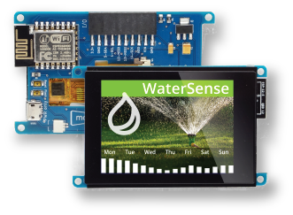
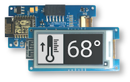
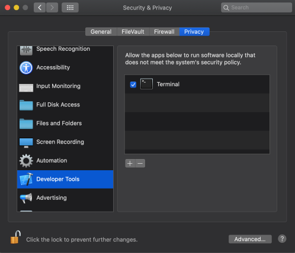

# Using the Moddable SDK with ESP8266
Copyright 2016-2022 Moddable Tech, Inc.<BR>
Revised: December 23, 2022

This document provides a guide to building apps for the [ESP8266](https://www.espressif.com/en/products/socs/esp8266) and ESP8266-based development boards with the Moddable SDK.

## Table of Contents

* [Overview](#overview)
* [Platforms](#platforms) 
* Setup instructions

	| [](#mac) | [](#win) | [](#lin) |
	| :--- | :--- | :--- |
	| •  [Installing](#mac-instructions)<BR>•  [Troubleshooting](#mac-troubleshooting)<BR>•  [Updating](#mac-update) | •  [Installing](#win-instructions)<BR>•  [Troubleshooting](#win-troubleshooting)<BR>•  [Updating](#win-update) | •  [Installing](#lin-instructions)<BR>•  [Troubleshooting](#lin-troubleshooting)<BR>•  [Updating](#lin-update)

* [Troubleshooting](#troubleshooting)
* [ESP8266 Arduino version 2.4](#arduino-version)

<a id="overview"></a>
## Overview

Before you can build applications, you need to:

- Install the Moddable SDK and build its tools
- Install the required drivers and development tools for the ESP8266 platform

The instructions below will have you verify your setup by running the `helloworld` example on your device using `mcconfig`, a command line tool that builds and runs Moddable applications.

> See the [Tools documentation](./../tools/tools.md) for more information about `mcconfig`

When building with `mcconfig`, you specify your device target by providing the **platform identifier** of your development board to the `-p` argument. For example, use the following command to build for Moddable One:

```text
mcconfig -d -m -p esp/moddable_one
```

A list of available ESP8266 subplatforms and their platform identifiers is provided in the **Platforms** section below.

<a id="platforms"></a>
### Platforms

ESP8266 has the following features:

- 80 MHz processor
- Wi-Fi
- 80 KB RAM
- 4 MB flash


The Moddable SDK supports many devices built on ESP8266. The following table lists each device, its platform identifier, a list of key features specific to the device, and links to additional resources.

| Name | Platform identifier | Key feaures | Links |
| :---: | :--- | :--- | :--- |
| <BR>Moddable One | `esp/moddable_one`<BR>`simulator/moddable_one` | **2.4" IPS display**<BR>240 x 320 QVGA<BR>16-bit color<BR>Capacitive touch<BR><BR>14 External pins | <li>[Moddable One  Developer Guide](./moddable-one.md)</li><li>[Moddable product page](https://www.moddable.com/purchase.php)</li> |
| <BR>Node MCU ESP8266 | `esp/nodemcu`<BR>`simulator/nodemcu` | | |
| <BR>Moddable Three | `esp/moddable_three`<BR>`simulator/moddable_three` |  **2.13" ePaper display**<BR>250 x 122 pixels<BR>1-bit black and white<BR><BR>11 External pins | <li>[Moddable Three Developer Guide](./moddable-three.md)</li><li>[Moddable product page](https://www.moddable.com/purchase.php)</li> |
| <BR>Moddable Zero | `esp/moddable_zero` |  | <li>[Moddable Zero Developer Guide](./moddable-zero.md)</li> |

We have also used many displays with the ESP8266 Node MCU board. The following table links to wiring guides and provides corresponding platform identifiers.

| Wiring guide | Platform identifier | 
| :--- | :--- |
| [Adafruit OLED](./../displays/wiring-guide-adafruit-OLED.md) | `esp/adafruit_oled` |
| [Adafruit ST7735](./../displays/wiring-guide-adafruit-1.8-st7735.md) | `esp/adafruit_st7735` |
| [Crystalfontz monochrome ePaper](./../displays/wiring-guide-crystalfontz-eink.md) | `esp/crystalfontz_monochrome_epaper` |
| [Sharp memory LCD](./../displays/wiring-guide-sharp-memory-2.7-spi.md) (2.7")  | `esp/sharp_memory` |
| [Sharp memory LCD](./../displays/wiring-guide-sharp-memory-1.3-spi.md) (1.3") | `esp/sharp_memory_square` |
| [SparkFun TeensyView](./../displays/wiring-guide-sparkFun-teensyview-spi.md) | `esp/sparkfun_teensyview` |
| [Switch Science reflective LCD](./../displays/wiring-guide-switch-science-LCD.md) | `esp/switch_science_reflective_lcd` |
| [BuyDisplay CTP](./../displays/wiring-guide-generic-2.8-CPT-spi.md) | `esp/buydisplay_ctp` |

<a id="mac"></a>
## macOS

The Moddable SDK build for ESP8266 currently uses ESP8266 Arduino Core 2.3.0 and ESP8266_RTOS_SDK v3.2. 

<a id="mac-instructions"></a>
### Installing

1. Install the Moddable SDK tools by following the instructions in the [Getting Started document](./../Moddable%20SDK%20-%20Getting%20Started.md).

2. Create an `esp` directory in your home directory at `~/esp` for required third party SDKs and tools.

3. If you are running macOS 10.15 (Catalina) or earlier, download and install the Silicon Labs [CP210x USB to UART VCP driver](https://www.silabs.com/products/development-tools/software/usb-to-uart-bridge-vcp-drivers). 

	If you run macOS Catalina, an extra step is required to enable the VCP driver. If you see a popup that says "System Extension Blocked" during installation, follow the instructions in the dialog to enable the extension in Security & Privacy System Preferences.
	
	If you are using macOS 10.16 (Big Sur) or later, you do not need to install the VCP driver.

4. If you use macOS Catalina (version 10.15) or later, add an exemption to allow Terminal (or your alternate terminal application of choice) to run software locally that does not meet the system's security policy. Without this setting, the precompiled Xtensa toolchain you will download in the next step will not be permitted to run. 

	To set the security policy exemption for Terminal, go into the Security & Privacy System Preferences, select the Privacy tab, choose Developer Tools from the list on the left, and then tick the checkbox for Terminal or the alternate terminal application from which you will be building Moddable SDK apps. The end result should look like this:

	

5. Download and untar the [Xtensa lx106 architecture GCC toolchain](https://github.com/Moddable-OpenSource/tools/releases/download/v1.0.0/esp8266.toolchain.darwin.tgz). Copy the `toolchain` directory into the `~/esp` directory.

6. Download the [ESP8266 core for Arduino repository](https://github.com/esp8266/Arduino/releases/download/2.3.0/esp8266-2.3.0.zip). Copy the extracted `esp8266-2.3.0` folder into your `~/esp` directory.

7. Clone the [ESP8266 SDK based on FreeRTOS](https://github.com/espressif/ESP8266_RTOS_SDK) repository into the `~/esp` directory:

	```text
	cd ~/esp
	git clone https://github.com/espressif/ESP8266_RTOS_SDK.git
	```

	We need version 3.2:

	```text
	cd ESP8266_RTOS_SDK
	git checkout release/v3.2
	```
	
8. Install Python and the required Python packages. We've used [brew](https://brew.sh/) and [pip](https://pypi.org/project/pip/) to install the additional components:

	```text
	brew install python
	sudo easy_install pip
	pip install --user pyserial
	```
	
9. Connect the ESP8266 to your computer with a USB cable.

10. Verify the setup by building `helloworld` for your device target:

	```text
	cd ${MODDABLE}/examples/helloworld
	mcconfig -d -m -p esp/<YOUR_SUBPLATFORM_HERE>
	```

<a id="mac-troubleshooting"></a>
### Troubleshooting

When you're trying to install applications, you may experience roadblocks in the form of errors or warnings; this section explains some common issues on macOS and how to resolve them.

For other issues that are common on macOS, Windows, and Linux, see the [Troubleshooting section](#troubleshooting) at the bottom of this document.

#### Device not connected/recognized

The following error messages mean that the device is not connected to your computer or the computer doesn't recognize the device.

```text
error: cannot access /dev/cu.SLAB_USBtoUART
error: cannot access /dev/usbserial-0001
```

There are a few reasons this can happen:
 
1. Your device is not plugged into your computer. Make sure it's plugged in when you run the build commands. 
2. You have a USB cable that is power only. Make sure you're using a data sync-capable USB cable.
3. The computer does not recognize your device. To fix this problem, follow the instructions below.


Unplug the device and enter the following command.

```text
ls /dev/cu*
```

Then plug in the device and repeat the same command. If nothing new appears in the terminal output, the device isn't being recognized by your computer.

If you are running macOS 10.15 or earlier, make sure you have the correct VCP driver installed.  If you are running macOS 10.16 or earlier, you do not need to install the VCP driver. 

If it is recognized, you now have the device name and you need to edit the `UPLOAD_PORT` environment variable. Enter the following command, replacing `/dev/cu.SLAB_USBtoUART` with the name of the device on your system.

```text
export UPLOAD_PORT=/dev/cu.SLAB_USBtoUART
```

<a id="mac-update"></a>	
### Updating

To ensure that your build environment is up to date, perform the following steps:

1. Download the [ESP8266 core for Arduino repository](https://github.com/esp8266/Arduino/releases/download/2.3.0/esp8266-2.3.0.zip). Copy the extracted `esp8266-2.3.0` folder into your `~/esp` directory.

2. Update your cloned copy of the [ESP8266 SDK based on FreeRTOS](https://github.com/espressif/ESP8266_RTOS_SDK) and select the release/v3.2 branch:

	```text
	cd ~/esp/ESP8266_RTOS_SDK
    git fetch
    git checkout release/v3.2
    git pull
	```

3. If you have existing ESP8266 build output in `$MODDABLE/build/bin/esp` or `$MODDABLE/build/tmp/esp`, delete those directories:

    ```text
    cd $MODDABLE/build
    rm -rf bin/esp
    rm -rf tmp/esp
    ```

4. Verify the setup by building `helloworld` for your device target:

	```text
	cd ${MODDABLE}/examples/helloworld
	mcconfig -d -m -p esp/<YOUR_SUBPLATFORM_HERE>
	```

<a id="win"></a>	
## Windows

The Moddable SDK build for ESP8266 currently uses ESP8266 Arduino Core 2.3.0 and `ESP8266_RTOS_SDK v3.2`. 

<a id="win-instructions"></a>
### Installing

1. Install the Moddable SDK tools by following the instructions in the [Getting Started document](./../Moddable%20SDK%20-%20Getting%20Started.md).


2. Create an `esp` directory in your home `%USERPROFILE%` directory, e.g. `C:\Users\<your-user-name>`.
 
3. Download and install the Silicon Labs [CP210x USB to UART VCP driver](https://www.silabs.com/products/development-tools/software/usb-to-uart-bridge-vcp-drivers). The driver zip file contains x64 and x86 versions of the installer. Most modern PCs run 64-bit Windows and should use the x64 version of the VCP driver. If you run a 32-bit version of Windows, use the x86 version of the driver. (You can determine if your computer is running a 64-bit version of Windows by checking "About your PC" in System Settings.) 

4. Download the [esptool](https://github.com/igrr/esptool-ck/releases/download/0.4.13/esptool-0.4.13-win32.zip). Unzip the archive and copy the `esptool.exe` executable from the `esptool-0.4.13-win32` directory into the `esp` directory.

5. Download and unzip the [Cygwin toolchain support package](https://github.com/Moddable-OpenSource/tools/releases/download/v1.0.0/cygwin.win32.zip). Copy the `cygwin` directory into the `esp` directory.
	
6. Download and unzip the [Xtensa lx106 architecture GCC toolchain](https://github.com/Moddable-OpenSource/tools/releases/download/v1.0.0/esp8266.toolchain.win32.zip). Copy the `xtensa-lx106-elf` directory into the `esp` directory.

7. Download the [ESP8266 core for Arduino repository](https://github.com/esp8266/Arduino/releases/download/2.3.0/esp8266-2.3.0.zip). Copy the extracted `esp8266-2.3.0` folder into your `esp` directory.

8. Clone the [ESP8266 SDK based on FreeRTOS](https://github.com/espressif/ESP8266_RTOS_SDK) repository into the `~/esp` directory:

	```text
	cd %USERPROFILE%\esp
	git clone https://github.com/espressif/ESP8266_RTOS_SDK.git
	```

	We need version 3.2:

	```text
	cd ESP8266_RTOS_SDK
	git checkout release/v3.2
	```

9. Download and run the [Python installer](https://www.python.org/ftp/python/2.7.15/python-2.7.15.msi) for Windows. Choose the default options.

10.  Open the "Environment Variables" dialog of the Control Panel app by following [these instructions](https://www.architectryan.com/2018/08/31/how-to-change-environment-variables-on-windows-10/). From that dialog:
	- Edit the `Path` System Variable to include the Python executable directories and the `cygwin\bin` directory.
		- Variable name: `Path`
		- Variable value (add to the existing list): `C:\Python27`
		- Variable value (add to the existing list): `C:\Python27\Scripts`

	> Note: You will need to add additional environment variables in a later step, after installing pyserial. But be sure to hit `OK` on the Environment Variables dialog and apply your changes here before continuing. 

11. Open a "Command Prompt" window and install the `pyserial` Python Serial Port Extension:

	```text
	pip install pyserial
	```
	
12. Connect the ESP8266 to your computer with a USB cable.

13. Launch the Windows Device Manager, open the "Ports (COM & LPT)" section, and verify the "Silicon Labs CP210x USB to UART Bridge" is displayed. Note the COM port (e.g. COM3) for the next step.

	> The Device Manager interface may vary depending on the Windows OS version.
	
14. Open the "Environment Variables" dialog of the Control Panel app by following [these instructions](https://www.architectryan.com/2018/08/31/how-to-change-environment-variables-on-windows-10/). From that dialog:
	- Create a User Variable called `BASE_DIR` and set it to `%USERPROFILE%
		- Variable name: `BASE_DIR`
		- Variable value: `%USERPROFILE%`
	- Create a User Variable called `UPLOAD_PORT` and set it to the COM port you identified in Step 13
		- Variable name: `UPLOAD_PORT`
		- Variable value (edit as necessary): `COM3`
	- Edit the `Path` User Variable to include the `cygwin\bin` directory.
		- Variable name: `Path`
		- Variable value (add to the existing list): `%BASE_DIR%\esp\cygwin\bin`

15. Launch the "x86 Native Tools Command Prompt for VS 2019" command line console. Verify the setup by building `helloworld` for your device target:

	```text
	cd %MODDABLE%\examples\helloworld
	mcconfig -d -m -p esp/<YOUR_SUBPLATFORM_HERE>
	```
	
<a id="win-troubleshooting"></a>
### Troubleshooting

When you're trying to install applications, you may experience roadblocks in the form of errors or warnings; this section explains some common issues on Windows and how to resolve them.

For other issues that are common on macOS, Windows, and Linux, see the [Troubleshooting section](#troubleshooting) at the bottom of this document.

#### Device not connected/recognized

The following error messages mean that the device is not connected to your computer or the computer doesn't recognize the device.

```text
error: cannot access /dev/cu.SLAB_USBtoUART
error: cannot access /dev/usbserial-0001
```

There are a few reasons this can happen:
 
1. Your device is not plugged into your computer. Make sure it's plugged in when you run the build commands. 
2. You have a USB cable that is power only. Make sure you're using a data sync-capable USB cable.
3. The computer does not recognize your device. To fix this problem, follow the instructions below.

Check the list of USB devices in Device Manager. If your device shows up as an unknown device, make sure you have the correct VCP driver installed.

If your device shows up on a COM port other than COM3, you need to edit the `UPLOAD_PORT` environment variable. Enter the following command, replacing `COM3` with the appropriate device COM port for your system.

```text
set UPLOAD_PORT=COM3
```

<a id="win-update"></a>	
### Updating

To ensure that your build environment is up to date, perform the following steps:

1. Download the [ESP8266 core for Arduino repository](https://github.com/esp8266/Arduino/releases/download/2.3.0/esp8266-2.3.0.zip). Copy the extracted `esp8266-2.3.0` folder into your `esp` directory.

2. Update your cloned copy of the [ESP8266 SDK based on FreeRTOS](https://github.com/espressif/ESP8266_RTOS_SDK) and select the release/v3.2 branch:

	```text
	cd %USERPROFILE%\esp\ESP8266_RTOS_SDK
    git fetch
    git checkout release/v3.2
    git pull
	```

3. If you have existing ESP8266 build output in `%MODDABLE%\build\bin\esp` or `%MODDABLE%\build\tmp\esp`, delete those directories. For instance, using the "x86 Native Tools Command Prompt for VS 2019" command line console:

    ```text
    cd %MODDABLE%\build
    rmdir /S /Q bin\esp
    rmdir /S /Q tmp\esp
    ```

4. Launch the "x86 Native Tools Command Prompt for VS 2019" command line console. Verify the setup by building `helloworld` for your device target:

	```text
	cd %MODDABLE%\examples\helloworld
	mcconfig -d -m -p esp
	```

<a id="lin"></a>
## Linux

The Moddable SDK build for ESP8266 currently uses ESP8266 Arduino Core 2.3.0 and ESP8266_RTOS_SDK v3.2. 

<a id="lin-instructions"></a>
### Installing

1. Install the Moddable SDK tools by following the instructions in the [Getting Started document](./../Moddable%20SDK%20-%20Getting%20Started.md).


2. Create an `esp` directory in your home directory at `~/esp` for required third party SDKs and tools.
 
3. Download and untar the [Xtensa lx106 architecture GCC toolchain](https://github.com/Moddable-OpenSource/tools/releases/download/v1.0.0/esp8266.toolchain.linux.tgz). Copy the `toolchain` directory into the `~/esp` directory.

4. Download the [ESP8266 core for Arduino repository](https://github.com/esp8266/Arduino/releases/download/2.3.0/esp8266-2.3.0.zip). Copy the extracted `esp8266-2.3.0` folder into your `~/esp` directory.

5. Clone the [ESP8266 SDK based on FreeRTOS](https://github.com/espressif/ESP8266_RTOS_SDK) repository into the `~/esp` directory:

	```text
	cd ~/esp
	git clone https://github.com/espressif/ESP8266_RTOS_SDK.git
	```

	We need version 3.2:

	```text
	cd ESP8266_RTOS_SDK
	git checkout release/v3.2
	```

6. Install Python and the required Python packages. We've used [pip](https://pypi.org/project/pip/) to install the additional components.

	For Ubuntu 20:

	```text
	sudo apt-get install python-is-python3 python3-pip python3-serial
	```

	For Ubuntu versions prior to 20:

	```text
	sudo apt-get install python
	sudo easy_install pip
	pip install --user pyserial
	```
	
7. Connect the ESP8266 to your computer with a USB cable.

8. Verify the setup by building `helloworld` for your device target:

	```text
	cd $MODDABLE/examples/helloworld
	mcconfig -d -m -p esp/<YOUR_SUBPLATFORM_HERE>
	```

<a id="lin-troubleshooting"></a>
### Troubleshooting

When you're trying to install applications, you may experience roadblocks in the form of errors or warnings; this section explains some common issues and how to resolve them on Linux.

For other issues that are common on macOS, Windows, and Linux, see the [Troubleshooting section](#troubleshooting) at the bottom of this document.

#### Permission denied

The ESP8266 communicates with the Linux host via the ttyUSB0 device. On Ubuntu Linux the ttyUSB0 device is owned by the `dialout` group. If you get a **permission denied error** when flashing the ESP8266, add your user to the `dialout` group:

```text
sudo adduser <username> dialout 
sudo reboot
```

#### Device not connected/recognized

The following error messages mean that the device is not connected to your computer or the computer doesn't recognize the device.

```text
error: cannot access /dev/cu.SLAB_USBtoUART
error: cannot access /dev/usbserial-0001
```

There are a few reasons this can happen:
 
1. Your device is not plugged into your computer. Make sure it's plugged in when you run the build commands. 
2. You have a USB cable that is power only. Make sure you're using a data sync-capable USB cable.
3. The computer does not recognize your device. To fix this problem, follow the instructions below.


Unplug the device and enter the following command.

```text
ls /dev/cu*
```

Then plug in the device and repeat the same command. If nothing new appears in the terminal output, the device isn't being recognized by your computer.

If you are running macOS 10.15 or earlier, make sure you have the correct VCP driver installed.  If you are running macOS 10.16 or earlier, you do not need to install the VCP driver. 

If it is recognized, you now have the device name and you need to edit the `UPLOAD_PORT` environment variable. Enter the following command, replacing `/dev/cu.SLAB_USBtoUART` with the name of the device on your system.

```text
export UPLOAD_PORT=/dev/cu.SLAB_USBtoUART
```

<a id="lin-update"></a>	
### Updating

To ensure that your build environment is up to date, perform the following steps:

1. Download the [ESP8266 core for Arduino repository](https://github.com/esp8266/Arduino/releases/download/2.3.0/esp8266-2.3.0.zip). Copy the extracted `esp8266-2.3.0` folder into your `~/esp` directory.

2. Update your cloned copy of the [ESP8266 SDK based on FreeRTOS](https://github.com/espressif/ESP8266_RTOS_SDK) and select the release/v3.2 branch:

	```text
	cd ~/esp/ESP8266_RTOS_SDK
    git fetch
    git checkout release/v3.2
    git pull
	```

3. If you have existing ESP8266 build output in `$MODDABLE/build/bin/esp` or `$MODDABLE/build/tmp/esp`, delete those directories:

    ```text
    cd $MODDABLE/build
    rm -rf bin/esp
    rm -rf tmp/esp
    ```

4. If you have updated to Ubuntu 20.04 or newer (or to any Linux distribution that defaults to Python 3) since initially installing the Moddable SDK, install additional Python 3 components:

	```text
	sudo apt-get install python-is-python3 python3-pip python3-serial
	```

5. Verify the setup by building `helloworld` for your device target:

	```text
	cd $MODDABLE/examples/helloworld
	mcconfig -d -m -p esp/<YOUR_SUBPLATFORM_HERE>
	```

<a id="troubleshooting"></a>
## Troubleshooting

When you're trying to install applications, you may experience roadblocks in the form of errors or warnings; this section explains some common issues and how to resolve them.

### Incompatible baud rate

The following warning message is normal and is no cause for concern.

```text
warning: serialport_set_baudrate: baud rate 921600 may not work
```

However, sometimes the upload starts but does not complete. You can tell an upload is complete after the progress bar traced to the console goes to 100%. For example:

```text
........................................................... [ 16% ]
........................................................... [ 33% ]
........................................................... [ 49% ]
........................................................... [ 66% ]
........................................................... [ 82% ]
........................................................... [ 99% ]
..                                                         [ 100% ]
```

There are a few reasons the upload may fail partway through:

- You have a faulty USB cable.
- You have a USB cable that does not support higher baud rates.
- You're using a board that requires a lower baud rate than the default baud rate that the Moddable SDK uses.

To solve the last two problems above, you can change to a slower baud rate as follows: 

1. Open `$MODDABLE/tools/mcconfig/make.esp.mk`. 

2. Find this line, which sets the upload speed to 921600:

    ```text 
    UPLOAD_SPEED ?= 921600
    ```

3. Set the speed to a smaller number. For example:

    ```text 
    UPLOAD_SPEED ?= 115200
    ```
    
<a id="arduino-version"></a>
## ESP8266 Arduino version 2.4

The Moddable SDK on ESP8266 is hosted by the [ESP8266 core for Arduino](https://github.com/esp8266/Arduino). The Moddable SDK uses version 2.3. Version 2.4 is supported as well. At this time, we do not recommend using version 2.4 as it requires more ROM and more RAM without providing significant benefits for most uses of the Moddable SDK. The team responsible for ESP8266 core for Arduino is aware of [these](https://github.com/esp8266/Arduino/issues/3740) [issues](https://github.com/esp8266/Arduino/issues/4089) and actively working to address them.

You can use version 2.4 today if building on macOS or Linux. 

- Follow the instructions above, but use the [version 2.4](https://github.com/esp8266/Arduino/releases/download/2.4.0/esp8266-2.4.0.zip) of ESP8266 Core for Arduino.

- In `${MODDABLE}/tools/mcconfig/make.esp.mk` change:

	 ```text
	 ESP_SDK_RELEASE ?= esp8266-2.3.0
	 ```
	 
	 to:
	 
	 ```text
	 ESP_SDK_RELEASE ?= esp8266-2.4.0
	 ```

- Do a clean build of tools by deleting the contents of `${MODDABLE}/build/bin/esp/` and `${MODDABLE}/build/tmp/esp/` and building as above.
