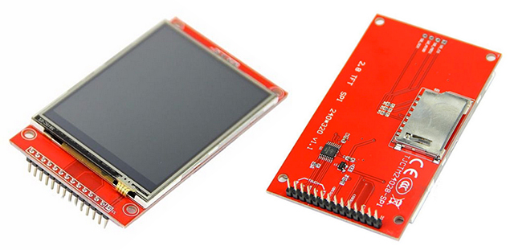
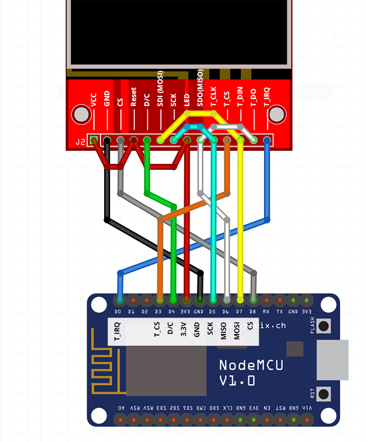
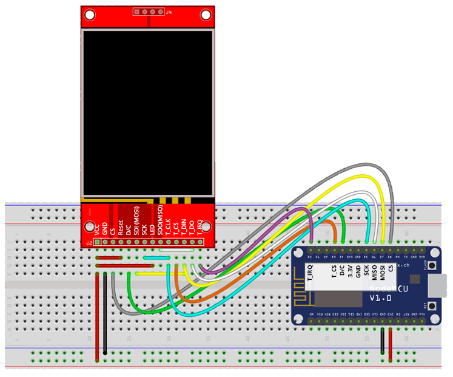

# Connecting a SPI display to ESP8266

#### Copyright 2017 Moddable Tech, Inc.

#### Revised: October 12, 2017

## Overview

Many Moddable examples include screen and touch UI. These demos have been developed with inexpensive resistive SPI touch displays readily available on eBay and other sources. The displays are 240 x 320 resolution and come in 2.4" and 2.8" sizes. 

Any SPI based screen should work. We have brought up samples and products on many screens including LCD, OLED, eInk. There are a number of display and touch drivers in the Moddable SDK repository. See: modules/drivers/

These inexpensive red resistive displays use the ILI9341 display IC/driver and the XPT2046 IC/driver.

## Wiring

When wired to an ESP8266 development board as shown below any of the Moddable examples with screen UI will utilize the screen. 

| ILI9341 Display | ESP8266 | Devboard label
| --- | --- | --- |
| SDO / MISO | GPIO 12 | (D6) 
| LED | 3.3V | 
| SCK | GPIO 14 | (D5) 
| SDI / MOSI | GPIO 13 | (D7) 
| DC | GPIO 2 | (D4) 
| CS | GPIO 15 | (D8)
| RESET | 3.3V | 
| GND | GND | 
| VCC | 3.3V | 
| T_DO | GPIO 12 | (D6) 
| T_DIn | GPIO 13 | (D7) 
| T_CLK | GPIO 14 | (D5) 
| T_IRQ | GPIO 16 | (D0)
| T_CS | GPIO 0 | (D3) 

 
 

