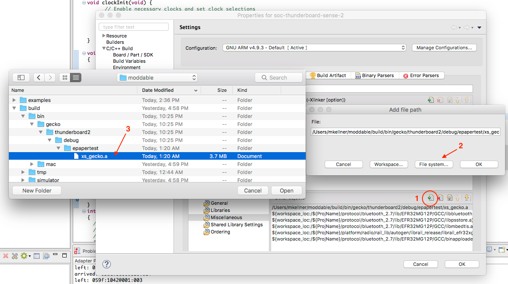
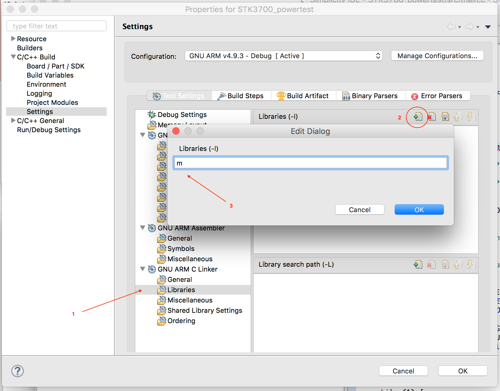
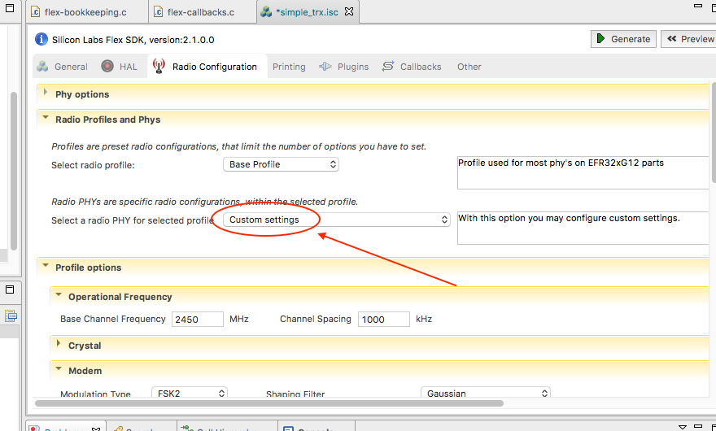
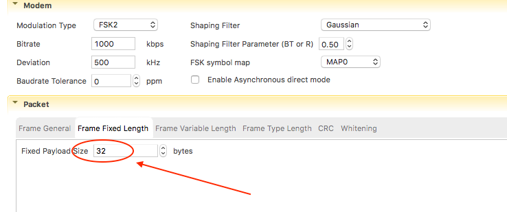
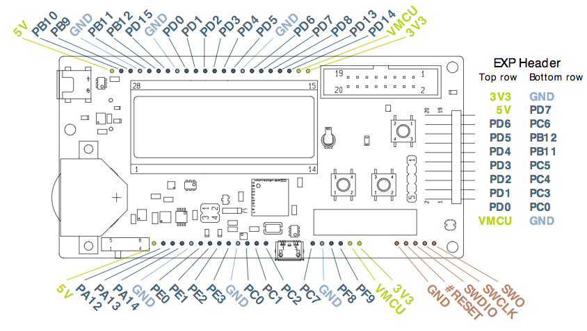
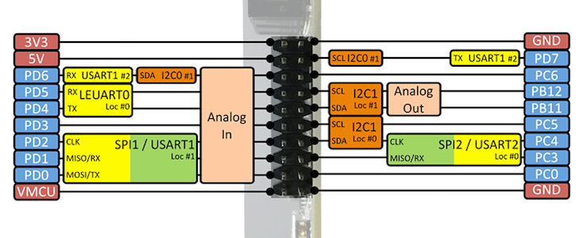
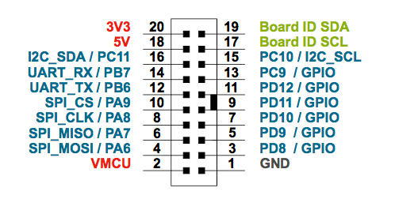
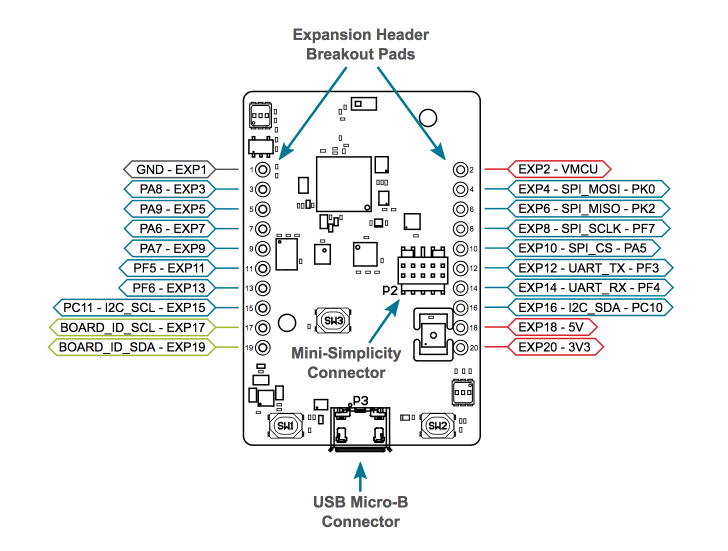

# Gecko

There are currently three flavors of Gecko implemented in the Moddable SDK.

The Giant Gecko is based off of the EFM32 family of devices. Its platform identifier is **gecko/giant**. We've worked with the EFM32GG STK3700 - [Giant Gecko Starter Kit](https://www.silabs.com/products/development-tools/mcu/32-bit/efm32-giant-gecko-starter-kit).

The Mighty Gecko is a family of devices that include radio hardware. Its platform identifier is **gecko/mighty**. We've worked with the [EFR32 Mighty Gecko Starter Kit](https://www.silabs.com/products/development-tools/wireless/mesh-networking/mighty-gecko-starter-kit).

The Thunderboard Sense 2 is a Mighty Gecko based radio device that includes a number of sensors included on the board. Its platform identifier is **gecko/thunderboard2**. [Thunderboard™ Sense 2 IoT Development Kit](https://www.silabs.com/products/development-tools/thunderboard/thunderboard-sense-two-kit)

### Development workflow

There are two major build steps in building a Moddable application for Gecko.

First, JS application, assets, modules and XS runtime are built into an archive using Moddable's `mcconfig` tool. This produces a `xs_gecko.a` archive file.

Second, a Simplicity Studio project builds an application stub and device libraries and links the Moddable archive.

Simplicity Studio is then used to upload the binary to the device and debug C-level code. JS Script code can be debugged with the **Xsbug** debugger as described below.

#### `mcconfig` and Subplatforms

The Gecko introduces subplatforms to the Moddable build.

Platform | Subplatform | Platform Flag | Device
---------|-------------|------|-------
gecko | giant | **-p gecko/giant** | Giant Gecko
gecko | mighty | **-p gecko/mighty** | Mighty Gecko
gecko | thunderboard2 | **-p gecko/thunderboard2** | Thunderboard Sense 2

The platform flag is used with `mcconfig`.

	$ mcconfig -d -m -p gecko/mighty
	

## Getting Started

### Install Simplicity Studio

To get started, install [Simplicity Studio](https://www.silabs.com/products/development-tools/software/simplicity-studio). MacOS v.4.2 is currently supported.

Plug in your board when launching for the first time so that Simplicity Studio will update with the correct SDKs. Install 32 bit MCU, Flex and Bluetooth.

As of this writing, the current versions are:
	
	32-bit MCU SDK - 5.3.5.0
	Flex SDK - 2.1.0.0
	Bluetooth SDK - 2.7.0.0

> If the SDK version changes, or you wish to use a specific SDK version, you can change the **SDK_BASE** build define in $MODDABLE/tools/mcconfig/gecko/make.*subplatform*.mk.

Install a sample project for your device or board.

	Giant Gecko: STK3700_powertest
	Mighty Gecko: simple_rail_without_hal
	Thunderboard Sense 2: soc-thunderboard-sense-2, soc-empty

Build, install and run the sample to become familiar with the process.

### Get Moddable Open Source

Follow the macOS [Host environment setup](../../Moddable SDK – Getting Started.md) section of the Getting Started guide.

### Build xs_gecko.a archive

Use mcconfig to build the moddable library for your gecko platform:

	$ cd $(MODDABLE)/examples/helloworld
	$ mcconfig -d -m -p gecko/mighty
	
Note: the `-d` option to mcconfig builds the debug version. **helloworld** uses the debugger to display its output.

See the **Debugging** section below for instructions on connecting to xsbug.
	

#### Modifications to the Simplicity Studio project for the Moddable sdk.

You will need to change some settings in the Simplicity Studio project for the Moddable application you are building.

Open the properties window for the project and select *C/C++ Build->Settings*.

1) In the **Other Objects** section, click the _add document_ icon  to add the Moddable archive to your project.

2) Select "File system..."

3) Navigate to your moddable directory and select the **xs_gecko.a** archive file.

It is located in $MODDABLE/build/bin/gecko/_platform_/debug/_application_/xs_gecko.a

> You will need to change this file path if you change the application that you are building.
 

You may also need to add the math library:

Open the properties window for the project and select *C/C++ Build->Settings*.

1) In the **GNU ARM C Linker section**, select **Libraries**.

2) Click the _add document_ icon  to add a library to your project.

3) Type in **'m'** to add the "Math" library.

#### Integrate Moddable runtime

In the app's main.c, add a few things:

	int gResetCause = 0;
	uint32_t wakeupPin = 0;
	
	void assertEFM() { } // maybe  void assertEFM(const char *file, int line) {} depending on your SDK

In the app's main() function after chip initialization, enable some clocks:

	  CMU_ClockEnable(cmuClock_CORELE, true);
	  CMU_ClockEnable(cmuClock_HFPER, true);
	  CMU_ClockEnable(cmuClock_GPIO, true);

Add some code to get the reset cause:

	  gResetCause = RMU_ResetCauseGet();
	  if (gResetCause & (RMU_RSTCAUSE_EM4RST | RMU_RSTCAUSE_SYSREQRST | RMU_RSTCAUSE_EXTRST)) {
		  wakeupPin = GPIO_EM4GetPinWakeupCause();
	  }
	  RMU_ResetCauseClear();

Do other setup for your device/application as necessary.

Add **xs_setup()** which configures the xs runtime and debugger:

	xs_setup();

In your main loop, call xs_loop(); repeatedly.

	while(1) {
		xs_loop();
	}

## Pin and Feature configuration

The pins and features of the Gecko family is highly configurable. For each application, the specific configuration is defined in the application's `manifest.json` file.

In the `manifest.json` platforms, defines section there are defines for the various peripherals to specify what pins, ports, clocks, irq, etc. to use.

The various pin/port/location values for interfaces can be found in the specific data sheet for your chip family.

### Debugging

Native code can be debugged with Simplicity Studio.

XS script code can be debugged with Xsbug by using a FTDI adapter. On the adapter, the pins RX, TX and GND will be used.

On your device, you will need to use a UART or USART and specify it in a **defines** section for your platform. Other required definitions include the tx and rx pins and location and the serial clock. Baud rate can also be defined, defaulting to 115200. Examples are shown below.

##### Connecting xsbug
Prior to launching your application from Simplicity Studio, start the **xsbug.app** application and use **serial2xsbug** to connect the FTDI adapter.

	$ open $MODDABLE/build/bin/mac/release/xsbug.app
	$ serial2xsbug /dev/cu.usbserial-AL035VAU 115200 8N1

In this case, the FTDI adapter is identified by the MacOS as /dev/cu.usbserial-AL035VAU.

##### Example manifest.json defines for xsbug
An example, using UART1 on Giant Gecko, USART1 on Mighty Gecko and USART0 on Thunderboard 2:

	"platforms": {
		"gecko/giant": {
			"defines": {
				"debugger": {
					"interface": { "UART": 1 },
					"location": "2",
					"tx" : { "pin": "9", "port": "gpioPortB" },
					"rx" : { "pin": "10", "port": "gpioPortB" },
				},
			},
		},
		"gecko/mighty": {
			"defines": {
				"debugger": {
					"interface": { "USART": 1 },
					"location": "19",
					"tx" : { "pin": "11", "port": "gpioPortD" },
					"rx" : { "pin": "12", "port": "gpioPortD" },
				},
			},
		},
		"gecko/thunderboard2": {
			"defines": {
				"debugger": {
					"interface": { "USART": 0 },
					"tx" : { "pin": "3", "port": "gpioPortF", "location": 27 },
					"rx" : { "pin": "4", "port": "gpioPortF", "location": 27 },
				},
			},
		},

An alternate configuration, using USART0 on Giant Gecko,and USART3 on Mighty Gecko:

	"platforms": {
		"gecko/giant": {
			"defines": {
				"debugger": {
					"interface": { "USART": 0 },
					"location": "5",
					"tx" : { "pin": "0", "port": "gpioPortC" },
					"rx" : { "pin": "1", "port": "gpioPortC" },
				},
			},
		},
		"gecko/mighty": {
			"defines": {
				"debugger": {
					"interface": { "USART": 3 },
					"location": "10",
					"tx" : { "pin": "6", "port": "gpioPortB" },
					"rx" : { "pin": "7", "port": "gpioPortB" },
				},
			},
		},

### Sleep

The Gecko series devices use low power. Careful programming and management of sleep cycles are necessary to optimize power usage for your application.

Moddable sleeps at times, waiting for sensor or user input, or the specific time for sensor output. Fewer interfaces are active at higher sleep levels, so it may be necessary to reduce the sleep level for your application.

By default, Moddable uses Sleep level EM3 while waiting. Certain Gecko interfaces are shut down at level EM3. For example, while operating the Mighty Gecko radio, the sleep level must be constrained to EM1.

#### EM4 Sleep

Gecko devices also have a deep sleep level EM4. At this level, the device is almost entirely shut off, including RAM, peripherals and most clocks. While in this state, the device can be awoken by an external GPIO pin or a low power clock. When awoken, the device reboots. 

During EM4 sleep, a small amount of memory can be kept active at the expense of a slightly increased power draw. The GPIO state can also be retained.

At wakeup, an application can check for the cause of wakeup and perform actions to restore state from some data stored in the retention memory.

##### manifest.json file:

		"gecko/mighty": {
			"defines": {
				"sleep": {
					"idleLevel" : 3,
					"retention": { "memory": false, "gpio": true },
					"wakeup": { "pin": "7", "port": "gpioPortF", "register": "GPIO_EXTILEVEL_EM4WU1" },
				},
			},
			"modules": {
				"*": [
					"$(BUILD)/devices/gecko/sleep/*",
				],
			},

`idleLevel`: Specifies the maximum sleep level allowed during idle periods.

`retention`:`memory`: enables or disables retention memory.

`retention`:`gpio`: enables or disables retention state.

`wakeup`: defines the pin used to wake from EM4.

The various Gecko devices specify specific port/pin combinations that will wake the device from EM4 sleep. The device's data sheet will specify what pins can be used, and what GPIO interupt register to use.

### class Sleep

The `Sleep` class provides access to Gecko's sleep functions.

	import Sleep from "sleep"
	let sleep = new Sleep();

#### Determine cause of wakeup

	if (Sleep.getWakeupCause() & Sleep.ExternalReset)
		trace("woke up by button\n");

To determine the cause of wakeup, use:

	let wakeupcause = Sleep.getWakeupCause();

**wakeupcause** is a bitmask of:

	Sleep.ExternalReset     = 0b00000001;
	Sleep.SysRequestReset   = 0b00000010;
	Sleep.EM4WakeupReset    = 0b00000100;

#### Storing data for retention during EM4 sleep

During EM4 sleep, RAM is shut off and only a small amount of memory is available for retreival after wakeup.

		let index;
		
		index = Sleep.getPersistentValue(0);
		Sleep.setPersistentValue(0, ++index);

To store a 32-bit **value** in one of 32 **location**s, use:

	Sleep.setPersistentValue(location, value);

To retrieve a 32-bit **value** from **location**, use:

	value = Sleep.getPersistentValue(location);

#### Entering EM4 Sleep

To enter EM4 sleep, use:

		let sleepTime = 10000;
		Sleep.sleepEM4(sleepTime);

This will sleep the device in the lowest power mode for about 10 seconds.

> Note that the sleepTime value is reduced to a base 2 value as that is what is supported by the Cryotimer. That is, sleepTime is 1, 2, 4, 8, 16, 32... ms.

### Analog

Gecko devices have a number of analog inputs and can be configured to use various pins and voltage references.

##### manifest.json file:
		"gecko/mighty": {
			"defines": {
				"analog": {
					"interface": { "ADC": 0 },
					"ref": "adcRefVDD",
					"input1": "adcPosSelAPORT2XCH9",
					"input2": "adcPosSelAPORT3YCH22",
				},
				"modules": {
					"*": [
						"$(BUILD)/devices/gecko/analog/*",
					],
				},
			

**interface** specifies which ADC interface to use.

**input_n_** specifies a particular pin for input. Moddable currently supports 5 concurrent input sources on gecko.

`adcPosSelAPORT2XCH9` - APORT2X, Channel 9 refers to pin **PC9** on the Mighty Gecko.

See your Gecko device datasheet for the values to use to set a particular pin for analog input.

**ref** specifies an analog voltage reference source. The default value is **adcRefVDD**. Other possibilities include **adcRef1V25**, **adcRef2V5** and others, as included by your device.

### class Analog
	import Analog from "analog"
	...
		let analog = new Analog();
		let voltage1 = analog.read(1);
		let voltage2 = analog.read(2);

`analog.read(1)` reads from `input1` described in the manifest.json segment above. 

### SPI

Gecko devices can run the SPI interface over a number of USART ports.

The `manifest.json` file contains defines for the base SPI pins

##### manifest.json file:
		"include": [
			"$(MODULES)/pins/spi/manifest.json",
		],
		"gecko/mighty": {
			"defines": {
				"spi": {
					"interface": { "USART": 1 },
					"location": "1",
					"mosi": { "pin": "0", "port": "gpioPortD" },					"miso": { "pin": "1", "port": "gpioPortD" },
					"sck": { "pin": "2", "port": "gpioPortD" },
				},
				"ili9341": {
					"hz": 40000000,
					"cs": { "pin": 9, "port": "gpioPortA", },
					"dc": { "pin": 6, "port": "gpioPortB", },
				}
			},
			
This section of the `manifest.json` defines the **spi** pins and locations, and the USART port to be used on the Mighty Gecko platform.

The **interface** definition specifies which USART interface to use.

**location** specifies which pin configuration to use for the _interface_. See your Gecko device datasheet for which pins refer to what USART location.

Other definitions for a specific SPI device's driver will define the **cs** (chip-select) pin, **hz** (speed in hz) and other driver specific defines.

### I2C

Gecko devices have a number of I2C interfaces.

##### manifest.json file:
		"include": [
			"$(MODULES)/pins/i2c/manifest.json",
		],
		"gecko/mighty": {
			"defines": {
				"i2c": {
					"interface": { "I2C": 0 },
					"sda": { "pin": 11, "port": "gpioPortC", "location": 16 },
					"scl": { "pin": 10, "port": "gpioPortC", "location": 14 },
				},
				
The **interface** definition specifies which I2C interface to use.

In this example, **I2C0** is used. The pin PC11 is the SDA pin for I2C0 at location 16 (I2C0_SDA#16). The pin PC10 is the SCL pin for I2C0 at location 14.

**location** specifies which pin configuration to use for the _interface_. See your Gecko device datasheet for which pins refer to what I2C location.

Note: some Gecko devices split the location for various pins. This i2c example shows a different pin location for `sda` and `scl`.

### Digital

On Gecko, GPIO pins are specified by port and pin.

	let led1 = new Digital({pin: 4, port: "gpioPortF", mode: Digital.Output});

When using the Digital Monitor, the port is used to create the pin, but is ignored when discerning the interrupt. That is, a monitor created for GPIO PC0 (GPIO port C, pin 0) will also be triggered by PD0 (and PA0, PB0, etc.)

### Radio

#### Radio setup

Using the Mighty Gecko radio requires a bit more work with Simplicity Studio.

As a base application, use **RAIL: Simple TRX with FiFo**. After creating the sample project, Simplicity Studio will open a application configuration window.

Click the "Generate" button to create the radio support files for the project.

#### Radio main.c

The changes to the project's `main.c` are a bit more involved than the simple examples above. Copy the file `$MODDABLE/build/devices/gecko/project/radio/main.c` into your Simplicity Studio's simple_trx project, replacing the existing `main.c`.

Continue with *__Build xs_gecko.a archive__* above.

### Notes and Troubleshooting

- During the final link, if Simplicity Studio does not find the Cryotimer routines or defines, you will need to copy the code and header files to your project.

`em_cryotimer.h` is located in: `/Applications/Simplicity Studio.app/Contents/Eclipse/developer/sdks/gecko_sdk_suite/v2.1/platform/emlib/inc/em_cryotimer.h`
	
`em_cryotimer.h` is located in: `/Applications/Simplicity Studio.app/Contents/Eclipse/developer/sdks/gecko_sdk_suite/v2.1/platform/emlib/src/em_cryotimer.c`

- During the final link, if Simplicity Studio does not find the `xs_gecko.a` file, either the library path is incorrect, or you have not built the `xs_gecko.a` file with **mcconfig**.

		$ cd .../application_path
		$ mcconfig -d -m -p gecko/mighty
	
- Unexplainable crashes can occur if Stack or Heap space run out:

Depending on the processor and project configuration, you may need to adjust the stack size and heap size of the project.

In **GNU ARM C Compiler -> Symbols** and **GNU ARM Assembler -> Symbols**, add a `__STACK_SIZE` and/or `__HEAP_SIZE`

	__STACK_SIZE=0x1000
	__HEAP_SIZE=0xA000

- Some Simplicity Studio example projects use a fixed size packet length.

You can increase that by changing the Radio Profile. When starting a new radio project, Simplicity Studio creates the ISC file, select the **Radio Configuration** tab and change the *Select a radio PHY for selected profile* to **Custom Settings**.

Scroll down to **Profile options->Packet** and select the **Frame Fixed Length** tab. 

Change the payload size to the size you need. Then click the **Generate** button to create the radio support files for the project.

## Useful pin configurations

The Gecko reference boards expose many pins. There is a pre-populated expansion connector on the right side of the board, and rows of pins at the top and bottom of the board.

For most Moddable examples, the pins used are located on the expansion connector for easier access.

Below are some default hookup schemes:

### Giant Gecko

Giant Gecko locates the xsbug serial pins on the top row of pins, other peripherals on the expansion port.

Xsbug Connection

Pin | Interface / Location | Hardware
----|----------------------|---------
PB9 | UART1_TX#2 | FTDI TX
PB10 | UART1_RX#2 | FTDI RX
GND | GND | FTDI GND

Epaper Display

Pin | Interface / Location | Hardware
----|----------------------|---------
PD0 | USART1_TX#1 | SPI_MOSI
PD1 | USART1_RX#1 | SPI_MISO
PD2 | USART1_SCLK#1 | SPI_SCK
PD3 | GPIO | SPI_CS
PC3 | GPIO | D/C
PC4 | GPIO | Busy
PC0 | GPIO | RST

I2C Sensors

Pin | Interface / Location | Hardware
----|----------------------|---------
PD6 | I2C0_SDA#1 | Sensor SDA
PD7 | I2C0_SCL#1 | Sensor SCL

Onboard Switches & LEDs

Pin | Interface / Location | Hardware
----|----------------------|---------
PE2 | LED0 | Right LED
PE3 | LED1 | Left LED
PB9 | SW0 | Push Button 0
PB10 | SW1 | Push Button 1

### Mighty Gecko

Xsbug Connection

Pin | Interface / Location | Hardware
----|----------------------|---------
PD11 | USART1_TX#19 | FTDI RX
PD12 | USART1_RX#19 | FTDI TX
GND | GND | FTDI GND

Epaper Display

Pin | Interface / Location | Hardware
----|----------------------|---------
PA6 | USART2_TX#1 | SPI_MOSI
PA7 | USART2_RX#1 | SPI_MISO
PA8 | USART2_SCLK#1 | SPI_SCK
PA9 | GPIO | SPI_CS
PD9 | GPIO | D/C
PD10 | GPIO | Busy
PD8 | GPIO | RST

I2C Sensors

Pin | Interface / Location | Hardware
----|----------------------|---------
PC11 | I2C0_SDA#16 | Sensor SDA
PC10 | I2C0_SCL#14 | Sensor SCL

Onboard Switches & LEDs

Pin | Interface / Location | Hardware
----|----------------------|---------
PF4 | LED0 | Right LED
PF5 | LED1 | Left LED
PF6 | SW0 | Push Button 0
PF7 | SW1 | Push Button 1

### Thunderboard Sense 2

Xsbug Connection

Pin | Interface / Location | Hardware
----|----------------------|---------
PF3 | USART0_TX#27 | FTDI RX
PF4 | USART0_RX#27 | FTDI TX
GND | GND | FTDI GND

Epaper Display

Pin | Interface / Location | Hardware
----|----------------------|---------
PK0 | USART2_TX#29 | SPI_MOSI
PK1 | USART2_RX#30 | SPI_MISO
PF7 | USART2_SCLK#18 | SPI_SCK
PA5 | GPIO | SPI_CS
PF6 | GPIO | D/C
PF5 | GPIO | Busy
PA7 | GPIO | RST

I2C Sensors

Pin | Interface / Location | Hardware
----|----------------------|---------
PC10 | I2C0_SDA#15 | Sensor SDA
PC11 | I2C0_SCL#15 | Sensor SCL

Onboard Switches & LEDs

Pin | Interface / Location | Hardware
----|----------------------|---------
PD8 | LED_RED | Red LED
PD9 | LED_GREEN | Green LED
PD14 | PUSH_BUTTON0 | Push Button 0
PD15 | PUSH_BUTTON1 | Push Button 1