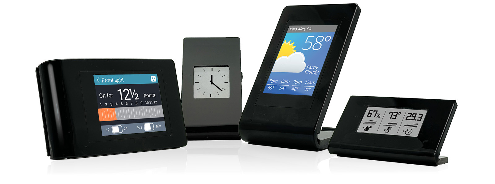

# Moddable Display Developer Guide
Copyright 2024 Moddable Tech, Inc.<BR>
Revised: January 9, 2024

This document provides information about the Moddable Display family of products.

## Table of Contents

- [About Moddable Display](#about-moddable-display)
- [Moddable Display 1](#display-1)
- [Moddable Display 2](#display-2)
- [Moddable Display 3](#display-3)
- [Moddable Display 4](#display-4)

<a id="about-moddable-display"></a>
## About Moddable Display



Moddable Display is the beautiful way to bring your latest project from the workbench to the real world. Each Moddable Display wraps an elegant stand around one of our powerful development boards. The sleek design fits right into your home or office. The intriguing, maker-friendly open back makes it easy to incorporate any additional hardware components your project requires.

There are four different Moddable Displays, one for each Moddable development board. Moddable Display 1 is built on the Moddable One development board, for example.

<a id="display-1"></a>
## Moddable Display 1

Moddable Display 1 is built around the Moddable One development board. See the [Moddable One Developer Guide](./moddable-one.md) for more information about developing with Moddable Display 1.

### Building

To build for Moddable Display 1, use the `esp/moddable_display_1` build target. For example:

```
mcconfig -d -m -p esp/moddable_display_1
```

### Display Rotation

Moddable Display 1 contains a Moddable One development board that is rotated 180 degrees when in portrait orientation. The default build automatically sets the rotation to 180 degrees. To run in landscape orientation, set the rotation to either 90 or 270. To run in touch orientation, set the rotation to 0. 

Rotation may be set on the command line:

```
mcconfig -d -m -p esp/moddable_display_1 driverRotation=90
```

Or in your project's manifest:

```json
	"config": {
		"driverRotation": 90
	}
```

Or at runtime in JavaScript:

```js
screen.rotation = 90;
```

Changing the rotation from JavaScript does not immediately update the screen; your project must redraw the screen.

**Note**: The touch input on Moddable Display 1 is automatically rotated when using the Piu user interface framework. When using Commodetto, the project code must apply display rotation.

<a id="display-2"></a>
## Moddable Display 2

Moddable Display 2 is built around the Moddable Two development board. See the [Moddable Two Developer Guide](./moddable-two.md) for more information about developing with Moddable Display 2.

### Building

To build for Moddable Display 2, use the `esp32/moddable_display_2` build target. For example:

```
mcconfig -d -m -p esp32/moddable_display_2
```

### Display Rotation

Moddable Display 2 contains a Moddable Two development board that is unrotated (0 degrees) when in portrait orientation. To run in landscape orientation, set the rotation to either 90 or 270. To run in touch orientation, set the rotation to 180. 

Rotation may be set on the command line:

```
mcconfig -d -m -p esp32/moddable_display_2 driverRotation=180
```

Or in your project's manifest:

```json
	"config": {
		"driverRotation": 180
	}
```

Or at runtime in JavaScript:

```js
screen.rotation = 180;
```

Changing the rotation from JavaScript does not immediately update the screen; your project must redraw the screen.

**Note**: The touch input on Moddable Display 2 is automatically rotated when using the Piu user interface framework. When using Commodetto, the project code must apply display rotation.

<a id="display-3"></a>
## Moddable Display 3

Moddable Display 3 is built around the Moddable Three development board. See the [Moddable Three Developer Guide](./moddable-three.md) for more information about developing with Moddable Display 3.

### Building

To build for Moddable Display 3, use the `esp/moddable_display_3` build target. For example:

```
mcconfig -d -m -p esp/moddable_display_3
```

### Display Rotation

Moddable Display 3 contains a Moddable Three development board that is rotated 180 degrees when in landscape orientation. To run in portrait orientation, set the rotation to either 90 or 270. 

Rotation may be set on the command line:

```
mcconfig -d -m -p esp/moddable_display_3 rotation=90
```

Or in your project's manifest:

```json
	"config": {
		"rotation": 90
	}
```

<a id="display-4"></a>
## Moddable Display 4

Moddable Display 4 is built around the Moddable Four development board. See the [Moddable Four Developer Guide](./moddable-four.md) for more information about developing with Moddable Display 4.

### Building

To build for Moddable Display 4, use the `nrf52/moddable_display_4` build target. For example:

```
mcconfig -d -m -p nrf52/moddable_display_4
```

### Display Rotation

Moddable Display 4 contains a Moddable Four development board that is rotated 180 degrees when in portrait orientation. The default build automatically sets the rotation to 180 degrees. You may also run with the rotation set to 0. 

Rotation may be set on the command line:

```
mcconfig -d -m -p nrf52/moddable_display_4 driverRotation=0
```

Or in your project's manifest:

```json
	"config": {
		"driverRotation": 0
	}
```

Or at runtime in JavaScript:

```js
screen.rotation = 0;
```

Changing the rotation from JavaScript does not immediately update the screen; your project must redraw the screen.
