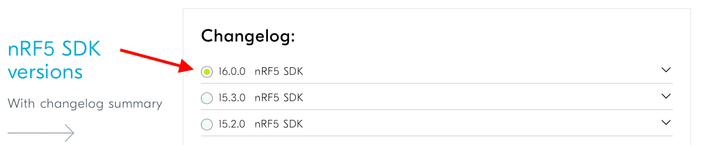
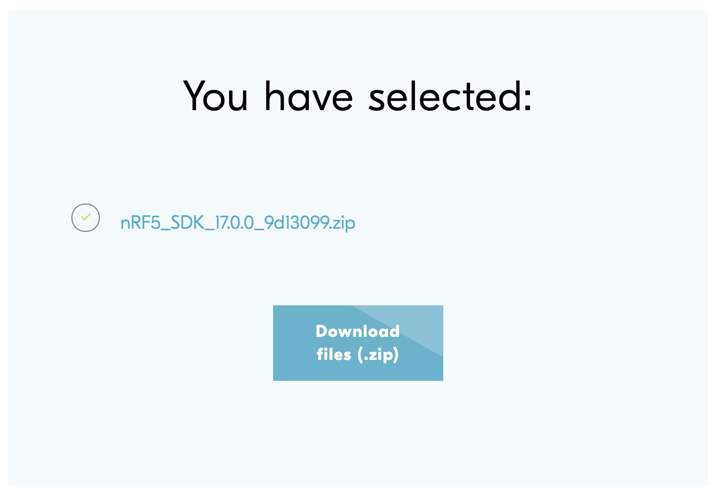
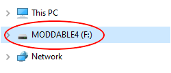
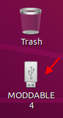
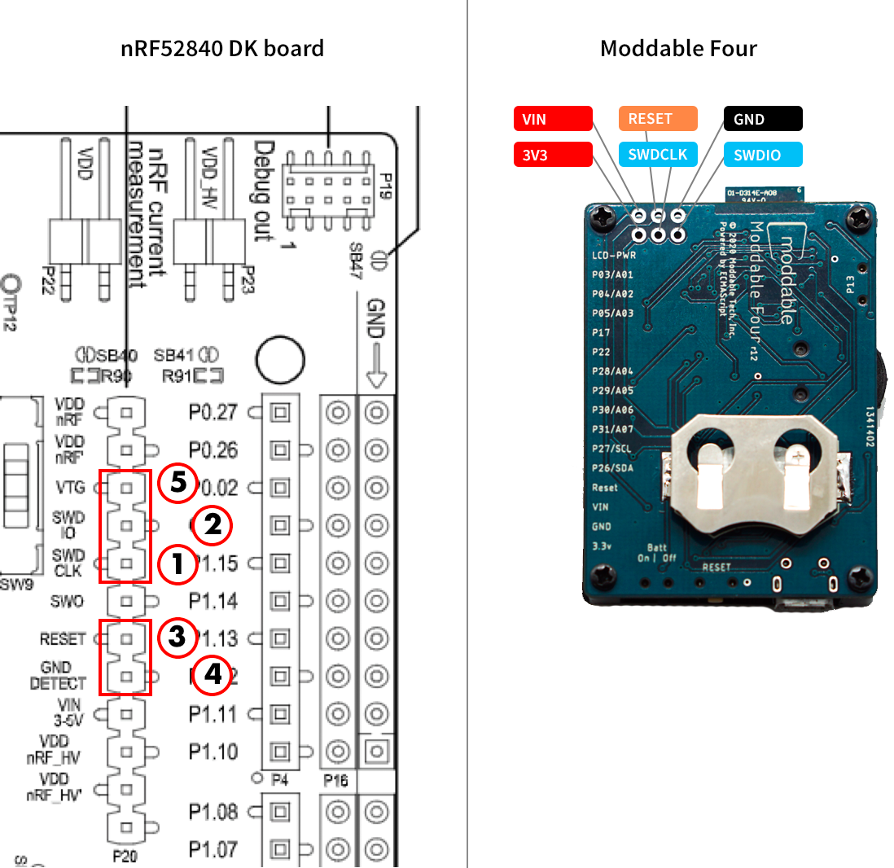
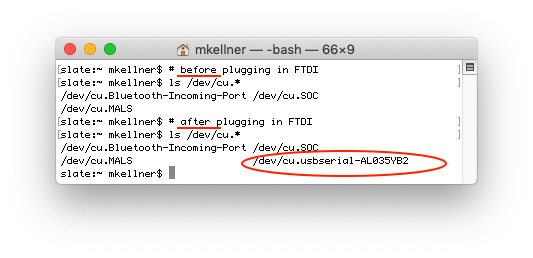

# Getting Started with Moddable Four

Copyright 2021 Moddable Tech, Inc.<BR>
Revised: Jan 18, 2023

This document describes how to start building Moddable applications for Moddable Four. It provides information on how to configure host build environments, how to build and deploy apps, and includes links to external development resources.

## Table of Contents

- [About Moddable Four](#about-moddable-four)
	- [Components](#components)
	- [Pinout](#pinout)
- [SDK and Host Environment Setup](#setup)
	- [macOS](#macos-setup)
	- [Windows](#windows-setup)
	- [Linux](#linux-setup)
-  [Enabling LE secure connection support](#le-secure-connections)
- [Development Resources](#development-resources)
	- [Examples](#examples)
	- [Documentation](#documentation)
	- [Support](#support)
	- [Updates](#updates)
- [Advanced](#advanced)
	- [Debugging Native Code](#debugging-native-code)
		- [Debugging Native Code with SEGGER Embedded Studio](#debugging-native-code-with-segger)
		- [Debugging Native Code with GDB](#debugging-native-code-with-gdb)	<!--- [Debugging Native and Script Code](#debugging-native-and-script-code)-->
	- [Bootloader](#bootloader)

<a id="about-moddable-four"></a>
## About Moddable Four


Moddable Four is a low-power, Bluetooth LE development board that makes it easy for developers to experiment with the Moddable SDK. It is available to purchase on the [Moddable website](http://www.moddable.com/purchase).

<a id="components"></a>
### Components

The two main components of Moddable Four are the nRF52840 module and mirror display. The nRF52840 module includes a BLE antenna, 1 MB Flash, and 256 KB RAM. The Sharp mirror display is a 128x128 black and white display that uses the [`ls013b4dn04` display driver](../drivers/ls013b4dn04/ls013b4dn04.md).

It also includes an integrated LIS3DH accelerometer, jog dial, and CR2032 battery connector.

<a id="pinout"></a>
### Pinout


**Note:** LCD-PWR is not for arbitrary digital inputs/outputs. It is used to provide power to a sensor and to the screen. 

- Writing `0` to GPIO23 emits 3.3V on LCD-PWR, which also gives power to the screen. 
- Writing `1` to GPIO23 turns off the the pin and the screen.

<a id="setup"></a>
## SDK and Host Environment Setup

<a id="macos-setup"></a>

### macOS setup

1. The [Moddable SDK Getting Started document](../Moddable%20SDK%20-%20Getting%20Started.md) describes how to configure the host build environment and install the required SDKs, drivers, and development tools. Follow the instructions in the [Host environment setup](https://github.com/Moddable-OpenSource/moddable/blob/public/documentation/Moddable%20SDK%20-%20Getting%20Started.md#host-mac) section for macOS.

2. Create a `nrf5` directory in your home directory at `~/nrf5` for required third party SDKs and tools.

	```text
	cd $HOME
	mkdir nrf5
	cd nrf5
	```

3. If you use macOS Catalina (version 10.15), add an exemption to allow Terminal (or your alternate terminal application of choice) to run software locally that does not meet the system's security policy. Without this setting, the precompiled GNU Arm Embedded Toolchain you will download in the next step will not be permitted to run. 

	To set the security policy exemption for Terminal, go into the Security & Privacy System Preferences, select the Privacy tab, choose Developer Tools from the list on the left, and then tick the checkbox for Terminal or the alternate terminal application from which you will be building Moddable SDK apps. The end result should look like this:

	

4. On **x86** Mac, Download version 12.2.1 [AArch32 bare-metal target (arm-none-eabi)](https://developer.arm.com/-/media/Files/downloads/gnu/12.2.rel1/binrel/arm-gnu-toolchain-12.2.rel1-darwin-x86_64-arm-none-eabi.tar.xz) of the GNU Arm Embedded Toolchain from the [Arm Developer](https://developer.arm.com/downloads/-/arm-gnu-toolchain-downloads) website. Uncompress the archive and move the `arm-gnu-toolchain-12.2.rel1-darwin-x86_64-arm-none-eabi` directory into the `nrf5` directory.

5. On **M1** Mac, Download version 12.2.1 [AArch32 bare-metal target (arm-none-eabi)](https://developer.arm.com/-/media/Files/downloads/gnu/12.2.rel1/binrel/arm-gnu-toolchain-12.2.rel1-darwin-arm64-arm-none-eabi.tar.xz) of the GNU Arm Embedded Toolchain from the [Arm Developer](https://developer.arm.com/downloads/-/arm-gnu-toolchain-downloads) website. Uncompress the archive and move the `arm-gnu-toolchain-12.2.rel1-darwin-arm64-arm-none-eabi` directory into the `nrf5` directory.

	<!-- is this brew step necessary with the v 12.2.1?	You will also need some items from `brew`:

	`brew install gmp mpfr libmpc isl libelf`
	 -->

5. Moddable Four uses a modified [Adafruit nRF52 Bootloader](https://github.com/adafruit/Adafruit_nRF52_Bootloader) that supports the UF2 file format for flashing firmware to a device. `uf2conv.py` is a Python tool from Microsoft that packages the UF2 binary for transfer to the device. Download the [uf2conv](http://test.moddable.com/private/nrf52/uf2conv.zip) tool. Unzip the archive and copy the `uf2conv.py` file into the `nrf5` directory.

	Use `chmod` to change the access permissions of `uf2conv` to make it executable.
	
	```text
	cd ~/nrf5
	chmod 755 uf2conv.py 
	```

6. Download the [Nordic nRF5 SDK](https://www.nordicsemi.com/Software-and-Tools/Software/nRF5-SDK/Download) by taking the following steps:

	- Select `v17.0.2` from the nRF5 SDK versions section.

		

	- Uncheck all SoftDevices.

		

	- Click the **Download Files** button at the bottom of the page. You should see the same selection as in the image below.

		

	The downloaded archive is named `DeviceDownload.zip`. Unzip the archive and copy the `nRF5_SDK_17.0.2_d674dde` directory into the `nrf5` directory.

7. Setup the `NRF_SDK_DIR` environment variable to point at the nRF5 SDK directory:
	
	```text
	export NRF_SDK_DIR=$HOME/nrf5/nRF5_SDK_17.0.2_d674dde
	```

8. Add a board definition file for the Moddable Four to the Nordic nRF5 SDK. The board definition file includes Moddable Four LED, button and pin definitions. To add the Moddable Four board definition file, take the following steps:

	- The `moddable_four.h` board definition file is found in `$MODDABLE/build/devices/nrf52/config/moddable_four.h`. Copy the `moddable_four.h` file to the Nordic nRF5 SDK `components/boards/` directory.

	```text
	cp $MODDABLE/build/devices/nrf52/config/moddable_four.h $NRF_SDK_DIR/components/boards
	```

	- Modify `$NRF_SDK_DIR/components/boards/boards.h`, adding the following before `#elif defined(BOARD_CUSTOM)`:

	```c
	#elif defined (BOARD_MODDABLE_FOUR)
	  #include "moddable_four.h"
	```

9. Add `SPIM3` support:

	The nRF5 SDK has a file `integration/nrfx/legacy/apply_old_config.h` that needs a small change. Add `|| NRFX_SPIM3_ENABLED` after the `NRFX_SPIM2_ENABLED` as shown in the line below:

	```text
	#define NRFX_SPIM_ENABLED \
    (SPI_ENABLED && (NRFX_SPIM0_ENABLED || NRFX_SPIM1_ENABLED || NRFX_SPIM2_ENABLED || NRFX_SPIM3_ENABLED))
	```


<a id="macOS-building-and-deploying-apps"></a>
#### Building and Deploying Apps

After you've setup your macOS host environment, take the following steps to install an application on your Moddable Four.

1. Attach your Moddable Four to your computer with a micro USB cable.

	Make sure you're using a data-sync capable cable, not one that is power-only.

2. Put the device into programming mode by double-tapping the RESET button or by holding the button while tapping RESET.

	Programming mode is indicated by the LED indicator blinking at boot time. A disk named `MODDABLE4` will also appear on your desktop.

	

	> **Note:** If you do not program your device within a short period, it will reboot to the installed application.

3. Build and deploy the app with `mcconfig`.

	`mcconfig` is the command line tool to build and launch Moddable apps on microcontrollers and the simulator. Full documentation of `mcconfig` is available [here](../tools/tools.md). 
	
	Specify the platform `-p nrf52/moddable_four` with `mcconfig` to build for Moddable Four. Build the [`piu/balls`](../../examples/piu/balls) example:
	
	```text
	cd $MODDABLE/examples/piu/balls
	mcconfig -d -m -p nrf52/moddable_four
	```
	
	The [examples readme](../../examples) contains additional information about other commonly used `mcconfig` arguments for screen rotation and more.
	
<a id="windows-setup"></a>

### Windows setup

1. The [Moddable SDK Getting Started document](../Moddable%20SDK%20-%20Getting%20Started.md) describes how to configure the host build environment and install the required SDKs, drivers, and development tools. Follow the instructions in the [Host environment setup](https://github.com/Moddable-OpenSource/moddable/blob/public/documentation/Moddable%20SDK%20-%20Getting%20Started.md#host-windows) section for Windows.

2. Create a `nrf5` directory in your `%USERPROFILE%` directory, e.g. `C:\Users\<your-user-name>` for required third party SDKs and tools.

	```text
	cd %USERPROFILE%
	mkdir nrf5
	cd nrf5
	```

3. Download version 12.2.1 [`AArch32 bare-metal target (arm-none-eabi`](https://developer.arm.com/-/media/Files/downloads/gnu/12.2.rel1/binrel/arm-gnu-toolchain-12.2.rel1-mingw-w64-i686-arm-none-eabi.zip) of the GNU Arm Embedded Toolchain from the [Arm Developer](https://developer.arm.com/downloads/-/arm-gnu-toolchain-downloads) website. Uncompress the archive and move the `arm-gnu-toolchain-12.2.rel1-mingw-w64-i686-arm-none-eabi` directory into the `nrf5` directory.

4. Moddable Four uses a modified [Adafruit nRF52 Bootloader](https://github.com/adafruit/Adafruit_nRF52_Bootloader) that supports the UF2 file format for flashing firmware to a device. `uf2conv.py` is a Python tool from Microsoft that packages the UF2 binary for transfer to the device. Download the [uf2conv](http://test.moddable.com/private/nrf52/uf2conv.zip) tool. Unzip the archive and copy the `uf2conv.py` file from the extracted `uf2conv` directory into the `nrf5` directory.

5. Download the [Nordic nRF5 SDK](https://www.nordicsemi.com/Software-and-Tools/Software/nRF5-SDK/Download) by taking the following steps:

	- Select `v17.0.2` from the nRF5 SDK versions section.

		

	- Uncheck all SoftDevices.

		

	- Click the **Download Files** button at the bottom of the page. You should see the same selection as in the image below.

		

	The downloaded archive is named `DeviceDownload.zip`. Unzip the archive and copy the `nRF5_SDK_17_0_2_d674dde` directory into the `nrf5` directory.

6. Setup the `NRF52_SDK_PATH` environment variable to point at your nRF5 SDK directory:

	```text
	set NRF52_SDK_PATH = %USERPROFILE%\nrf5\nRF5_SDK_17_0_2_d674dde
	```

7. Download and run the [Python installer](https://www.python.org/ftp/python/2.7.15/python-2.7.15.msi) for Windows. Choose the default options.

8. Edit the system `PATH` environment variable to include the Python directories:

	```text
	C:\Python27
	C:\Python27\Scripts
	```

9. Add a board definition file for the Moddable Four to the Nordic nRF5 SDK. The board definition file includes Moddable Four LED, button and pin definitions. To add the Moddable Four board definition file, take the following steps:

	- The `moddable_four.h` board definition file is found in `%MODDABLE%\build\devices\nrf52\config\moddable_four.h`. Copy the `moddable_four.h` file to the Nordic nRF5 SDK `components\boards\` directory.

	```text
	copy %MODDABLE%\build\devices\nrf52\config\moddable_four.h %NRF52_SDK_PATH%\components\boards
	```

	- Modify the `%NRF52_SDK_PATH%\components\boards.h` file, adding the following before `#elif defined(BOARD_CUSTOM)`:

	```c
	#elif defined (BOARD_MODDABLE_FOUR)
	  #include "moddable_four.h"
	```

10. Add `SPIM3` support:

	The nRF5 SDK has a file `integration\nrfx\legacy\apply_old_config.h` that needs a small change. Add `|| NRFX_SPIM3_ENABLED` after the `NRFX_SPIM2_ENABLED` as shown in the line below:

	```text
	#define NRFX_SPIM_ENABLED \
    (SPI_ENABLED && (NRFX_SPIM0_ENABLED || NRFX_SPIM1_ENABLED || NRFX_SPIM2_ENABLED || NRFX_SPIM3_ENABLED))
	```


<a id="windows-building-and-deploying-apps"></a>
#### Building and Deploying Apps

After you've setup your Windows host environment, take the following steps to install an application on your Moddable Four.

1. Attach your Moddable Four to your computer with a micro USB cable.

	Make sure you're using a data-sync capable cable, not one that is power-only.

2. Put the device into programming mode by double-tapping the RESET button or by holding the BOOT button while tapping RESET.

	Programming mode is indicated by the LED indicator staying lit at boot time. A disk named `MODDABLE4` will also appear in File Explorer.

	

	> **Note:** If you do not program your device within a short period, it will reboot to the installed application.

3. Build and deploy the app with `mcconfig`.

	`mcconfig` is the command line tool to build and launch Moddable apps on microcontrollers and the simulator. Full documentation of `mcconfig` is available [here](../tools/tools.md). 
	
	Specify the platform `-p nrf52/moddable_four` with `mcconfig` to build for Moddable Four. Build the [`piu/balls`](../../examples/piu/balls) example:
	
	```text
	cd %MODDABLE%\examples\piu\balls
	mcconfig -d -m -p nrf52/moddable_four
	```
	
	The [examples readme](../../examples) contains additional information about other commonly used `mcconfig` arguments for screen rotation and more.
	
<a id="linux-setup"></a>

### Linux setup

1. The [Moddable SDK Getting Started document](../Moddable%20SDK%20-%20Getting%20Started.md) describes how to configure the host build environment and install the required SDKs, drivers, and development tools. Follow the instructions in the [Host environment setup](https://github.com/Moddable-OpenSource/moddable/blob/public/documentation/Moddable%20SDK%20-%20Getting%20Started.md#host-linux) section for Linux.

2. Create a `nrf5` directory in your home directory at `~/nrf5` for required third party SDKs and tools.

	```text
	cd $HOME
	mkdir nrf5
	cd nrf5
	```

3. Download version 12.2.1 [AArch32 bare-metal target (arm-none-eabi)](https://developer.arm.com/-/media/Files/downloads/gnu/12.2.rel1/binrel/arm-gnu-toolchain-12.2.rel1-x86_64-arm-none-eabi.tar.xz) of the GNU Arm Embedded Toolchain from the [Arm Developer](https://developer.arm.com/downloads/-/arm-gnu-toolchain-downloads) website. Uncompress the archive and move the `arm-gnu-toolchain-12.2.rel1-x86_64-arm-none-eabi` directory into the `nrf5` directory.

4. Moddable Four uses a modified [Adafruit nRF52 Bootloader](https://github.com/adafruit/Adafruit_nRF52_Bootloader) that supports the UF2 file format for flashing firmware to a device. `uf2conv.py` is a Python tool from Microsoft that packages the UF2 binary for transfer to the device. Download the [uf2conv](http://test.moddable.com/private/nrf52/uf2conv.zip) tool. Unzip the archive and copy the `uf2conv.py` file into the `nrf5` directory.

	Use `chmod` to change the access permissions of `uf2conv` to make it executable.
	
	```text
	cd ~/nrf5
	chmod 755 uf2conv.py 
	```

5. Download the [Nordic nRF5 SDK](https://www.nordicsemi.com/Software-and-Tools/Software/nRF5-SDK/Download) by taking the following steps:

	- Select `v17.0.2` from the nRF5 SDK versions section.

		

	- Uncheck all SoftDevices.

		

	- Click the **Download Files** button at the bottom of the page. You should see the same selection as in the image below.

		

	The downloaded archive is named `DeviceDownload.zip`. Unzip the archive and copy the `nRF5_SDK_17.0.2_d674dde` directory into the `nrf5` directory.

6. Setup the `NRF_SDK_DIR` environment variable to point at the nRF5 SDK directory:
	
	```text
	export NRF_SDK_DIR=$HOME/nrf5/nRF5_SDK_17.0.2_d674dde
	```

7. Add a board definition file for the Moddable Four to the Nordic nRF5 SDK. The board definition file includes Moddable Four LED, button and pin definitions. To add the Moddable Four board definition file, take the following steps:

	- The `moddable_four.h` board definition file is found in `$MODDABLE/build/devices/nrf52/config/moddable_four.h`. Copy the `moddable_four.h` file to the Nordic nRF5 SDK `components/boards/` directory.

	```text
	cp $MODDABLE/build/devices/nrf52/config/moddable_four.h $NRF_SDK_DIR/components/boards
	```

	- Modify `$NRF_SDK_DIR/components/boards/boards.h`, adding the following before `#elif defined(BOARD_CUSTOM)`:

	```c
	#elif defined (BOARD_MODDABLE_FOUR)
	  #include "moddable_four.h"
	```

8. Add `SPIM3` support:

	The nRF5 SDK has a file `integration/nrfx/legacy/apply_old_config.h` that needs a small change. Add `|| NRFX_SPIM3_ENABLED` after the `NRFX_SPIM2_ENABLED` as shown in the line below:

	```text
	#define NRFX_SPIM_ENABLED \
    (SPI_ENABLED && (NRFX_SPIM0_ENABLED || NRFX_SPIM1_ENABLED || NRFX_SPIM2_ENABLED || NRFX_SPIM3_ENABLED))
	```


<a id="linux-building-and-deploying-apps"></a>
#### Building and Deploying Apps

After you've setup your Linux host environment, take the following steps to install an application on your Moddable Four.

1. Attach your Moddable Four to your computer with a micro USB cable.

	Make sure you're using a data-sync capable cable, not one that is power-only.

2. Put the device into programming mode by double-tapping the RESET button or by holding the BOOT button while tapping RESET.

	Programming mode is indicated by the LED indicator staying lit at boot time. A disk named `MODDABLE4` will also appear on your desktop.

	

	> **Note:** If you do not program your device within a short period, it will reboot to the installed application.

3. Build and deploy the app with `mcconfig`.

	`mcconfig` is the command line tool to build and launch Moddable apps on microcontrollers and the simulator. Full documentation of `mcconfig` is available [here](../tools/tools.md). 
	
	Specify the platform `-p nrf52/moddable_four` with `mcconfig` to build for Moddable Four. Build the [`piu/balls`](../../examples/piu/balls) example:
	
	```text
	cd $MODDABLE/examples/piu/balls
	mcconfig -d -m -p nrf52/moddable_four
	```
	
	The [examples readme](../../examples) contains additional information about other commonly used `mcconfig` arguments for screen rotation and more.
	
<a id="le-secure-connections"></a>
## Enabling LE secure connection support

LE secure connection support is disabled by default in the Moddable build due to a FreeRTOS incompatibility in the Nordic SDK. To enable LE secure connections, the Nordic SDK and config must be patched as follows:

1. Edit the two `#define` statements in the Moddable SDK [`sdk_config.h`](../build/devices/nrf52/config/sdk_config.h) file to enable LE secure connection support:

	```c
	#ifndef NRF_BLE_LESC_ENABLED
		#define NRF_BLE_LESC_ENABLED 1
	#endif
	
	#ifndef PM_LESC_ENABLED
		#define PM_LESC_ENABLED 1
	#endif
	``` 
	
2. Disable the stack overflow check in the `nrf_stack_info_overflowed` function In the Nordic SDK `nrf_stack_info.h` file:

	```c
	__STATIC_INLINE bool nrf_stack_info_overflowed(void)
	{
	#if 0
		if (NRF_STACK_INFO_GET_SP() < NRF_STACK_INFO_BASE)
		{
			return true;
		}
	#endif
		return false;
	}
	```

> **Note:** Because of this incompatibility, the Moddable BLE server traces a warning to the `xsbug` console when LE secure connections are enabled.
	
<a id="development-resources"></a>
## Development Resources

<a id="examples"></a>
### Examples

The Moddable SDK has over 150 [example apps](../../examples) that demonstrate how to use its many features. Many of these examples run on Moddable Four. 

That said, many of the examples that use Commodetto and Piu are designed for colored QVGA screens. In addition, not every example is compatible with Moddable Four hardware. Some examples are designed to test specific display and touch drivers that are not compatible with the Moddable Four display and give a build error.

<a id="documentation"></a>
### Documentation

Documentation for the nRF5 device and SDK can be found on the [Nordic Semiconductor Infocenter](https://infocenter.nordicsemi.com/topic/struct_nrf52/struct/nrf52840.html). Of particular interest is the documentation for the Nordic nRF5 SDK v17.0.2, which is available [here](https://infocenter.nordicsemi.com/topic/struct_sdk/struct/sdk_nrf5_latest.html).

All the documentation for the Moddable SDK is in the [documentation](../) directory. The **documentation**, **examples**, and **modules** directories share a common structure to make it straightforward to locate information. Some of the highlights include: 

- The `commodetto` subdirectory, which contains resources related to Commodetto--a bitmap graphics library that provides a 2D graphics API--and Poco, a lightweight rendering engine.
- The `piu` subdirectory, which contains resources related to Piu, a user interface framework that makes it easier to create complex, responsive layouts.
- The `networking` subdirectory, which contains networking resources related to network sockets and a variety of standard, secure networking protocols built on sockets including HTTP/HTTPS, WebSockets, DNS, SNTP, and telnet
- The `pins` subdirectory, which contains resources related to supported hardware protocols (digital, analog, PWM, I2C, etc.). A number of drivers for common off-the-shelf sensors and corresponding example apps are also available.

<a id="support"></a>
### Support

If you have questions, we recommend you [open an issue](https://github.com/Moddable-OpenSource/moddable/issues). We'll respond as quickly as practical, and other developers can offer help and benefit from the answers to your questions. Many questions have already been answered, so please try searching previous issues before opening a new issue.

<a id="updates"></a>
### Updates

The best way to keep up with what we're doing is to follow us on Twitter ([@moddabletech](https://twitter.com/moddabletech)). We post announcements about new posts on [our blog](http://blog.moddable.com/) there, along with other Moddable news.

<a id="advanced"></a>
## Advanced

This section provides information about native code debugging using SEGGER Embedded Studio or GDB, and the bootloader on Moddable Four.

<a id="debugging-native-code"></a>
### Debugging Native Code

As with all Moddable platforms, you can debug script code using `xsbug` over the USB serial interface with Moddable Four. For more information, see the [`xsbug` documentation](../../xs/xsbug.md). For native code source level debugging, developers can use [SEGGER Embedded Studio](https://www.segger.com/products/development-tools/embedded-studio/) or [GDB](https://www.gnu.org/software/gdb/documentation/).

Debugging native code on the Moddable Four requires a [Nordic nRF52840-DK board](https://www.nordicsemi.com/Software-and-Tools/Development-Kits/nRF52840-DK). Connect your Moddable Four to the nRF52840-DK board as follows:

| nRF52840 DK | Moddable Four |
| :---: | :---: |
| SWD CLK | SDWCLK |
| SWD IO | SWDIO |
| RESET | RESET |
| GND DETECT | GND |
| VTG | 3V3 |



<a id="debugging-native-code-with-segger"></a>
#### Debugging Native Code with SEGGER Embedded Studio

[SEGGER Embedded Studio](https://www.segger.com/products/development-tools/embedded-studio/) is a C/C++ IDE for embedded systems. It includes a debugger that allows you to set breakpoints and examine registers, variables, and memory. You can debug native code on Moddable Four using the SEGGER Embedded Studio debugger. For documentation on using the debugger, see the [documentation by SEGGER](https://www.segger.com/products/development-tools/embedded-studio/technology/debugger/).


<!--In SEGGER Embedded Studio, open the Options dialog for the `xsproj` project. Go to **Debug->J-Link** and set the **Target Interface Type** to **SWD**, as shown in the image below.


<a id="debugging-native-and-script-code"></a>
### Debugging Native and Script Code

`xsbug` and the SEGGER Embedded Studio debugger can be used simultaneously. To do so, your Moddable Four must be connected to the nRF52840 DK using an external FTDI serial interface as follows:

| nRF52840 DK | FTDI interface |
| :---: | :---: |
| ? | ? |
| ? | ? |
| ? | ? |

Then you'll need to launch launch `xsbug` and `serial2xsbug` by taking the following steps:

- Identify the serial port that the interface is using. Start with your device unplugged. Enter the following command in a terminal window.

	```text
	ls dev/cu.*
	```
	
	Then plug your device in and enter the same command. There should be an additional device file this time.
	
	The image below shows the terminal output when the command is entered before and after plugging a Moddable Four in. In this example, the Moddable Four is `/dev/cu.usbserial-AL035YB2`.

	

- Enter the following commands to launch `xsbug` and `serial2xsbug`. Replace `<DEVICE_FILE>` with the serial port that you identified.

	```text
	xsbug &
	serial2xsbug <DEVICE_FILE> 115200 8N1
	```
	
	For example:
	
	```text
	xsbug &
	serial2xsbug /dev/cu.usbserial-AL035YB2115200 8N1
	```
	
	-->

<a id="debugging-native-code-with-gdb"></a>
#### Debugging Native Code with GDB

[GDB](https://www.gnu.org/software/gdb/documentation/) is the GNU debugger widely used on Unix-like build hosts to debug native code. GDB is included in the Arm Embedded Toolchain archive downloaded during the [SDK and Host Environment Setup](#setup) step. GDB communicates with the Moddable Four via a J-Link connection to the nRF52840-DK board. Take the following steps to install/configure the required tools and launch GDB:

1. [Install the nRF Command Line Tools](https://www.nordicsemi.com/Software-and-tools/Development-Tools/nRF-Command-Line-Tools). Make sure the `JLinkGDBServer` is somewhere in your `$PATH`.

2. Create a GDB startup command text file `gdb_cmds.txt` in the `nrf5` directory with the following contents:

	```text
	target remote localhost:2331
	mon speed 10000
	mon flash download=1
	load
	break main
	mon reset 0
	continue
	```
	
3. Connect the Moddable Four and nRF52840-DK USB ports to your computer. Both USB ports can be connected to the computer via a USB hub. Note that the Moddable Four must also be connected to the nRF52840-DK board as described in the [Debugging Native Code](debugging-native-code) section above.

4. Build the Moddable app that includes the native code you plan to debug. For this example, we build the BLE [heart-rate-server](https://github.com/Moddable-OpenSource/moddable/tree/public/examples/network/ble/heart-rate-server) example:

	```text
	cd $MODDABLE/examples/network/ble/heart-rate-server
	mcconfig -d -m -p nrf52/moddable_four -t build
	```
	
5. Launch the J-Link GDB server from a command line console:

	```text
	JLinkGDBServer -device nRF52840_xxAA -if swd -port 2331
	```

	The GDB server will connect to the nRF52840-DK target and wait for a client connection:
	
	```text
	Connecting to J-Link...
	J-Link is connected.
	Firmware: J-Link OB-SAM3U128-V2-NordicSemi compiled Mar 17 2020 14:43:00
	Hardware: V1.00
	S/N: 683214408
	Checking target voltage...
	Target voltage: 3.30 V
	Listening on TCP/IP port 2331
	Connecting to target...Connected to target
	Waiting for GDB connection...
	```

6. From a second command line console, launch the GDB client, passing the application ELF and GDB startup command text files as command line arguments:

	```text
	~/nrf5/gcc-arm-none-eabi-8-2018-q4-major/bin/arm-none-eabi-gdb $MODDABLE/build/tmp/nrf52/moddable_four/debug/heart-rate-server/xs_nrf52.out -x ~/nrf5/gdb_cmds.txt
	```
	
	The GDB server connects with the client, downloads the application and stops at the breakpoint `main` specified in the GDB setup command file:
	
	```text
	Breakpoint 1 at 0x46550: file /Users/<user>/Projects/moddable/build/devices/nrf52/xsProj/main.c, line 149.
Resets core & peripherals via SYSRESETREQ & VECTRESET bit.

	Breakpoint 1, main () at /Users/<user>/Projects/moddable/build/devices/nrf52/xsProj/main.c:149
149		clock_init();
(gdb) 
	```

7. At the `(gdb)` prompt, type `c` to continue execution and/or set other breakpoints, etc...


<a id="bootloader"></a>
### Bootloader

Moddable Four uses a slightly modified [Adafruit nRF52 Bootloader](https://github.com/adafruit/Adafruit_nRF52_Bootloader). It is very unlikely you will need to build a bootloader; the bootloader is pre-installed on Moddable Four and a pre-built version of the bootloader is included on the device and in the source tree.

In the unlikely event that you need to build a bootloader, take the following steps. Be careful when you do so, as you can brick your device.

1. Get the bootloader sources, enter the repository directory and update the submodules.

	```	text
	git clone https://github.com/adafruit/Adafruit_nRF52_Bootloader.git
	cd Adafruit_nRF52_Bootloader
	git submodule update --init --recursive
	```

2. From the repository directory, add the Moddable Four configuration.

	```text
	cp -r $MODDABLE/build/devices/nrf52/config/bootloader/moddable_four src/boards
	```

3. Edit the file `src/usb/uf2/uf2cfg.h` to expand available flash.

	Change:

	```text
    #define USER_FLASH_END     0xAD000 // Fat Fs start here
	```
	to:

	```text
	#define USER_FLASH_END     0xF2000 // use all of flash up to the bootloader
	```

4. Build the bootloader.

	```text
	make BOARD=moddable_four all
	```

5. With the board hooked up to a DK through SWD interface, flash the softdevice to the Moddable Four:

	```text
	make BOARD=moddable_four sd
	```

6. With the board hooked up to a DK through SWD interface, flash the bootloader to the Moddable Four:

	```text
	make BOARD=moddable_four flash
	```

7. Remove the board from the programmer. It is now ready for use.

