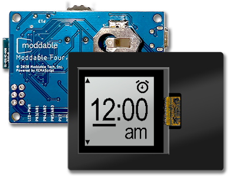
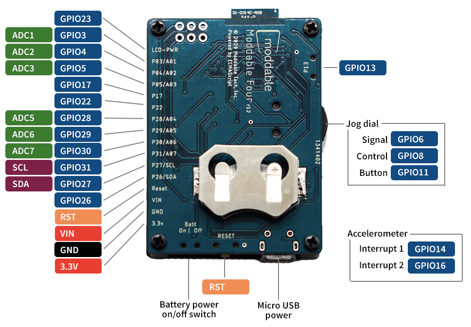
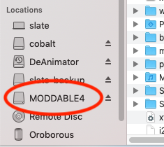
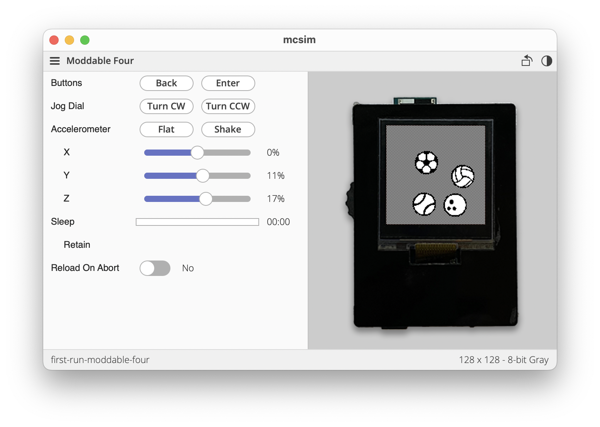

# Moddable Four Developer Guide

Copyright 2021-2023 Moddable Tech, Inc.<BR>
Revised: August 7, 2023

This document provides information about Moddable Four, including details about its pins and other components, how to build and deploy apps, and links to other development resources.

## Table of Contents

- [About Moddable Four](#about-moddable-four)
	- [Components](#components)
	- [Pinout](#pinout)
	- [Pin Information](#pin-info)
- [SDK and Host Environment Setup](#setup)
- [Building and Deploying Apps](#building-and-deploying-apps)
- [Using the Moddable Four](#moddable-features)
- [Troubleshooting](#troubleshooting)
- [Development Resources](#development-resources)
	- [Simulator](#simulator)
	- [Examples](#examples)
	- [Documentation](#documentation)
	- [Support](#support)
	- [Updates](#updates)

<a id="about-moddable-four"></a>
## About Moddable Four



Moddable Four is a low-power, Bluetooth LE development board that makes it easy for developers to experiment with the Moddable SDK. It is available to purchase on the [Moddable website](http://www.moddable.com/purchase).

<a id="components"></a>
### Components

The two main components of Moddable Four are the nRF52840 module and mirror display. The nRF52840 module includes a BLE antenna, 1 MB Flash, and 256 KB RAM. The Sharp mirror display is a 128x128 black and white display that uses the [`ls013b4dn04` display driver](../drivers/ls013b4dn04/ls013b4dn04.md).

It also includes an integrated LIS3DH accelerometer, jog dial, and CR2032 battery connector.

<a id="pinout"></a>
### Pinout



**Note:** LCD-PWR / GPIO23 is not for use as a general GPIO. It is used to provide power to a sensor and to the screen.

- Writing `0` to GPIO23 emits 3.3V on LCD-PWR, which also gives power to the screen.
- Writing `1` to GPIO23 turns off the the pin and the screen.

<a id="pin-info"></a>
### Pin Information

#### 16-pin External Header Description

| Name| Function| Description |
| :---: | :---: | :--- |
| LCD-PWR<BR>GPIO23 | Power | GPIO23 is used to turn power on for the screen and sensors connected to this pin. 3.3v |
| GPIO3<BR>ADC1 | I/O<BR>Analog | Connects to nrf52 GPIO3. ADC Channel 1 |
| GPIO4<BR>ADC2 | I/O<BR>Analog | Connects to nrf52 GPIO4. ADC Channel 2 |
| GPIO5<BR>ADC3 | I/O<BR>Analog | Connects to nrf52 GPIO5. ADC Channel 3 |
| GPIO17 | I/O | Connects to nrf52 GPIO17 |
| GPIO22 | I/O | Connects to nrf52 GPIO22 |
| GPIO28<BR>ADC4 | I/O<BR>Analog | Connects to nrf52 GPIO28. ADC Channel 4 |
| GPIO29<BR>ADC5 | I/O<BR>Analog | Connects to nrf52 GPIO29. ADC Channel 5 |
| GPIO30<BR>ADC6 | I/O<BR>Analog | Connects to nrf52 GPIO30. ADC Channel 6 |
| GPIO31<BR>ADC7 | I/O<BR>Analog | Connects to nrf52 GPIO31. ADC Channel 7 |
| GPIO27<BR>SCL | I/O<BR>I2C | Connects to nrf52 GPIO27<BR>I2C Clock<BR>Accelerometer |
| GPIO26<BR>SDA | I/O<BR>I2C | Connects to nrf52 GPIO26<BR>I2C Data<BR>Accelerometer |
| RST | Reset | Reset device |
| VIN | Power | VIN is a 5V pin that can be used to power the Moddable Four. If the board is powered by USB, this pin can be used to provide that 5V power. This is an unregulated pin; VIN is a direct connection to the 5V input sources. Connects to other 5V inputs and AP2112K voltage regulator.
| GND | GND | Connects to GND |
| 3.3V | Power | 3.3V input and output. Connects to nRF52 3.3V input and other 3.3V devices. Regulated output power if board is 5V powered via micro USB, VIN external connector or USB. 3.3V can also be provided by the CR2032 coin cell. |

#### Power

The Moddable Four is a 3.3V device. 5V power is regulated to 3.3V by a AP2112K-3.3 voltage regulator (see data sheet for specs). Testing of Moddable Four has been with typical 5V 0.5amp USB source power.

Power can be supplied to the Moddable Four via the following:

* 5V - Micro USB connector
* 5V - VIN on 16 pin external header
* 3.3V - 3.3V on 16 pin external header
* 3V - CR2032 battery

Power provided by the CR2032 battery connector can be turned on and off with the sliding switch.

#### 6-pin JTAG connector

The 6-pin JTAG connector can be used for gdb debugging or flashing a new bootloader onto the Moddable Four. Please see the [nrf52 Platform document](./nrf52.md#debugging-native-code) for details.

<a id="setup"></a>
## SDK and Host Environment Setup

To build and run apps on Moddable Four, you'll need to:

1. Install the [Moddable SDK](./../Moddable%20SDK%20-%20Getting%20Started.md)
2. Install [nRF5 tools](./nrf52.md)
3. Follow the instructions in the **Building and Deploying Apps** section below.

<a id="building-and-deploying-apps"></a>
### Building and Deploying Apps

After you've setup your environment and nRF5 tools, take the following steps to install an application on your Moddable Four.

1. Attach your Moddable Four to your computer with a micro USB cable.

	Make sure you're using a data-sync capable cable, not one that is power-only.

2. Put the device into programming mode by double-tapping the RESET button.

	Programming mode is indicated by the LED indicator blinking regularly at boot time. A disk named `MODDABLE4` will also appear on your desktop.

	

	> **Note:** If you do not program your device within a short period, it will reboot to the installed application.

3. Build and deploy the app with `mcconfig`.

	`mcconfig` is the command line tool to build and launch Moddable apps on microcontrollers and the simulator. Full documentation of `mcconfig` is available [here](../tools/tools.md).

	Use the platform `-p nrf52/moddable_four` with `mcconfig` to build for Moddable Four. Build the [`piu/balls`](../../examples/piu/balls) example:

	```text
	cd $MODDABLE/examples/piu/balls
	mcconfig -d -m -p nrf52/moddable_four
	```

	The [examples readme](../../examples) contains additional information about other commonly used `mcconfig` arguments for screen rotation and more.

    Use the platform -p `sim/moddable_four` with `mcconfig` to build for the Moddable Four simulator.

<a id="moddable-features"></a>
### Using Moddable Four

The hardware and software in Moddable Four have been carefully designed to work together to support many kinds of applications without additional hardware. The hardware features include:

* LED
* Back button
* Jog dial
* Display power
* Display dither
* Accelerometer
* Energy Management

#### LED and Back button
This code snippet shows the use of the Moddable Four Host object to turn on the LED when the back button is pressed.

```
let led = new Host.LED.Default;

new Host.Button({
    pin: Host.pins.button,
    onPush() {
        led.write(this.pressed);
    }
});
```

#### Jog Dial

```
new Host.JogDial({
    onTurn(delta) {
	    trace(`Turn ${delta}\n`);
    },
    onPushAndTurn(delta) {
        trace(`Push and Turn ${delta}\n`);
    },
    onPush(value) {
        trace(`Button ${value}\n`);
    }
});
```

#### Display Power
To use the Moddable Four display, the LCD power pin must be enabled. In the `moddable_four/setup-target.js` file, the screen is enabled if the `autobacklight` config variable is set:

```
if (config.autobacklight)
    Digital.write(config.lcd_power_pin, 0);
```

#### Display Dither
The Sharp memory display in Moddable Four uses the ls013b4dn04 display driver. By default, the display driver is configured to dither images as it converts from 8-bit gray to black and white for the display. The driver uses the [Atkinson dither](https://en.wikipedia.org/wiki/Atkinson_dithering) algorithm which is fast, high quality, and well suited to animation.

While low, there is some runtime cost to dither. For applications that want to maximize frame rate, minimize computation, reduce code size, and reduce RAM use, dithering may be completely disabled in the driver by setting the appropriate define in the project manifest:

```
    "defines": {
        "ls013b4dn04": {
            "dither": 0
        }
    },
```
Some applications want dithering enabled on some screens but not others. Those applications will leave dithering enabled in the driver, and use the `dither` property of the driver to turn dithering on and off at runtime.

```
screen.dither = true;
screen.dither = false;
```

#### Accelerometer

```
import Timer from "timer";

let acc = new Host.Accelerometer;

Timer.repeat(() => {
    let sample = acc.sample();
    trace(`sample x: ${sample.x}, y: ${sample.y}, z: ${sample.z}\n`);
}, 100);
```

#### Energy Management

The Moddable Four is designed to run on coin-cell batteries for long periods of time. The hardware is carefully designed to achieve maximum energy efficiency. Here is the energy used in various operating modes:

- Idle mode - 3.7 uA - RAM maintained, waiting for user input, between screens and sensor readings.
- Deep sleep - 1.85 uA - No software running. Automatically wake after a specified duration. Only retention RAM maintained.
- Wake on digital - 1.9 uA - Like deep sleep, but also wakes up on state change of digital input
- Wake on analog - 2.7 uA - Like deep sleep, but also wakes when an analog input crosses a specified threshold

There are many energy management APIs available on Moddable Four. These include:

- Deep sleep
- Retention RAM
- Wake on digital
- Wake on timer
- Wake on analog
- Wake on motion (using accelerometer)

<!--
	should have a readme.md in that directory which describes the examples
-->

See the [nRF52 Low Power Notes](./nRF52-low-power.md) for details. Examples of different sleep and wakeup modes can be found in `$MODDABLE/build/devices/nrf52/examples/sleep`.

<a id="troubleshooting"></a>
## Troubleshooting

See the Troubleshooting section of the [nRF52 documentation](./nrf52.md) for a list of common issues and how to resolve them.

<a id="development-resources"></a>
## Development Resources

<a id="simulator"></a>
### Simulator
The Moddable SDK simulator, mcsim, includes a Moddable Four simulator. To use it, use the `sim/moddable_four` platform when building with `mcconfig`:

```
mcconfig -d -m -p sim/moddable_four
```

The simulator includes controls for many of the unique hardware features of Moddable Four. Use "Show Controls" and "Hide Controls" in the View menu to toggle their visibility.



You can also use your computer's keyboard to control the jog dial and button:

- Jog dial clockwise – up arrow
- Jog dial counter-clockwise – down arrow
- Jog dial press – enter
- Back button – delete

The Moddable Four simulator renders images in 8-bit grayscale, which matches how Moddable Four hardware renders images off-screen. The display driver in Moddable Four then converts the 8-bit grayscale images to monochrome (1-bit) for display with optional dithering.

<a id="examples"></a>
### Examples

The Moddable SDK has over 150 [example apps](../../examples) that demonstrate how to use its many features. Many of these examples run on Moddable Four.

Many of the examples that use Commodetto and Piu are designed for colored QVGA screens. While they will run on Moddable Four, the colors will be dithered when rendered and some screens may be cropped. Not every example is compatible with Moddable Four hardware. Some examples are designed to test specific display and touch drivers that are not compatible with the Moddable Four display and give a build error.

<a id="documentation"></a>
### Documentation

Documentation for the nRF5 device and SDK can be found on the [Nordic Semiconductor Infocenter](https://infocenter.nordicsemi.com/topic/struct_nrf52/struct/nrf52840.html). Of particular interest is the documentation for the Nordic nRF5 SDK v17.0.2, which is available [here](https://infocenter.nordicsemi.com/topic/struct_sdk/struct/sdk_nrf5_latest.html).

Documentation for the Moddable SDK is in the [documentation](../) directory. The **documentation**, **examples**, and **modules** directories share a common structure to make it straightforward to locate information. Some of the highlights include:

- [Using the Moddable SDK with nRF52](./nrf52.md) explains how to get set-up for development, supported devices, and more.
- [nRF52 Low Power Notes](./nRF52-low-power.md) describes the techniques and APIs to maximize battery life by minimizing power consumption.
- The `commodetto` [directory](../../examples/commodetto), which contains resources related to Commodetto--a bitmap graphics library that provides a 2D graphics API--and Poco, a lightweight rendering engine.
- The `piu` [directory](../../examples/piu), which contains resources related to Piu, our user interface framework for creating complex, responsive layouts.
- The `pins` [directory](../../examples/pins), which contains resources related to supported hardware protocols (digital, analog, PWM, I²C, etc.). A number of drivers for common off-the-shelf sensors and corresponding example apps are also available.

<a id="support"></a>
### Support

If you have questions, we're here to help. If you've encountered a bug, recommend you [open an issue](https://github.com/Moddable-OpenSource/moddable/issues). If you have a question, [start a discussion](https://github.com/Moddable-OpenSource/moddable/discussions) or ask us on our [Gitter](https://gitter.im/embedded-javascript/moddable#). We'll respond as quickly as practical, and other developers can offer help and benefit from the answers to your questions. Many questions have already been answered, so please try searching previous issues and discussions before opening a new one.

<a id="updates"></a>
### Updates

The best way to keep up with what we're doing is to follow us on Twitter ([@moddabletech](https://twitter.com/moddabletech)). We post announcements about new posts on [our blog](http://blog.moddable.com/) there, along with other Moddable news.

