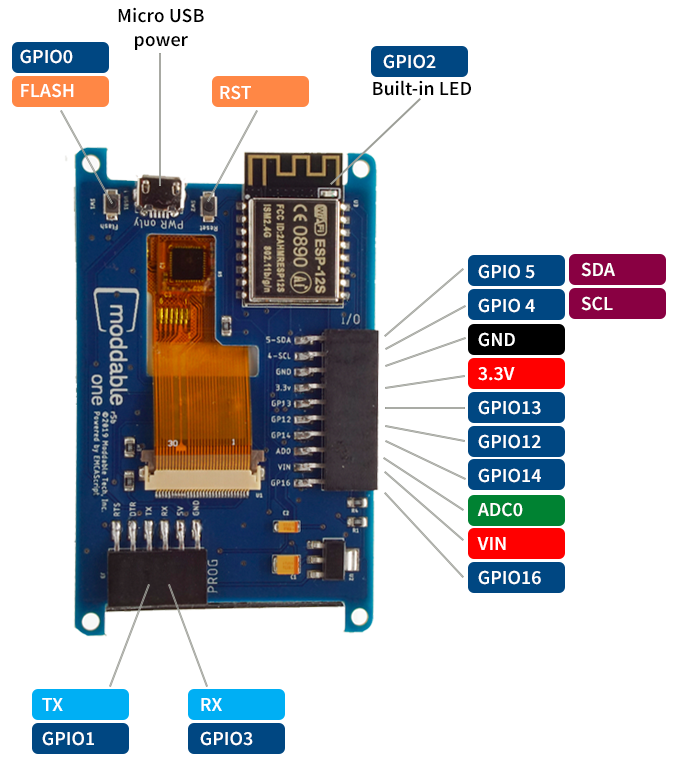
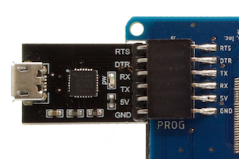

# Moddable One Developer Guide
Copyright 2019-2022 Moddable Tech, Inc.<BR>
Revised: March 22, 2022

This document provides information about Moddable One, including details about its pins and other components, how to build and deploy apps, and links to other development resources.

## Table of Contents

- [About Moddable One](#about-moddable-one)
	- [Components](#components)
	- [Pinout](#pinout)
- [SDK and Host Environment Setup](#setup)
- [Building and Deploying Apps](#building-and-deploying-apps)
- [Troubleshooting](#troubleshooting)
- [Development Resources](#development-resources)
	- [Examples](#examples)
	- [Documentation](#documentation)
	- [Support](#support)
	- [Updates](#updates)

<a id="about-moddable-one"></a>
## About Moddable One


Moddable One is a hardware module that makes it easy for developers to experiment with the Moddable SDK on inexpensive hardware. It is available to purchase on the [Moddable website](http://www.moddable.com/moddable-one).

<a id="components"></a>
### Components

The two main components of Moddable One are the ESP8266 module and capacitive touch screen. The ESP8266 module includes a Wi-Fi antenna and 4 MB of flash storage memory. The touch screen is a 240 x 320 QVGA IPS display driven by a MIPI Display Serial Interface compatible display controller with an FT6206 capacitive touch controller.

<a id="pinout"></a>
### Pinout




#### Touch panel

The touch panel uses pins 4 and 5 to connect to the I<sup>2</sup>C bus. You cannot use these pins as GPIO if your app uses the touch panel.

You can use other I<sup>2</sup>C sensors even if your app uses the touch panel as long as they don't use the same address. The touch panel uses address 0x38 (7-bit address).

#### Display

The display uses pins 13 and 14 to connect to the SPI bus. You cannot use these pins as GPIO if your app uses the display.

You can use other SPI sensors even if your app uses the display.

<a id="setup"></a>
## SDK and Host Environment Setup

To build and run apps on Moddable One, you'll need to:

1. Install the [Moddable SDK](./../Moddable%20SDK%20-%20Getting%20Started.md)
2. Install [ESP8266 tools](./esp8266.md)
3. Follow the instructions in the **Building and Deploying Apps** section below.

<a id="building-and-deploying-apps"></a>
## Building and Deploying Apps

After you've set up your host environment and ESP8266 tools, take the following steps to install an application on your Moddable One.

1. Attach the programmer to your Moddable One.

	Make sure you have the programmer oriented correctly. The orientation should match the image below.
	
	

	**Note**: The USB port on Moddable One may be used to provide power when operating without the programmer. The USB port is only for powering Moddable One. It cannot be used to program Moddable One.

2. Attach the programmer to your computer with a micro USB cable.

	The USB cable must be attached to the programmer, not the power-only USB port on the board. Make sure you're using a data sync&#8211;capable cable, not one that is power-only.

3. Build and deploy the app with `mcconfig`.

	`mcconfig` is the command line tool to build and launch Moddable apps on microcontrollers and the simulator. Full documentation of `mcconfig` is available [here](../tools/tools.md). 
	
	Use the platform `-p esp/moddable_one`  with `mcconfig` to build for Moddable One. For example, to build the [`piu/balls` example](../../examples/piu/balls):
	
	```text
	cd $MODDABLE/examples/piu/balls
	mcconfig -d -m -p esp/moddable_one
	```
	
	The [examples readme](../../examples) contains additional information about other commonly used `mcconfig` arguments for screen rotation, Wi-Fi configuration, and more.

	Use the platform `-p simulator/moddable_one` with `mcconfig` to build for the Moddable One simulator.

<a id="troubleshooting"></a>
## Troubleshooting

See the Troubleshooting section of the [ESP8266 documentation](./esp8266.md) for a list of common issues and how to resolve them.


<a id="development-resources"></a>
## Development Resources

<a id="examples"></a>
### Examples

The Moddable SDK has over 150 [example apps](../../examples) that demonstrate how to use its many features. The vast majority of these examples run on Moddable One. 

That said, not every example is compatible with Moddable One hardware. For example, the ESP8266 does not have BLE capabilities so BLE examples do not build or run. Some examples are designed to test specific display and touch drivers that are not compatible with the Moddable One display and give a build error.

<a id="documentation"></a>
### Documentation

All the documentation for the Moddable SDK is in the [documentation](../) directory. The **documentation**, **examples**, and **modules** directories share a common structure to make it straightforward to locate information. Some of the highlights include: 

- The `commodetto` subdirectory, which contains resources related to Commodetto--a bitmap graphics library that provides a 2D graphics API--and Poco, a lightweight rendering engine.
- The `piu` subdirectory, which contains resources related to Piu, a user interface framework that makes it easier to create complex, responsive layouts.
- The `networking` subdirectory, which contains networking resources related to network sockets and a variety of standard, secure networking protocols built on sockets including HTTP/HTTPS, WebSockets, DNS, SNTP, and telnet
- The `pins` subdirectory, which contains resources related to supported hardware protocols (digital, analog, PWM, I2C, etc.). A number of drivers for common off-the-shelf sensors and corresponding example apps are also available.

<a id="support"></a>
### Support

If you have questions, we recommend you [open an issue](https://github.com/Moddable-OpenSource/moddable/issues). We'll respond as quickly as practical, and other developers can offer help and benefit from the answers to your questions. Many questions have already been answered, so please try searching previous issues before opening a new issue.

<a id="updates"></a>
### Updates

The best way to keep up with what we're doing is to follow us on Twitter ([@moddabletech](https://twitter.com/moddabletech)). We post announcements about new posts on [our blog](http://blog.moddable.com/) there, along with other Moddable news.
