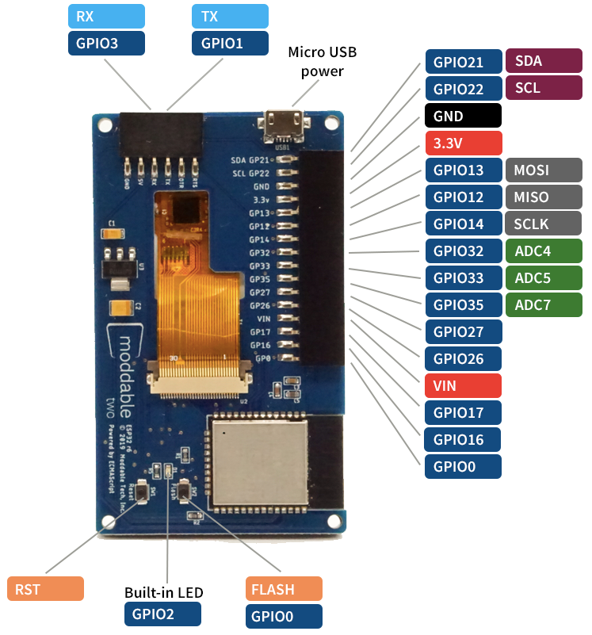

# Moddable Two Developer Guide
Copyright 2019-2022 Moddable Tech, Inc.<BR>
Revised: March 22, 2022

This document provides information about Moddable Two, including details about its pins and other components, how to build and deploy apps, and links to other development resources.

## Table of Contents

- [About Moddable Two](#about-moddable-two)
	- [Components](#components)
	- [Pinout](#pinout)
	- [Pin Information](#pin-info)
	- [Dimensions](#dimensions)
- [SDK and Host Environment Setup](#setup)
- [Building and Deploying Apps](#building-and-deploying-apps)
- [Troubleshooting](#troubleshooting)
- [Development Resources](#development-resources)
	- [Examples](#examples)
	- [Documentation](#documentation)
	- [Backlight](#backlight)
	- [Support](#support)
	- [Updates](#updates)

<a id="about-moddable-two"></a>
## About Moddable Two


Moddable Two is a hardware module that makes it easy for developers to experiment with the Moddable SDK on inexpensive hardware. It is available to purchase on the [Moddable website](http://www.moddable.com/moddable-two).

<a id="components"></a>
### Components

The two main components of Moddable Two are the ESP32 module and capacitive touch screen. The ESP32 module includes a Wi-Fi/BLE antenna and 4 MB of flash storage memory. The touch screen is a 240 x 320 QVGA IPS display driven by a MIPI Display Serial Interface compatible display controller with an FT6206 capacitive touch controller.

<a id="pinout"></a>
### Pinout



#### Touch panel

The touch panel uses pins 21 and 22 to connect to the I<sup>2</sup>C bus. You cannot use these pins as GPIO if your app uses the touch panel.

You can use other I<sup>2</sup>C sensors even if your app uses the touch panel as long as they don't use the same address. The touch panel uses address 0x38 (7-bit address).

#### Display

The display uses pins 13 and 14 to connect to the SPI bus. You cannot use these pins as GPIO if your app uses the display.

You can use other SPI sensors even if your app uses the display.

<a id="pin-info"></a>
### Pin Information

#### 6-pin Programming Header Description

| Name | Function | Description |
| :---: | :---: | :--- |
| RTS | I/O | Connects to auto programming and reset circuit |
| DTR | I/O | Connects to auto programming and reset circuit |
| TX | I/O | Connects to ESP32 GPIO1 |
| RX | I/O | Connects to ESP32 GPIO3 |
| 5V | PWR | 5V input connects to LM1117-3.3 voltage regulator and 5V pin on 16-pin external connector |
| GND | GND | Connects to GND |

#### 16-pin External Header Description

| Name| Function| Description |
| :---: | :---: | :--- |
| SDA GP21 | I/O | Connects to ESP32 GPIO21 (standard SDA, no external pull up resistor) |
| SCL GP22 | I/O | Connects to ESP32 GPIO22 (standard SCL, no external pull up resistor) |
| GND      | GND | Connects to GND |
| 3.3V     | I/O | 3.3V input and output. Connects to ESP32 3.3V input and other 3.3V IC's. Regulated output power if board is 5V powered via micro USB, VIN external connector or programming connector. 3.3V is the output of the LM1117-3.3. Output of the LM1117 is conditioned with a 100uf Tantalum capacitor. |
| GP13     | I/O | Connects to ESP32 GPIO13 (Also MOSI for display) |
| GP12     | I/O | Connects to ESP32 GPIO12 |
| GP14     | I/O | Connects to ESP32 GPIO14 |
| GP32     | I/O | Connects to ESP32 GPIO32 |
| GP33     | I/O | Connects to ESP32 GPIO33 |
| GP35     | I/O | Connects to ESP32 GPIO35 |
| GP27     | I/O | Connects to ESP32 GPIO27 |
| GP26     | I/O | Connects to ESP32 GPIO26 |
| VIN      | I/O | VIN is a 5V pin that can be used to power the Moddable Two. If the board is powered by one of the other 5V inputs this pin can be used for external 5V power. This is an unregulated pin; VIN is a direct connection to the 5V input sources. Connects to other 5V inputs and LM1117-3.3 voltage regulator. |
| GP17     | I/O | Connects to ESP32 GPIO17 |
| GP16     | I/O | Connects to ESP32 GPIO16 |
| GP0      | I/O | Connects to ESP32 GPIO0 |

#### Power

The Moddable Two is a 3.3V device. 5V power is regulated to 3.3V by a LM1117-3.3 voltage regulator (see data sheet for specs). Testing of Moddable Two has been with typical 5V 0.5amp USB source power.

Power can be supplied to the Moddable Two via the following:

* 5V - Micro USB connector
* 5V - Moddable Programmer connector
* 5V - VIN on 16 pin external header
* 3.3V - 3.3V pin external header

<a id="dimensions"></a>
### Dimensions

The complete dimensions of Moddable Two are provided in this [PDF document](../assets/devices/moddable-two-dimensions.pdf). These are helpful when designing a case for Moddable Two. 

<a id="setup"></a>
## SDK and Host Environment Setup

To build and run apps on Moddable Two, you'll need to:

1. Install the [Moddable SDK](./../Moddable%20SDK%20-%20Getting%20Started.md)
2. Install [ESP32 tools](./esp32.md)
3. Follow the instructions in the **Building and Deploying Apps** section below.

<a id="building-and-deploying-apps"></a>
## Building and Deploying Apps

After you've set up your host environment and ESP32 tools, take the following steps to install an application on your Moddable Two.

1. Attach the programmer to your Moddable Two.

	Make sure you have the programmer oriented correctly. The orientation should match the image below.
	
	

	**Note**: The USB port on Moddable Two may be used to provide power when operating without the programmer. The USB port is only for powering Moddable Two. It cannot be used to program Moddable Two.

2. Attach the programmer to your computer with a micro USB cable.

	The USB cable must be attached to the programmer, not the power-only USB port on the board. Make sure you're using a data sync&#8211;capable cable, not one that is power-only.

3. Build and deploy the app with `mcconfig`.

	`mcconfig` is the command line tool to build and launch Moddable apps on microcontrollers and the simulator. Full documentation of `mcconfig` is available [here](../tools/tools.md). 
	
	Use the platform `-p esp32/moddable_two`  with `mcconfig` to build for Moddable Two. For example, to build the [`piu/balls` example](../../examples/piu/balls):
	
	```text
	cd $MODDABLE/examples/piu/balls
	mcconfig -d -m -p esp32/moddable_two
	```
	
	The [examples readme](../../examples) contains additional information about other commonly used `mcconfig` arguments for screen rotation, Wi-Fi configuration, and more.
	
	Use the platform `-p simulator/moddable_two` with `mcconfig` to build for the Moddable Two simulator.
	

<a id="troubleshooting"></a>
## Troubleshooting

See the Troubleshooting section of the [ESP32 documentation](./esp32.md) for a list of common issues and how to resolve them.

<a id="development-resources"></a>
## Development Resources

<a id="examples"></a>
### Examples

The Moddable SDK has over 150 [example apps](../../examples) that demonstrate how to use its many features. The vast majority of these examples run on Moddable Two. 

That said, not every example is compatible with Moddable Two hardware. For example, some examples are designed to test specific display and touch drivers that are not compatible with the Moddable Two display and give a build error.

<a id="documentation"></a>
### Documentation

All the documentation for the Moddable SDK is in the [documentation](../) directory. The **documentation**, **examples**, and **modules** directories share a common structure to make it straightforward to locate information. Some of the highlights include: 

- The `commodetto` subdirectory, which contains resources related to Commodetto--a bitmap graphics library that provides a 2D graphics API--and Poco, a lightweight rendering engine.
- The `piu` subdirectory, which contains resources related to Piu, a user interface framework that makes it easier to create complex, responsive layouts.
- The `networking` subdirectory, which contains networking resources related to BLE, network sockets, and a variety of standard, secure networking protocols built on sockets including HTTP/HTTPS, WebSockets, DNS, SNTP, and telnet.
- The `pins` subdirectory, which contains resources related to supported hardware protocols (digital, analog, PWM, I2C, etc.). A number of drivers for common off-the-shelf sensors and corresponding example apps are also available.

<a id="backlight"></a>
### Backlight
The original Moddable Two has an always-on backlight. The second revision has the ability to adjust the backlight brightness in software. Moddable Two units with backlight brightness control are identified by the small `ESP32 r9` printed on the back of the board to the right of the Moddable logo. 

The backlight control is connected to GPIO 18. There is a constant defined for the backlight GPIO in the host config.

```javascript
import "config" from "mc/config";

Digital.write(config.backlight, 1);	// backlight ON
Digital.write(config.backlight, 0);	// backlight OFF
```

The brightness of the backlight may be set at build time in the `config` section of your project manifest. It defaults to 100%.

```javascript
"config": {
	"brightness": 75
}
```

You can also set the brightness on the command line when building with `mcconfig`. Here it is set to 50%.

```text
mcconfig -d -m -p esp32/moddable_two backlight=50
```

The `setup/target` module for Moddable Two installs a global variable named `backlight` that you can use to adjust the backlight in your code. Here it is set to 80%.

```javascript
backlight.write(80);
```

The `backlight` global contains an instance of a subclass of `PWM`. If you do not want the `setup/target` to create this `PWM` instance, set the brightness to `"none"` in the `config` section of your project's manifest.

```javascript
"config": {
	"brightness": "none"
}
```

**Note**: Backlight support is present in all builds using the `esp32/moddable_two` build target, however it only works for revision two.

<a id="support"></a>
### Support

If you have questions, we recommend you [open an issue](https://github.com/Moddable-OpenSource/moddable/issues). We'll respond as quickly as practical, and other developers can offer help and benefit from the answers to your questions. Many questions have already been answered, so please try searching previous issues before opening a new issue.

<a id="updates"></a>
### Updates

The best way to keep up with what we're doing is to follow us on Twitter ([@moddabletech](https://twitter.com/moddabletech)). We post announcements about new posts on [our blog](http://blog.moddable.com/) there, along with other Moddable news.
