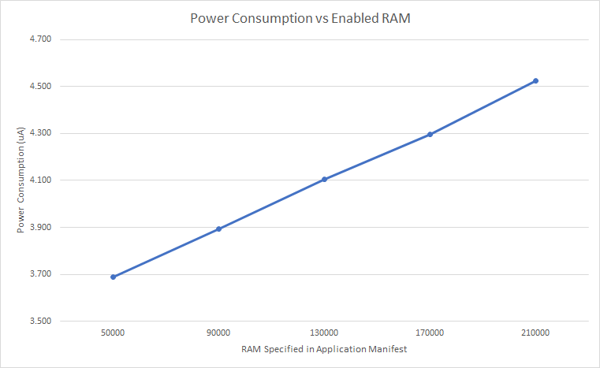

# nRF52 Low Power Notes
Copyright 2019-23 Moddable Tech, Inc.<br/>
Revised: April 8, 2023

Warning: These notes are preliminary. Omissions and errors are likely. If you encounter problems, please ask for assistance.

## Table of Contents

- [Low Power Modes](#low-power-modes)
	- [System ON Power Mode](#system-on-power-mode)
	- [System OFF Power Mode](#system-off-power-mode)
- [FreeRTOS and Low Power](#free-rtos-and-low-power)
- [Low Power Constraints](#low-power-constraints)
- [RAM Retention](#ram-retention)
- [RAM Power Control](#ram-power-control)
- [Low Power APIs](#low-power-apis)
	- [Class Sleep](#class-sleep)
- [Example apps](#example-apps)
- [Power Consumption on Moddable Four](#power-consumption-on-moddable-four)
- [References](#references)

<a id="low-power-modes"></a>
## Low Power Modes
The Nordic nRF52 devices (Moddable Four) provide two low power (sleep) modes to reduce power consumption: **System ON** and **System OFF**. Applications can programatically enter and exit these power modes using Nordic APIs. The [nRF52840 Product Specification](https://infocenter.nordicsemi.com/pdf/nRF52840_PS_v1.0.pdf), Section 5.2 includes current consumption tables for common scenarios.

The Moddable SDK includes APIs to configure and leverage features provided by these low power modes.

<a id="system-on-power-mode"></a>
### System ON Power Mode
System ON power mode is what the firmware and applications typically enter when idle. In System ON mode, the CPU is put to sleep and the Power Management Unit automatically shuts down any peripheral not in use. When the SoftDevice is enabled, i.e. when BLE is active, a few additional clocks remain active to wake up the CPU on BLE events.
System ON power mode is further subdivided into two sub-power modes: **Constant Latency** and **Low Power.** Constant Latency sub-power mode maintains a constant latency by keeping certain oscillators and regulators running, while increasing power consumption. In the Low Power sub-power mode, the Power Management Unit turns these regulators/oscillators on and off based on demand, reducing power consumption, but increasing latency. The default sub-power mode is Low Power.

By default all RAM is powered while in System ON sleep mode, though it is possible to selectively power off RAM banks. Refer to the [RAM Power Control](#ram-power-control) section for further details.

The Moddable nRF52 runtime is configured to automatically enter System ON power mode when applications are idle, i.e. waiting for events, messages, interrupts, etc... Power consumption while in System ON power mode on the Moddable Four averages 4.5 microamps when all RAM banks are powered on (default).

<a id="system-off-power-mode"></a>
### System OFF Power Mode
System OFF power mode is deep sleep. The CPU and most peripherals are asleep and disabled. The device always resets when exiting System OFF power mode. System OFF wake-up can be achieved through GPIO triggers (analog & digital), NFC or pin reset. RAM can be retained in System OFF mode. Power consumption while in System OFF power mode on the Moddable Four averages between 1.4 and 5.2 microamps, depending on the wake-up source.

<a id="freertos-and-low-power"></a>
## FreeRTOS and Low Power
Moddable apps run on FreeRTOS on nRF52 devices. To conserve energy, FreeRTOS supports a [Tickless Idle](https://www.freertos.org/low-power-tickless-rtos.html) mode. Tickless idle disables the periodic tick interrupt, allowing the CPU to enter low power mode until a task needs to run or interrupt occurs, at which point the RTOS tick value is adjusted.

The core of the tickless idle implementation/hook is provided by our `vApplicationSleep()` function. This function enters System ON sleep mode when the application is idle and exits System ON sleep mode when an interrupt occurs or a task needs to run.

The main loop in a Moddable app on nRF52 executes all "ready" timers and then waits on messages until the next timer needs to fire. If no timers are active, the app waits for a maximum delay time. This wait triggers the FreeRTOS scheduler, which in turn calls the tickless idle function and puts the app into System ON sleep mode.

The Nordic SDK includes a Power Manager API for configuring low power modes. Because FreeRTOS includes it's own power management hook (tickless idle), the Power Manager APIs cannot be called from the Moddable runtime. Instead, Moddable apps use the provided SoftDevice power API wrappers, when the SoftDevice is active, and/or the [Arm CMSIS hardware abstraction](https://developer.arm.com/tools-and-software/embedded/cmsis) APIs.

<a id="low-power-constraints"></a>
## Low Power Constraints
System OFF sleep mode is *emulated* on debug builds. This is because the debugger needs certain hardware resources powered in order to maintain a connection. Therefore, low power APIs and current consumption measurements are only valid when running release builds.

Similarly all logging and serial connections must be completely disabled when measuring consumption, including the NRF_LOG support available to release build Moddable apps.

<a id="ram-retention"></a>
## RAM Retention
RAM on nRF52 devices is subdivided into slave regions. Each slave region is further subdivided into sections. RAM sections can be programatically powered off and/or retained in both System ON and OFF power modes. There are nine slave regions that can be controlled. Eight of the slave regions have two 4 KB sections. The ninth slave region (RAM8 AHB Slave) has six 32 KB sections.

The Moddable build reserves 512 bytes from one RAM section for retention in System OFF power mode. The number of bytes is arbitrary but a reasonable staring point. The retained section is defined in the linker scripts for SES and GCC. The runtime accesses this RAM buffer as a named `.no_init` section.

<a id="ram-power-control"></a>
## RAM Power Control
Moddable apps can optionally specify how much runtime RAM is required by the application. Overall current consumption is reduced by powering off unused RAM while in System ON sleep mode. Unused RAM sections in the heap area are powered off by the low power [setup module](https://github.com/Moddable-OpenSource/moddable/blob/public/documentation/base/setup.md) after the native code runtime and XS have been initialized. Memory on nRF52 is allocated starting from the bottom of the heap. Because the native code initialization performs memory allocations, unused RAM sections are powered off starting from the top of the heap, immediately below the RAM section containing the stack, avoiding any allocations made during the initialization sequence.

Applications using this feature must include the `Sleep` module [manifest](https://github.com/Moddable-OpenSource/moddable/blob/public/build/devices/nrf52/modules/sleep/manifest.json) in the application manifest. The amount of RAM required by the application is specified in the `config` section of the application manifest for the nrf52 platform:

```javascript
"platforms": {
	"nrf52": {
		"config": {
			"ram": 50000
		}
	}
}
```

Care must be taken to ensure that the amount of RAM requested is sufficient for the application and Moddable runtime.

In the graph below, power consumption was measured while waiting on a [Timer](../../modules/base/timer). Power consumption tracks inversely with the amount of RAM powered.



> Note: RAM Power Control can only be used in release builds.

<a id="class-sleep"></a>
## Class Sleep
- **Source code:** [sleep](./../../build/devices/nrf52/modules/sleep)
- **Relevant Examples:** [deep-sleep](./../../build/devices/nrf52/examples/sleep/deep-sleep), [ram-power-off](./../../build/devices/nrf52/examples/sleep/ram-power-off), [retained-values](./../../build/devices/nrf52/examples/sleep/retained-values), [wake-on-digital](./../../build/devices/nrf52/examples/sleep/wake-on-digital), and [many more](./../../build/devices/nrf52/examples/sleep/).

The Sleep class includes static methods for setting low power modes, initiating deep sleep, and RAM retention. This section provides an overview of the available methods and features.

```javascript
import Sleep from "sleep";
```

### Functions

#### `deep([ms])`

| Argument | Type | Description |
| --- | --- | :--- |
| `ms` | `number` | Optional number of milliseconds to sleep

Call the `deep` function to enter deep sleep. When called with the milliseconds parameter, the function powers off all RAM and configures a RTC to wake-up from System ON sleep after the specified number of milliseconds have passed, or on any configured interrupt. When the `ms` parameter is omitted, the device is put into System OFF sleep. In either case, the device reboots and the application script is relaunched upon wake-up.

To put the device into deep sleep with no wake-up timer:

```javascript
Sleep.deep();
```

To put the device into deep sleep and then wake-up after five seconds:

```javascript
Sleep.deep(5000);
```

***

#### `resetReason()`

The `resetReason` accessor function returns the reason for the most recent system reset. The `ResetReason` object contains property values corresponding to each reset reason.

### Properties

| Name | Description |
| --- | --- |
| `RESETPIN` | Reset pin |
| `DOG` | Reset from watchdog timer |
| `SREQ` | Software reset |
| `LOCKUP` | Reset from lockup |
| `GPIO` | Reset triggered from GPIO DETECT (digital) signal |
| `LPCOMP` | Reset triggered from GPIO ANDETECT (analog) signal |
| `DIF` | Reset triggered from debugger interface |
| `NFC` | Reset triggered from NFC field detect |

To check if reset was triggered by a digital input:

```javascript
import {Sleep, ResetReason} from "sleep";

let reason = Sleep.resetReason;
if (ResetReason.GPIO == reason)
	trace(`Reset was triggered by a digital pin\n`);
```

***

#### `powerMode()`

The `powerMode` setter function sets the System ON low power sub-mode. The `PowerMode` object contains property values corresponding to each mode.

### Properties

| Name | Description |
| --- | --- |
| `ConstantLatency` | Constant Latency sub-mode |
| `LowPower` | Low Power sub-mode |

To set System ON low power sub-power mode:

```javascript
import {Sleep, PowerMode} from "sleep";

Sleep.powerMode = PowerMode.LowPower;
```

***

#### `setRetainedValue(index, value)`

| Argument | Type | Description |
| --- | --- | :--- |
| `index` | `number` | Index of 32-bit memory slot to retain
| `value` | `number` | 32-bit value to retain

The `setRetainedValue` method allows an application to retain 32-bit values across System OFF sleep. A subsequent call to `setRetainedValue` replaces any existing retained value. Up to 32 individual 32-bit values can be retained.

To save 32 values where each slot value corresponds to the slot index:

```javascript
import {Sleep} from "sleep";

// retain values
for (let index = 0; index < 32; ++index)
	Sleep.setRetainedValue(index, index + 1);

// sleep
Sleep.deep();
```

#### `getRetainedValue(index)`

| Argument | Type | Description |
| --- | --- | :--- |
| `index` | `number` | Zero-based index of 32-bit memory slot to retrieve.

The `getRetainedValue` method allows an application to retrieve a 32-bit memory value previously retained across System OFF sleep. The function returns a `number` containing the retained memory value when available. If no memory was retained the function returns the value `0`.


```javascript
let index = 1;
let value = Sleep.getRetainedValue(index);
trace(`Retrieved value ${value} at index ${index}\n`);
```

***

#### `setup()`

The `setup` method is called internally by the nRF52 [power.js](./../../build/devices/nrf52/setup/power.js) [setup module](https://github.com/Moddable-OpenSource/moddable/blob/public/documentation/base/setup.md) to initialize low power features at launch. This method restores the system time after waking up from deep sleep, i.e. after a call to `Sleep.deep` when a milliseconds timeout value is provided. The function also powers down unused RAM for applications that specify a RAM configuration.

<a id="example-apps"></a>
## Example apps
Example apps are provided to demonstrate the various `Sleep` class features:

| Name | Description |
| :---: | :--- |
| [deep-sleep](./../../build/devices/nrf52/examples/sleep/deep-sleep) | Enter deep sleep mode and read the reset reason on launch.
| [ram-power-off](./../../build/devices/nrf52/examples/sleep/ram-power-off) | Configure required RAM in manifest and power off unused RAM.
| [retained-values](./../../build/devices/nrf52/examples/sleep/retained-values) | Retain 32 values across System OFF sleep mode and verify the values on reset.
| [wake-on-analog](./../../build/devices/nrf52/examples/sleep/wake-on-analog) | Configure wake-up on analog crossing configurations.
| [wake-on-digital](./../../build/devices/nrf52/examples/sleep/wake-on-digital) | Configure wake-up on a button press.
| [wake-on-motion](./../../build/devices/nrf52/examples/sleep/wake-on-motion) | Configure wake-up from a connected LIS3DH accelerometer configured to generate interrupts on motion.
| [wake-on-multiple](./../../build/devices/nrf52/examples/sleep/wake-on-multiple) | Configure wake-up from a combination of analog and digital triggers.
| [wake-on-timer](./../../build/devices/nrf52/examples/sleep/wake-on-timer) | Configure wake-up after the specified number of milliseconds have passed.

<a id="power-consumption-on-moddable-four"></a>
## Power Consumption on Moddable Four
The Moddable runtime is optimized to support the low-power features of the Moddable Four. Low power applications should use the [Sleep APIs](#class-sleep) to leverage these optimizations. The Sleep class APIs that enter System OFF sleep result in the lowest power consumption. The chart below summarizes power consumption in System OFF sleep when running the example apps on the Moddable Four.

| Example app | Power Consumption | Description
| :---: | :---: | :--- |
| [deep-sleep](./../../build/devices/nrf52/examples/sleep/deep-sleep) | 1.4 uA | Wake on reset
| [wake-on-digital](./../../build/devices/nrf52/examples/sleep/wake-on-digital) | 1.5 uA | Wake on digital input trigger
| [wake-on-analog](./../../build/devices/nrf52/examples/sleep/wake-on-analog) | 2.3 uA | Wake on analog input trigger
| [wake-on-motion](./../../build/devices/nrf52/examples/sleep/wake-on-motion) | 5.2 uA | Wake on accelerometer motion interrupt digital input trigger
| [wake-on-multiple](./../../build/devices/nrf52/examples/sleep/wake-on-multiple) | 2.4 uA | Wake on RTC, analog, or digital input triggers with LCD on and displaying the wake-up source
| [wake-on-timer](./../../build/devices/nrf52/examples/sleep/wake-on-timer) | 2.4 uA | Wake on RTC with LCD on and displaying the time

<a id="references"></a>
## References
* [nRF52 Product Specification](https://infocenter.nordicsemi.com/pdf/nRF52832_PS_v1.1.pdf)
* [Optimizing Power on nRF52 Designs](https://devzone.nordicsemi.com/nordic/nordic-blog/b/blog/posts/optimizing-power-on-nrf52-designs)
* [FreeRTOS sleep optimization from main task](https://devzone.nordicsemi.com/f/nordic-q-a/55181/freertos-sleep-optimization-from-main-task)

