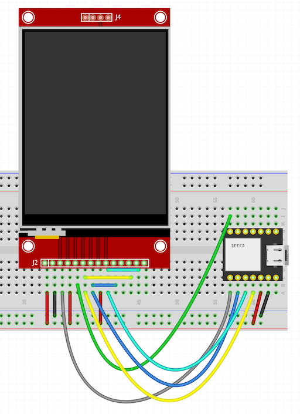

# Using the Moddable SDK with nRF52

Copyright 2021-2023 Moddable Tech, Inc.<BR>
Revised: September 7, 2023

This document is a guide to building apps for the nRF52840 SoC from Nordic using the Moddable SDK.

## Table of Contents

* [Overview](#overview)
* [Platforms](#platforms)
	* [nrf52](#platforms-nrf52)
* [Build Types](#builds)
	* [Debug](#build-debug)
	* [Instrumented](#build-instrumented)
	* [Release](#build-release)
* Setup instructions

    | [](#mac) | [](#win) | [](#lin) |
    | :--- | :--- | :--- |
    | •  [Installing](#mac-instructions)<BR>•  [Troubleshooting](#mac-troubleshooting) | •  [Installing](#win-instructions)<BR>•  [Troubleshooting](#win-troubleshooting) | •  [Installing](#lin-instructions)<BR>•  [Troubleshooting](#lin-troubleshooting)

* [Troubleshooting](#troubleshooting)
* [Debugging Over Serial](#serial-debugging)
* [Installing Apps via Serial](#install-apps-via-serial)
* [Debugging Native Code](#debugging-native-code)
* [Bootloader](#bootloader)
	* [Installing the bootloader](#install-bootloader)
	* [Updating the bootloader](#update-bootloader)
* [nRF5 SDK modifications](#nrf5-sdk-mods)

<a id="overview"></a>
## Overview

Before you can build applications, you need to:

- Install the Moddable SDK and build its tools
- Install the required drivers and development tools for the nRF52 platform

The instructions below will have you verify your setup by running the `helloworld` example on your device using `mcconfig`, the command line tool to build and run applications using the Moddable SDK.

> See the [Tools documentation](./../tools/tools.md) for more information about `mcconfig`


To build for Moddable Four,  run `mcconfig` with `nrf52/moddable_four` for the **platform identifier**:

```text
mcconfig -d -m -p nrf52/moddable_four
```

A list of available nRF52 subplatforms and their platform identifiers is in the **Platforms** section below.

<a id="platforms"></a>
## Platforms

<a id="platforms-nrf52"></a>
### nRF52

nRF52840 has the following features:

- 64 MHz Cortex-M4 with FPU
- BLE
- 256 KB RAM
- 1 MB Flash

| Name | Platform identifier | Key features | Links |
| :---: | :--- | :--- | :--- |
| <BR>Moddable Four | `nrf52/moddable_four`<BR>`simulator/moddable_four` | - **1.28" 128x128 Monochrome**<BR>- Sharp Mirror display<BR>- BLE<BR>- Jogdial<BR>- Accelerometer<BR>- Button and LED<BR>- CR2032 coin-cell power<BR>- 12 External GPIO pins  | <li>[Moddable Four developer guide](./moddable-four.md)</li><li>[Moddable product page](https://www.moddable.com/purchase.php)</li> |
| <BR>Nordic nRF52840 DK pca10056 | `nrf52/dk` | - 4 LEDs<BR>- 4 Buttons<BR>- All pins accessible<BR>- BLE<BR>- CR2032 coin-cell power  | <li>[Product page](https://www.nordicsemi.com/Products/Development-hardware/nrf52840-dk)</li> |
| <BR>Sparkfun Pro nRF52840 Mini | `nrf52/sparkfun` | - 1 LED<BR>- 1 Button<BR>- BLE<BR>- JST Power connector<BR>- Qwiic connector<BR>- 17 GPIO pins  | <li>[Product page](https://www.sparkfun.com/products/15025)</li> |
| <BR>Makerdiary nRF58240 MDK | `nrf52/makerdiary` | - 1  3-color LED<BR>- 1 Button<BR>- BLE<BR>- 12 GPIO pins  | <li>[Product page](https://makerdiary.com/products/nrf52840-mdk-usb-dongle)</li> |
| <BR>Seeed Studio XIAO nRF52840 | `nrf52/xiao` | - 1 3-color LED<BR>- 1 Button<BR>- BLE<BR>- 11 GPIO pins  | <li>[Product page](https://www.seeedstudio.com/Seeed-XIAO-BLE-nRF52840-p-5201.html)</li> |
| <BR>Adafruit ItsyBitsy nRF52840 Express | `nrf52/itsybitsy` | - 1 LED<BR>- 1 Button<BR>- BLE<BR>- 21 GPIO pins  | <li>[Product page](https://www.adafruit.com/product/4481)</li> |
| </a><BR>ili9341 | `nrf52/xiao_ili9341` | ili9341 QVGA display<BR>320 x 240<BR>16-bit color | <li>[Wiring Guide](../displays/images/xiao-qtpy-ili9341-wiring.png)</li> |

<a id="builds"></a>
## Build Types
The nRF52 supports three kinds of builds: debug, instrumented, and release. Each is appropriate for different stages in the product development process. You select which kind of build you want from the command line when running `mcconfig`.

> **Note**: Deep sleep APIs are only available instrumented and release builds.

<a id="build-debug"></a>
### Debug
A debug build is used for debugging JavaScript. In a debug build, the device will attempt to connect to xsbug at startup over USB or serial depending on the device configuration. Symbols will be included for native gdb debugging.

The `-d` option on the `mcconfig` command line selects a debug build.

<a id="build-instrumented"></a>
### Instrumented
An instrumented build is used for debugging native code. In an instrumented build, the JavaScript debugger is disabled. The instrumentation data usually available in xsbug is output to the serial console once a second. Deep sleep APIs are available in an instrumented build.

The `-i` option on the `mcconfig` command line selects an instrumented build.

<a id="build-release"></a>
### Release
A release build is for production. In a release build, the JavaScript debugger is disabled, instrumentation statistics are not collected, and serial console output is suppressed. Deep sleep APIs are available in a release build.

Omitting both the `-d` and `-i` options on the `mcconfig` command line selects a release. Note that `-r` specifies display rotation rather than selecting a release build.


<a id="setup"></a>
<a id="mac"></a>
## macOS

The Moddable SDK build for nRF52 currently uses Nordic nRF5 SDK v17.0.2.

<a id="mac-instructions"></a>
### Installing

1. Install the Moddable SDK tools by following the instructions in the [Getting Started document](./../Moddable%20SDK%20-%20Getting%20Started.md).

2. Create an `nrf5` directory in your home directory at `~/nrf5 ` for required third party SDKs and tools.

3. If you use macOS Catalina (version 10.15) or later, add an exemption to allow Terminal (or your alternate terminal application of choice) to run software locally that does not meet the system's security policy. Without this setting, the precompiled GNU Arm Embedded Toolchain downloaded in the next step will not be permitted to run.

    To set the security policy exemption for Terminal, go to Security & Privacy System Preferences, select the Privacy tab, choose Developer Tools from the list on the left, and then tick the checkbox for Terminal or the alternate terminal application from which you will be building Moddable SDK apps. The end result should look like this:

    

4. On **x86** Mac, Download version 12.2.1 [AArch32 bare-metal target (arm-none-eabi)](https://developer.arm.com/-/media/Files/downloads/gnu/12.2.rel1/binrel/arm-gnu-toolchain-12.2.rel1-darwin-x86_64-arm-none-eabi.tar.xz) of the GNU Arm Embedded Toolchain from the [Arm Developer](https://developer.arm.com/downloads/-/arm-gnu-toolchain-downloads) website. Uncompress the archive and move the `arm-gnu-toolchain-12.2.rel1-darwin-x86_64-arm-none-eabi` directory into the `nrf5` directory.

5. On **Arm-based** Mac, Download version 12.2.1 [AArch32 bare-metal target (arm-none-eabi)](https://developer.arm.com/-/media/Files/downloads/gnu/12.2.rel1/binrel/arm-gnu-toolchain-12.2.rel1-darwin-arm64-arm-none-eabi.tar.xz) of the GNU Arm Embedded Toolchain from the [Arm Developer](https://developer.arm.com/downloads/-/arm-gnu-toolchain-downloads) website. Uncompress the archive and move the `arm-gnu-toolchain-12.2.rel1-darwin-arm64-arm-none-eabi` directory into the `nrf5` directory.

    <!-- is this brew step necessary with the v 12.2.1? You will also need some items from `brew`:

    `brew install gmp mpfr libmpc isl libelf`
     -->

6. Moddable Four uses a modified [Adafruit nRF52 Bootloader](https://github.com/Moddable-OpenSource/Adafruit_nRF52_Bootloader) that supports the UF2 file format for flashing firmware to a device. Moddable uses the `uf2conv.py` Python tool from Microsoft that packages the UF2 binary for transfer to the device. Download the [uf2conv](https://github.com/Moddable-OpenSource/tools/releases/download/v1.0.0/uf2conv.py) tool. Move or copy the `uf2conv.py` file into the `nrf5` directory.

    Use `chmod` to change the access permissions of `uf2conv` to make it executable.

    ```text
    cd ~/nrf5
    chmod 755 uf2conv.py
    ```

6. Download the [Nordic nRF5 SDK](https://github.com/Moddable-OpenSource/tools/releases/download/v1.0.0/nRF5_SDK_17.0.2_d674dde-mod.zip) with Moddable Four modifications.

    Unzip the archive and copy the `nRF5_SDK_17.0.2_d674dde` directory into the `nrf5` directory.

    > FYI – See the section [nRF5 SDK modifications](#nrf5-sdk-mods) for information on the modifications to the nRF5 SDK. These modifications have already been applied to the archive you just downloaded.

7. Setup the `NRF_SDK_DIR` environment variable to point at the nRF5 SDK directory:

    ```text
    export NRF_SDK_DIR=$HOME/nrf5/nRF5_SDK_17.0.2_d674dde
    ```

8. Verify the setup by building `helloworld` for your device target:

    ```text
    cd ${MODDABLE}/examples/helloworld
    mcconfig -d -m -p nrf52/<YOUR_SUBPLATFORM_HERE>
    ```

<a id="mac-troubleshooting"></a>
### Troubleshooting

- If the macOS **DISK NOT EJECTED PROPERLY** remain on your screen, you can download and use the [`ejectfix.py`](https://github.com/Moddable-OpenSource/tools/releases/download/v1.0.0/ejectfix.py) tool to make them auto-dismiss.

   See the [article at the Adafruit blog](https://blog.adafruit.com/2021/05/11/how-to-tone-down-macos-big-surs-circuitpy-eject-notifications/) for details.

<a id="win"></a>
## Windows

<a id="win-instructions"></a>
### Installing

1. Install the Moddable SDK tools by following the instructions in the [Getting Started document](./../Moddable%20SDK%20-%20Getting%20Started.md).

2. Create a `nrf5` directory in your `%USERPROFILE%` directory, e.g. `C:\Users\<your-user-name>` for required third party SDKs and tools.

    ```text
    cd %USERPROFILE%
    mkdir nrf5
    cd nrf5
    ```

3. Download version 12.2.1 [`AArch32 bare-metal target (arm-none-eabi)`](https://developer.arm.com/-/media/Files/downloads/gnu/12.2.rel1/binrel/arm-gnu-toolchain-12.2.rel1-mingw-w64-i686-arm-none-eabi.zip) of the GNU Arm Embedded Toolchain from the [Arm Developer](https://developer.arm.com/downloads/-/arm-gnu-toolchain-downloads) website. Uncompress the archive and move the `arm-gnu-toolchain-12.2.rel1-mingw-w64-i686-arm-none-eabi` directory into the `nrf5` directory.

4. Moddable Four uses a modified [Adafruit nRF52 Bootloader](https://github.com/Moddable-OpenSource/Adafruit_nRF52_Bootloader) that supports the UF2 file format for flashing firmware to a device. `uf2conv.py` is a Python tool from Microsoft that packages the UF2 binary for transfer to the device. Download the [uf2conv](https://github.com/Moddable-OpenSource/tools/releases/download/v1.0.0/uf2conv.py) tool. Move or copy the `uf2conv.py` file into the `nrf5` directory.

5. Download the [Nordic nRF5 SDK](https://github.com/Moddable-OpenSource/tools/releases/download/v1.0.0/nRF5_SDK_17.0.2_d674dde-mod.zip) with Moddable Four modifications.

    Unzip the archive and copy the `nRF5_SDK_17.0.2_d674dde` directory into the `nrf5` directory.

    > FYI – See the section [nRF5 SDK modifications](#nrf5-sdk-mods) for information on the modifications to the nRF5 SDK. These modifications have already been applied to the archive you just downloaded.

6. Setup the `NRF52_SDK_PATH` environment variable to point at your nRF5 SDK directory:

    ```text
    set NRF52_SDK_PATH = %USERPROFILE%\nrf5\nRF5_SDK_17.0.2_d674dde
    ```

7. Download and run the [Python installer](https://www.python.org/ftp/python/2.7.15/python-2.7.15.msi) for Windows. Choose the default options.

8. Edit the system `PATH` environment variable to include the Python directories:

    ```text
    C:\Python27
    C:\Python27\Scripts
    ```

9. Verify the setup by building `helloworld` for your device target:

    ```text
    cd %MODDABLE%\examples\piu\balls
    mcconfig -d -m -p nrf52/moddable_four
    ```

<a id="win-troubleshooting"></a>
### Troubleshooting

<a id="lin"></a>
## Linux

<a id="lin-instructions"></a>
### Installing

1. Install the Moddable SDK tools by following the instructions in the [Getting Started document](./../Moddable%20SDK%20-%20Getting%20Started.md).

2. Create a `nrf5` directory in your home directory at `~/nrf5` for required third party SDKs and tools.

    ```text
    cd $HOME
    mkdir nrf5
    cd nrf5
    ```

3. Download version 12.2.1 [AArch32 bare-metal target (arm-none-eabi)](https://developer.arm.com/-/media/Files/downloads/gnu/12.2.rel1/binrel/arm-gnu-toolchain-12.2.rel1-x86_64-arm-none-eabi.tar.xz) of the GNU Arm Embedded Toolchain from the [Arm Developer](https://developer.arm.com/downloads/-/arm-gnu-toolchain-downloads) website. Uncompress the archive and move the `arm-gnu-toolchain-12.2.rel1-x86_64-arm-none-eabi` directory into the `nrf5` directory.

4. Moddable Four uses a modified [Adafruit nRF52 Bootloader](https://github.com/Moddable-OpenSource/Adafruit_nRF52_Bootloader) that supports the UF2 file format for flashing firmware to a device. `uf2conv.py` is a Python tool from Microsoft that packages the UF2 binary for transfer to the device. Download the [uf2conv](https://github.com/Moddable-OpenSource/tools/releases/download/v1.0.0/uf2conv.py) tool. Move or copy the `uf2conv.py` file into the `nrf5` directory.

5. Download the [Nordic nRF5 SDK](https://github.com/Moddable-OpenSource/tools/releases/download/v1.0.0/nRF5_SDK_17.0.2_d674dde-mod.zip) with Moddable Four modifications.

    Unzip the archive and copy the `nRF5_SDK_17.0.2_d674dde` directory into the `nrf5` directory.

    > FYI – See the section [nRF5 SDK modifications](#nrf5-sdk-mods) for information on the modifications to the nRF5 SDK. These modifications have already been applied to the archive you just downloaded.

6. Setup the `NRF_SDK_DIR` environment variable to point at the nRF5 SDK directory:

    ```text
    export NRF_SDK_DIR=$HOME/nrf5/nRF5_SDK_17.0.2_d674dde
    ```

7. Verify the setup by building `helloworld` for your device target:

    ```text
    cd ${MODDABLE}/examples/helloworld
    mcconfig -d -m -p nrf52/<YOUR_SUBPLATFORM_HERE>
    ```

<a id="lin-troubleshooting"></a>
### Linux Troubleshooting

When you're trying to install applications, you may experience roadblocks in the form of errors or warnings; this section explains some common issues on Linux and how to resolve them.

For other issues that are common on macOS, Windows, and Linux, see the [Troubleshooting section](#troubleshooting) at the bottom of this document.


#### Permission denied

The nrf52 communicates with the Linux host via the ttyACM0 device. On Ubuntu Linux the ttyACM0 device is owned by the `dialout` group. If you get a **permission denied error** when trying to connect to the `xsbug` debugger, add your user to the `dialout` group:

```text
sudo adduser <username> dialout
sudo reboot
```

#### Permission problems with `MODDABLE4` or other `nrf52` disk

When the nrf52 device is in programming mode (ie. double-press the reset button), it should appear on the desktop. If there are permissions problems, try the following command to mount the disk:

```text
udisksctl mount -b /dev/sdb -t FAT
```


<a id="troubleshooting"></a>
## Troubleshooting

### Stack overflow

	region RAM overflowed with stack

If you are building an application and the link fails with an error `arm-none-eabi/bin/ld: region RAM overflowed with stack`, you will need to reduce the amount of RAM allocated to the heap.

By default, `NRF52_HEAP_SIZE` is set to 0x35000.

In your application manifest, you can change the `NRF52_HEAP_SIZE` allocation:

```text
    "build": {
        "NRF52_HEAP_SIZE": "0x30000"
     }
```

### Application too large

	ld: region FLASH overflowed with .data and user data
	section '.text' will not fit in region 'FLASH'
	ld: region `FLASH' overflowed by 2285384 bytes

If you are building an application and the link fails with an error like those above, your application is too large. Reduce the size of the application resources or restructure your code.


<a id="advanced"></a>
## Advanced

<a id="serial-debugging"></a>
### Debugging Over Serial

Custom devices and some development boards may not have a USB port for debugging.

The Moddable SDK can connect to `xsbug` over a serial connection.

#### `manifest.json` changes

In the `build` section, ensure the following settings:

```
"USE_USB": "0",
"FTDI_TRACE": "-DUSE_FTDI_TRACE=0"
```

In the `defines` section, set up a `debugger` clause, setting up pins and baudrate:

```
"debugger": {
    "tx_pin": "NRF_GPIO_PIN_MAP(0,30)",
    "rx_pin": "NRF_GPIO_PIN_MAP(0,31)",
    "baudrate": "NRF_UARTE_BAUDRATE_460800"
},
```

#### Environment changes

Set the `DEBUGGER_PORT` environment variable to refer to your serial adapter and set the `DEBUGGER_SPEED`.

```
export DEBUGGER_PORT=/dev/cu.usbserial-0001
export DEBUGGER_SPEED=460800
```

Build and install the application.


#### Connect to the debugger

If `xsbug` is not running, launch it:

macOS:

```
open $MODDABLE/build/bin/mac/release/xsbug.app
```

On Windows and Linux you can just type:

```
xsbug
```

Run `serial2xsbug` to connect:

```
serial2xsbug $DEBUGGER_PORT $DEBUGGER_SPEED 8N1
```

Reset the device, and it will connect to `xsbug`.

<a id="install-apps-via-serial"></a>
### Installing apps via Serial

The bootloader and Moddable SDK support installation of firmware using the serial port. Note that a build of the bootloader supports either programming via USB or Serial but not both.

To install via serial, you need to take the follow steps:

1. Modify your bootloader `board.h` file
2. Build and install the bootloader
3. Build your Moddable apps with a special target

These steps are explained in detail below.

#### Bootloader

The bootloader needs to be built specifically for the device being targeted. You need to modify the `BOARD` definitions file and use a build define.

##### `BOARD` definitions

Add this section to the `src/boards/<boardname>/board.h` file:

```
//--------------------------------------------------------------------+
// UART update
//--------------------------------------------------------------------+
#define RX_PIN_NUMBER      31
#define TX_PIN_NUMBER      30
#define CTS_PIN_NUMBER     0
#define RTS_PIN_NUMBER     0
#define HWFC               false
```

Set the `RX_PIN_NUMBER` and `TX_PIN_NUMBER` to the appropriate values for your board.

The status LED is useful as it blinks rapidly when the device is in programming mode. It is defined as `LED_PRIMARY_PIN` in this file.

##### Build line

When building the bootloader, add `SERIAL_DFU=1` to the build line. For example:

```
make BOARD=<boardname> SERIAL_DFU=1 flash
```

See below for more details on building the [bootloader](#bootloader).

#### Moddable application build target

In order to install over the serial port instead of USB, use either of the targets `installDFU` or `debugDFU`.

```
mcconfig -d -m -p nrf52/<boardname> -t debugDFU
```

`installDFU` simply installs the app to your device.

`debugDFU` installs the app, launches xsbug, and then connects to it with serial2xsbug.

Installation is done by mcconfig using Adafruit's adafruit-nrfutil.

#### Setup

Install Adafruit's `adafruit-nrfutil` as described at the github repository:

[`https://github.com/adafruit/Adafruit_nRF52_nrfutil`](https://github.com/adafruit/Adafruit_nRF52_nrfutil)


Set the environment variable `UPLOAD_PORT` to the serial port that is connected to your device.

```
export UPLOAD_PORT=/dev/cu.usbserial-0001
```

#### Device target

In the device target's `manifest.json` file, ensure that the debugger tx and rx pins and baudrate are defined.

The manifest.json file is located at `$MODDABLE/build/devices/nrf52/targets/<boardname>/manifest.json`.

In the `"defines"` section:

```
"defines": {
	"debugger": {
		"tx_pin": "30",
		"rx_pin": "31",
		"baudrate": "NRF_UARTE_BAUDRATE_921600"
	},
...
```

#### Build and install

The device needs to be in firmware update mode in order to receive the installation. Double-tap the reset button to put the device into programming mode. The status LED will blink rapidly.

```
mcconfig -d -m -p nrf52/<boardname> -t debugDFU
```

After the build information, the console will progress to installing:

```
Sending DFU start packet
Sending DFU init packet
Sending firmware file
########################################
########################################
...
########################################
###########################
Activating new firmware

DFU upgrade took 69.43805122375488s
Device programmed.
```


<a id="debugging-native-code"></a>
### Debugging Native Code

As with all Moddable platforms, you can debug script code using `xsbug` over the USB serial interface with Moddable Four. For more information, see the [`xsbug` documentation](../xs/xsbug.md). For native code source level debugging, you can use [GDB](https://www.gnu.org/software/gdb/documentation/).

Debugging native code on the Moddable Four requires a [Nordic nRF52840-DK board](https://www.nordicsemi.com/Software-and-Tools/Development-Kits/nRF52840-DK), [Segger J-Link Plus](https://www.segger.com/products/debug-probes/j-link/models/j-link-plus/) or compatible device.

<a id="j-link-connection"></a>
For example, connect your Moddable Four to the nRF52840-DK board as follows:

| nRF52840 DK | Moddable Four |  |
| :---: | :---: | :---
| SWD CLK | SWDCLK |
| SWD IO | SWDIO |
| RESET | RESET | (optional)
| GND DETECT | GND |
| VTG | 3V3 |

<BR>

If you have a Segger J-Link Plus, the connections to the J-Link are as follows:

| Moddable Four | J-Link | |
| :---: | :---: | :---
| SWDCLK | TCK |
| SWDIO | TMS |
| RESET | RESET | (optional)
| GND | GND |
| 3V3 | VTref |


<BR>


[GDB](https://www.gnu.org/software/gdb/documentation/) is the GNU debugger widely used on Unix-like build hosts to debug native code. GDB is included in the Arm Embedded Toolchain archive downloaded during the [SDK and Host Environment Setup](#setup) step.

GDB communicates with the nRF58240 device via a J-Link connection in the nRF52840-DK board, Segger j-link Plus or other J-Link compatible device. Take the following steps to install/configure the required tools and launch GDB:

1. [Install the nRF Command Line Tools](https://www.nordicsemi.com/Software-and-tools/Development-Tools/nRF-Command-Line-Tools). Make sure the `JLinkGDBServer` is somewhere in your `$PATH`.

2. Create a GDB startup command text file `gdb_cmds.txt` in the `nrf5` directory with the following contents:

    ```text
    target remote localhost:2331
    mon speed 10000
    mon flash download=1
    load
    break main
    mon reset 0
    continue
    ```

3. Connect both your device and debugger USB ports to your computer. Both USB ports can be connected to the computer via a USB hub.

4. Build the Moddable app that includes the native code you plan to debug. For this example, we build the BLE [heart-rate-server](https://github.com/Moddable-OpenSource/moddable/tree/public/examples/network/ble/heart-rate-server) example:

    ```text
    cd $MODDABLE/examples/network/ble/heart-rate-server
    mcconfig -d -m -p nrf52/moddable_four -t build
    ```

5. Launch the J-Link GDB server from a command line console:

    ```text
    JLinkGDBServer -device nRF52840_xxAA -if swd -port 2331
    ```

    The GDB server will connect to the nRF52840-DK target and wait for a client connection:

    ```text
    Connecting to J-Link...
    J-Link is connected.
    Firmware: J-Link OB-SAM3U128-V2-NordicSemi compiled Mar 17 2020 14:43:00
    Hardware: V1.00
    S/N: 683214408
    Checking target voltage...
    Target voltage: 3.30 V
    Listening on TCP/IP port 2331
    Connecting to target...Connected to target
    Waiting for GDB connection...
    ```

6. From a second command line console, launch the GDB client, passing the application ELF and GDB startup command text files as command line arguments:

    ```text
    arm-none-eabi-gdb $MODDABLE/build/tmp/nrf52/moddable_four/debug/heart-rate-server/xs_nrf52.out -x ~/nrf5/gdb_cmds.txt
    ```

    The GDB server connects with the client, downloads the application and stops at the breakpoint `main` specified in the GDB setup command file:

    ```text
    Breakpoint 1 at 0x46550: file /Users/<user>/Projects/moddable/build/devices/nrf52/xsProj/main.c, line 149.
    Resets core & peripherals via SYSRESETREQ & VECTRESET bit.

    Breakpoint 1, main () at /Users/<user>/Projects/moddable/build/devices/nrf52/xsProj/main.c:149

    149     clock_init();
    (gdb)
    ```

7. At the `(gdb)` prompt, type `c` to continue execution and/or set other breakpoints, etc...

<a id="bootloader"></a>
## Bootloader

Applications using the Moddable SDK running on the nRF52 SoC typically use a modified [Adafruit nRF52 Bootloader](https://github.com/Moddable-OpenSource/Adafruit_nRF52_Bootloader) that supports the UF2 file format for flashing firmware to a device.

### Programming mode

If the device has a debug build of a Moddable SDK app installed, the Moddable tools can automatically set the device to programming mode so you do not have to manually reset the board.

Otherwise **double-tap** the reset button on the device to put it into programming mode. The on-board LED blinks every second and a USB disk named **MODDABLE4** appears on your desktop.

Drag a `.uf2` file to the **MODDABLE4** disk to program it.

> Note: The bootloader can be updated in the same way.

<a id="install-bootloader"></a>
### Installing the bootloader

To use a nRF52840 device with the Moddable SDK, you will have to install the bootloader to that device. This will replace the functionality of the previous bootloader.

> Note: The Moddable Four has the bootloader pre-installed.

> Note: You may brick your device.

You will need a Segger J-Link or equivalent to program the bootloader.

1. Connect your device to the J-Link in the same way that you would for the debugger. See the
[Debugging Native Code](#debugging-native-code)
section.

2. Fetch the bootloader repository:

   ```
   git clone https://github.com/Moddable-OpenSource/Adafruit_nRF52_Bootloader --recurse-submodules
   ```

3. Build for your device

   ```
   cd Adafruit_nRF52_Bootloader
   make BOARD=moddable_four
   ```

   > Note: The following BOARD configurations have been updated to support Moddable.
   - `moddable_four`
   - `moddable_itsybitsy_nrf52`
   - `moddable_makerdiary_nrf52`
   - `moddable_pca10056`
   - `moddable_sparkfun52840`
   - `moddable_xiao`


4. Install to your device. First install the SoftDevice, then flash the bootloader:

   ```
   make BOARD=moddable_four sd
   make BOARD=moddable_four flash
   ```

5. Double-tap the reset button to set the device to Programming mode. The LED will blink regularly, and the `MODDABLEnRF` volume will appear on the desktop.

You can now program the device.


----

<a id="nrf5-sdk-mods"></a>
## nRF5 SDK Modifications

Moddable Four requires a few small adjustments to the Nordic nRF5 SDK. You can use the prepared SDK at [Nordic nRF5 SDK](https://github.com/Moddable-OpenSource/tools/releases/download/v1.0.0/nRF5_SDK_17.0.2_d674dde-mod.zip).

Or you can make your own by following these steps to modify the SDK:

1. Download the [Nordic nRF5 SDK](https://www.nordicsemi.com/Software-and-Tools/Software/nRF5-SDK/Download) by taking the following steps:

    - Select `v17.0.2` from the nRF5 SDK versions section.

        

    - Uncheck all SoftDevices.

        

    - Click the **Download Files** button at the bottom of the page. You should see the same selection as in the image below.

        

    The downloaded archive is named `DeviceDownload.zip`. Unzip the archive and copy the `nRF5_SDK_17.0.2_d674dde` directory into the `nrf5` directory.

2. Setup the `NRF_SDK_DIR` environment variable to point at the nRF5 SDK directory:

    ```text
    export NRF_SDK_DIR=$HOME/nrf5/nRF5_SDK_17.0.2_d674dde
    ```

3. Add a board definition file for the Moddable Four to the Nordic nRF5 SDK. The board definition file includes Moddable Four LED, button and pin definitions. To add the Moddable Four board definition file, take the following steps:

    - The `moddable_four.h` board definition file is found in `$MODDABLE/build/devices/nrf52/config/moddable_four.h`. Copy the `moddable_four.h` file to the Nordic nRF5 SDK `components/boards/` directory.

    ```text
    cp $MODDABLE/build/devices/nrf52/config/moddable_four.h $NRF_SDK_DIR/components/boards
    ```

    - Modify `$NRF_SDK_DIR/components/boards/boards.h`, adding the following before `#elif defined(BOARD_CUSTOM)`:

    ```c
    #elif defined (BOARD_MODDABLE_FOUR)
      #include "moddable_four.h"
    ```

4. Add `SPIM3` support:

    The nRF5 SDK has a file `integration/nrfx/legacy/apply_old_config.h` that needs a small change. Add `|| NRFX_SPIM3_ENABLED` after the `NRFX_SPIM2_ENABLED` as shown in the line below:

    ```text
    #define NRFX_SPIM_ENABLED \
    (SPI_ENABLED && (NRFX_SPIM0_ENABLED || NRFX_SPIM1_ENABLED || NRFX_SPIM2_ENABLED || NRFX_SPIM3_ENABLED))
    ```

5. Enable LE secure connection support:

	Disable the stack overflow check in the `nrf_stack_info_overflowed` function In the Nordic SDK `nrf_stack_info.h` file:

    ```c
    __STATIC_INLINE bool nrf_stack_info_overflowed(void)
    {
    #if 0
        if (NRF_STACK_INFO_GET_SP() < NRF_STACK_INFO_BASE)
        {
            return true;
        }
    #endif
        return false;
    }
    ```
