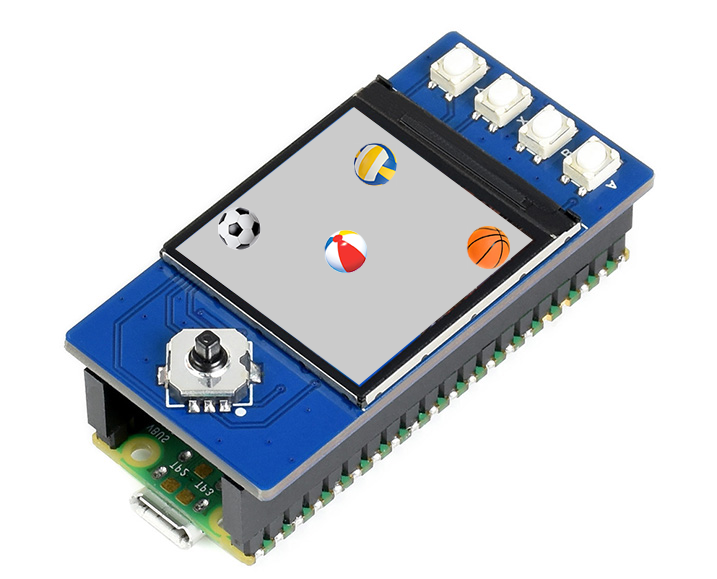
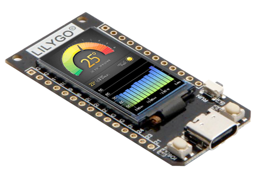
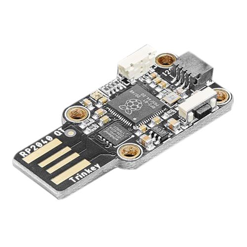
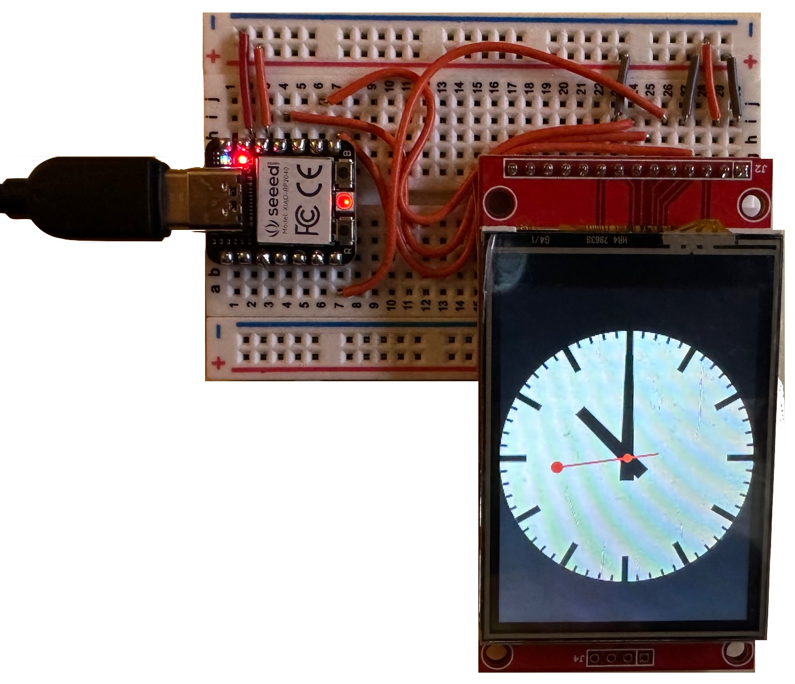

# Getting Started with Raspberry Pi Pico
Copyright 2021-2023 Moddable Tech, Inc.<BR>
Revised: March 28, 2023

This document describes how to start building Moddable applications for the Raspberry Pi Pico. It provides information on how to configure host build environments, how to build and deploy apps, and includes links to external development resources.

> Note: The Pico port is solid and mostly complete. Possible future work includes:
> 
> - Mods
> - Audio
> - JavaScript Atomics
> - Web Workers making use of the second core
> - PIO integration
> - Building on Windows

## Table of Contents

- [About Raspberry Pi Pico](#about-pico)
- [Overview](#overview)
- [Platforms](#platforms)
- [macOS](#mac)
  - [SDK and Host Environment Setup - macOS](#macos-setup)
  - [Building and Deploying apps - macOS](#macOS-building-and-deploying-apps)
- [Windows](#win)
  - [SDK and Host Environment Setup - Windows](#windows-setup)
  - [Building and Deploying apps - Windows](#windows-building-and-deploying-apps)
- [Linux](#lin)
  - [SDK and Host Environment Setup - Linux](#linux-setup)
  - [Building and Deploying apps - Linux](#linux-building-and-deploying-apps)
- [Debugging Native Code](#debugging-native-code)
- [Reference Documents](#reference)

<a id="about-pico"></a>
## About Raspberry Pi Pico and Pico W


Please see the [Raspberry Pi Pico documentation](https://www.raspberrypi.org/documentation/pico/getting-started/) for details.

<a id="overview"></a>
## Overview

Before you can build applications, you need to:

- Install the Moddable SDK and build its tools
- Install the required development tools for the Raspberry Pi Pico platform

The instructions below will have you verify your setup by running the `helloworld` example on your device using `mcconfig`, a command line tool that builds and runs Moddable applications.

> See the [Tools documentation](./../tools/tools.md) for more information about `mcconfig`


When building with `mcconfig`, you specify your device target by providing the **platform identifier** of your development board to the `-p` argument. For example, use the following command to build for the Pico Display:

```text
mcconfig -d -m -p pico/pico_display
```

A list of available Pico subplatforms and their platform identifiers is provided in the **Platforms** section below.

<a id="platforms"></a>
## Platforms

### Pico

The Raspberry Pi Pico has the following features:

- RP2040 microcontroller running up to 133 MHz
- Dual-core ARM Cortex M0+
- 264 KB RAM
- 2 MB flash

The Moddable SDK supports devices built with the Pico. The following table lists each device, its platform identifier, a list of key features specific to the device, and links to additional resources.

| Name | Platform identifier | Key features | Links |
| :---: | :--- | :--- | :--- |
| <BR>Rasberry Pi<BR>Pico | `pico` | LED, 26 external pins  | <li>[Raspberry Pi Pico documentation](https://www.raspberrypi.org/documentation/pico/getting-started/)</li> |
| <BR>Rasberry Pi<BR>Pico W | `pico/pico_w` | Wi-Fi, LED, 26 external pins  | <li>[Raspberry Pi Pico documentation](https://www.raspberrypi.org/documentation/pico/getting-started/)</li> |
| </a><BR>Pimoroni<BR>Pico Display | `pico/pico_display`<BR>`simulator/pico_display` | **1.4" IPS display**<BR>135 x 240<BR>16-bit color<BR>4 buttons<BR>RGB LED | <li>[Pimoroni Pico Display](https://pimoroni.com/picodisplay)</li> |
| </a><BR>Pimoroni<BR>Pico Display 2 | `pico/pico_display_2`<BR>`simulator/pico_display_2` | **2.0" IPS display**<BR>320 x 240<BR>16-bit color<BR>4 buttons<BR>RGB LED | <li>[Pimoroni Pico Display 2](https://shop.pimoroni.com/products/pico-display-pack-2-0)</li> |
| </a><BR>Waveshare<BR>Pico LCD 1.3 | `pico/pico_lcd_1.3` | **1.3" IPS display**<BR>240 x 240<BR>16-bit color<BR>4 buttons<BR>1 joystick | <li>[Waveshare Pico LCD 1.3](https://www.waveshare.com/wiki/Pico-LCD-1.3)</li> |
| </a><BR>Adafruit<BR>ItsyBitsy RP2040 | `pico/itsybitsy` | Neopixel, 1 button | <li>[Adafruit product page](https://www.adafruit.com/product/4888)</li> |
| </a><BR>LILYGO<BR>T-Display RP240 | `pico/lilygo_t_display` | **1.14" ST7789**, 2 buttons, red LED | <li>[LilyGO T-Display GitHub repository](https://github.com/Xinyuan-LilyGO/LILYGO-T-display-RP2040)</li> |
| </a><BR>Pimoroni<BR>PicoSystem | `pico/picosystem` | **1.54" IPS LCD**, 240 x 240, D-pad & 4 buttons, RGB LED | <li>[Pimoroni product page](https://shop.pimoroni.com/products/picosystem?variant=32369546985555)</li> |
| </a><br>Sparkfun<br>Pro Micro RP2040 | `pico/pro_micro` | Qwiic/STEMMA connector, Neopixel | <li>[Sparkfun product page](https://www.sparkfun.com/products/18288)</li> |
| </a><br>Adafruit<br>QT Py | `pico/qtpy` | STEMMA/Qwiic connector, Neopixel, 1 button | <li>[Adafruit product page](https://www.adafruit.com/product/4900)</li> |
| </a><br>Adafruit<br>Trinkey QT2040 | `pico/qt_trinkey` | STEMMA/Qwiic connector, Neopixel, 1 button | <li>[Adafruit product page](https://www.adafruit.com/product/5056)</li> |
| </a><br>Pimoroni<br>Tiny 2040 | `pico/tiny2040` | RGB LED, 1 button| <li>[Pimoroni product page](https://shop.pimoroni.com/products/tiny-2040?variant=39560012234835)</li> |
| </a><br>Seeed Studio<br>XIAO RP2040 | `pico/xiao_rp2040` | Neopixel | <li>[Seeed Studio product page](https://www.seeedstudio.com/XIAO-RP2040-v1-0-p-5026.html)</li> |
| </a><BR>ili9341 | `pico/xiao_ili9341` | ili9341 QVGA display<BR>320 x 240<BR>16-bit color | <li>[Generic 2.4" & 2.8" Displays (Resistive Touch) Wiring Guide - Pico](../displays/wiring-guide-generic-2.4-spi-pico.md)</li> |
| </a><BR>ili9341 | `pico/ili9341` | ili9341 QVGA display<BR>320 x 240<BR>16-bit color | <li>[Generic 2.4" & 2.8" Displays (Resistive Touch) Wiring Guide - Pico](../displays/wiring-guide-generic-2.4-spi-pico.md)</li> |

<a id="setup"></a>
## SDK and Host Environment Setup

<a id="mac"></a>

### macOS Setup

> Most of steps these are condensed from the [Raspberry Pi Pico C SDK][picosdkdoc] document. Refer to the document for details.

1. The [Moddable SDK Getting Started document](../Moddable%20SDK%20-%20Getting%20Started.md) describes how to configure the host build environment and install the required SDKs, drivers, and development tools. Follow the instructions in the [Host environment setup](https://github.com/Moddable-OpenSource/moddable/blob/public/documentation/Moddable%20SDK%20-%20Getting%20Started.md#host-mac) section for macOS.


2. Set up the Pico SDK
	Create a `pico` directory in your home directory at `~/pico` for required third party SDKs and tools.

	```text
	cd $HOME
	mkdir pico
	```

3. Install required components using `brew`.

	```text
	brew install cmake
	brew tap ArmMbed/homebrew-formulae
	brew install arm-none-eabi-gcc
	```

4. Set `PICO_GCC_ROOT` environment variable to point to the `bin` directory of your `arm-none-eabi` toolchain. For macOS, it is set to `brew --prefix`; typically this is `/usr/local` on x86_64 architecture and `/opt/homebrew` on arm64.

	```text
	export PICO_GCC_ROOT=$(brew --prefix)
	```

5. Install the __pico__ sdk and examples:

	```text
	cd $HOME/pico
	git clone -b 1.5.0 https://github.com/raspberrypi/pico-sdk
	cd pico-sdk
	git submodule update --init
	```

	```text
	cd $HOME/pico
	git clone -b sdk-1.5.0 https://github.com/raspberrypi/pico-examples
	```
	
6. Set the `PICO_SDK_DIR` environment variable to point to the Pico SDK directory:

	```text
	export PICO_SDK_DIR=$HOME/pico/pico-sdk
	```

7. Build some `pico` tools:

	```text
	cd $PICO_SDK_DIR
	mkdir build
	cd build
	cmake ..
	make
	```


<a id="macOS-building-and-deploying-apps"></a>
#### Building and Deploying Apps on macOS

After you've setup your macOS host environment, take the following steps to install an application on your Pico.

1. Build and deploy the app with `mcconfig`.

	`mcconfig` is the command line tool to build and launch Moddable apps on microcontrollers and the simulator. Full documentation of `mcconfig` is available [here](../tools/tools.md). 
	
	Specify the platform `-p pico` with `mcconfig` to build for the Pico. Build the [`helloworld`](../../examples/helloworld) example:
	
	```text
	cd $MODDABLE/examples/helloworld
	mcconfig -d -m -p pico
	```

The app will be built and installed. `xsbug` will be launched and connected to the Pico after a few seconds.

> Note: If the device is unresponsive, you may see this message:
>	
>	```text
>	Hold the BOOTSEL button and power-cycle the device.
>	Waiting for /Volumes/RPI-RPI2.....
>	```
>
>  Put the device into programming mode by holding the __BOOTSEL__ button when powering on the Pico.
>
>    You will know that programming mode is active when a disk named `RPI-RP2` appears on your desktop.


<a id="win"></a>

### Windows Setup

Not yet available.

<a id="win-building-and-deploying-apps"></a>
#### Building and Deploying Apps on Windows

Not yet available.


<a id="lin"></a>

### Linux setup

> Note: This setup was performed on a Ubuntu 20 VM using VirtualBox.

> Most of steps these are condensed from the [Raspberry Pi Pico C SDK][picosdkdoc] document. Refer to the document for details.

1. The [Moddable SDK Getting Started document](../Moddable%20SDK%20-%20Getting%20Started.md) describes how to configure the host build environment and install the required SDKs, drivers, and development tools. Follow the instructions in the [Host environment setup](https://github.com/Moddable-OpenSource/moddable/blob/public/documentation/Moddable%20SDK%20-%20Getting%20Started.md#lin-instructions) section for Linux.


2. Set up the Pico SDK

	Create a `pico` directory in your home directory at `~/pico` for required third party SDKs and tools.

	```text
	cd $HOME
	mkdir pico
	```

3. Install required components using `apt`.

	```text
	sudo apt update
	sudo apt install cmake gcc-arm-none-eabi libnewlib-arm-none-eabi build-essential
	```

4. Set `PICO_GCC_ROOT` environment variable to point to the `bin` directory of your `arm-none-eabi` toolchain. For Ubuntu 20, it is set to `/usr`.

	```text
	export PICO_GCC_ROOT=/usr
	```

5. Install the __pico__ sdk and examples:

	```text
	cd $HOME/pico
	git clone -b 1.5.0 https://github.com/raspberrypi/pico-sdk
	cd pico-sdk
	git submodule update --init
	```

	```text
	cd $HOME/pico
	git clone -b sdk-1.5.0 https://github.com/raspberrypi/pico-examples
	```
	
6. Set the `PICO_SDK_DIR` environment variable to point to the Pico SDK directory:

	```text
	export PICO_SDK_DIR=$HOME/pico/pico-sdk
	```

7. Build some `pico` tools:

	```text
	cd $PICO_SDK_DIR
	mkdir build
	cd build
	cmake ..
	make
	```


<a id="linux-building-and-deploying-apps"></a>
### Building and Deploying Apps on Linux

After you've setup your Linux host environment, take the following steps to install an application on your Pico.

1. Put the device into programming mode by holding the __BOOTSEL__ button when powering on the Pico.

	Make sure you're using a data-sync capable cable, not one that is power-only.

	> Note: a USB hub with power switch is very helpful here.

	You will know that programming mode is active when a disk named `RPI-RP2` appears on your desktop.
	
	

	> Note: For best results with a virtual machine, capture the Pico device in both the Boot mode state and running state. The image below shows the configuration in VirtualBox:
	
	

3. Build and deploy the app with `mcconfig`.

	`mcconfig` is the command line tool to build and launch Moddable apps on microcontrollers and the simulator. Full documentation of `mcconfig` is available [here](../tools/tools.md). 
	
	Specify the platform `-p pico` with `mcconfig` to build for the Pico. Build the [`helloworld`](../../examples/helloworld) example:
	
	```text
	cd $MODDABLE/examples/helloworld
	mcconfig -d -m -p pico
	```

The app will be built and installed. `xsbug` will be launched and connected to the Pico after a few seconds.


<a id="debugging-native-code"></a>
## Debugging Native Code

Refer to the [Getting Started With Pico][picogettingstarteddoc] for 
instructions on setting up your hardware.

These instructions have been tested on a macOS host using the two Pico SWD setup described in Appendix A: Using Picoprobe.

1. Build pico-openocd as described in the document.

2. In a console, start `openocd` and set the console aside.

	```text
	cd ~/pico/openocd
	~/pico/openocd/src/openocd -f interface/picoprobe.cfg -f target/rp2040.cfg -s tcl
	```

3. In another console, change the directory to the build results directory and start `gdb`:

	```text
	cd $MODDABLE/build/bin/pico/debug/<app>
	arm-none-eabi-gdb xs_pico.elf
	```

4. Connect to `openocd`. `load` the app. `reset` the device.

	```text
	(gdb) target remote localhost:3333
	(gdb) load
	(gdb) monitor reset init
	(gdb) continue
	```
	
<a id="reference"></a>
## Reference Documents

[Getting started with Raspberry Pi Pico][picogettingstarteddoc]

[Hardware Design with RP2040][picohwdoc]

[Raspberry Pi Pico C SDK][picosdkdoc]
	

[picogettingstarteddoc]:https://datasheets.raspberrypi.org/pico/getting-started-with-pico.pdf
[picohwdoc]:https://datasheets.raspberrypi.org/rp2040/hardware-design-with-rp2040.pdf
[picosdkdoc]:https://datasheets.raspberrypi.org/pico/raspberry-pi-pico-c-sdk.pdf

