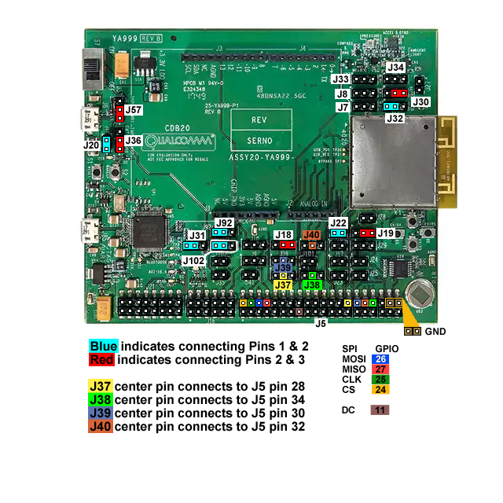
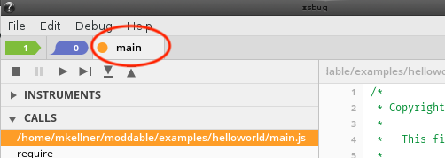

# Using the Moddable SDK with QCA4020
Copyright 2016-2020 Moddable Tech, Inc.<BR>
Revised: December 1, 2020

This document describes how to set up and build Moddable applications for the Qualcomm QCA4020 series processors.


## Table of Contents

* [About QCA4020](#about-qca4020)
* [Development workflow](#development-workflow)
* [Getting Started](#getting-started)
  * [Linux host environment setup](#linux-host-environment-setup)
  * [Install the QCA4020 SDK](#install-the-qca4020-sdk)
  * [Set environment variables](#environment-variables)
  * [ARM Toolchain setup](#arm-toolchain-setup)
* [SDK Setup](#sdk-setup)
  * [FreeRTOS Setup](#freertos-setup)
  * [Build QuRT](#build-qurt)
  * [Build FreeRTOS](#build-freertos)
  * [Install OpenOCD](#install-openocd)
  * [Modify device configuration for debugging](#modify-device-configuration-for-debugging)
  * [Adjust link map](#adjust-link-map)
  * [Adjust stack size](#adjust-stack-size)
* [Linux Build and Deploy](#linux-build-and-deploy)
  * [Build Moddable tools for Linux](#build-moddable-tools-for-linux)
  * [Build Moddable app](#build-moddable-app)
  * [Flash to device](#flash-to-device)
* [Debugging](#debugging)
  * [Start xsbug](#start-xsbug)
  * [Launch gdb](#launch-gdb)
  * [Boot to app](#boot-to-app)
* [Notes and troubleshooting](#notes-and-troubleshooting)
* [Example apps with QCA4020 support](#example-apps-with-qca4020-support)

* [Reference Documentation](#reference-documentation)


## About QCA4020

The Qualcomm QCA4020 is an low-powered ARM-based SoC with Bluetooth and Wi-Fi support.

A [Qualcomm Developer Network][devNet] account is required to download the Qualcomm QCA4020 SDK. Moddable supports SDK version 3.x.

Moddable supports FreeRTOS on the QCA4020 Customer Development Board (CDB) using a Linux host build platform.

The build platform `-p qca4020/cdb` is used to target the CDB development board powered by the QCA4020.

## Development workflow

After the initial host setup, there are four major steps to build and deploy a Moddable application for the QCA4020.

1. The application, assets, modules and XS runtime are built into an archive using the `mcconfig` tool. This produces a `xs_qca4020.a` archive file.

2. Build the small launcher application which includes the `xs_qca4020.a` archive and the Qualcomm libraries.

3. Flash the application to the board.

4. Use `gdb` to launch and debug the native portion of your application. Use `xsbug` to debug your ECMAScript application. 

## Getting Started

### Linux host environment setup

> The Moddable SDK has been tested on 16.04 LTS (64-bit), 18.04.1 (64-bit) and Raspberry Pi Desktop (32-bit) operating systems. These setup instructions assume that a host GCC toolchain has already been installed.

Set up the Linux environment as described in the [Moddable SDK - Getting Started][modStart] guide.

#### Install the QCA4020 SDK

Download the [Qualcomm QCA4020 SDK version 3.0][sdk3] from the Qualcomm Developer Network's [Tools & Resources - QCA4020][tools] page.

Decompress the SDK file into a `~/qualcomm` directory making:

```text
/home/<user>/qualcomm/qca4020
```
	
The `qca4020` directory should contain a `target/` subdirectory.

#### Environment variables

Export required build environment variables:

```text
export SDK=/home/<user>/qualcomm/qca4020/target
export CHIPSET_VARIANT=qca4020
export RTOS=freertos
export BOARD_VARIANT=cdb
export QCA_GCC_ROOT=/usr/local/bin/gcc-arm-none-eabi-6-2017-q2-update
```

Update the `PATH` environment variable to include the SDK `cortex-m4` target directory:

```text
export PATH=$PATH:$SDK/bin/cortex-m4
```

#### Arm toolchain setup

Download [version 6.2 (Linux, 64-bit)][armtoolslink] of the GNU embedded toolchain for ARM-based processors from the [Arm Developer Site][armdevsite] 

Update the `PATH` environment variable to include the toolchain installation path:

```text
export PATH=$PATH:/usr/local/bin/gcc-arm-none-eabi-6-2017-q2-update/bin/
```

###### Ref: [B] Development Kit User Guide - section 3.2

#### FreeRTOS setup

Download **FreeRTOS**:

```text
cd ~/qualcomm
git clone https://source.codeaurora.org/external/quartz/FreeRTOS
cd FreeRTOS
git checkout v8.2.1
```

Download the **QuRT** RTOS abstraction layer:

```text
cd ~/qualcomm
git clone https://source.codeaurora.org/external/quartz/ioe/qurt
```

> Note: You may get an warning here. Continue.
	
```text
cd qurt
git checkout v2.0
```

##### Configure FreeRTOS

The FreeRTOS configuration file is located here:

```text
~/qualcomm/FreeRTOS/1.0/FreeRTOS/Demo/QUARTZ/FreeRTOSConfig.h
```

Change the following config values:

```text
#define configTICK_RATE_HZ        ( ( TickType_t )  1000)
#define configTOTAL_HEAP_SIZE     ( ( size_t ) 0x13000) )
```

> Note: If you change the ```configTOTAL_HEAP_SIZE ```, you will need to change ```RTOS_HEAP_SIZE``` in the **DefaultTemplateLinkerScript.ld** as described below. You will also need to rebuild **qurt** and **FreeRTOS** and copy them into the proper place, also described below.

To assist in development, you may want to enable two additional configuration values to trigger 'C' callbacks for stack overflow and out of memory conditions.

To trigger the `vApplicationStackOverflowHook()` callback in `$MODDABLE/build/devices/qca4020/xsProj/src/main.c` on a stack overflow, change the following config value:

```text
#define configCHECK_FOR_STACK_OVERFLOW  2
```

To trigger the `vApplicationMallocFailedHook()` callback when memory allocation fails, change the following config value:
		
```text
#define configUSE_MALLOC_FAILED_HOOK    1
```

#### Build QuRT

###### Ref: [B] Development Kit User Guide - section 3.8

Build the **QuRT** RTOS abstraction layer and copy the libraries into place:

```text
cd ~/qualcomm/qurt/FreeRTOS/2.0
make all
cp output/qurt*.lib ~/qualcomm/qca4020/target/lib/cortex-m4IPT/freertos/
```

#### Build FreeRTOS

Build the FreeRTOS library and copy into place:

```text
cd ~/qualcomm/FreeRTOS/1.0/FreeRTOS/Demo/QUARTZ
make all
cp output/free_rtos.lib ~/qualcomm/qca4020/target/lib/cortex-m4IPT/freertos/
```

### Install OpenOCD

###### Ref: [B] Development Kit User Guide - section 3.7.2.1

[OpenOCD](http://openocd.org) is used to flash the binary to the QCA4020. 

Download [openocd-0.10.0](https://sourceforge.net/projects/openocd/files/openocd/0.10.0/) and build with the `--enable-ftdi` option. The location doesn't matter.

```text
cd open-ocd-0.10.0
./configure --enable-ftdi
make install
```

> Note: If there is an error `libusb-1.x not found...` install the `libusb-dev` package.

```text
sudo apt-get install libusb-1.0-0.dev
```

#### Modify device configuration for debugging

###### Ref: [B] Development Kit User Guide - section 3.7.2 (JTAG debug mode)

Make sure system sleep is disabled so that JTAG can connect on boot:

In the file `$MODDABLE/build/devices/qca4020/xsProj/src/export/DevCfg_master_devcfg_out_cdb.xml` change:

```text
<driver name="Sleep"> ...
	<props id="0x2" oem_configurable="false" type="0x00000002"> 1 </props>
```

to:

```text
<props ... > 0 </props>
```

Disable the watchdog so the application doesn't terminate in `err_jettison_core` while using `xsbug`. Same file as above:

Change:

```text
<props name="dog_hal_disable" type="0x00000002”> 0 </props>
```

to:

```text
<props name="dog_hal_disable" type="0x00000002”> 1 </props>
```
    
> Note: you will want to re-enable the watchdog before shipping.


### Adjust link map

The link map specifies where in memory the different components of your application will go. 

The QCA4020 allocates RAM to read-only memory (instructions and data), and read-write memory for each of the different operating modes of the chip. Moddable apps run primarily in the Full Operating Mode (***FOM***).

The QCA4020 also has flash memory that can be used to store data and code. Moddable stores resources, XS bytecode and static variables in flash. Application object code runs out of execute-in-place (***XIP***) memory.

We adjust link map values to give us more data space in RAM, and to move read-only data to flash.

In the file `MODDABLE/build/devices/qca4020/xsProj/src/export/DevCfg_master_devcfg_out_cdb.xml` change the following:

Disable **DEP** (data execution prevention) by setting the property value to 0:

```text
<props id="1" id_name="PLATFORM DEP ENABLE" oem_configurable="true" helptext="Enable or disable data execution prevention." type="0x00000002">
	0
</props>
```

Disabling DEP allows more RAM to be allocated by applications.

In the file `~/qualcomm/qca4020/target/bin/cortex-m4/freertos/DefaultTemplateLinkerScript.ld` do the following:

##### 1) Check `RTOS_HEAP_SIZE`

Make sure `RTOS_HEAP_SIZE` has the same value as the define `configTOTAL_HEAP_SIZE` in **FreeRTOSConfig.h** described above.

```text
RTOS_HEAP_SIZE = 0x13000;
```

> Note: When `configUSE_MALLOC_FAILED_HOOK` is defined in **FreeRTOSConfig.h**, the `vApplicationMallocFailedHook()` error handler is invoked. This can be used to determine if you need to allocate more memory to the FreeRTOS heap.

> `vApplicationMallocFailedHook()` is found in `$MODDABLE/build/devices/qca4020/xsProj/src/main.c`

##### 2) Move static data to Flash

Move your application's static data into flash (XIP):

```text
XIP_OEM_RO_REGION :
{
	*(XIP_OEM_RO_SECTION)
```

After this, add:

```text
	*(.flash*)
	*(.flash.rodata*)
```

##### 3) Allocate 40 KB to read-only memory and 262 KB RAM to data space 

###### Ref: 	(see similar in Document [C]: QCA402x (CDB2x) Programmers Guide - section 4.3.4 Resize application memory)

Change the `RAM_FOM_APPS_RO_MEMORY` and `RAM_FOM_APPS_DATA_MEMORY` origin and length values:

```text
RAM_FOM_APPS_RO_MEMORY   (RX) : ORIGIN = 0x10046000, LENGTH = 0x0a000
RAM_FOM_APPS_DATA_MEMORY (W)  : ORIGIN = 0x10050000, LENGTH = 0x40000
```

### Adjust stack size

If you encounter stack overflows, the stack size of the XS task can be increased by changing `xsMain_THREAD_STACK_SIZE` in `$MODDABLE/build/devices/qca4020/base/xsmain.c`.

> Note: When `configCHECK_FOR_STACK_OVERFLOW` is set to **2** in **FreeRTOSConfig.h**, the `vApplicationStackOverflowHook()` error handler is invoked.

> `vApplicationStackOverflowHook()` is found in `$MODDABLE/build/devices/qca4020/xsProj/src/main.c`


## Linux build and Deploy

### Build Moddable tools for Linux

Build Moddable tools for Linux (if you haven't already):

```text
cd $MODDABLE/build/makefiles/lin
make
```

### Build Moddable app

Build the Moddable `helloworld` app:

```text
cd $MODDABLE/examples/helloworld
mcconfig -d -m -p qca4020/cdb
```

> The `mcconfig` tool builds the application and generates the `xs_qca4020.a` archive, which contains the app, any assets and the XS runtime.

You will need to set some environment variables to configure the stub application build:

```text
export APP_NAME=helloworld
export DEBUG=1
```

> Note: The `APP_NAME` environment variable value must match the name of the application being built.

Build the stub application to link in the qca4020 libraries and *main.c*.
	
```text
cd $MODDABLE/build/devices/qca4020/xsProj/build/gcc
make
```

### Flash to device
###### Ref: [B] Development Kit User Guide - section 3.6 (Linux Flash)

> Note: Flashing takes a long time (over 3 minutes running Ubuntu in a MacOS VirtualBox) with a _lot_ of output on the console.

#### Ensure the jumpers are configured properly:



Make sure jumper is on J31 1&2 and reset the board. If J31 is removed, the board will boot directly into the app.

```text
Pin Configuration for JTAG GPIO 53:50

To use JTAG3 (which doesn't conflict with SPI):

// JTAG bootstrap
J30 Connect pins 2 and 3 for JTAG    (GPIO_25 low)
J32 Connect pins 1 and 2 for JTAG    (GPIO_18 high)

// JTAG 
J37 pin 2 Connect J5 pin 28 (JTAG TCK)
J38 pin 2 Connect J5 pin 34 (JTAG TDI)
J39 pin 2 Connect J5 pin 30 (JTAG TDO)
J40 pin 2 Connect J5 pin 32 (JTAG TMS)
```

#### Flash to device

The development board should be connected and powered on. The lower USB port is used to connect to Linux.

> Note: When you plug in the cdb board, two USB devices will be made available to Linux: `/dev/ttyUSB0` and `/dev/ttyUSB1`. The first will be captured by OpenOCD and `/dev/ttyUSB1` will be used to connect to `xsbug`.

Navigate to the project build directory and run the flash tool:

```text
cd $MODDABLE/build/devices/qca4020/xsProj/build/gcc
sh flash_openocd.sh
```

> Note: the flash tool launches **openocd** and leaves it running. This is helpful as we will need it running later for `gdb`.


### Debugging

#### Start xsbug

In another terminal window, launch `xsbug` and `serial2xsbug`:

```text
xsbug &
serial2xsbug /dev/ttyUSB1 115200 8N1
```

> `xsbug` is used to debug the ECMAScript side of your application. `serial2xsbug` provides a serial to network socket bridge between the QCA4020 CDB and the `xsbug` debugger.
     
#### Launch gdb

Navigate to the project build directory and launch `gdb`:

```text
cd $MODDABLE/build/devices/qca4020/xsProj/build/gcc
arm-none-eabi-gdb -x v2/quartzcdb.gdbinit
```

> `gdb` is used to debug the native 'C' portion of your application.

A considerable amount of output will appear on the screen. At the `(gdb)` prompt type `c` to continue three times to launch the app. You can also set breakpoints, view source and variables, etc...

`xsbug` will show the connection is made and the application should start.



You can now run and debug your application.

#### Boot to app

If you would like to boot directly to your application without having to launch and use `gdb`:

Disconnect jumper on J31 between pins 1 & 2 and reset the board.

The board will boot into the app instead of waiting for `gdb`.

> Note: if you have a debug build, your application will still try to connect to `xsbug` at startup. If it cannot connect, it will proceed to launch. You can continue to debug your application without using `gdb`.


### Notes and troubleshooting

* `xsbug` needs to be running before `serial2xsbug` is started.

* Use bash aliases or other scripts to make your life easier. For example:

```text
	alias killocd='killall openocd'
	alias doocd='killall openocd; openocd -f qca402x_openocd.cfg'
	alias dogdb='arm-none-eabi-gdb -x v2/quartzcdb.gdbinit'
```

* You will need to restart `serial2xsbug` if you disconnect the board or shut down the virtual usb interface.

* When the device crashes and you want to restart your debug session, you will need to restart **gdb**.

   - You may also need to kill and restart openocd

```text
		killall openocd; openocd -f qca402x_openocd.cfg
```

* Press the Reset button (near **J20**) before reflashing.

* The upper USB port near the switch is for Windows connection. Do not use this port with a Linux Host.

* The lower USB port provides JTAG connection (`/dev/ttyUSB0` for JTAG and `/dev/ttyUSB1` for serial output (and `xsbug`)


## Example apps with QCA4020 support

App | Feature 
--- | ------- 
[helloworld](https://github.com/Moddable-OpenSource/moddable/tree/public/examples/helloworld) | xsbug 
[timers](https://github.com/Moddable-OpenSource/moddable/tree/public/examples/base/timers) | timers
[files](https://github.com/Moddable-OpenSource/moddable/tree/public/examples/files/files) | file I/O
[preference](https://github.com/Moddable-OpenSource/moddable/tree/public/examples/files/preference) | persistent preferences
[networkpromises](https://github.com/Moddable-OpenSource/moddable/tree/public/examples/js/networkpromises) | Asynchronous network operations using JavaScript promises
[network/ble/advertiser](https://github.com/Moddable-OpenSource/moddable/tree/public/examples/network/ble/advertiser) | BLE advertising
[network/ble/colorific](https://github.com/Moddable-OpenSource/moddable/tree/public/examples/network/ble/colorific) | BLE client
[network/ble/discovery](https://github.com/Moddable-OpenSource/moddable/tree/public/examples/network/ble/discovery) | BLE service/characteristic discovery
[network/ble/heart-rate-server](https://github.com/Moddable-OpenSource/moddable/tree/public/examples/network/ble/heart-rate-server) | BLE peripheral
[network/ble/security-client](https://github.com/Moddable-OpenSource/moddable/tree/public/examples/network/ble/security-server) | BLE client encryption and pairing
[network/ble/security-server](https://github.com/Moddable-OpenSource/moddable/tree/public/examples/network/ble/security-server) | BLE peripheral encryption and pairing
[network/ble/wifi-connection-server](https://github.com/Moddable-OpenSource/moddable/tree/public/examples/network/ble/wifi-connection-server) | Wi-Fi access point connection via BLE
[httpgetjson](https://github.com/Moddable-OpenSource/moddable/tree/public/examples/network/http/httpgetjson) | HTTP client, JSON parsing
[httpserver](https://github.com/Moddable-OpenSource/moddable/tree/public/examples/network/http/httpserver) | HTTP server
[httpsgetstreaming](https://github.com/Moddable-OpenSource/moddable/tree/public/examples/network/http/httpsgetstreaming) | streaming secure HTTP client
[network/ping](https://github.com/Moddable-OpenSource/moddable/tree/public/examples/network/ping) | network ping
[socketreadwrite](https://github.com/Moddable-OpenSource/moddable/tree/public/examples/network/socket/socketreadwrite) | network socket read/write
[wifiaccesspoint](https://github.com/Moddable-OpenSource/moddable/tree/public/examples/network/wifi/wifiaccesspoint) | configure device as Wi-Fi access point
[wifiscan](https://github.com/Moddable-OpenSource/moddable/tree/public/examples/network/wifi/wifiscan) | scan for Wi-Fi access points
[piu/balls](https://github.com/Moddable-OpenSource/moddable/tree/public/examples/piu/balls) | animation on ili9341
[piu/cards](https://github.com/Moddable-OpenSource/moddable/tree/public/examples/piu/cards) | animation on ili9341
[images](https://github.com/Moddable-OpenSource/moddable/tree/public/examples/piu/images) | animation, image decompression
[mini-weather](https://github.com/Moddable-OpenSource/moddable/tree/public/examples/piu/mini-weather) | Piu application to fetch weather conditions
[text](https://github.com/Moddable-OpenSource/moddable/tree/public/examples/piu/text) | text rendering

### CDB20 SPI display wiring for ILI9341 display driver

The following pinout table and image describe the connections required to support a SPI display on the `CDB20` board.

| Screen pin | CDB20 header / pin number| GPIO
| --- | --- | :--- |
| `SDO (MISO)` | `J5 / 8` | 27
| `LED (3.3V)` | `J1 / 4` | N/A
| `SCK (CLK)` | `J5 / 4` | 25
| `SDI (MOSI)` | `J5 / 6` |  26
| `RESET` | `J1 / 4` | N/A
| `CS` | `J5 / 2` | 24
| `DC` | `J5 / 15` | 11
| `GND` | `J5 / 40` | N/A
| `VCC` | `J1 / 4` | N/A


### Reference Documentation

Documentation for the QCA4020 can be found on the [Qualcomm Developer Network][devNet]. You will need to be logged in to access these files.

Of particular interest and referenced earlier in this document are:

[A] [QAPI Specification][A]

Contains the API Documentation

[B] [Development Kit User Guide][B]

Describes setting up the SDK, development environment, how to flash and debug. Also describes board jumper settings.

[C] [QCA402x (CDB2x) Programmers Guide][C]

Contains an overview, networking features, programming model, memory model, etc. GPIO configuration and interfaces

### Reference Sites

[Qualcomm Developer Network][devNet]

[QCA4020 SDK v3][sdk3]

[QCA4020 Tools][tools]

[Arm Developer GNU-ARM Downloads][armdevsite]

[gcc-arm-none-eabi version 6.2 (Linux, 64-bit)][armtoolslink]

[Moddable Getting Started Guide][modstart]

[A]: https://developer.qualcomm.com/download/qca4020-qca4024/qca402x-qapi-specification.pdf
[B]: https://developer.qualcomm.com/download/qca4020-qca4024/qca402x-cdb2x-development-kit-user-guide.pdf
[C]: https://developer.qualcomm.com/download/qca4020-qca4024/qca402x-cdb2x-programmers-guide.pdf
[devnet]: https://developer.qualcomm.com/hardware/qca4020-qca4024/tools-qca4020
[sdk3]:https://developer.qualcomm.com/download/qca4020-qca4024/qca4020or11-qca-oem-sdkcdb.zip
[tools]:https://developer.qualcomm.com/hardware/qca4020-qca4024/tools-qca4020
[armdevsite]:https://developer.arm.com/open-source/gnu-toolchain/gnu-rm/downloads
[armtoolslink]:https://developer.arm.com/-/media/Files/downloads/gnu-rm/6-2017q2/gcc-arm-none-eabi-6-2017-q2-update-linux.tar.bz2
[modstart]: https://github.com/Moddable-OpenSource/moddable/blob/public/documentation/Moddable%20SDK%20-%20Getting%20Started.md
