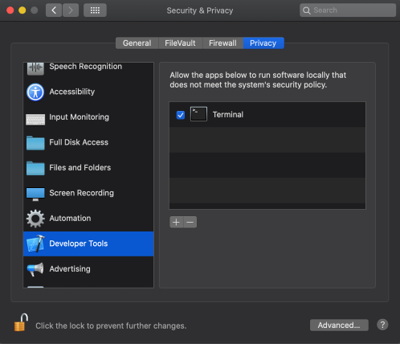

# Using the Moddable SDK with Zephyr

Copyright 2025 Moddable Tech, Inc.<BR>
<!-- Revised: -->

This docuemnt is a guide to building apps with the Zephyr SDK.

## Table of Contents

* [Overview](#overview)
* [Platforms](#platforms)
	* [zephyr](#platforms-zephyr)
* [Build Types](#builds)
	* [Debug](#build-debug)
	* [Instrumented](#build-instrumented)
	* [Release](#build-release)
* Setup instructions

    | [](#mac) | [](#win) | [](#lin) |
    | :--- | :--- | :--- |
    | •  [Installing](#mac-instructions)<BR>•  [Troubleshooting](#mac-troubleshooting) | •  [Installing](#win-instructions)<BR>•  [Troubleshooting](#win-troubleshooting) | •  [Installing](#lin-instructions)<BR>•  [Troubleshooting](#lin-troubleshooting)

* [Troubleshooting](#troubleshooting)
* [Debugging Native Code](#debugging-native-code)

<a id="overview"></a>
## Overview

Before you can build applications, you need to:

- Install the Moddable SDK and build its tools
- Install the Zephyr SDK and Tools

The instructions below will have you verify your setup by running the `helloworld` example on your device using `mcconfig`, the command line tool to build and run applications using the Moddable SDK.

> See the [Tools documentation](./../tools/tools.md) for more information about `mcconfig`


To build for a Zephyr board,  run `mcconfig` with `zephyr/<board>` for the **platform identifier**. For example, to build for the ST Nucleo L4A6ZG:

```text
mcconfig -d -m -p zephyr/nucleo_l4a6zg
```

Zephyr supports many boards. To add Moddable support for a board that has not yet been tested, see [Adding a new board](#new-board).

<a id="builds"></a>
## Build Types
The Zephyr supports three kinds of builds: debug, instrumented, and release. Each is appropriate for different stages in the product development process. You select which kind of build you want from the command line when running `mcconfig`.

<a id="build-debug"></a>
### Debug
A debug build is used for debugging JavaScript. In a debug build, the device will attempt to connect to xsbug at startup over USB or serial depending on the device configuration. Symbols will be included for native gdb debugging.

The `-d` option on the `mcconfig` command line selects a debug build.

<a id="build-instrumented"></a>
### Instrumented
An instrumented build is used for debugging native code. In an instrumented build, the JavaScript debugger is disabled. The instrumentation data usually available in xsbug is output to the serial console once a second. Deep sleep APIs are available in an instrumented build.

The `-i` option on the `mcconfig` command line selects an instrumented build.

<a id="build-release"></a>
### Release
A release build is for production. In a release build, the JavaScript debugger is disabled, instrumentation statistics are not collected, and serial console output is suppressed. Deep sleep APIs are available in a release build.

Omitting both the `-d` and `-i` options on the `mcconfig` command line selects a release. Note that `-r` specifies display rotation rather than selecting a release build.


<a id="setup"></a>
<a id="mac"></a>
## macOS

The Moddable SDK build for Zephyr currently uses the Zephyr SDK v4.2.0-rc1 (commit `ffb28eed`).

<a id="mac-instructions"></a>
### Installing

1. Install the Moddable SDK tools by following the instructions in the [Getting Started document](./../Moddable%20SDK%20-%20Getting%20Started.md).

2. Create an `zephyrproject` directory in your home directory at `~/zephyrproject ` for required third party SDKs and tools.
	
	```
	mkdir ~/zephyrproject
	cd ~/zephyrproject
	```

3. If you use macOS Catalina (version 10.15) or later, add an exemption to allow Terminal (or your alternate terminal application of choice) to run software locally that does not meet the system's security policy. Without this setting, the precompiled GNU Arm Embedded Toolchain downloaded in the next step will not be permitted to run.

    To set the security policy exemption for Terminal, go to Security & Privacy System Preferences, select the Privacy tab, choose Developer Tools from the list on the left, and then tick the checkbox for Terminal or the alternate terminal application from which you will be building Moddable SDK apps. The end result should look like this:

    

4. Install Zephyr requirements:
	
	```
	brew install cmake ninja gperf python3 python-tk ccache qemu dtc libmagic wget openocd
	```

5. Create a new virtual environment (one time):
	
	```
	python3 -m venv ~/zephyrproject/.venv
	```

6. Activate the virtual environment (for each new shell):
	
	```
	source ~/zephyrproject/.venv/bin/activate
	```
> Note: You can deactivate the environment at any time by running `deactivate`

7. Install the `west` tool:
	
	```
	pip install west
	```

8. Get the Zephyr SDK
	
	```
	west init ~/zephyrproject
	cd ~/zephyrproject
	west update
	```
<!--
is exporting a Zephyr CMake package necessary?
-->

9. The Zephyr west extension command, west packages can be used to install Python dependencies.
	
	```
	west packages pip --install
	```

10. Install the Zephyr SDK
	
	```
	cd ~/zephyrproject/zephyr
	west sdk install
	```

11. Verify Zephyr SDK installation
	To ensure the SDK and tools are installed properly, build the `blinky` sample for your board:
	
	```
	west build -p always -b nucleo_l4a6zg samples/basic/blinky
	```

11. Verify the complete setup by building `helloworld` for your device target:

    ```text
    cd ${MODDABLE}/examples/helloworld
    mcconfig -d -m -p zephyr/nucleo_l4a6zg
    ```

12. To use `xsbug`
	
	a. Start xsbug:
	
	```text
	open $MODDABLE/build/bin/mac/release/xsbug.app
	```
	
	b. Start serial2xsbug, using the serial port of the console on your device:
	
	> Note: currently configured for 115200 baud
	
	```
	serial2xsbug /dev/cu.usbmodem114433 115200 8N1
	```

13. Deploy the zephyr application to your device:
	
	```
	mcconfig -d -m -p zephyr/nucleo_l4a6zg -t deploy
	```

14. The device should connect to xsbug and stop at the `debugger` statement.


<a id="mac-troubleshooting"></a>
### Troubleshooting


<a id="win"></a>
## Windows

<a id="win-instructions"></a>
### Installing

*Not yet supported*


<a id="lin"></a>
## Linux

<a id="lin-instructions"></a>
### Installing

*Not yet supported*

<a id="debugging-native-code"></a>
### Debugging Native Code

As with all Moddable platforms, you can debug script code using `xsbug` over the USB serial interface with the Zephyr device. For more information, see the [`xsbug` documentation](../xs/xsbug.md).

For native code source level debugging, you can use [GDB](https://www.gnu.org/software/gdb/documentation/).

Use the `-t debug` target to start the debugger:

```
mcconfig -d -m -p zephyr/nucleo_l4a6zg -t debug
```

> Note: if you receive this error, you may have to start `openocd` in another window if the gdb connection fails. We have encountered this on the Nucleo L4A6ZG board running with a MacOS host.

```
:3333: Operation timed out.
You can't do that when your target is `exec'
```

Start openocd:

```
> openocd -s ~/zephyrproject/zephyr/boards/st/nucleo_l4a6zg/support
```

and try to build the `-t debug` target.

```
mcconfig -d -m -p zephyr/nucleo_l4a6zg -t debug
```