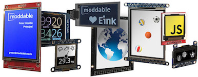

# Moddable SDK - Display Guides
Copyright 2019 Moddable Tech, Inc. 
Revised: June 20, 2019

This folder contains guides to connect a variety of SPI displays to the ESP8266 and ESP32. Each guide contains:

- General information about the display
- Links to the source code for the corresponding display and touch drivers 
- A wiring guide
- A build command to run an example app to test your wiring

Video demonstrations of these displays are [on the Moddable website](http://www.moddable.com/display). 

> Note: Although the guides in this folder are for the ESP8266 and ESP32, the examples and drivers are platform-independent and will run on any microcontroller the Moddable SDK is ported to.
