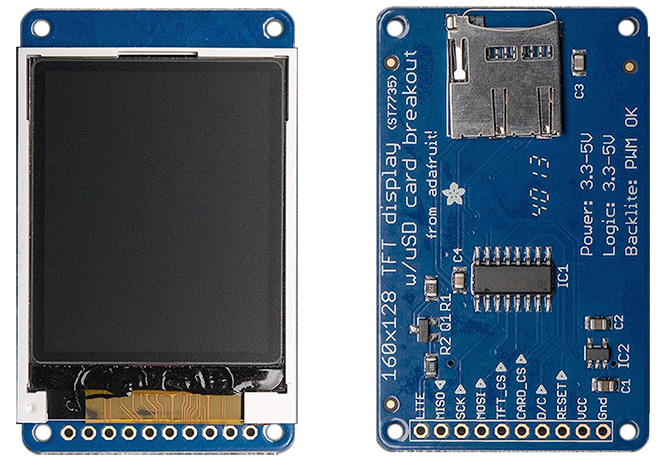
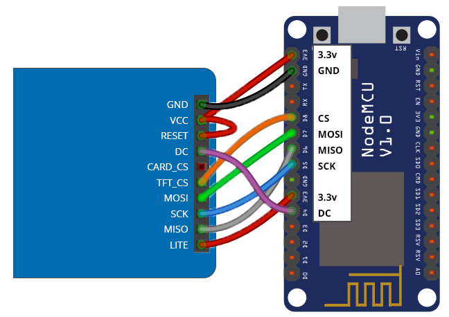

# Adafruit 1.8" ST7735 Wiring Guide
Copyright 2018 Moddable Tech, Inc.<BR>
Revised: December 10, 2018



## Specs

| | |
| :---: | :--- |
| **Part** | Adafruit Product ID: 2088 
| **Size** | 1.8", 128 × 160
| **Type** | TFT LCD
| **Interface** | SPI
| **Drivers** | video [ST7735](../../documentation/drivers/st7735/st7735.md), no touch
| **Availability** | [Adafruit 1.8" Color TFT LCD Display](https://www.adafruit.com/product/358)<BR>[HiLetgo 1.8" ST7735R](https://www.amazon.com/gp/product/B00LSG51MM/)
| **Description** | Colorful, bright display wtih 4-wire SPI.


## Moddable example code

The [balls](../../examples/piu/balls/) example is good for testing this display.  To run a debug build, use the following build command:

```
cd $MODDABLE/examples/piu/balls
mcconfig -d -m -p esp/adafruit_st7735
```

## ESP8266 Pinout

| Adafruit 1.8" TFT | ESP8266 | ESP8266 Devboard label
| --- | --- | --- |
| LITE | 3.3v | 
| MISO | GPIO 12 | (D6)
| SCK | GPIO 14 | (D5)
| MOSI | GPIO 13 | (D7)
| TFT_CS | GPIO 15| (D8)
| DC | GPIO 2 | (D4)
| RESET | 3.3v  | 
| VCC| 3.3v | 
| GND | GND | 



