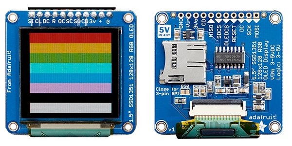
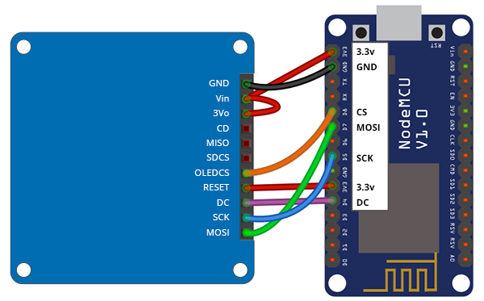

# Adafruit OLED Display Wiring Guide
Copyright 2018 Moddable Tech, Inc.<BR>
Revised: October 23, 2018



## Specs

| | |
| :---: | :--- |
| **Part** | Adafruit Product ID: 1431 
| **Size** | 1.5", 128 × 128
| **Type** | OLED
| **Interface** | SPI
| **Drivers** | video [SSD1351](../../documentation/drivers/ssd1351/ssd1351.md), no touch
| **Availability** | [1.5" OLED Breakout Board](https://www.adafruit.com/product/1431)
| **Description** | Excellent color, small OLED.
 

## Moddable example code

The [countdown](../../examples/piu/countdown/) example is good for testing this display. To run a debug build, use the following build command:

```
cd $MODDABLE/examples/piu/countdown
mcconfig -d -m -p esp/adafruit_oled
```

## ESP8266 pinout

| Adafruit OLED | ESP8266 | ESP8266 Devboard label
| --- | --- | --- |
| GND | GND | 
| VIN | 3.3v | 
| 3Vo | 3.3v | 
| OLEDCS | GPIO 15| (D8)
| RESET | 3.3v  | 
| DC | GPIO 2 | (D4)
| SCK | GPIO 14 | (D5)
| MOSI | GPIO 13 | (D7)



