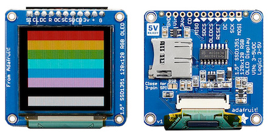

# Wiring Guides for Moddable supported SPI displays

Copyright 2018 Moddable Tech, Inc.  
Revised: January 2, 2018


## Adafruit OLED display
**Part:** Adafruit Product ID: 1431 

**Size:** 1.5", 128 × 128

**Type:** OLED

**Interface:** SPI

**Drivers:** video [SSD1351](../../documentation/drivers/ssd1351/ssd1351.md), No touch

**Availability:** [1.5" OLED Breakout Board] (https://www.adafruit.com/product/1431)

**Description:** Excellent color, small OLED. 


**Moddable Sample code:** The Piu example [transitions](../../examples/piu/transitions/) is good for testing this display. The build command below includes the -d, debug flag.

```
cd $MODDABLE/examples/piu/transitions
mcconfig -d -m -r 0 -f rgb332 -p esp screen=ssd1351 touch="" 
```


**ESP8266 Pinout:**

| Adafruit OLED | ESP8266 | ESP8266 Devboard label
| --- | --- | --- |
| GND | GND | 
| VIN | 3.3v | 
| 3Vo | 3.3v | 
| OLEDCS | GPIO 15| (D8)
| RESET | 3.3v  | 
| DC | GPIO 2 | (D4)
| SCK | GPIO 14 | (D5)
| MOSI | GPIO 13 | (D7)


