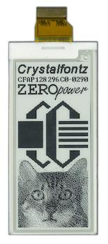

# Crystalfontz ePaper Display Wiring Guide
Copyright 2018 Moddable Tech, Inc.<BR>
Revised: October 23, 2018



## Specs

| | |
| :---: | :--- |
| **Part** | CFAP128296C0-0290 ([datasheet](https://www.crystalfontz.com/products/document/3660/CFAP128296C0-0290DatasheetReleaseDate2017-08-14.pdf))
| **Size**  | 2.9" 128x296 
| **Type** | EPD (Electronic Paper Displays)
| **Interface** | SPI
| **Drivers** | video [destm32s](../../documentation/drivers/destm32s/destm32s.md), no touch
| **Availability** | [128x296 ePaper Display](https://www.crystalfontz.com/product/cfap128296c00290-128x296-epaper-display-eink)
| **Description** | This is a TFT active matrix electrophoretic display (ePaper/E-Ink) with 1-bit white/black full display capabilities.<BR><BR>One benefit of this display is very low power consumption. The only time you need to provide power to this ePaper module is while updating the display. Once the image is displayed you can remove the power source and the display will continue to display the image appropriately.<BR><BR>We used the destm32s adaptor board to interface with the display. See: Crystalfontz part CFAP128296C0-E1-1 on the [display product](https://www.crystalfontz.com/product/cfap128296c00290-128x296-epaper-display-eink) page.

## Moddable example code

The [love-e-ink](../../examples/piu/love-e-ink/) example is good for testing this display. To run a debug build, use the following build command:

```
cd $MODDABLE/examples/piu/love-e-ink/
mcconfig -d -m -p esp/crystalfontz_monochrome_epaper -r 270
```

## ESP8266 pinout

| eInk Display | ESP8266 | ESP8266 Devboard label
| --- | --- | --- |
| 3 - GND | GND | 
| 5 - 3.3v | 3.3v | 
| 13 - SCK | GPIO 14 | (D5)
| 14 - SDI | GPIO 13 | (D7)
| 15 - DC | GPIO 2 | (D4) 
| 16 - CS | GPIO 4 | (D2) 
| 17 - BUSY | GPIO 5 | (D1)
| 18 - Reset | 3.3v |
| 19 - BUSSEL | GND |  
 


