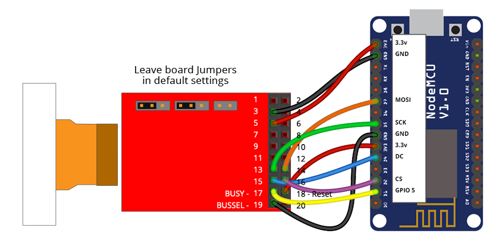

# Wiring Guides for Moddable supported SPI displays

Copyright 2018 Moddable Tech, Inc.  
Revised: January 2, 2018


## Crystalfontz ePaper display
**Part:** CFAP128296C0-0290  
[Datasheet] (https://www.crystalfontz.com/products/document/3660/CFAP128296C0-0290DatasheetReleaseDate2017-08-14.pdf)

**Size:**  2.9" 128x296 

**Type:** EPD (Electronic Paper Displays)

**Interface:** SPI

**Drivers:** video [destm32s](../../documentation/drivers/destm32s/destm32s.md), No touch

**Availability:** [128x296 ePaper Display] (https://www.crystalfontz.com/product/cfap128296c00290-128x296-epaper-display-eink)

**Description:** This is a TFT active matrix electrophoretic display (ePaper/E-Ink) with 1-bit white/black full display capabilities.

One benefit of this display is very low power consumption. The only time you need to provide power to this ePaper module is while updating the display. Once the image is displayed you can remove the power source and the display will continue to display the image appropriately.

We used the destm32s adaptor board to interface with the display. See: Crystalfontz part CFAP128296C0-E1-1 on the [display product](https://www.crystalfontz.com/product/cfap128296c00290-128x296-epaper-display-eink) page.


**Moddable Sample code:** The Piu example [love-e-ink](../../examples/piu/love-e-ink/) is good for testing this display. The build command below includes the -d, debug flag.

```
cd $MODDABLE/examples/piu/love-e-ink
mcconfig -d -m -p esp -f gray256 -r 270  
```


**ESP8266 Pinout:**

| eInk Display | ESP8266 | ESP8266 Devboard label
| --- | --- | --- |
| 3 - GND | GND | 
| 5 - 3.3v | 3.3v | 
| 13 - SCK | GPIO 14 | (D5)
| 14 - SDI | GPIO 13 | (D7)
| 15 - DC | GPIO 2 | (D4) 
| 16 - CS | GPIO 15 | (D8) 
| 17 - BUSY | GPIO 5 | (D1)
| 18 - Reset | 3.3v |
| 19 - BUSSEL | GND |  
 



