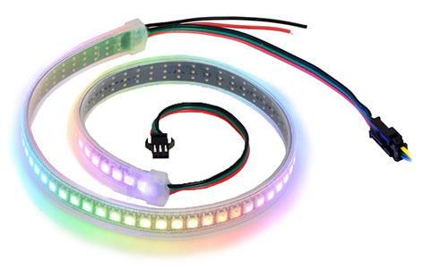
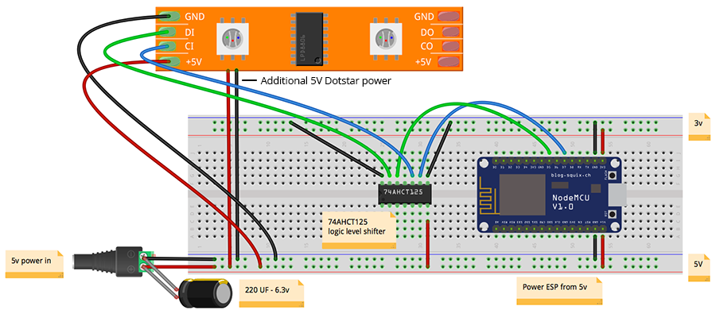

# DotStar Wiring Guide
Copyright 2018 Moddable Tech, Inc.<BR>
Revised: December 11, 2018



## Specs

| | |
| :---: | :--- |
| **Size** | 144 LED strip (5mm x 5mm LEDs) 
| **Type** | ADA102 LED
| **Interface** | SPI
| **Drivers** | [dotstar](../../documentation/drivers/dotstar/dotstar.md)
| **Availability** | [Adafruit DotStar](https://www.adafruit.com/product/2241)
| **Description** |  Adafruit uses the ADA102 LED's in their DotStar digital LEDs. This allows individual LED control with 2 wire SPI. These LEDs are not strictly a display, but they can be seen as one row of a display. There are options to purchase them in a organized in a rectangular grid, which is like a display.

## Moddable example code

The [dotstar](../../examples/drivers/dotstar/) example works with a 144 LED strip. It scans through an image one row at a time to update the pixels on the DotStar string.

```
cd $MODDABLE/examples/drivers/dotstar
mcconfig -d -m -p esp
```

## ESP8266 Pinout

**Note:** Dotstar requires 5V data signals so signal lines must be run through a logic converter to boost them to 5V. The [74AHCT125](https://www.adafruit.com/product/1787) or a similar shifter will work.

| Dotstar Display | ESP8266 | ESP8266 Devboard label
| --- | --- | --- |
| 5V | N/A (connect to 5V supply) | 
| GND | GND | 
| CI | GPIO 14/SCLK | D5
| DI| GPIO 13/MOSI | D7


