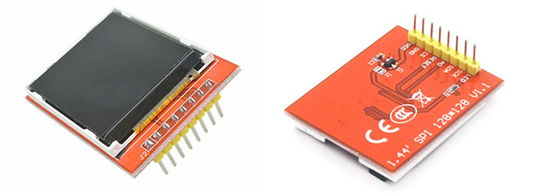
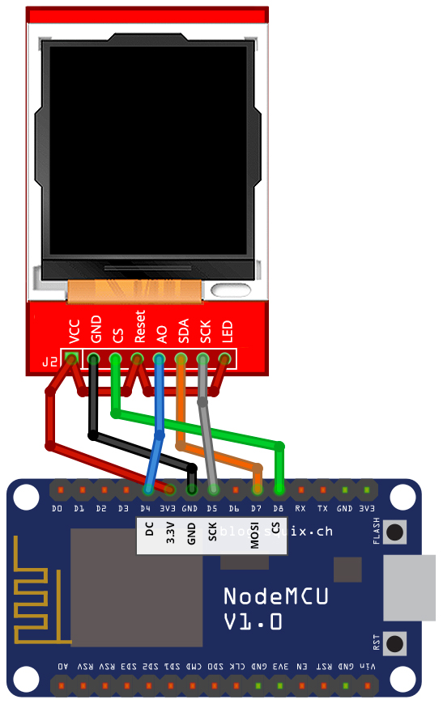

# Generic 1.44" Display Wiring Guide
Copyright 2018 Moddable Tech, Inc.<BR>
Revised: December 10, 2018



## Specs

| | |
| :---: | :--- |
| **Size** | 1.44", 128 x 128
| **Type** | TFT LCD
| **Interface** | SPI
| **Drivers** | video [ST7735](../../documentation/drivers/st7735/st7735.md), no touch
| **Availability** | [Generic 1.44" SPI Displays on eBay](https://www.ebay.com/sch/i.html?_odkw=spi+display&_osacat=0&_from=R40&_trksid=p2045573.m570.l1313.TR0.TRC0.H0.Xspi+display+1.44%22.TRS1&_nkw=spi+display+1.44%22&_sacat=0)
| **Description** | These inexpensive displays are available on eBay and other resources.

## Moddable example code

The [balls](../../examples/piu/balls/) example is good for testing this display.  To run a debug build, use the following build command:

```
cd $MODDABLE/examples/piu/balls
mcconfig -d -m -p esp/generic_square
```

## ESP8266 Pinout

| 1.44" Display | ESP8266 | ESP8266 Devboard label
| --- | --- | --- | 
| VCC | 3.3V |
| GND | GND | 
| CS | GPIO 15 | (D8)
| RESET | 3.3V | 
| AO | GPIO 2 | (D4)
| SDA | GPIO 13 | (D7) 
| SCK | GPIO 14 | (D5) 
| LED | 3.3V | 



