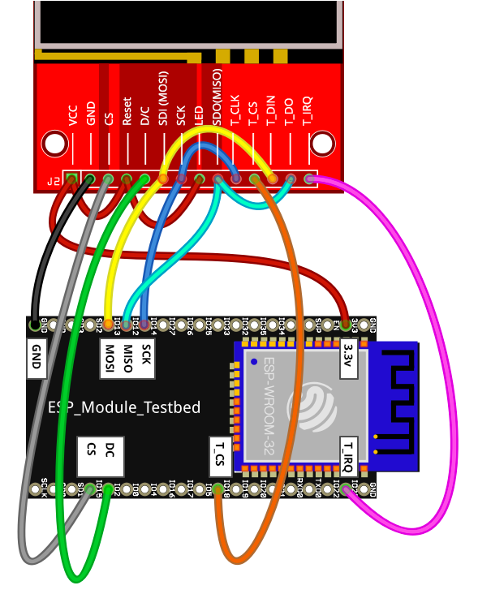

# Wiring Guides for Moddable supported SPI displays

Copyright 2018 Moddable Tech, Inc.  
Revised: January 2, 2018


## Generic 2.4" & 2.8" displays - ESP32 
**Size:** 2.4" & 2.8", 320 x 240

**Type:** TFT LCD

**Interface:** SPI

**Drivers:** video [ILI9341](../../documentation/drivers/ili9341/ili9341.md), touch XPT2046

**Availability:** [Generic SPI Displays on eBay] (https://www.ebay.com/sch/i.html?_odkw=spi+display+2.4&_osacat=0&_from=R40&_trksid=p2045573.m570.l1313.TR0.TRC0.H0.Xspi+display+2.4+touch.TRS0&_nkw=spi+display+2.4+touch&_sacat=0)

**Description:** These inexpensive displays are available on eBay and other resources. Note: They are available in touch and non-touch versions which appear very similar.


**Moddable Sample code:** The Piu example [Drag](../../examples/piu/drag/) is good for testing this display. The build command below includes the -d, debug flag.

```
cd $MODDABLE/examples/piu/drag
mcconfig -d -m -r 0 -f rgb565le -p esp screen=ili9341 touch=xpt2046  
```
At this time Moddable sample code does not include display SD card support.

**ESP8266 Pinout:**

| ILI9341 Display | ESP32 | 
| --- | --- | --- |
| SDO / MISO | GPIO 12  
| LED | 3.3V | 
| SCK | GPIO 14 |
| SDI / MOSI | GPIO 13 |
| CS | GPIO 15 |
| DC | GPIO 2 | 
| RESET | 3.3V | 
| GND | GND | 
| VCC | 3.3V | 
| T_DO | GPIO 12 | 
| T_DIn | GPIO 13 | 
| T_CLK | GPIO 14 | 
| T_IRQ | GPIO 23 | 
| T_CS | GPIO 18 | 



