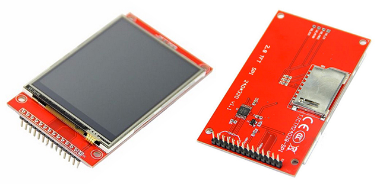
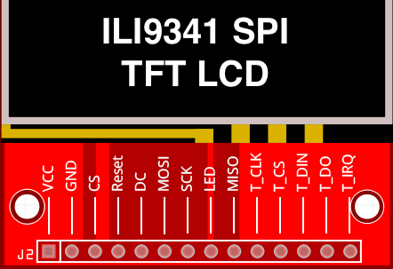

# Generic 2.4" & 2.8" Displays (Resistive Touch) Wiring Guide - Pico
Copyright 2021 Moddable Tech, Inc.<BR>
Revised: March 4, 2022



## Specs

| | |
| :---: | :--- |
| **Size** | 2.4" & 2.8", 320 x 240
| **Type** | TFT LCD
| **Interface** | SPI
| **Drivers** | video [ILI9341](../../documentation/drivers/ili9341/ili9341.md), touch XPT2046 **(not supported yet)**
| **Availability** | [Generic SPI Displays on eBay](https://www.ebay.com/sch/i.html?_odkw=spi+display+2.4&_osacat=0&_from=R40&_trksid=p2045573.m570.l1313.TR0.TRC0.H0.Xspi+display+2.4+touch.TRS0&_nkw=spi+display+2.4+touch&_sacat=0)
| **Description** | These inexpensive displays are available on eBay and other resources. <BR><BR>Note: They are available in touch and non-touch versions which appear very similar.

> At this time Moddable sample code does not include display SD card support.

## Moddable example code

The [balls](../../examples/piu/balls/) example is good for testing this display.  To run a debug build, use the following build command:

```
cd $MODDABLE/examples/piu/balls
mcconfig -d -m -p pico/ili9341
```

## ili9341 Module pinout

This is a typical layout of the ili9341 module. 



## Raspberry Pi Pico Pinout

| ILI9341 Display | Pico
| --- | --- |
| VCC | 3.3V
| GND | GND
| CS | GPIO 9
| RESET | GPIO 12
| DC | GPIO 7
| SDI / MOSI | GPIO 11
| SCK | GPIO 10
| LED | 3.3V
<!--
| SDO / MISO | GPIO 8
| T_CLK | GPIO 10
| T_CS | GPIO 13
| T_DIn | GPIO 11
| T_DO | GPIO 8
| T_IRQ | GPIO 14
--> 
