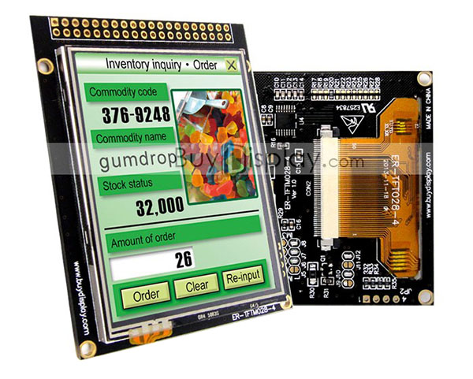
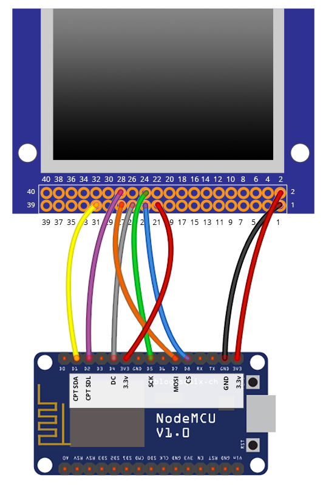

#  BuyDisplay 2.8" CTP Display Wiring Guide - ESP8266
Copyright 2018 Moddable Tech, Inc.<BR>
Revised: December 6, 2018




## Specs

| | |
| :---: | :--- |
| **Part** | ER-TFTM028-4 LCD w/Capacitive Touch Screen Module ([datasheet](http://www.buydisplay.com/download/manual/ER-TFTM028-4_Datasheet.pdf))
| **Size** | 2.8", 320 x 240
| **Type** | TFT LCD
| **Interface** | SPI
| **Drivers** | video [ILI9341](../../documentation/drivers/ili9341/ili9341.md), touch FT6206
| **Availability** | [2.8" BuyDisplay CTP display](http://www.buydisplay.com/default/2-8-inch-tft-touch-shield-for-arduino-w-capacitive-touch-screen-module)
| **Description** | This BuyDisplay screen is highly configurable and can be ordered with varying touch modules, main power voltage and connection types. This sample is for the 3.3v CTP version.

## Configuration

This display supports many configurations. For this sample, Moddable configured the display  IMO settings to support 4 wire SPI. See the ER-TFTM028-4 [datasheet](http://www.buydisplay.com/download/manual/ER-TFTM028-4_Datasheet.pdf). The jumper settings below are open or closed drag solder pads on the PCB.

| IMO Mode | Jumper settings
| --- | --- |
| 4-wire SPI Interface | J2, J3, J4, J5 Short<BR>J1, J6, J7, J8 Open<BR>R1-R10=0R<BR>R19=0R<BR>R21-R28=0R<BR>R17, R18, R20 not soldered

**Display input voltage**  
The TFTM028-4 can be configured to be powered by either 5v or 3.3v via a solder jumper. See Table 4.3 in the [datasheet](http://www.buydisplay.com/download/manual/ER-TFTM028-4_Datasheet.pdf). For this guide the display was set to run with 3.3v input. If the display was configured for 5v Pin 2 on the display header would require 5v input.


## Moddable Sample code

The [drag](../../examples/piu/drag/) example is good for testing this display. To run a debug build, use the following build command:

```
cd $MODDABLE/examples/piu/drag
mcconfig -d -m -p esp/buydisplay_ctp 
```

## ESP8266 Pinout

| BuyDisplay CTP Display | ESP8266 | ESP8266 Devboard label
| --- | --- | --- |
| 1 - VSS | GND | 
| 2 - VDD | 3.3V | 
| 21 - Reset | 3.3V  |  
| 23 - CS | GPIO 15 | (D8) 
| 24 - SCK | GPIO 14 | (D5)
| 25 - DC | GPIO 2 | (D4)  
| 27 - SDI | GPIO 13 | (D7)
| 28 - SDO | GPIO 12 | (D6)
| 30 - CPT SCL | GPIO 4 | (D2)
| 31 - CPT SDA | GPIO 5 | (D1) 



