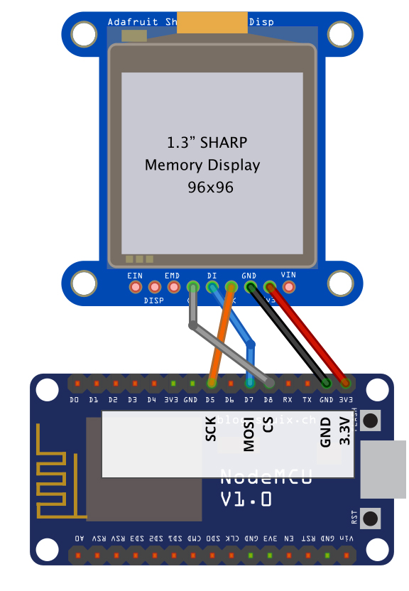

# Sharp Memory Screen 1.3" Wiring Guide
Copyright 2018 Moddable Tech, Inc.<BR>
Revised: December 10, 2018


## Specs

| | |
| :---: | :--- |
| **Part** | LS013B4DN04 LCD Module ([datasheet](https://cdn-shop.adafruit.com/datasheets/LS013B4DN04-3V_FPC-204284.pdf))
| **Size** | 1.3", 96 x 96, 168 x 144
| **Type** | LCD, Monochrome
| **Interface** | SPI
| **Drivers** | video [ls013b4dn04](../../documentation/drivers/ls013b4dn04/ls013b4dn04.md), no touch
| **Availability** |  [Sharp Memory Monochrome Display on Adafruit](https://www.adafruit.com/product/3502)<BR>[Sharp Memory Reflective Display on Digi-Key](https://www.digikey.com/product-detail/en/1393/1528-1183-ND/5353643)<BR>[Sharp Memory Reflective Display on Sparkfun](https://www.sparkfun.com/products/retired/13192)
| **Description** | These interesting displays have the ultra-low power usage of eInk and the fast-refresh rates of an LCD. The [older 96 x 96 version](https://www.adafruit.com/product/1393) has an mirror-like display where the active pixels are reflective.

## Moddable example code

The [transitions](../../examples/piu/transitions/) example is good for testing this display.  To run a debug build, use the following build command:

```
cd $MODDABLE/examples/piu/transitions
mcconfig -d -m -p esp/sharp_memory_square  
```

## ESP8266 Pinout

| 1.3" Memory Display | ESP8266 | ESP8266 Devboard label
| --- | --- | --- | 
| 3v3 | 3.3V | 
| GND | GND | 
| CLK | GPIO 14 | (D5)
| DI | GPIO 13 | (D7)
| CS | GPIO 15 | (D8)




