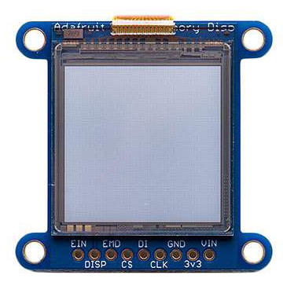

# Wiring Guides for Moddable supported SPI displays

Copyright 2018 Moddable Tech, Inc.  
Revised: January 2, 2018


## Sharp Memory Screen 1.3"
**Part:** LS013B4DN04 LCD Module  
[Datasheet](https://cdn-shop.adafruit.com/datasheets/LS013B4DN04-3V_FPC-204284.pdf)

**Size:** 1.3", 96 x 96, 168 x 144

**Type:** LCD, Monochrome

**Drivers:** video [ls013b4dn04](../../documentation/drivers/ls013b4dn04/ls013b4dn04.md), no touch

**Availability:** [Sharp Memory Monochrome Display on Adafruit] (https://www.adafruit.com/product/3502)  
[Sharp Memory Silver Display on Digi-Key] (https://www.digikey.com/product-detail/en/1393/1528-1183-ND/5353643)

**Description:** These interesting displays have the ultra-low power usage of eInk and the fast-refresh rates of an LCD. The [older 96 x 96 version] (https://www.adafruit.com/product/1393) has an mirror-like display where the active pixels are reflective.




**Moddable Sample code:** The Piu example [Balls](../../examples/piu/balls/) is good for testing this display. The build command below includes the -d, debug flag so requires XSBug to be launched to run.

```
cd $MODDABLE/examples/piu/balls
mcconfig -d -m -r 0 -f rgb565le -p esp screen=ili9341 touch=xpt2046  
```

**ESP8266 Pinout:**

| 1.3" Memory Display | ESP8266 | ESP8266 Devboard label
| --- | --- | --- | 
| VIN |  | 
| 3v3 | 3.3V | 
| GND | GND | 
| CLK | GPIO 14 | (D5)
| DI | GPIO 13 | (D7)
| CS | GPIO 15 | (D8)
| EMD | | 
| DISP | | 
| EIN | | 


