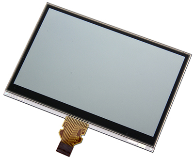

# Sharp Memory Display Wiring Guide
Copyright 2018 Moddable Tech, Inc.<BR>
Revised: October 23, 2018



## Specs

| | |
| :---: | :--- |
| **Part** | LS027B7DH01A
| **Size** | 2.7", 240 x 400
| **Type** | Sharp Memory TFT-LCD, Monochrome
| **Interface** | SPI
| **Drivers** | video [ls013b4dn04](../../documentation/drivers/ls013b4dn04/ls013b4dn04.md), no touch
| **Availability** | [Sharp Memory 2,7" LCD on Digi-Key](https://www.digikey.com/product-detail/en/sharp-microelectronics/LS027B7DH01A/425-2908-ND/5054067?utm_adgroup=Optoelectronics&gclid=Cj0KCQiAvrfSBRC2ARIsAFumcm-L2iz88RlcYf9Z1MU0J1ZW97VgAa0oPoDBgqYSIIRUyZnhGNURyY4aAjIgEALw_wcB)
| **Description** | The Sharp Memory display is a blend of an eInk (e-paper) display and an LCD. It has the very-low power draw of eInk and fast-refresh rates of an LCD.<BR><BR>Moddable uses the [Kuzyatech Sharp Memory display breakout board](https://www.tindie.com/products/kuzyatech/sharp-memory-lcd-breakout-a2/) to interface with the display FFC and boost the ESP8266 power to the 5V needed to drive the display.

## Moddable example code

The [balls](../../examples/piu/balls/) example is good for testing this display. To run a debug build, use the following build command:

```
cd $MODDABLE/examples/piu/balls
mcconfig -d -m -p esp/sharp_memory  
```

## ESP8266 pinout

| Sharp Memory Display | ESP8266 | ESP8266 Devboard label
| --- | --- | --- |
| VIN | 3.3V |  
| GND | GND | 
| EXTMODE |  |  
| DISP | 3.3V | 
| EXTCOMM |  | 
| SCS | GPIO 4 | (D2) 
| SI | GPIO 13 | (D7) 
| SCK | GPIO 14 | (D5) 


