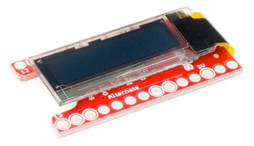
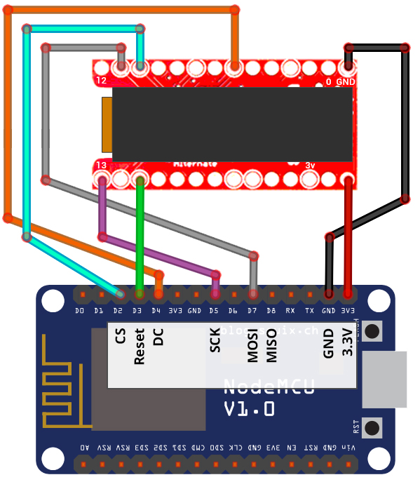

# SparkFun TeensyView Wiring Guide
Copyright 2018 Moddable Tech, Inc.<BR>
Revised: October 23, 2018



## Specs

| | |
| :---: | :--- |
| **Part** | Sparkfun - LCD-14048 
| **Size** | 128 x 32
| **Type** | OLED, Monochrome
|**Interface** | SPI
|**Drivers** | video [SSD1306](../../documentation/drivers/ssd1306/ssd1306.md), no touch
|**Availability** | [TeensyView on Sparkfun](https://www.sparkfun.com/products/14048)
|**Description** | Very small monochrome, OLED display. Moddable uses the TeensyView configured in [standard](https://learn.sparkfun.com/tutorials/teensyview-hookup-guide) mode.

## Moddable example code 

The [balls](../../examples/piu/balls/) example is good for testing this display. To run a debug build, use the following build command:

```
cd $MODDABLE/examples/piu/balls
mcconfig -d -m -p esp/teensyview  
```

## ESP8266 pinout

| TeensyView Display | ESP8266 | ESP8266 Devboard label
| --- | --- | --- |
| GND | GND | 
| 5 | GPIO 2 | (D4)
| 10 | GPIO 4 | (D2)
| 11 | GPIO 13 | (D7) 
| 13 | GPIO 14 | (D5) 
| 15 | GPIO 0 | (D3) 
| 3v | 3.3V |




