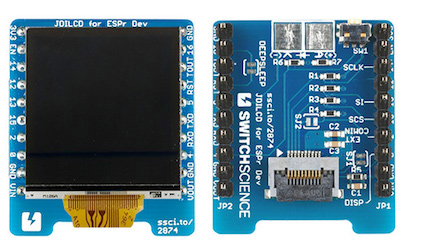

# Switch Science Reflective LCD Display Wiring Guide
Copyright 2018 Moddable Tech, Inc.<BR>
Revised: October 23, 2018



## Specs

| | |
| :---: | :--- |
| **Part** | 2858: JDI - REFLCD - 128 
| **Size** | 1.28", 176 × 176
| **Type** | Color reflective LCD (no backlight)
| **Interface** | SPI
| **Drivers** | video [lpm013m126a](../../documentation/drivers/lpm013m126a/lpm013m126a.md), no touch
| **Availability** | [1.28" Switch Science Color reflective LCD](https://translate.google.com/translate?hl=en&sl=ja&tl=en&u=https%3A%2F%2Fwww.switch-science.com%2Fcatalog%2F2874%2F)
| **Description** | Moddable purchased this display in Tokyo. [Here](https://translate.googleusercontent.com/translate_c?depth=1&hl=en&rurl=translate.google.com&sl=ja&sp=nmt4&tl=en&u=https://www.switch-science.com/catalog/2858/&usg=ALkJrhijtlYZnC4qJ2sRkLE3mkVZujVU1w) is some info on the display.

## Moddable example code

The [balls](../../examples/piu/balls/) example is good for testing this display. To run a debug build, use the following build command:

```
cd $MODDABLE/examples/piu/balls
mcconfig -d -m -p esp/switch_science_reflective_lcd
```

## ESP8266 pinout

| Switch Science LCD | ESP8266 | ESP8266 Devboard label
| --- | --- | --- |
| 14 - SCLK | GPIO 14 | (D5)
| 13 - SI | GPIO 13 | (D7) 
| 15 - SCS | GPIO 15 | (D8)
| DISP | 3.3v | 
| GND | GND | 
| VIN | 3.3v | 


