# XS 7 @ TC-39

Copyright 2017 Moddable Tech, Inc.

Revised: May 23, 2017

**Warning**: These notes are preliminary. Omissions and errors are likely. If you encounter problems, please ask for assistance.

> *The problem of designing anything is in a sense the problem of designing a tool. And as in designing a tool, it is usually wise to have a pretty clear idea of what you want the thing to do.*
> 
> Charles and Ray Eames, Development of the Molded Plywood Chair, 16 mm film, 1953.

## Name and Number

There are clubs, deejays, energy drinks, even a superhero named XS, all in the sense of [You Gotta Say Yes to Another Excess](https://en.wikipedia.org/wiki/You_Gotta_Say_Yes_to_Another_Excess). Fifteen years ago, when I began to work on XS, I kind of liked that quote. Maybe because I thought it was bold to develop an ECMAScript engine for consumer devices!

But the name mostly refers to this: 

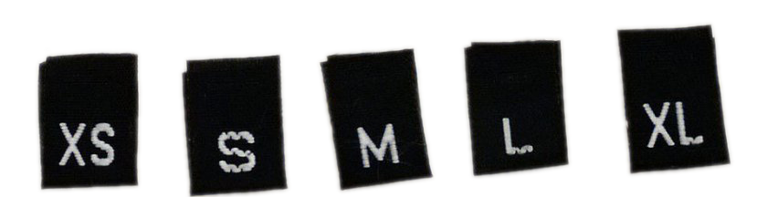

The number is of course the edition of the ECMAScript specifications that the implementation claims to be compatible with.

## History

At the beginning of this century, Peter and his friends were creating a media oriented software platform for consumer devices. I joined them to add a scripting engine. 

My experience was a language I designed and developed for building CD-ROMs. Maybe somebody still remembers CD-ROMs? 

I named the language "Key". It was shipped by Apple in 1993, part of the Apple Media Tool, a CD-ROMs authoring tool.

For his new sofware platform, Peter wanted a standard scripting language, so we selected ECMAScript. 

> Some characteristics of my original language remain in XS, For instance the way XS communicates with its debugger, **xsbug**.

### XS 3

The first version of XS was based on the third edition of the specifications. XS 3 extended the language with XML in order to describe prototypes hierarchies, properties attributes, frameworks packages, binary data, etc. 

XS progressively abandoned such extensions. For instance, with the fifth edition, XS used the property descriptors and the related features of `Object` to create and define prototypes and properties; and, of course, with the sixth edition, classes and modules to package frameworks, and ArrayBuffer for binary data. 

Back to the early days. Our main customer then was Sony and XS 3 found its way into several of their consumer devices. One of the most interesting is the e-book reader PRS-500:

The XS tool chain was already in place to deliver the e-book reader system: a byte code compiler and packager, a graphical debugger and, last but not least, a simulator. Indeed XS is always available on macOS and Windows for the purpose of prototyping frameworks and applications.

### XS 5

In 2010 and 2011, I implemented the fifth edition of the specifications. At that time our software platform was mostly used to build mobile apps on iOS and Android. Our frameworks were implemented in C and interfaced in ECMAScript. All applications were scripts that XS5 compiled and packaged to run on phones and tablets. 

The XS tool chain allowed us to release self-contained applications without their sources. Thanks to integration between XS and the frameworks, applications performed as well as completely native applications. Which was significant compared to other scripting environment available on mobile.

### XS 6

In 2014 and 2015, I implemented the sixth edition of the specifications. We had been acquired by a semiconductor company and our focus was on one hand to build frameworks and applications for their customers, and on the other hand to promote their chips thru products for "makers".

So XS6 has been used privately into several appliances and peripherals, and publicly into two construction kits, Kinoma Create and Kinoma Element, which was our first micro-controller based device.

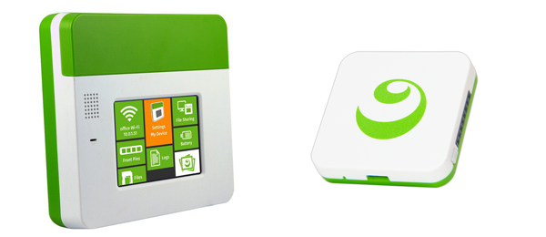

XS 6 was also the first open source release of XS. That was necessary because customers would never use our software platform without being able to access its sources. And for me, that was significant: I learned a lot from the sources of other ECMAScript engines and I was happy for XS to become eventually available to everybody.

### XS 7

Peter already presented where we are now so I can skip the rest... 

I told you that story to give you some context:

- It is obvious today with micro-controllers, but the target of XS has almost always been devices with limited memory and performance. 
- Out of curiosity, I explored browser based frameworks and applications, node.js, etc.  However, XS does not come from the web, neither from the client side nor from the server side.
- I have been helped a lot to debug, port and optimize XS. And of course XS would be different without the suggestions of my colleagues. But put the blame on me if the way XS implements ECMAScript is terrible!

## Conformance

Before I explain the foundations of XS and the runtime model we use for embedded development, I want to mention that XS supports the traditional runtime model.

On Linux, macOS and Windows, XS can be built into a command line tool that executes modules, scripts in strict mode, and scripts in non-strict mode. That is how XS goes thru the Test262 conformance suite.

So the number 7 means that XS  now conforms to the 7th edition of the specifications. Currently XS7 passes **99%** of the language tests (18402/18544) and **97%** of the built-ins tests (24143/24804).

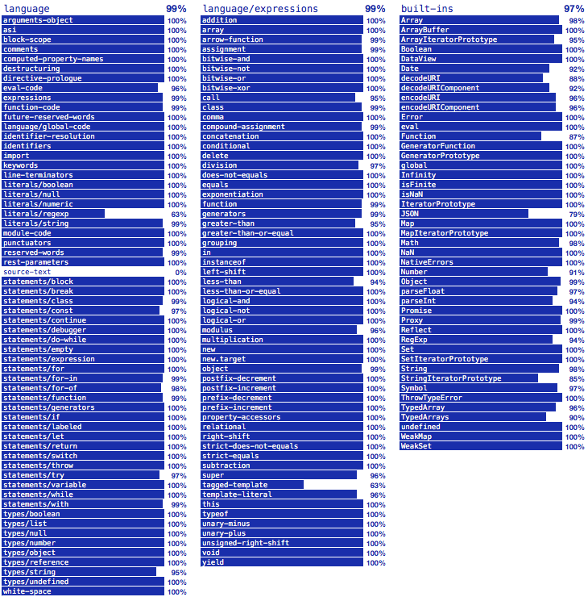

As expected there are still bugs! But I am pleased with these results, especially since I understand why such or such test fails... <!-- Failures are explained in a document distributed with XS. --> For instance:

- XS depends too naively on [PCRE](http://www.pcre.org) for parsing and executing regular expressions, and on the C standard library for computing dates.
- XS does not store the source code of functions so `Function.prototype.toString` fails.
- Strings are UTF-8 encoded C strings, their length is the number of Unicode characters they contain and they are indexed by Unicode characters. 
- XS does not implement yet `JSON` revivers and replacers.

In these results, tests related to proposals beyond the 7th edition are skipped. <!-- Such tests are helping me to prepare XS8...  -->

## Foundations

XS exists for a while and its foundations are still relevant today on micro-controllers. Let me introduce a few of them, which will also define the vocabulary I use when I talk about XS.

People familiar with the architecture of other ECMAScript engines will of course recognize how similar XS is here and there. When it makes sense for our target I just used the same techniques.

### Machine

The main XS runtime structure is the machine. Each machine is its own ECMAScript realm and has its own heap, stack, keys, names table, symbols table, connection to the debugger, etc. 

XS can run several machines concurrently in several threads but only one thread can enter one machine at a time. XS7 provides a C programming interface for machines to communicate.

### Slot

The most ubiquitous XS runtime structure is the slot. Slots store booleans, numbers, references, etc. 

The size of a slot is 16 bytes on 32-bit processors. 

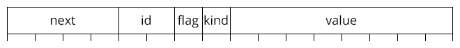

<!--
- The first field of a slot is a pointer to the `next` slot. Slots are mostly used as linked lists. For instance objects are linked lists of properties. 
- The second field of a slot is its `id`, an index into the keys of the machine that owns the slot. For instance properties and variables have an id.
- The third field of a slot is its `flag`, with for instance bits for configurable, enumerable and writable. The garbage collector also uses the flag to mark the slot.
- The fourth field of a slot is its `kind`. It defines what is in the fifth field, the `value` of the slot. For instance if the kind is number, the value contains a double. 
-->
In the machine heap, there is a linked list of free slots, using the `next` field of the slots. The slot allocator remove slots from that list. The garbage collector sweeps unreachable slots by adding them to that list.

### Chunk

What does not fit into a slot, or a list of slots, goes into a chunk. Chunks store byte codes, strings, typed arrays, etc. Chunks are always accessed thru slots. The kind field of a slot that points to the chunk defines what the chunk contains.

The size of chunks varies. 

<!--
The first four bytes of a chunk is the size of its data. The garbage collector uses the high-order bit of the size to mark the chunk. 
-->

In the machine heap, chunks are allocated inside a memory block. In order to compact the memory block, the garbage collector sweeps unreachable chunks by relocating reachable chunks, then update slots that point to them with their relocated addresses.

> Fragmentation is a real issue on micro-controllers with limited memory and no memory management unit to cope, so relocatable chunks are a blessing.

XS allows frameworks and applications to use chunks for their own data, thanks to a specific kind of slot that references a chunk and hooks for the garbage collector. Such a slot works like a Handle, for those who remember the original Macintosh operating system.

### Byte Code

At the core of the XS runtime, there is a huge C function that is a byte code interpreter. The C function uses computed gotos to dispatch byte code, which is always faster than a loop and a switch.

The primary objective of byte code is of course to encode modules and scripts into something that is fast enough to decode. XS compiles modules and scripts into byte codes to handle their relative complexity once and only once. Then XS only runs byte code. Byte code is the only information exchanged between compile and run time.

The secondary objective of byte code is compression. I always try to find a balance between the vocabulary (the number of byte codes available to encode ECMAScript constructs) and the grammar (the number of byte codes necessary to encode ECMAScript constructs). The design of the byte code evolves with each version of XS.

> Currently there are 194 different byte codes. Most language constructs generate few byte codes.

In fact most byte codes do not look at all like assembly instructions. Most byte codes directly refer to ECMAScript expressions and statements. For instance there are byte codes to get and set properties, byte codes for unary and binary operators, byte codes for primitive values, etc.

> In that sense, XS is an ECMAScript virtual machine, like an imaginary ECMAScript processor.

A lot of byte codes have no values and take just 1 byte. Most byte codes with values have variations depending on the size of their values. Here are a few examples:

- the integer byte code has variations for 1, 2 and 4 bytes values, 
- the branches byte codes have also variations for 1, 2 and 4 bytes values, depending on how far the interpreter has to jump. 
- since ECMAScript functions with more than 255 arguments and variables are rare, related byte codes have variations too, so most accesses and assignments take only two bytes.

> Such variations may seem like a detail but every byte matters!

### Stack

The byte code interpreter is stack based. Byte codes push, pop or transform references and values to, from or on the machine stack. The machine stack is a stack of slots, separate from the C stack.

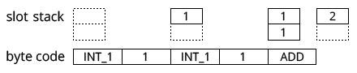

When calling an ECMAScript function, XS does not use the C stack. The byte code interpreter uses the machine stack to remember where to go back and jumps to the first byte code of the ECMAScript function. 

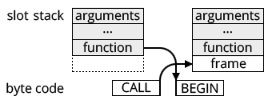

> That technique allows XS to run intricate enough ECMAScript code despite the typically tiny C stack of micro-controllers.

That technique has other benefits. For instance tail call optimization is straightforward. 

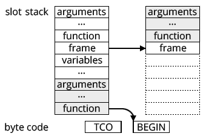

And generators only have to store part of the machine stack in order to yield.

However XS implements built-in functions in C and modules can implement their functions in C too. So the byte code interpreter is re-entrant, in order to handle calls from and to such host functions.

<!--

### Scopes

At compile time, XS parses modules and scripts into syntax trees, then hoists definitions and variables, then scopes identifiers, then generates byte code. 

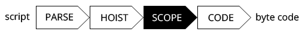

The first objective of scoping identifiers is to access and to assign variables by index, on the stack, directly or indirectly in closures, instead of having to lookup identifiers. That is for performance.

The second objective of scoping identifiers is to create closures with only the necessary variables, since enclosing functions know what their enclosed functions use. That is for memory.

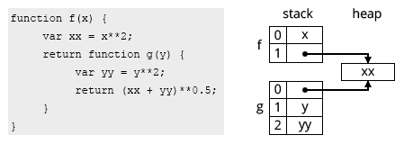

In strict mode, when there is a direct call to `eval`, XS creates closures for everything. For the evaluated string, XS generates different byte codes to lookup identifiers.

In non-strict mode, when there is a direct call to `eval` or a `with` statement, it is similar, except that XS also generates different byte codes to lookup identifiers outside the direct call to `eval` or inside the `with` statement.
-->

### XS in C

XS provides two C programming interfaces: one for platforms, one for applications.

<!--
#### Platform Programming Interface

XS is written in C, not C++, and primarily relies on constants and functions from the C standard library. Such constants and functions are accessed thru macros so platforms can override them when necessary.

Then a platform has a few functions to implement: 

- to allocate the memory blocks used by slots and chunks,
- to connect to, communicate with and disconnect from the debugger,
- to find modules,
- to defer the execution of promises jobs.

> It seems simple enough because it is. The initial port is usually quick if you know the platform well. 

However an optimal port is still work, especially for some peculiar platforms, like the Xtensa instruction set and architecture, on which XS has been ported by Peter.

Platforms can extend the machine structure itself. Since the machine is passed to all XS  functions, it is a convenient way for platforms to have their own context in addition of the application context.

-->

#### Application Programming Interface

XS has an extensive C programming interface for applications to create and delete machines, to execute modules and scripts, to store and retrieve contexts, to collect garbage, etc.

And, mostly, XS allows applications to implement ECMAScript functions in C. That is usually how core frameworks are built, as collections of modules that extend the host for such or such tasks. Then other frameworks and applications are built using only ECMAScript.

> With XS, there is no such thing as a generic host. Applications describe the modules they need in their manifest and XS provides tools to assemble a specific host.

Modules tell XS that such or such function is implemented in C with an intentionally "alien" syntax.

	export default class Out {
 		print(it) @ "Out_print";
 		printLine(it) {
			this.print(it + "\n");
		}
	}

The syntax allows modules to be hybrid, implemented partially in C and partially in ECMAScript, and to use arbitrary C identifiers for functions. It works for functions, methods, getters and setters. The parameter list must be simple. 

Based on that, when assembling a host, XS tools generate what it is necessary to automatically bind C functions to `Function` objects.

<!--

The C implementation itself uses macros to convert from and to ECMAScript values, to access arguments and variables, to get and set properties, to call functions, etc.

	void Out_print(xsMachine* the) {
		printf("%s", xsToString(xsArg(0)));
	}

For the sake of performance, the API uses the machine stack almost like the byte code interpreter. The macros adorn the API to simplify its usage and to check boundaries.
-->

### xsbug

To have a source level debugger is of course essential for any language runtime. XS always provided xsbug, a stand-alone debugger, on macOS and Windows. I built the latest version of xsbug using XS7 itself and a thin user interface framework.

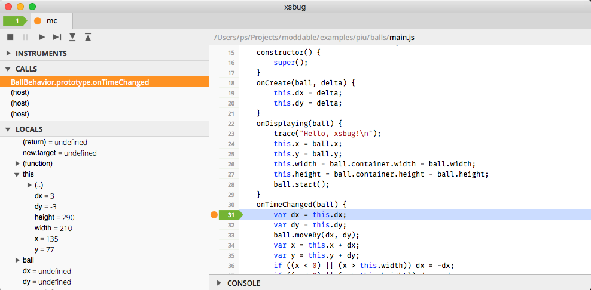

xsbug is a TCP/IP server, waiting for the connection of XS machines. xsbug can debug several machines in parallel, each machine being a tab in its window. XS machines can be TCP/IP clients directly, or indirectly thru a serial connection to the PC and a serial to TCP/IP bridge.

The protocol between xsbug and machines is an XML conversation, somewhat similar to the original protocol of XMPP. 

xsbug sends messages to break, run, step, set and clear breakpoints.

	<set-breakpoint path="/Users/ps/Projects/moddable/examples/piu/balls/main.js" line="25"/>
	<go/>

Machines send messages to log, report exceptions, inspect the heap and the stack.   

	<xsbug><log>Hello, xsbug!</log></xsbug>

Machines also instrument themselves, measuring heap and stack size, counting garbage collections, keys used, modules loaded, etc. Machines send samples periodically to xsbug.

	<xsbug><samples>0,0,0,0,0,0,0,0,0,1304,2032,2064,8192,0,4096,0,0,12</samples></xsbug>

There is a C programming interface for the instrumentation, so modules can also instrument themselves. The available instruments are reported at the beginning of the conversation.

	 <xsbug><instruments>
	 	<instrument name="Pixels drawn" value=" pixels"/>
	 	<instrument name="Frames drawn" value=" frames"/>
	 	<instrument name="Network bytes read" value=" bytes"/>
	 	<instrument name="Network bytes written" value=" bytes"/>
	 	<instrument name="Network sockets" value=" sockets"/>
	 	<instrument name="Timers" value=" timers"/>
	 	<instrument name="Files" value=" files"/>
	 	<instrument name="Poco display list used" value=" bytes"/>
	 	<instrument name="Piu command List used" value=" bytes"/>
	 	<instrument name="Chunk used" value=" / "/>
	 	<instrument name="Chunk available" value=" bytes"/>
	 	<instrument name="Slot used" value=" / "/>
	 	<instrument name="Slot available" value=" bytes"/>
	 	<instrument name="Stack used" value=" / "/>
	 	<instrument name="Stack available" value=" bytes"/>
	 	<instrument name="Garbage collections" value=" times"/>
	 	<instrument name="Keys used" value=" keys"/>
	 	<instrument name="Modules loaded" value=" modules"/>
	 </instruments></xsbug>

xsbug uses the instruments and samples to display the evolution of the machine while it is running or at every step. 

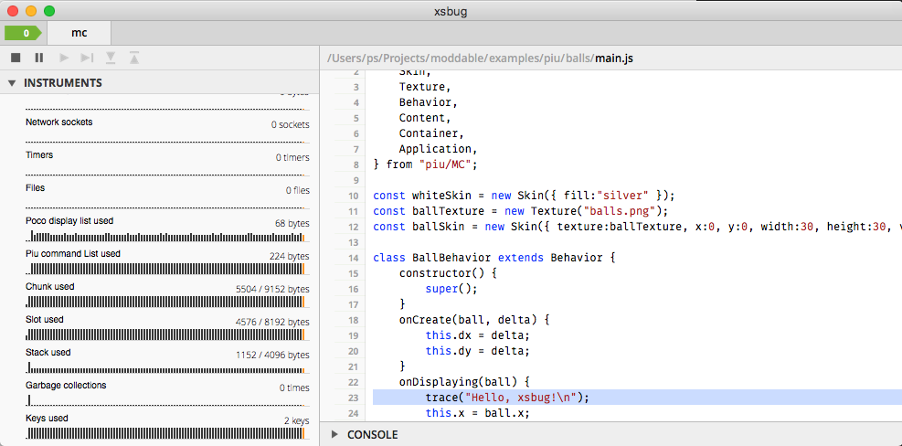

## Embedded Development

The challenges of embedded development are obvious: limited memory and limited performance. Compared to hardware that usually runs ECMAScript on the client or the server sides, the differences are measured in orders of magnitude, not percentages: kilobytes instead of gigabytes, megahertz instead of gigahertz, single core instead of multiple cores...

While RAM is often extremely limited, embedded devices also have ROM which can be flashed from a PC. Not a lot of ROM but perhaps a megabyte or two! The main strategy XS uses to run ECMAScript on embedded devices is to run ECMAScript as much as possible from ROM instead of RAM. Then XS uses several techniques to further reduce the amount of ROM it requires. 

This is interesting! Considering the dynamic and mutable nature of ECMAScript, I was surprised to find how much can be done in ROM, which is obviously static and immutable.

#### Compile

XS always compiles modules or scripts into byte code. The part of XS that parses, scopes and codes modules or scripts and the part of XS that executes byte code are completely separate.

In the traditional runtime model, the two parts are of course chained. For embedded development, the XS compiler runs on a PC and the resulting byte code is flashed into ROM where it is executed. 

In fact, most embedded devices cannot afford to parse, scope and code modules or scripts themselves, so that part of XS is often absent, which saves some ROM at the cost of `eval`, `new Function` and `new Generator`.

#### Link

Having the byte code in ROM is not enough. There are the ECMAScript built-ins. There are the modules that applications need to do something useful, like a user interface framework, a secure network framework, etc. That means a lot of memory to define objects.

In the traditional runtime model, when the application starts, built-ins are constructed then modules are loaded. The resulting objects are created dynamically in RAM. Even with the byte code in ROM, that requires too much RAM on embedded devices.

So XS allows developers to prepare the environment to run their application. On a PC, the XS linker constructs built-ins and load modules as usual, then save the resulting objects as C constants. Together with the C code of XS, built-ins and frameworks, such C constants are built into the ROM image.

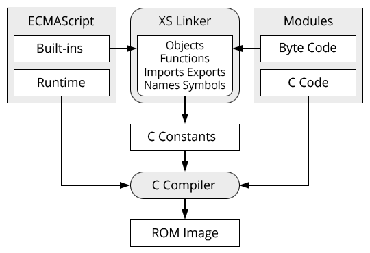

#### Run

When the application starts, everything is ready so the embedded device boots instantaneously. Nothing is ever copied from ROM to RAM so the application runs in a few kilobytes.

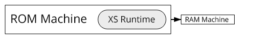

Let us explore some interesting details...

### The ROM machine

The XS linker creates a machine to construct built-ins and load modules. If the body of a module does not call a host function, it can be executed at link time to construct the module objects. Applications declare the modules to prepare that way in their manifest.

The heap, stack, keys, names, symbols and modules table of that machine are literally dumped into C constants together with the byte code and references to host functions. Here are some byte codes of a module, and some slots of the heap that define an ECMAScript function that uses such byte code. 

	static const txU1 gxCode1[1023] = {
		0x45, 0x81, 0x9a, 0x66, 0x00, 0x16, 0x48, 0x81, 0x9a, 0x28, 0x03, 0xc1, 0x0a, 0x00, 0x83, 0x08,
		//...
		0x03, 0xb3, 0xad, 0x81, 0x91, 0x76, 0x76, 0x5c, 0x03, 0xb3, 0x5c, 0x06, 0x69, 0x89, 0x39
	};

	static const txSlot gxHeap[mxHeapCount] = {
	// ...
	/* 1804 */	{ (txSlot*)&gxHeap[1805], XS_NO_ID, 0x92, XS_INSTANCE_KIND, { .instance = { NULL, (txSlot*)&gxHeap[756] } } },
	/* 1805 */	{ (txSlot*)&gxHeap[1806], -32346, 0x8f, XS_CODE_X_KIND, { .code = { (txByte*)(&gxCode1[44]), NULL } } },
	/* 1806 */	{ (txSlot*)&gxHeap[1807], XS_NO_ID, 0x8f, XS_HOME_KIND, { .home = { (txSlot*)&gxHeap[1781], (txSlot*)&gxHeap[1778] } }},
	/* 1807 */	{ NULL, -32508, 0x8e, XS_REFERENCE_KIND, { .reference = (txSlot*)&gxHeap[1781] } },
	// ...
	};

### The RAM machine

The XS runtime creates a machine to run the application. Except for a few tables that are inherently live, the dynamic RAM machine is initialized by pointing into the static ROM machine. 

Here are a few examples:

- When the application invokes built-in or prepared modules constructors, the constructors are in ROM and the prototypes of the results are also in ROM.
- When functions are created on the fly, which is increasingly common due to arrow functions, the Function objects are in RAM but their byte code stays in ROM.
- String constants and literals are also created from ROM instead of RAM: the string slots point to C constants instead of chunks.

So the heap can be extra small. This helps the simple garbage collector to be efficient since a big "generation" never has to be marked and swept.

### Aliases

What happens when applications want to modify objects in the ROM machine? 

The RAM machine has a table of aliases which is initially empty. All aliasable objects in ROM have an index into that table. When an application modifies an aliasable object, an instance is inserted into the table to override the aliasable object.

Such a mechanism has a cost in memory and performance, so prepared modules can use `Object.freeze` in their body to tell the XS linker that such or such object do not need to be aliasable.

In fact, thanks to subclassing, it is practical and healthy to freeze most functions and prototypes.

## Future

Obviously there will be XS8 :-) Two proposals are especially relevant to our target.

The `async` function and `await` expression would help applications to cleanly define the typical microcontroller setup and loop: configuring sensors, reading sensors, uploading results, and so on. That is essentially asynchronous.

Microcontroller with multiple cores are there, and XS could creates several tiny RAM machines based on one huge ROM machine to run them in parallel. So the `atomics` and `shared memory` could become relevant, even on embedded devices.

On my side, I think there is more I can do to reduce the size of XS itself and optimize how XS dispatches ordinary and exotic behaviors. Implementing `Proxy` and `Reflect` a few years ago already drove me in the right direction.

Also I am still exploring the possibilities offered by the linking process I just described. There could be some significant optimizations to do there, for instance by further modifying the byte code at this stage.

Thank you!
