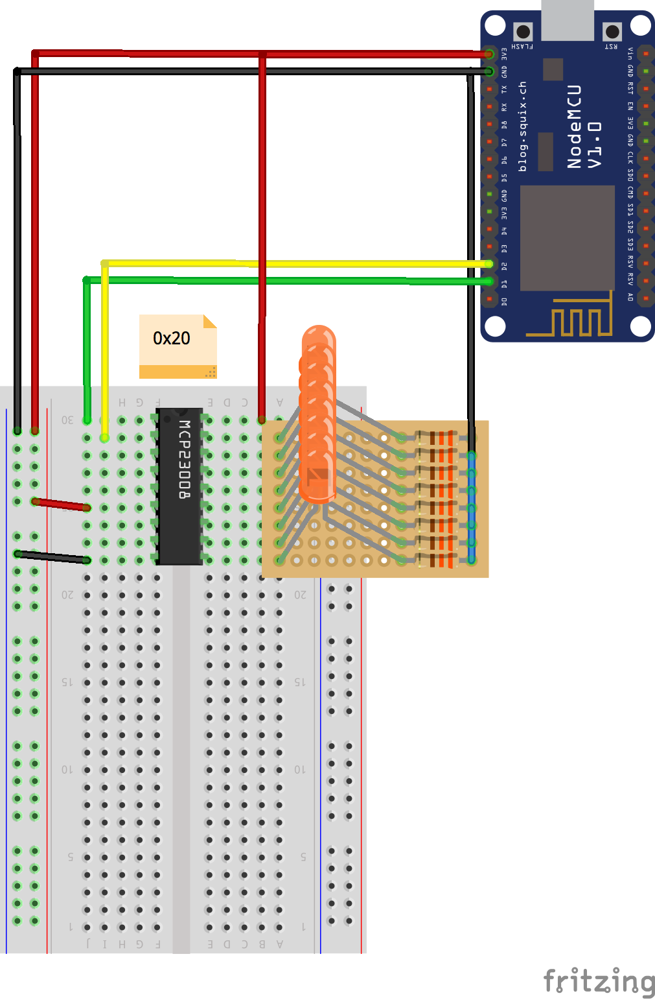
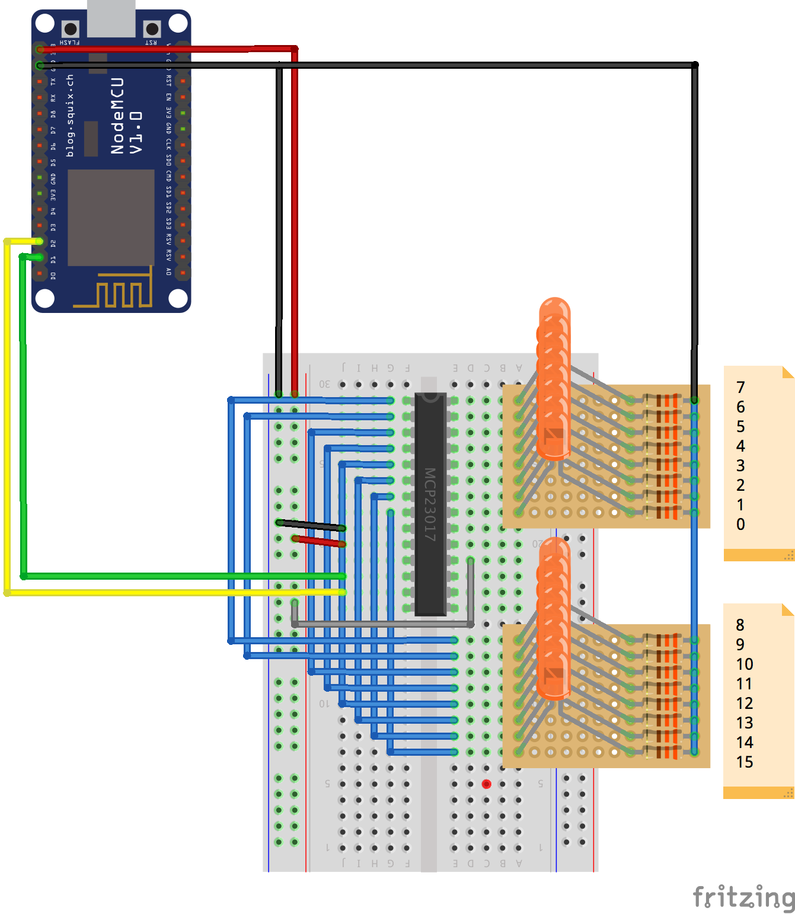

# MCP230XX
Copyright 2017 Moddable Tech, Inc.<BR>
Revised: Dec 21, 2017

The [MCP23008](http://www.microchip.com/wwwproducts/en/MCP23008) device provides 8-bit, general purpose, parallel I/O expansion for I2C bus applications. (Description from MCP23008 product page)

The [MCP23017](http://www.microchip.com/wwwproducts/en/MCP23017) device provides 16-bit, general purpose, parallel I/O expansion for I2C bus applications. (Description from MCP23017 product page)

### Module "MCP230XX"

The driver module "MCP230XX" exports the following:

```js
export { 
  MCP23008, 
  MCP23017
};
```

### MCP23008 Class

The `MCP23008` class produces instances that represent a single MCP23008 IC on the I2C bus. The `MCP23008` class extends an internal `Expander` class, which extends the `SMBus` class. `Expander` is not exported. 

Instance objects of `MCP23008` contain 8 `Pin` instance object entries.

```js
import Timer from "timer";
import {MCP23008} from "MCP230XX";


export default function() {
  let leds = new MCP23008(); // defaults to 0x20!
  let mask = 0x88;

  Timer.repeat(() => {
    mask = ((mask << 1) | (mask >> 7)) & 0xFF;

    for (let i = 0; i < 8; i++) {
      leds[i].write(mask & (1 << i) ? 1 : 0);
    }
  }, 50);
}
```



#### Constructor Description

##### `MCP23008([dictionary])`

| Argument | Type | Description |
| --- | --- | :--- |
| `dictionary` | `object` | An object with properties to initialize the result. Supported parameters are specified in the [Dictionary](#MCP23008-dictionary) section below.


```
let leds = new MCP23008({ sda: 4, scl: 5 });
```

<a id="MCP23008-dictionary"></a>
#### Dictionary

| Parameter | Type | Default Value | Description
| --- | --- | --- | :--- |
| `address`  | `number` | `0x20` | The address of the I2C device |
| `hz`       | `number` | 100kHz | The clock speed of the I2C device. | 
| `sda`      | `number` | 4 | The I2C sda (data) pin. | 
| `scl`      | `number` |  5 | The I2C scl (clock) pin.     |
| `inputs`   | `number` (byte) | `0b11111111` | A byte representing the input/output initialization state of the 8 GPIO pins. `1` for input, `0` for output |
| `pullups`  | `number` (byte)  | `0b00000000` | A byte representing the pullup initialization state of the 8 GPIO pins. `1` for pullup, `0` for default |

#### Properties

All properties are read-only.

| Name | Type | Value | Description|
| --- | --- | --- | :--- |
| `length` | `number` | `8` | Number of pins in collection |
| `offset` | `number` | `0` | Register offset |
| `IODIR` | `number` | `0x00` | `IODIR` register |
| `GPIO` | `number` | `0x06` | `GPIO` register |
| `GPPU` | `number` | `0x09` | `GPPU` register |
| 0-8 | `pin` | | `Pin` instances (see the section [Pin Class](#pin-class)) |

#### Methods

##### `write(byte)`

Temporarily sets the mode of all pins to output and writes all pins at once. 

```js
let expander = new MCP23008(); // defaults to 0x20!
expander.write(0b11111111); // Set all pins to 1
```

##### `read()`

Temporarily sets the mode of all pins to input, reads all pins at once, and returns their values.

```js
let expander = new MCP23008(); // defaults to 0x20!
trace(`${expander.read()}\n`); 
```


### MCP23017 Class

The `MCP23017` class produces instances that represent a single MCP23017 IC on the I2C bus. The `MCP23017` class extends an internal `Expander` class, which extends the `SMBus` class.

Instance objects of `MCP23017` contain 16 `Pin` instance object entries.

```js
import Timer from "timer";
import {MCP23017} from "MCP230XX";


export default function() {
  let leds = new MCP23017(); // defaults to 0x20!
  let mask = 0x8888;

  Timer.repeat(() => {
    mask = ((mask << 1) | (mask >> 15)) & 0xFFFF;

    for (let i = 0; i < 16; i++) {
      leds[i].write(mask & (1 << i) ? 1 : 0);
    }
  }, 50);
}
```



#### Constructor Description

##### `MCP23017([dictionary])`

| Argument | Type | Description |
| --- | --- | :--- |
| `dictionary` | `object` | An object with properties to initialize the result. Supported parameters are specified in the [Dictionary](#MCP23017-dictionary) section below.


```
let leds = new MCP23017({ sda: 4, scl: 5 });
```

<a id="MCP23017-dictionary"></a>
#### Dictionary

| Parameter | Type | Default Value | Description
| --- | --- | --- | :--- |
| `address`  | `number` | `0x20` | The address of the I2C device |
| `hz`       | `number` | 100kHz | The clock speed of the I2C device. |
| `sda`      | `number` | 4 | The I2C sda (data) pin. |
| `scl`      | `number` | 5 | The I2C scl (clock) pin. |
| `inputs`   | `number` (word) |  `0b1111111111111111` | A word representing the input/output initialization state of the 16 GPIO pins. `1` for input, `0` for output |
| `pullups`  | `number` (word) | `0b0000000000000000` | A word representing the pullup initialization state of the 16 GPIO pins. `1` for pullup, `0` for default |

#### Properties

All properties are read-only. 

| Name | Type | Value | Description|
| --- | --- | --- | :--- |
| `length` | `number` | `16` | Number of pins in collection |
| `offset` | `number` | `1` | Register offset |
| `IODIR` | `number` | `0x00` | `IODIR` register |
| `GPIO` | `number` | `0x0C` | `GPIO` register |
| `GPPU` | `number` | `0x12` | `GPPU` register |
| 0-16 | `pin` | | `Pin` instances (see the section [Pin Class](#pin-class)) |


#### Methods

##### `write(word)`

Temporarily sets the mode of all pins to output and writes all pins at once. 

```js
let expander = new MCP23017(); // defaults to 0x20!
expander.write(0b1111111111111111); // Set all pins to 1
```

##### `read()`

Temporarily sets the mode of all pins to input, reads all pins at once, and returns their values.

```js
let expander = new MCP23017(); // defaults to 0x20!
trace(`${expander.read()}\n`); 
```

### Pin Class

The `Pin` class represents a single pin within a `MCP23008` or `MCP23017` instance object. The class is not exported; `Pin` instances are automatically created by `MCP23008` and `MCP23017` instances.

```js
import Timer from "timer";
import { MCP23008 } from "MCP230XX";

export default function() {
	const leds = new MCP23008({
		inputs: 0b00000000
	});
  
  	// leds[0], leds[1], etc. are Pin instances
	leds[0].write(1);
	leds[1].write(0);
	leds[2].write(1);
	leds[3].write(0);
	leds[4].write(1);
	leds[5].write(0);
	leds[6].write(1);
	leds[7].write(0);
}
```


#### Constructor Description

##### `Pin(dictionary)`

| Argument | Type | Description |
| --- | --- | :--- |
| `dictionary` | `object` | An object with properties to initialize the result. The required parameters are specified in the [Dictionary](#Pin-dictionary) section below.


<a id="Pin-dictionary"></a>
#### Dictionary

| Parameter | Type | Description
| --- | --- | :--- |
| `pin`  | `number` | The GPIO pin number |
| `expander` | `expander` | The instance of `Expander` that created this `Pin` instance |

#### Properties

All properties are read-only.

| Name | Type | Description 
| --- | --- | :--- |
| `pin` | `number` | The GPIO pin number |
| `expander` | `expander` | The instance of `Expander` that this `Pin` belongs to |

#### Methods

##### `mode(mode)`

| Argument | Type | Description |
| --- | --- | :--- |
| `mode` | `number` | A number representing the desired mode. May be input, input pullup, or output.

Sets the pin's mode to the specified mode. 

##### `read()`

Sets the pin's mode to input, reads the value of the pin object, and returns the value.

##### `write(value)`

Sets the pin's mode to output and writes the value to the pin object.

### Manifest Example

```
{
  "include": [
    "$(MODDABLE)/examples/manifest_base.json",
    "$(MODULES)/drivers/mcp230xx/manifest.json"
  ],
  "modules": {
    "*": [
      "./main",
    ]
  },
  "platforms": {
    "esp": {
      "modules": {
        "*": "$(MODULES)/pins/i2c/esp/*",
      },
    },
    "esp32": {
      "modules": {
        "*": "$(MODULES)/pins/i2c/esp32/*",
      },
    },
  }
}
```
