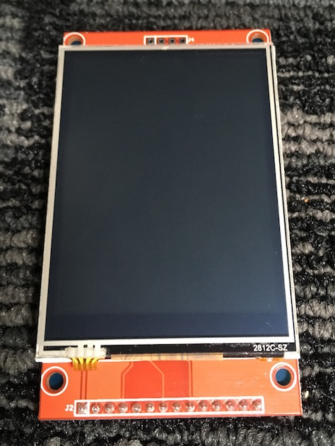
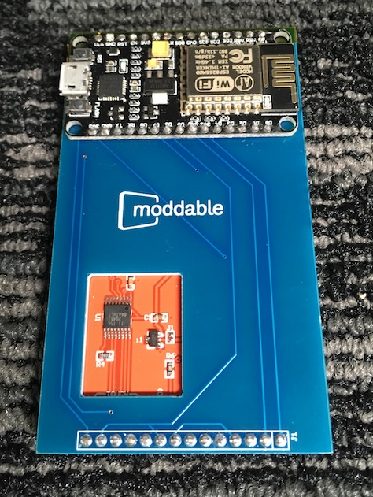
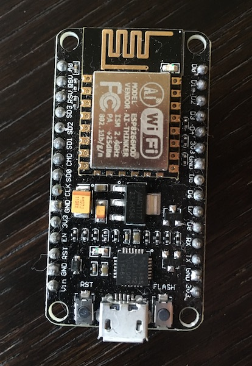
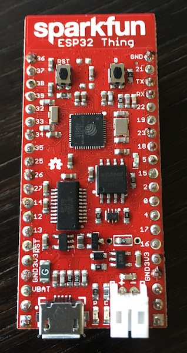
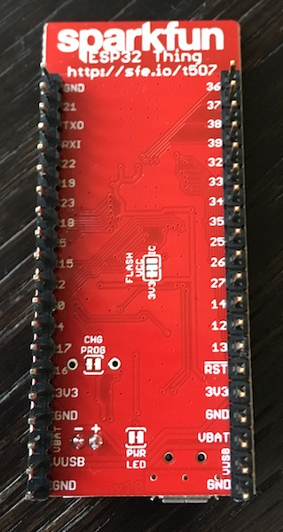
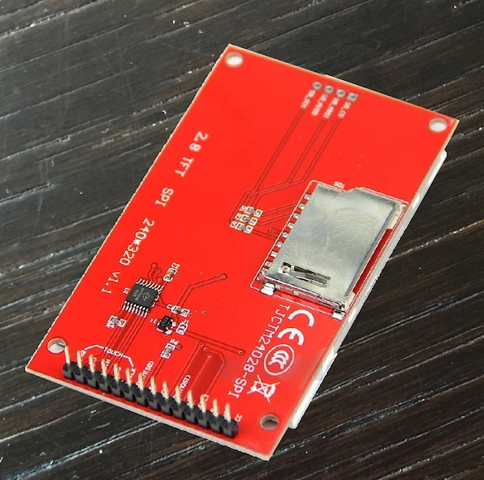
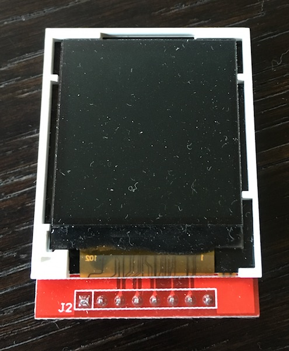

## Moddable Zero
#### Copyright 2016-2017 Moddable Tech, Inc.
#### Confidential

Revised: April 20, 2017

This document describes Moddable Zero, an experimental IoT module that delivers modern JavaScript software development on a small, low cost hardware module that combines CPU, RAM, flash storage, Wi-Fi, and a color touch display. Moddable Zero is hand-built from easily available off-the-shelf components.

 

### Moddable SDK
While this document focused on the capabilities of the hardware in Moddable Zero, it is the software, the Moddable SDK, that makes the hardware truly useful. The Moddable SDK is a comprehensive runtime that minimizes resource requirements throughout the software stack. The following are the key software components in the SDK:

- XS6 JavaScript engine provides, optimized to minimize memory use and provide near instantaneous launch of the virtual machine
- Commodetto graphics framework and Poco renderer, designed to draw modern user interfaces with a small set of primitives, rendering as little as a single scan line at a time
- Piu user interface framework, a modern container based object oriented framework which minimizes the drawing area of screen updates
- Network stack that minimizes buffering and copying to deliver HTTP client, HTTP server, WebSocket client, WebSocket server, SNTP client, and MQTT client.
- Build tools, which offload complex tasks to a computer, including image transformations, JavaScript parsing and compilation, and module loading and linking.
- Source level debugger, runtime instrumentation, and desktop simulator, to speed development and quickly diagnose issues

### ESP8266
The ESP8266 is a Wi-Fi module from [Espressif Systems](http://espressif.com). Originally developed exclusively for use as Wi-Fi peripheral, through the work of hackers it proved capable of powering many devices without additional components. Espressif has since embraced this work, and is now actively working with the open source development community.

#### Technical specifications

The ESP8266 is based on the [Xtensa](http://ip.cadence.com) architecture which uses the Tensilica instruction set, which shares many similarities to the MIPS instruction set. The CPU runs at 80 MHz, and can be overclocked to 160 MHz (although this is not done in Moddable Zero). The CPU supports Execute-in-Place (XIP), allowing native code directly from flash memory.

The device has 96 KB of RAM. Some of that RAM is required for the RTOS, and much of that RAM is statically allocated to the Wi-Fi and TCP stack, leaving about 45 KB available for use by developers. On Moddable Zero, this 45 KB is shared by the Moddable SDK and the application it hosts.

Fortunately, there is 4 MB of flash memory onboard. One MB of this is memory mapped for execution of code, and 3 MB is reserved for storage. The flash memory is connected to the CPU by a high-speed 4-bit SPI interface. This performance makes it practical to execute native code and byte code from flash, as well as render graphical assets directly from flash.

The Wi-Fi radio operates at 2.4 GHz. It can be either a Wi-Fi client (connecting to a base-station) or a base-station (useful for configuration). The board has a printed PCB antenna which delivers adequate range.

The ESP8266 has two hardware SPI buses. The first is dedicated to flash memory. The second is a 1-bit SPI interface, and is shared among other SPI devices, specifically the display and touch controllers. This SPI interface runs at up to 40 MHz and is driven by a 64 byte buffer. Commodetto's Poco rendering engine uses this buffer for asynchronous pixel transmission, allowing a group of pixels to be rendered while the previous group are being transmitted.

#### Hardware
Moddable Zero uses a [NodeMCU](http://hiletgo.com/product/html/?26.html) development board, originally designed to run an embedded version of the Lua scripting language, and subsequently used for many other purposes. The board provides convenient pin breakouts, two buttons, two LEDs, a USB bridge chip, and a micro-USB connector. The development board has the ESP8266 module mounted at the top (the metal shield and antenna fill most of the module).

The hardware design is now so widely supported by the maker community that several companies are manufacturing it. The NodeMCU board can be easily purchased on eBay for between $7 and $8, and in Beijing electronic shops for about $4. The core module itself (CPU, on-board RAM, Flash, Wi-Fi antenna, shielding) is available for about $2.10 each in quantities of 5. It is claimed that in volume, the chip is available for under $1.

 

There are many other companies manufacturing development boards around the ESP8266 modules including [AdaFruit](https://www.adafruit.com/product/2471), [SparkFun](https://www.sparkfun.com/products/13711), [Switch Science](https://www.switch-science.com/catalog/2500/), and [Electrodragon](http://www.electrodragon.com/product/wifi-iot-relay-board-based-esp8266/).

#### Software
Among the most important software for the ESP8266 is the GCC development toolchain. Because GCC supports the Tensilica instruction set directly, it is possible to re-use knowledge, code, make files, and optimizations from other development platforms.

At the core of the device is FreeRTOS, which is well established on many different embedded devices. The Wi-Fi stack is proprietary to Espressif. The TCP stack is [lwip](https://en.wikipedia.org/wiki/LwIP), a TCP stack designed specifically for small devices. Lwip uses a callback model at its core that integrates cleanly with JavaScript's non-blocking callback model.

The firmware is built with the [Arduino Core](https://github.com/esp8266/Arduino) software stack. This is convenient for development, but is not necessary, and could be eliminated.

A typical application deployed, including the full entire software stack (RTOS, Wi-Fi, Moddable SDK, application, graphical assets), uses about 800 KB of flash, though the size varies depending on the configured options.

#### Reality
The ESP8266 delivers remarkable capabilities and performance at a very reasonable price. Memory, however, is tight. It is sufficient for some products, but others will encounter limits. Fortunately, the successor to the ESP8266, the ESP32, is already available in limited quantities. It includes two CPU cores, many more pin outs, BLE support, and approximately 300 KB of available RAM. The price will be higher, but is expected to be competitive.

The ESP32 is not software compatible with the ESP8266. They are similar in many ways, however there will be porting work. Given that the hardware is new, there is considerably less software information available to help.

 

The Moddable SDK is designed to be device independent. It is not tied to ESP processors, and already runs on Intel and ARM processors. It has a very small number of dependencies on the host operating system, so may be ported operating systems, including RTOSes. 

### Display
The display in Moddable Zero is an unbranded QVGA (240 x 320) LCD that supports 16-bit RGB565 pixels. The display operates in portrait mode, with landscape mode supported through software by the Moddable SDK at near-zero performance impact. The display is mounted to a PCB that includes pin outs for prototyping use and an SD Card slot (removed in Moddable Zero).

The display controller is the [ILI9341](https://cdn-shop.adafruit.com/datasheets/ILI9341.pdf) by [Ilitek](http://www.ilitek.com/about-e.asp). The controller operates over SPI, and integrates RAM to buffer the output image. The SPI interface supports windowed access to the frame buffer which is used by the Moddable SDK to update subsections of the display. This is necessary because even at 40 MHz, the SPI bus requires more than two frame times (at 60 fps) to update the 153,600 bytes of the full display buffer.

The display controller includes a "tearing effect" pin which signals when a new frame is about to be displayed. This can be used to synchronize pixel transmission with the display refresh to minimize or eliminate tearing. As the tearing effect pin is not brought out by the display PCB, it is not used in Moddable Zero. With a custom board design, it could be supported.

The display includes a resistive touch interface which uses the XPT2046 controller, also connected by SPI.

Variations on this board are also available. For example, there is a square variant that is 128x128, also using an Ilitek controller, but with smaller frame buffer memory, and without touch.

These LCD development boards have been available for much of 2016 for about $4 each on eBay and other outlets. Recently tightened supply has led to increased prices.
