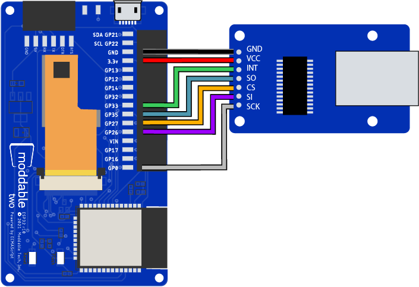
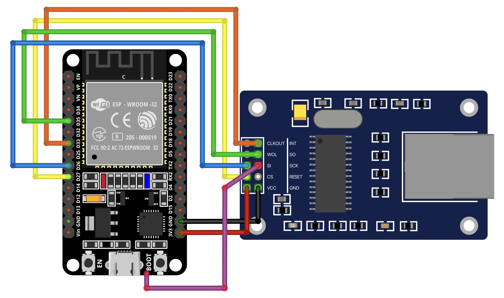

# Ethernet
Copyright 2021 Moddable Tech, Inc.<BR>
Revised: November 16, 2021

## Overview

The Moddable SDK supports Ethernet for the ESP32. Ethernet support is an extension to our [network support](./network.md), which includes support for Wi-Fi and protocols like HTTP/HTTPS, MQTT, WebSockets, DNS, and mDNS. Most of the [networking examples](../../examples/network) in the Moddable SDK enable Wi-Fi by default, but examples that work with Wi-Fi can easily be made to use Ethernet instead.

This document provides information about how to enable Ethernet in applications, details of the JavaScript API used to establish and monitor an Ethernet connection, and wiring instructions for a compatible Ethernet breakout board. 

## Table of Contents

* [Wiring](#wiring)
* [Enabling Ethernet in applications](#enabling-ethernet)
* [Class Ethernet](#class-ethernet)

<a id="wiring"></a>
## Wiring

The Moddable SDK supports any Ethernet module you can wire into the hardware and integrate with the ESP-IDF. We've worked with various ENC28J60 Ethernet module breakout boards (pictured below) and had good results. This section contains wiring information for ENC28J60 modules.


The ESP32 communicates with the ENC28J60 over SPI.

| ENC28J60 | ESP32 |
| :---: | :---: |
| INT | GPIO 33 |
| CS | GPIO 27 |
| MISO | GPIO 35 |
| MOSI | GPIO 26 |
| SCK | GPIO 0 |
| PWR | PWR |
| GND | GND |

The diagram below shows a Moddable Two (an ESP32-based hardware module) wired to a HanRun ENC28J60 module.



You can use other ESP32-based development boards too. Many developers use NodeMCU ESP32 boards, pictured in the diagram below. These boards require you to solder to the GPIO 0 pad since they do not have a pinout for GPIO 0 (because GPIO 0 is used by the BOOT button).



<a id="enabling-ethernet"></a>
## Enabling Ethernet in Applications

Most of the [networking examples](../../examples/network) in the Moddable SDK enable Wi-Fi by default. They do this by including the `manifest_net.json` manifest.

```js
"include": [
	/* other included manifests here */
	"$(MODDABLE)/examples/manifest_net.json"
],
```

If you want to use Ethernet in these examples, you can simply replace `manifest_net.json` with `manifest_net_ethernet.json`. Note that you should not include both `manifest_net.json` and `manifest_net_ethernet.json`; only include one or the other.

```js
"include": [
	/* other included manifests here */,
	"$(MODDABLE)/modules/network/ethernet/manifest_net_ethernet.json"
],
```

The `manifest_net_ethernet.json` manifest includes a `setup/network` module that automatically sets up the connection to Ethernet. The connection is set up before the rest of the application runs. In other words, the device connects to Ethernet, then the application's `main` module is executed. If the device is unable to connect to Ethernet, the `main` module is never executed.

You may choose to remove the `setup/network` module from your own applications and instead set up and monitor the Ethernet connection in the application code using the JavaScript APIs described in the [Class Ethernet](#class-ethernet) section below.

### ESP-IDF ENC28J60 Driver Multicast Packet Issue

The ENC28J60 driver in the ESP-IDF contains a bug that causes multicast packets to be filtered out in hardware. Moddable has [fixed this bug via an ESP-IDF pull request](https://github.com/espressif/esp-idf/commit/3e9cdbdedfd47813a55454ff3b9541fb5c9f9a61) that will be included in a future ESP-IDF release. Until that time, if your project needs multicast you can apply this small fix in the file `$IDF_PATH/examples/ethernet/enc28j60/main/esp_eth_mac_enc28j60.c`, lines 551-552:

```diff
-    // set up default filter mode: (unicast OR broadcast) AND crc valid
-    MAC_CHECK(enc28j60_register_write(emac, ENC28J60_ERXFCON, ERXFCON_UCEN | ERXFCON_CRCEN | ERXFCON_BCEN) == ESP_OK,
+    // set up default filter mode: (unicast OR broadcast OR multicast) AND crc valid
+    MAC_CHECK(enc28j60_register_write(emac, ENC28J60_ERXFCON, ERXFCON_UCEN | ERXFCON_CRCEN | ERXFCON_BCEN | ERXFCON_MCEN) == ESP_OK,
```

<a id="class-ethernet"></a>
## Class Ethernet

- **Source code:** [ethernet](../../modules/network/ethernet)
- **Relevant Examples:** [`ethernet-test`](../../examples/network/ethernet/ethernet-test), [`ethernet-test-graphic`](../../examples/network/ethernet/ethernet-test-graphic), [`ethernet-monitor`](../../examples/network/ethernet/ethernet-monitor)

The `Ethernet` class provides access to use and configure the Ethernet capabilities of an Ethernet module.

```js
import Ethernet from "ethernet";
```

The software for Ethernet is nearly identical to Wi-Fi with the exception of establishing a connection. Since Ethernet implements the same API as Wi-Fi, you can mostly use Ethernet as a drop-in replacement to Wi-Fi in examples from the Moddable SDK and in your own applications, rather than rewriting large portions of them.

### `static start()`

The `start` method begins the underlying process to manage the device's connection to the network.

```js
Ethernet.start();
```

### `constructor(callback)`

The `Ethernet` constructor creates a monitor for the Ethernet status. It takes a callback function to receive status messages. Messages are strings representing the state of the Ethernet connection. The `Ethernet` class has properties that correspond to each string as a convenience for developers.

| Property | Description |
| :---: | :--- |
| `Ethernet.connected` | Physical link established
| `Ethernet.disconnected ` | Physical link lost
| `Ethernet.gotIP` | IP address has been assigned via DHCP and network connection is ready for use
| `Ethernet.lostIP ` | IP address has been lost and network connection is no longer usable

> **Note:** Applications must call the static `start` method of the `Ethernet` class to initiate the Ethernet connection. Without calling `start`, the callback passed into the `Ethernet` constructor will never be called.

```js
Ethernet.start();
let monitor = new Ethernet((msg) => {
	switch (msg) {
		case Ethernet.disconnected:
			// Ethernet disconnected
			break;
		case Ethernet.gotIP:
			// Got IP address
			break;
	}
});	
```

### `close()`

The `close` method closes the connection between the `Ethernet` instance and the underlying process managing the device's connection to the network. In other words, it prevents future calls to the callback function, but it does not disconnect from the network.

```js
let monitor = new Ethernet((msg) => {
	trace(`Ethernet msg: ${msg}\n`);
});	

monitor.close();
```

### Example: Get Ethernet IP address

The following example begins the process of connecting to Ethernet and traces to the console when the connection succeeds with an IP address being assigned to the Ethernet device.

The `Net.get` method can be used to get the IP and MAC addresses of the Ethernet interface, as with Wi-Fi. An optional second argument to `Net.get` specifies which interface to query: `"ethernet"`, `"ap"`, or `"station"`. If no second argument is provided, `Net.get` defaults to the active network interface (for example, when the only network connection is Ethernet, the Ethernet interface is the default).

```js
Ethernet.start();
let monitor = new Ethernet((msg) => {
	switch (msg) {
		case Ethernet.connected:
			trace(`Physical link established. Waiting for IP address.\n`);
			break;
	
		case Ethernet.gotIP:
			let ip = Net.get("IP", "ethernet");
        	trace(`Ethernet connected. IP address ${ip}\n`);
        	break;

		case Ethernet.disconnected:
			trace(`Ethernet connection lost.\n`);
			break;
    }
});	
```

### Example: Get MAC address of Ethernet device

The following example gets the MAC address of the Ethernet device and traces it to the console.

The `Net.get` method is documented in the **Net** section of the [networking documentation](./network.md). Note that there is a second argument passed into the `Net.get` function in this example: the string `"ethernet"`. This specifies that you want to get the MAC address of the ethernet device, not the MAC address of the Wi-Fi device on the ESP32.

```js
let mac = Net.get("MAC", "ethernet");
trace(`Ethernet MAC address is ${mac}\n`);
```
