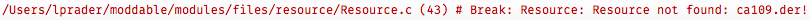

# TLS (SecureSocket)
Copyright 2017-2022 Moddable Tech, Inc.<BR>
Revised: November 11, 2022

## Table of Contents

* [SecureSocket](#securesocket)
	* [Use with HTTP client (`https:`)](#https)
	* [Use with WebSocket client (`wss:`)](#websockets)
	* [Use with MQTT client (`mqtts:`)](#mqtts)
	* [TLS Certificates](#certificates)
		* [Using a Built-in Certificate](#certificate-bulitin)
		* [Providing a Certificate](#certificate-providing)
		* [Converting PEM to DER](#converting-pem)
		* [Updating Certificate Store](#certificate-update)
	* [Memory](#memory)
* [Configuration](#configuration)

<a id="securesocket"></a>
## class `SecureSocket`

- **Source code:** [securesocket](../../modules/crypt/securesocket)
- **Relevant Examples:** [socketsecure](../../examples/network/socket/socketsecure), [httpsget](../../examples/network/http/httpsget), [mqttsecure](../../examples/network/mqtt/mqttsecure)

The `SecureSocket` class implements TLS. At this time, there is no Listener in `SecureSocket`; there is only the Socket, which is TCP-only (no UDP).

```js
import SecureSocket from "securesocket";
```

### `constructor(dictionary)`

The `SecureSocket` constructor takes a single argument, a object dictionary of initialization parameters. The dictionary is a super-set of the `Socket` dictionary (see the documentation of the `Socket` class in the [network documentation](./network.md) for details).

`SecureSocket` extends the dictionary of the constructor with an additional property named `secure` which is itself a dictionary used to configure the TLS connection.

The `secure` dictionary may contain the following properties:

| Parameter | Default Value | Description |
| :---: | :---: | :--- |
| `protocolVersion` | `0x302` (TLS 1.1) | The minimum version of the TLS protocol to implement, in hex.<BR><BR>- `0x303` is TLS 1.2<BR>- `0x302` is TLS 1.1<BR>- `0x301` is TLS 1.0
| `certificate` | N/A |  a certificate in DER (binary) format contained in an `ArrayBuffer`, `Uint8Array`, or host buffer
| `trace` | `false` | If `true`, the TLS stack outputs a trace of its activity. This can be useful in diagnosing failures.
| `verify` | `true` | If `false`, the certificate chain provided by the server is not verified. This should never be done in production systems but can be useful when debugging.
| `tls_max_fragment_length` | N/A |  A number indicating the requested maximum fragment size. Unfortunately, many servers ignore this optional extension. When supported, can help reduce memory requirements.
| `applicationLayerProtocolNegotiation` | N/A | Supports [RFC 7301](https://datatracker.ietf.org/doc/html/rfc7301). Either a `String` or `ArrayBuffer` value to indicate support for a single application layer protocol or an `Array` of one or more `String` and `ArrayBuffer` values to indicate support for multiple application layer protocols.
| `clientKey` | N/A |  a key in DER (binary) format contained in an `ArrayBuffer`, `Uint8Array`, or host buffer
| `clientCertificates ` | N/A |  an array of one or more client certificates in DER (binary) format contained in an `ArrayBuffer`, `Uint8Array`, or host buffer

In the following example, the TLS socket is created with support for version `0x303` of TLS, which corresponds to TLS 1.2.

```js
let socket = new SecureSocket({
	host: "www.example.com", 
	port: 443,
	secure: {
		protocolVersion: 0x303
	}
});
```

<a id="https"></a>
### Use with HTTP client (`https:`)

The HTTP `Client` class accepts an optional `Socket` property in the dictionary of its constructor. Set this property to `SecureSocket` to make an HTTPS request. The `secure` property may be provided to configure the TLS connection:

```js
let request = new Request({
	host: "www.howsmyssl.com",
	path: "/",
	response: String, 
	Socket: SecureSocket, 
	port: 443,
	secure: {
		trace: true,
		protocolVersion: 0x303
	}
});
```

<a id="websockets"></a>
### Use with WebSocket client (`wss:`)

The WebSocket `Client` class accepts an optional `Socket` property in the dictionary of its constructor. Set this property to `SecureSocket` to make an WSS request. The `secure` property may be provided to configure the TLS connection:

```js
let ws = new Client({
	host: "echo.websocket.org", 
	port: 443,
	Socket: SecureSocket, 
	secure: {
		protocolVersion: 0x302
	}
});
```

<a id="mqtts"></a>
### Use with MQTT client (`mqtts:`)

The MQTT `Client` class accepts an optional `Socket` property in the dictionary of its constructor. Set this property to `SecureSocket` to establish a secure MQTT connection. The `secure` property may be provided to configure the TLS connection:

```js
const mqtt = new MQTT({
	host: "iot.aws.com,
	id: "unique mqtt client id",
	port: 8883,
	Socket: SecureSocket,
	secure: {
		protocolVersion: 0x303,
		applicationLayerProtocolNegotiation: "mqtt",
		certificate: new Resource("AmazonRootCA1.der"),
		clientKey: new Resource("device.key.der"),
		clientCertificates: [new Resource("device.crt.a.der")]
	},
});
```

<a id="certificates"></a>
### TLS Certificates

TLS Certificates are used to encrypt the data you send to a server. `SecureSocket` objects use certificates in DER (binary) format.

<a id="certificate-bulitin"></a>
#### Using a Built-in Certificate
The certificate store is located in the [`modules/crypt/data` directory](../../modules/crypt/data) of the Moddable SDK. Not every certificate is used by every application, so it would be a waste of limited flash memory to include all of them by default. Instead, certificates are explicitly included in the `resources` section of manifests.

```text
"resources": {
    "*": [
        "$(MODULES)/crypt/data/ca9",
    ]
}
```

If you are unsure which certificate you need to include, just run your application that tries to access a website and see what certificate fails to load. The application will throw an exception like the following:



In this case, `ca109.der` needs to be included, so it should be added in the manifest’s `resources` object.

```test
"resources": {
    "*": [
        "$(MODULES)/crypt/data/ca109"
    ]
}
```

As an alternative to the certificate store, you can put the certificates needed in your application and pass the appropriate certificate in the `secure` dictionary.

```js
let request = new Request({
	host: "www.howsmyssl.com", 
	path: "/",
	response: String, 
	Socket: SecureSocket, 
	port: 443,
	secure: {
		certificate: new Resource("ca109.der")
	}
});
```

<a id="certificate-providing"></a>
#### Providing a Certificate
You do not have to use the certificates included in the Moddable SDK. You may pass any valid certificate in DER format in the SecureSocket’s dictionary:

```js
let request = new Request({
    ...
    secure: {
    	certificate: new Resource("mycert.der")
    } 
});
```

<a id="converting-pem"></a>
#### Converting PEM to DER
The `SecureSocket` implementation requires certificates to be provided in DER (binary) format. If you have a certificate in PEM (a Base64 encoded) format, you need to convert it to DER. 

Whenever possible, convert the PEM file to DER format before adding it to your project. There are many tools that can perform the conversion. A reliable choice is `openssl`. The following command line works for many certificates (substitute your PEM file path for `data.pem` and the desired output file path for `data.der`):

```
openssl x509 -inform pem -in data.pem -out data.der -outform der
``` 


Sometimes there is no choices but to convert the PEM to DER at runtime. For example, during provisioning you might receive a certificate in PEM format from a service, and later you need to use that certificate to establish a TLS connection. The Moddable SDK provides the [`pemtoDER`](../crypt/crypt.md#transform-pemToDER) and [`privateKeyToPrivateKeyInfo`](../crypt/crypt.md#transform-privateKeyToPrivateKeyInfo) functions for these situations. These functions are part of the Crypt `Transform` class.


<a id="certificate-update"></a>
#### Updating Certificate Store
The certificate store may be updated with new and revised certificates in `$MODDABLE/modules/crypt/data`. Certificates are numbered sequentially starting with `ca0.der`. The certificate store index `ca.ski` must be rebuilt after adding or updating certificates . To update the index, run the `mcprintski` tool with no arguments. The `ca.ski` index file is updated in place. (This tool is currently only available on macOS. Windows and Linux could be supported with updates to their tool makefiles.)

<a id="memory"></a>
### Memory

The TLS handshake requires a fair amount of memory. The exact amount required varies depending on the site you are connecting to. As a rough guideline, the following should be free:

- 4 KB of stack
- 10 KB in the chunk heap
- 6 KB in the slot heap
- 2 KB in the system heap

Once the handshake is complete (e.g. once the secure connection is established), memory use drops considerably.

However, if the server sends large fragments (e.g. apple.com sends 16 KB fragments), there may not be enough free RAM on your microcontroller to buffer them. The requests will fail. Secure web servers designed to work with IoT devices will use smaller fragments by default and/or will support the `tls_max_fragment_length` extension.

When working with HTTPS, it is best to use streaming mode to retrieve the response body as it arrives rather than having the HTTP client buffer the entire response body in memory. See the [`httpsgetstreaming` example](../../examples/network/http/httpsgetstreaming) for an example of this.

<a id="configuration"></a>
## Configuration

The TLS implementation defaults to enabling cipher suites that use DHE and ECDHE. These modes are computationally complex and therefore can take a long time to run on slower microcontrollers. The use of these suites is controlled by the `config` section of the manifest. To disable these suites, include the following in your project manifest:

```text
"config": {
	"tls": {
		"DHE_RSA": false,
		"ECDHE_RSA": false
	}
}
```
