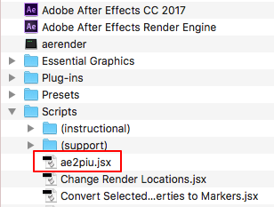
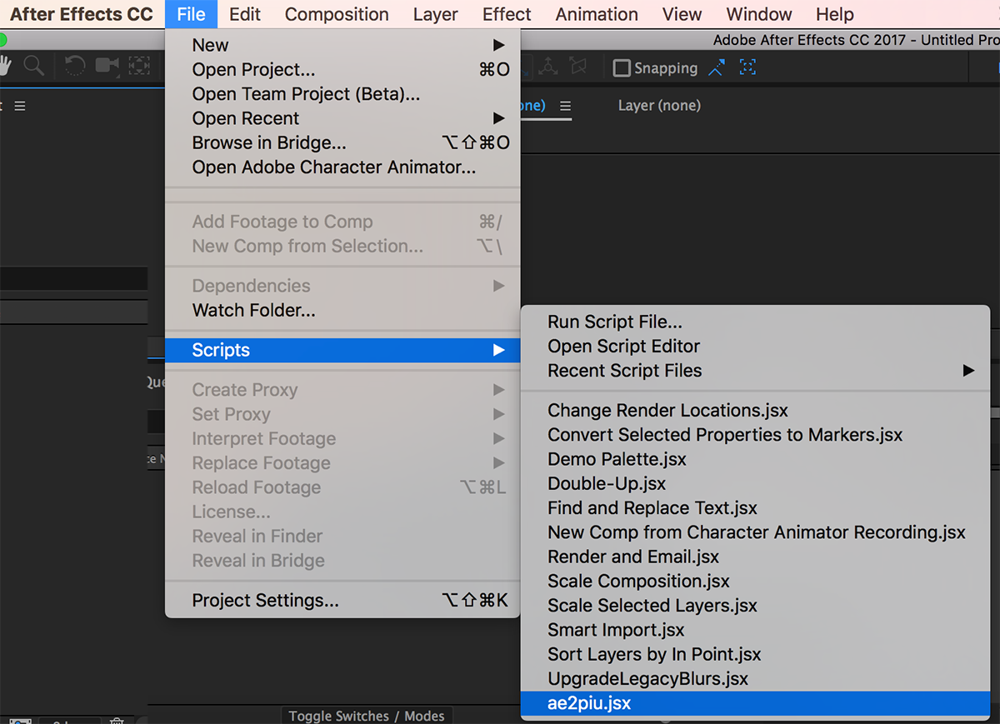

# Using Adobe After Effects to export Moddable motion data
Copyright 2017 Moddable Tech, Inc. 
Revised: September 26, 2017

## Introduction

Adobe After Effects can be used to export motion data into a Moddable sample app for use in development.

Moddable motion control only supports position. 

In AE only layers with assets are exported and only positions are exported. Scaling, rotation, transparncy, etc. are not exported.

Piu interpolates linearly between values in the array. You can reduce the frame rate in After Effects to reduce the size of the arrays. Piu will animate between values based on defined time length of the motion effect.

### Installing the export script in After Effects

Install the ae2piu.jsx script in the "scripts" folder within your After Effects application folder.

 

	

### Exporting motion data

To run the script select "ae2piu.jsx" from the File -> Scripts menu.

 

When you run the export script in After Effects, it displays a dialog box to select a folder. Create a new folder the first time. The export script copies the assets and creates the manifest.json and main.js files for a complete Moddable application. To build the project and run in the Moddable Simulator use the following command.

	cd <the folder you selected>
	mcconfig -m

### Notes

The length of the total animation is taken from the AE composition.

Time values are exported as milliseconds.

AE easing is not exported but Moddable easing can be added to the exported code.

Example: (null replaced by Math.quadEaseOut) 

	this.steps(ball, { x:ballX, y:ballY }, 2333, null, 0, 0);
	
	this.steps(ball, { x:ballX, y:ballY }, 2333, Math.quadEaseOut, 0, 0);

