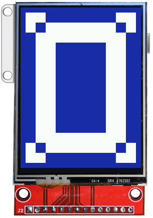

# Die Cut
Copyright 2016 Moddable Tech, Inc. 
Revised: November 22, 2016

## Introduction

To get animations on a screen connected to a microcontroller by a serial interface (SPI), the game is to minimize the number of pixels that change from frame to frame.

> FYI, here is what is happening at every frame when changes in the appearance or the layout invalidate and update the screen:
> 
> - The dirty region accumulates the invalidations.
> - The containment hierarchy is traversed once to build the command list that will update the screen.
> - The dirty region and the command list are decomposed into rectangles and display lists.
> - Rectangles and display lists are processed to send blocks of pixels to the screen.

The `die` object is a `layout` object that allows animations and transitions to “die cut” contents with a region. Thanks to regions operations, the `die` object minimizes the areas to invalidate and to update. It can give the illusion of full screen animations while few pixels are in fact changing.

## Examples

Let us begin with a static example:

	let TestContainer = Container.template($ => ({
		left:0, right:0, top:0, bottom:0, skin:blueSkin,
		contents: [
			Die($, {
				left:0, right:0, top:0, bottom:0,
				Behavior: class extends Behavior {
					onDisplaying(die) {
						let w = die.width, h = die.height;
						die.empty()
							.or(10, 10, 40, 40)
							.or(w - 50, 10, 40, 40)
							.or(w - 50, h - 50, 40, 40)
							.or(10, h - 50, 40, 40)
							.xor(30, 30, w - 60, h - 60)
							.sub(70, 70, w - 140, h - 140)
							.cut();
					}
				},
				contents: [
					Content($, { left:0, right:0, top:0, bottom:0, skin:whiteSkin,
				]
			}),
		]
	}));
	
The `empty`, `or`, `xor` and `sub` methods are chainable operations to build the region. The `cut` method changes the region.

If you add the `TestContainer` to an application, here is what it will look like:

But of course the `die` object is mostly interesting to build animations and transitions. You will find examples in the Piu libraries: WipeTransition and CombTransition. 

Let us build a "venitian blind" transition:

	class VenitianBlindTransition extends Transition {
		constructor(duration) {
			super(duration);
		}
		onBegin(container, former, current) {
			container.add(current);
			this.container = container;
			this.die = new Die(null, {});
			this.die.attach(current);
		}
		onEnd(container, former, current) {
			this.die.detach();
			container.remove(former);
		}
		onStep(fraction) {
			let die = this.die;
			die.empty();
			let width = die.width;
			let height = die.height;
			let y = 0;
			let step = height >> 3;
			let delta = Math.round(fraction * step);
			for (let i = 0; i < 8; i++) {
				die.or(0, y, width, delta);
				y += step;
			}
			die.cut();
		}
	}

The `attach` and `detach` methods allow to temporarily insert a `die` object in the containment hierarchy. At every step of the transition the region changes to progressively close the "venitian blind".

## Reference

The `die` object is a `layout` object that allows to “die cut” its contents with a region. The `die` object maintains two regions: 

- the work region that the available operations build, 
- the clip region that clips the contents of the `die` object

Both regions are initially empty.

#### Prototype Description

Prototype inherits from `Layout.prototype`.

##### `Die.prototype.and(x, y, width, height)`

> `x, y, width, height` a local rectangle, in pixels
> 
> Intersect the rectangle with the work region. Return this.

##### `Die.prototype.attach(content)`

> `content ` the `content` object to attach
> 
> Bind the `die` object to the content hierarchy by replacing the specified `content` object in the content's container with this `die` object and adding the `content` object to this `die` object.

##### `Die.prototype.cut()`

>  Copy the work region into the current region. Invalidate only the difference between the work and the clip regions.

##### `Die.prototype.empty()`

> Empty the work region. Return `this`

##### `Die.prototype.detach()`

> Unbind this `die` object from the content hierarchy by removing the first `content` object from this `die` object and replacing this `die` object in its container with the removed `content` object.

##### `Die.prototype.fill()`

> Set the work region to the bounds of this `die` object. Return `this`

##### `Die.prototype.or(x, y, width, height)`

> `x, y, width, height` a local rectangle, in pixels
> 
> Inclusively union the rectangle with the work region. Return `this`.

##### `Die.prototype.set(x, y, width, height)`

> `x, y, width, height` a local rectangle, in pixels
> 
> Set the work region to the rectangle. Return `this`.

##### `Die.prototype.sub(x, y, width, height)`

> `x, y, width, height` a local rectangle, in pixels
> 
> Subtract the rectangle from the work region. Return `this`.

##### `Die.prototype.xor(x, y, width, height)`

> `x, y, width, height` a local rectangle, in pixels
> 
> Exclusively union the work region with the rectangle. Return `this`.

