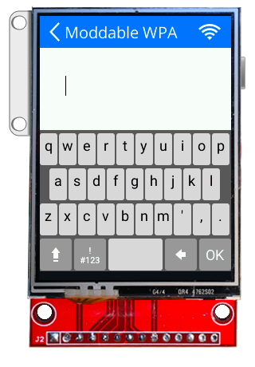

# Expanding Keyboard Reference
Copyright 2019 Moddable Tech, Inc.<BR>
Revised: July 2, 2019

The vertical and horizontal expanding keyboard modules implement touch screen keyboards for use with [Piu](https://github.com/Moddable-OpenSource/moddable/blob/public/documentation/piu/piu.md) on Moddable One and Moddable Two [products](https://www.moddable.com/product.php). The keys automatically expand when tapped, eliminating the need for a stylus. Both keyboards implement the same API. 

- **Source code:** [`vertical/keyboard.js`](../../modules/input/expanding-keyboard/vertical/keyboard.js) [`horizontal/keyboard.js`](../../modules/input/expanding-keyboard/horizontal/keyboard.js)
- **Relevant Examples:** [vertical-expanding-keyboard](../../examples/piu/vertical-expanding-keyboard/main.js) [horizontal-expanding-keyboard](../../examples/piu/horizontal-expanding-keyboard/main.js)

The keyboards are designed to fit a 240 x 320 screen. The vertical keyboard height is 185 pixels. The horizontal keyboard height is 164 pixels and designed to run in a landscape orientation. Both orientations fill the application screen width.

Key presses trigger events that can be captured in the application's behavior. The style (font and weight) of the keyboard's text are defined by a [`Style`](./piu.md#style-object) object supplied by the caller. This allows the use of `Style` templates.

A `KeyboardField` container and associated behavior are additionally provided to facilitate integrating the keyboard into apps. This container displays the keys pressed along with a blinking I-beam cursor. The `KeyboardField` height should be tall enough to fit the I-beam cursor, which is outset from the field text.

## Keyboard Module Exports

| Export | Type |  Description |
| :---: | :---: | :--- |
| `VerticalExpandingKeyboard` | `constructor` | Constructor used to create vertical expanding keyboard instances. |
| `HorizontalExpandingKeyboard` | `constructor` | Constructor used to create horizontal expanding keyboard instances. |

```js
import {VerticalExpandingKeyboard} from "keyboard";
import {HorizontalExpandingKeyboard} from "keyboard";
```

## KeyboardField Module Exports

| Export | Type |  Description |
| :---: | :---: | :--- |
| `KeyboardField` | `constructor` | Constructor used to create keyboard field instances. |

```js
import {KeyboardField} from "common/keyboard";
```

## Keyboard Objects

### Constructor Description

#### `VerticalExpandingKeyboard(behaviorData, dictionary)`
#### `HorizontalExpandingKeyboard(behaviorData, dictionary)`

| Argument | Type | Description |
| :---: | :---: | :--- | 
| `behaviorData`	| `*` |	A parameter that is passed into the `onCreate `function of the keyboard's `behavior`. This may be any type of object, including `null` or a dictionary with arbitrary parameters.
| `dictionary` | `object` | An object with properties to configure the resulting keyboard. Only parameters specified in the [Dictionary](#keyboard-dictionary) section below will have an effect; other parameters will be ignored.

Returns a `VerticalExpandingKeyboard` or `HorizontalExpandingKeyboard` `Container` instance.

```js
const KeyboardStyle = Style.template({ font:"18px Roboto", color:"black" });
let keyboard = new VerticalExpandingKeyboard(null, { Style:KeyboardStyle, target:this.data["FIELD"] });
```



<a id="keyboard-dictionary"></a>
### Dictionary

| Parameter | Type | Default Value | Description |
| :---: | :---: | :---: | :--- | 
| `Style` | `style` | n/a | **Required.** A Piu Style object that will be used for the text on keys. |
| `target` | `object` | n/a | **Required.** A Piu Container object that will receive the `onKeyUp` event. |
| `doTransition` | `boolean` | `false`| Whether or not to transition in the keyboard when it is first displayed and transition out when dismissed. |

<a id="key-callback"></a>
### Triggered Events

#### `onKeyboardOK(container, text)`

| Argument | Type | Description |
| :---: | :---: | :--- | 
| `container` | `object` | The behavior's Container object |
| `text` | `string` | The complete string entered into the field |

The keyboard bubbles this event when the OK button is pressed.

#### `onKeyboardRowsContracted(container)`

| Argument | Type | Description |
| :---: | :---: | :--- | 
| `container` | `object` | The behavior's Container object |

The keyboard bubbles this event when it is done horizontally contracting the keyboard rows back to the unzoomed view.

#### `onKeyboardRowsExpanded(container)`

| Argument | Type | Description |
| :---: | :---: | :--- | 
| `container` | `object` | The behavior's Container object |

The keyboard bubbles this event when it is done horizontally expanding the keyboard rows to the zoomed view.

#### `onKeyboardTransitionFinished(container, out)`

| Argument | Type | Description |
| :---: | :---: | :--- | 
| `container` | `object` | The behavior's Container object |
| `out` | `boolean` | Set `true` when the keyboard transitions out of view, `false` when the keyboard transitions into view |

The keyboard bubbles this event when it is done transitioning on and off the screen. The `onKeyboardTransitionFinished` function will usually be implemented and triggered in the calling application's behavior.

#### `onKeyUp(container, key)`

| Argument | Type | Description |
| :---: | :---: | :--- | 
| `container` | `object` | The behavior's Container object |
| `key` | `string` | The string value of the key that was pressed (e.g., `'a'`, `'3'`, `'$'`). It can also be `\b` for backspace or `\r` for the submit button.|

The keyboard bubbles the `onKeyUp` event when a key is released. The `onKeyUp` function will usually be implemented and triggered in the calling application's behavior.

***

## KeyboardField Object

### Constructor Description

#### `KeyboardField(behaviorData, dictionary)`

| Argument | Type | Description |
| :---: | :---: | :--- | 
| `behaviorData`	| `*` |	A parameter that is passed into the `onCreate `function of the keyboard field's `behavior`. This may be any type of object, including `null` or a dictionary with arbitrary parameters.
| `dictionary` | `object` | An object with properties to configure the resulting keyboard field. Only parameters specified in the [Dictionary](#keyboard-field-dictionary) section below will have an effect; other parameters will be ignored.

Returns a `KeyboardField` `Container` instance.

```js
const FieldStyle = Style.template({ font: "20px Open Sans", color: "black", horizontal:"left", vertical:"middle" });
let keyboardField = new KeyboardField(null, { Style:FieldStyle });
```

<a id="keyboard-field-dictionary"></a>
### Dictionary

| Parameter | Type | Default Value | Description |
| :---: | :---: | :---: | :--- | 
| `Style` | `style` | n/a | **Required.** A Piu Style object that will be used for the keyboard entry text. |
| `password` | `boolean` | `false` | Set `true` to enable password mode. The password mode hides each character displayed after a short delay. |

### Triggered Events

#### `onKeyboardOK(container, text)`

| Argument | Type | Description |
| :---: | :---: | :--- | 
| `container` | `object` | The behavior's Container object |
| `text` | `string` | The complete string entered into the field |

The keyboard bubbles this event when the OK button is pressed.

