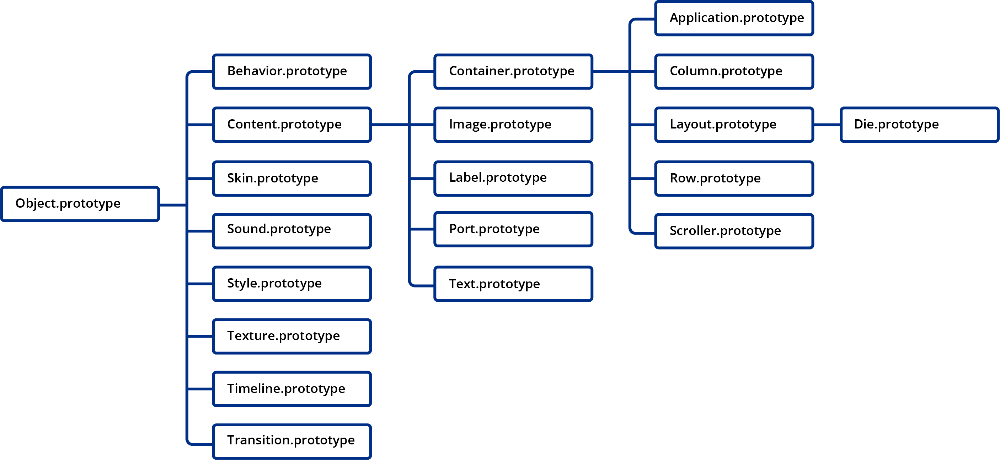
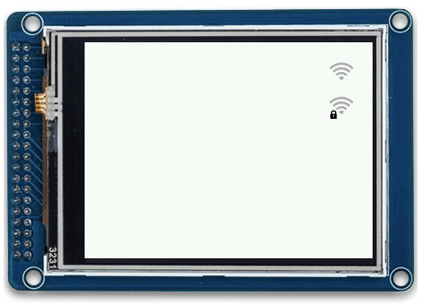
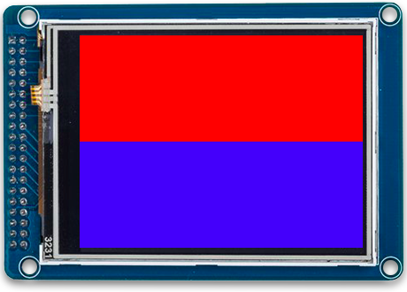
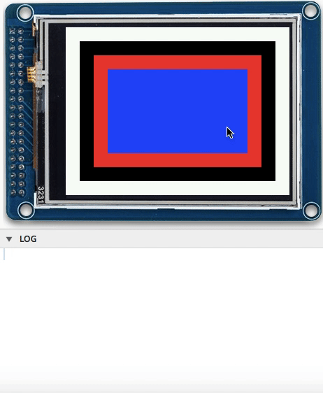
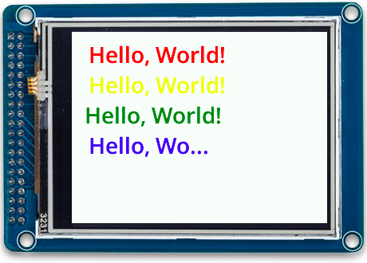
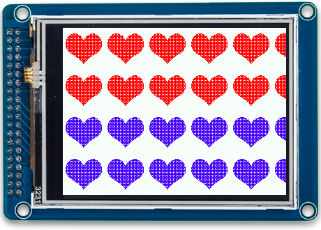
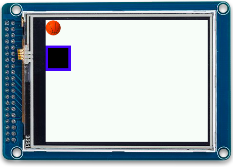

# Piu JavaScript Reference
Copyright 2017-2022 Moddable Tech, Inc.<BR>
Revised: January 24, 2022

## About This Document

Piu is a user interface framework designed to run on microcontrollers. The programming interface to Piu is a JavaScript API of global constructors, functions, and objects that define the containment hierarchy, appearance, behavior, and flow of applications. This document provides details on the objects that define the Piu API and important related concepts.

## Table of Contents

  * [Inheritance Hierarchy](#inheritance-hierarchy)
  * [Introduction to Important Concepts](#introduction-to-important-concepts)
    * [Containment Hierarchy and Appearance](#containment-hierarchy-and-appearance)
    * [Behavior and Flow](#behavior-and-flow)
  * [Global Properties](#global-properties)
 	 * [Built-in Properties](#built-in-properties)
 	 * [Adding Additional Properties](#adding-additional-properties)
  * [Descriptions of Properties](#descriptions-of-properties)
  	 * [Anchor](#anchor)
 	 * [Color](#color)
 	 * [Coordinates](#coordinates)
 	 * [Duration, Fraction, Interval, Loop, and Time](#duration-fraction-interval-loop-and-time)
 	 * [Font](#font)
 	 * [Tiles](#tiles)
 	 * [Variant, Variants, State, and States](#variant-variants-state-and-states)
  * [Piu Object Reference](#piu-object-reference)
 	 * [Application Object](#application-object)
 	 * [Behavior Object](#behavior-object)
 	 * [Column Object](#column-object)
 	 * [Container Object](#container-object)
 	 * [Content Object](#content-object)
 	 * [Die Object](#die-object)
 	 * [Image Object](#image-object)
 	 * [Label Object](#label-object)
 	 * [Layout Object](#layout-object)
 	 * [Port Object](#port-object)
 	 * [Row Object](#row-object)
 	 * [Scroller Object](#scroller-object)
 	 * [Shape Object](../commodetto/outline/Outlines.md)
 	 * [Skin Object](#skin-object)
 	 * [Sound Object](#sound-object)
 	 * [Style Object](#style-object)
 	 * [Text Object](#text-object)
 	 * [Texture Object](#texture-object)
 	 * [Timeline Object](#timeline-object)
 	 * [Transition Object](#transition-object)

## Inheritance Hierarchy

Figure 1 summarizes the inheritance hierarchy for the objects described in this document. 

**Figure 1.** Piu Inheritance Hierarchy



The basic relationship between these objects in the context of a Piu application is as follows:

- Graphical parts of the user interface are all `content` objects
- `skin`, `style`, and `texture` objects customize the look (colors, fonts, etc.) of `content` objects
- `behavior` objects are bound to `content` objects to handle events
- `timeline` and `transition` objects animate `content` objects 


## Introduction to Important Concepts

This section explains important concepts related to Piu applications and defines some of the terms used throughout the rest of this document.

### Containment Hierarchy and Appearance

The graphical user interface elements of Piu applications are composed of a hierarchy of `content` objects. The basic structure is as follows:

- The `application` object is the root of the containment hierarchy
- `container` objects are branches of the containment hierarchy
- `content` objects are leaves of the containment hierarchy

Applications use constructors to define `content` and `container` objects. These objects are attached to the containment hierarchy using the `add`, `insert`, and `replace` functions, and are removed from the containment hierarchy using the `remove` and `replace` functions. See [Functions](#container-functions) in the section [Container Object](#container-object) for descriptions of these properties.

#### Bound and Unbound Contents

Contents that are not attached to the containment hierarchy are called *unbound* contents; contents attached to the containment hierarchy, *bound* contents. Only objects that are part of the containment hierarchy appear on screen. 

Unbound contents do not participate in layout. They are neither measured nor fitted; consequently, their position and size are `undefined` and cannot be changed.

```javascript
let content = new Content();
let before = content.position;	// undefined
application.add(content);
let after = content.position;	// {x: 160, y:120} (assuming the application is 320x240)
```

#### Constraints

The coordinates of an object define implicit constraints on its position and size. 

For example, centered content and contents whose sizes/position are dependent on their container's size/position cannot move.

```javascript
// Cannot move
let centeredContent = new Content(null, {
	width: 10, height: 10
});
let dependentOnContainerContent = new Content(null, { 
    top: 0, left: 0, bottom: 100, right: 100,
});

// Can move
let unconstrainedContent = new Content(null, { 
    top: 0, left: 0, height: 100, width: 100
});
```

#### Measure and Fit

<a id="measured-size"></a>
##### Measured size

All contents have a *measured width* and *measured height*, which are the default width and height computed by the content itself. For example, the measured width of the following content object will be 100.

```javascript
let sampleContent = new Content(null, { 
	width: 100 
});
```

The measured width of the following content will be 0, because the content has no default width.

```javascript
let sampleContent = new Content(null, { 
	left: 0, right: 0 
});
```

The `coordinates` property of a `content` object reflect the content's measured size. This property can be changed at any time.

```javascript
sampleContent.coordinates = { 
	left: 0,
	width: 100,
	top: 0,
	height: 100 
};
```

<a id="fitted-size"></a>
##### Fitted size

All contents also have a *fitted width* and *fitted height*, which are the effective width and height of the content computed by its container.

If both `left` and `right` coordinates are defined, the content stretches horizontally with its container, and the fitted width of the content depends on the fitted width of its container. Similarly, if both `top` and `bottom` coordinates are defined, the content stretches vertically with its container, and the fitted height of the content depends on the fitted height of its container. For example, the fitted width and fitted height of the `sampleContent` object here will both be 100.

```javascript
let sampleContent = new Content(null, { 
	left: 0, right: 0 
});
let sampleContainer = new Container(null, {
	height: 100, width: 100,
	contents: [
		sampleContent
	]
});
```

If a `left` or `right` coordinate (but not both) is defined, or if neither `left` nor `right` is defined, the fitted width equals the measured width. Similarly, if a `top` or `bottom` coordinate (but not both) is defined, or if neither `top` nor `bottom` is defined, the fitted width equals the measured height. For example, the fitted width and fitted height of the `sampleContent` object here will both be 50.

```javascript
let sampleContent = new Content(null, { 
	left: 0, top: 0, width: 50, height: 50 
});
let sampleContainer = new Container(null, {
	height: 100, width: 100,
	contents: [
		sampleContent
	]
});
```

The `width` and `height` properties of a `content` object reflect the content's fitted size. A content's measured width and height are available immediately after the content is created; the fitted width and height are not available until its `onDisplaying` event has been triggered.

```javascript
let sampleContent = new Content(null, {
	left: 0, right: 0, top: 0, height: 50,
	Behavior: class extends Behavior {
		onCreate(content) {
			let measuredHeight = content.coordinates.height; // 50
			let measuredWidth = content.coordinates.width; // undefined
			let fittedWidth = content.width; // undefined
			let fittedHeight = content.height; // 50
		}
		onDisplaying(content) {
			let fittedWidth = content.width; // 320 (assuming the application is 320x240)
			let fittedHeight = content.height; // 50
		}
	}
});
application.add(sampleContent)
```

##### Templates

*Templates* are a tool that reduce the script code needed to instantiate contents and build the containment hierarchy. Templates are often used to create objects that are similar, but have a few slightly different properties.

For example, consider the following screens:


The code for these screens without templates is unnecessarily repetitive. The only difference between `screen1` and `screen2` here is the header background color and string.

```javascript
let screen1 = new Column(null, {
	top: 0, bottom: 0, left: 0, right: 0,
	skin: new Skin({ fill: "blue" }), style: sampleStyle,
	contents: [
		Label(null, {
			top: 0, height: 40, left: 0, right: 0,
			string: "Screen 1"
		}),
		Content(null, {
			top: 0, bottom: 0, left: 0, right: 0,
			skin: new Skin({ fill: "white" })
		}),
	]
});

let screen2 = new Column(null, {
	top: 0, bottom: 0, left: 0, right: 0,
	skin: new Skin({ fill: "red" }), style: sampleStyle,
	contents: [
		Label(null, {
			top: 0, height: 40, left: 0, right: 0,
			string: "Screen 2"
		}),
		Content(null, {
			top: 0, bottom: 0, left: 0, right: 0,
			skin: new Skin({ fill: "white" })
		}),
	]
});
```

Using templates significantly reduces the amount of code needed to define the two screens.

```javascript
let BasicScreen = Column.template($ => ({
	top: 0, bottom: 0, left: 0, right: 0,
	skin: new Skin({ fill: $.headerColor }), style: sampleStyle,
	contents: [
		Label(null, {
			top: 0, height: 40, left: 0, right: 0,
			string: $.title
		}),
		Content(null, {
			top: 0, bottom: 0, left: 0, right: 0,
			skin: new Skin({ fill: "white" })
		}),
	]
}));

let screen1 = new BasicScreen({ title: "Screen 1", headerColor: "blue" });
let screen2 = new BasicScreen({ title: "Screen 2", headerColor: "red" });
```

As seen in the example above, the constructor has one parameter, `$`, which applications use to pass data to the template. The data may have any prototype; it is often a `string`, `number`, or JSON object. In their attributes, `content` and `container` objects use `$` to access data properties. The `$` parameter is referred to as “the data” or “the instantiating data.”

The `template` function for most Piu objects returns a constructor and a `template` function; the only exceptions are the `Skin` and `Texture` objects, which simply return constructors. These `template` functions allow constructors to be further specialized. In the example below, a `HeaderWithBehavior` instance would have all the properties of a `BasicHeader` instance in addition to being active and having a behavior.

```javascript
let headerStyle = new Style({ font:"600 28px Open Sans", color: "white", horizontal: "left" });
let headerSkin = new Skin({ fill: "blue" });
let BasicHeader = Label.template($ => ({
	top: 0, height: 40, left: 0, right: 0,
	skin: headerSkin, style: headerStyle, string: $
}));

class HeaderBehavior extends Behavior {
	onTouchEnded(header) {
		trace("Header tapped\n");
	}
}
let HeaderWithBehavior = BasicHeader.template($ => ({
	active: true, Behavior: HeaderBehavior
}));
```
### Behavior and Flow

#### Events

Piu delivers *events* to the containment hierarchy of applications, and `content` objects can reference `behavior` objects, which contain functions that respond to events. Piu uses events extensively.

When a `content` object receives an event, it checks whether its `behavior` object has a corresponding function to respond to that event (either directly or indirectly in its prototype chain). If it does, the `content` object calls the function, passing itself as the first parameter. If it does not, nothing happens.

##### Low-level events

Piu defines low-level events that are useful on a wide range of target devices. For example, `onTouchBegan` and `onTouchEnded` are useful for target devices with touch screens.

##### Higher-level events

Applications can also define their own higher-level events. To help efficiently implement common event propagation patterns, contents have `delegate`, `distribute`, `bubble`, `firstThat`, and `lastThat` properties. See [Functions](#content-functions) in the section [Content Object](#content-object) for descriptions of these properties.

#### Animations

There are multiple ways to create time-based animation behaviors. One way is to use `content` objects as clocks, as described in the [Duration, Fraction, Interval, Loop, and Time](#duration-fraction-interval-loop-and-time) section of this document. This method is commonly used to animate a single content in response to events (to show touch feedback, for example) and to animate a single content for long periods of time.

The simplest way to create complex behaviors that animate several contents or properties is using the `timeline` object. The `timeline` object provides a mechanism for sequencing and running a collection of tweens, making it the best method for staggered animations of multiple content objects (to transition graphical elements of a screen in and out, for example). For more information, see the [Timeline Object](#timeline-object) section of this document.

Piu `transition` objects are best for simple animations to move between screens or swap content objects. They often modify the containment hierarchy by adding or removing contents. They can also modify properties of objects as `timeline` objects do, but creating a sequence of animations is more complicated. For more information, see the [Transition Object](#transition-object) section of this document.

##### Easing equations

Animations that linearly modify the properties of content objects often appear awkward. Using easing equations is a common way to implement animations that feel more natural.

Piu extends the JavaScript `Math` object with Robert Penner’s open source easing equations (see the Easing section of [Robert Penner’s Programming Macromedia Flash MX](http://robertpenner.com/easing/penner_chapter7_tweening.pdf)). The source code is in [`piuTransition.c`][33].

The Piu implementations of these easing equations all take a single argument: a `number` in the range [0, 1]. The return value is a `number` in the range [0, 1] that maps the input to the eased output. These equations are used extensively in all types of animations. They are commonly used to map the `fraction` property of `content` objects or the `fraction` argument of a `transition` object's `onStep` function, and as an argument to many `timeline` object functions.

## Global Properties

Properties of the Piu global object can be used anywhere in an application.

### Built-in Properties

- **Source code:** [`xsGlobal.c`][1]

##### `trace(string)`

| Arguments | Type | Description
| --- | --- |  :--- |
| `string` | `string` | The string to trace

Traces the specified string in the virtual machine of the hosted application.

> Note: Strings will not be traced until a line break ("\n") has also been traced.

```javascript
trace("Hello world\n");	

let sampleVariable = 2;
trace(`sampleVariable value is: ${sampleVariable}\n`);    // "sampleVariable value is 2"
```

***

### Adding Additional Properties

Additional properites can be added by setting a property of the global object.

```javascript
global.application = new Application(null, {
	displayListLength: 2048, commandListLength: 2048
});
export default global.application;
```

## Descriptions of Properties

This section provides descriptions of select properties referenced throughout the Piu Object Reference section below.

### Anchor

Each `content` object can have an optional `anchor` property. When the template is instantiated, a reference to the created `content` object is assigned to a property of the instantiating data; the identifier of the property is the value of the `anchor` property.

Anchors allow applications to directly access specific contents and containers in a containment hierarchy instantiated from a template. This can make it easier to access objects to modify while the application is running—for example, to change the label of a string, disable a button, or add lines to a column in a table.

```javascript
let sampleStyle = new Style({ font:"600 28px Open Sans", color: "white" });
let SampleContent = Label.template($ => ({
	anchor: "ANCHORED_CONTENT", top: 0, bottom: 0, left: 0, right: 0,
	skin: new Skin({ fill: $.color }), style: sampleStyle,
	string: $.title
}));
let SampleContainer = Container.template($ => ({
	active: true, top: 0, bottom: 0, left: 0, right: 0,
	contents: [
		new SampleContent($)
	],
	Behavior: class extends Behavior {
		onCreate(container, data) {
			this.data = data;
		}
		onTouchEnded(container) {
			this.data["ANCHORED_CONTENT"].string = "Hello!"
		}
	}
}));
application.add(new SampleContainer({ title: "Tap to update", color: "blue" }));
```


### Color

A `color` parameter can be passed into the dictionaries of `skin` and `style` constructors.

To specify a color, you can use CSS names (Level 2) or hexadecimal notations (`"#RGB"`, `"#RGBA"`, `"#RRGGBB"`, `"#RRGGBBAA"`):
	
```javascript
const whiteSkin = new Skin({ fill:"white" });
const redSkin = new Skin({ fill:"#F00" });
const halfRedSkin = new Skin({ fill:"#F008" });
const greenSkin = new Skin({ fill:"#00FF00" });
const halfGreenSkin = new Skin({ fill:"#00FF0088" });
```

To specify a color with an alpha channel, you can also use a mere hexadecimal number `0xRRGGBBAA`:

```javascript
const blueSkin = new Skin({ fill:0x0000FFFF });
const halfBlueSkin = new Skin({ fill:0x0000FF88 });
```

To build such hexadecimal numbers, Piu exports functions similar to the CSS functional notations:

```javascript
import { rgb, rgba, hsl, hsla } from "piu/All";
const yellowSkin = new Skin({ fill:rgb(255, 255, 0) });
const halfYellowSkin = new Skin({ fill:rgba(255, 255, 0, 0.5) });
const cyanSkin = new Skin({ fill:hsl(180, 1, 0.5) });
const halfCyanSkin = new Skin({ fill:hsla(180, 1, 0.5, 0.5) });
```

In dictionaries, colors can be a single color or an array of 2, 3, or 4 colors. The `skin` and `style` objects blend a color based on the state of the `content` object that uses them. See [Variant, Variants, State, and States](#variant-variants-state-and-states) for more information.

### Coordinates

All `content` objects have a `coordinates` property. The coordinates property is an object with `left`, `width`, `right`, `top`, `height`, and `bottom` properties, all of which can be `undefined`.  The coordinates of contents determine their position and size relative to their container and their `previous` and `next` properties (other `content` objects in the same container). 

When a content's container is an `application`, `container`, `scroller`, or `layout` object:

- `top`, `bottom`, `left`, and `right` coordinates are all relative to their container
- If `width`, `left`, and `right` coordinates are all specified, the `left` and `right` coordinates will be overruled
- If `left` and `right` are both unspecified, the content will be centered horizontally in its container with the width specified (or a width of 0, if unspecified)
- If `height`, `top`, and `bottom` coordinates are all specified, the `top` and `bottom` coordinates will be overruled
- If `top` and `bottom` are both unspecified, the content will be centered vertically in its container with the height specified (or a height of 0, if unspecified)

When a content's container is a `column` object:

-  `top` and `bottom` coordinates are relative to their `previous` and `next` properties
- `left` and `right` coordinates are relative to their container
- If `width`, `left`, and `right` coordinates are all specified, the `left` and `right` coordinates will be overruled

When a content's container is a `row` object:

- `left` and `right` coordinates are relative to their `previous` and `next` properties
- `top` and `bottom`  coordinates are relative to their container
- If `height`, `top`, and `bottom` coordinates are all specified, the `top` and `bottom` coordinates will be overruled

### Duration, Fraction, Interval, Loop, and Time

Every content in the containment hierarchy can be used as a clock to control time-based animation behaviors using its `duration`, `fraction`, `interval`, and `time` properties.

- The `duration` property is the duration of the animation, expressed in milliseconds. 
- The `time` property provides the current time of the content’s clock. 
- The `fraction` property is the ratio of the clock’s current time to the content’s duration.
- The `interval` property is the time between frames (frame rate) of the animation, expressed in milliseconds.

The content’s `start` and `stop` functions control when the clock is running. The clock is automatically stopped when its current time reaches its duration. If the content's `loop` property is set to true, the clock will restart.

When a clock is running, the `onTimeChanged` function of its content is triggered at the interval specified by the content's `interval` property. When the content's time is equal to its duration, the `onFinished` function is triggered.

```javascript
let animatedContent = new Content(null, {
	height: 100, width: 100, loop: true,
	skin: new Skin({ fill: ["red", "yellow", "blue"] }),
	Behavior: class extends Behavior {
		onCreate(content) {
			this.startAnimation(content);
		}
		startAnimation(content) {
			content.duration = 3000;
			content.time = 0;
			content.start();
		}
		onTimeChanged(content) {
			content.state = content.fraction*2;
		}
	}
});
application.add(animatedContent);
```


#### Time-based animation

The `interval` property sets the desired frame rate for an object's clock, but be aware that it may not be exact if the application is overloaded.  It is not safe to assume, for instance, that if a content's `interval` is 2 and its `duration` is 100 that it will trigger the `onTimeChanged` event exactly 50 times before it triggers the `onFinished` event. Therefore, it is recommended that applications use the `fraction` or `time` properties to determine which frame to display for animations.

For example, consider two implementations of a button that expands and contracts 10 pixels in both directions  when tapped.


The following implementation is **not recommended**, as it assumes that `onTimeChanged` will be triggered exactly 20 times before `onFinished`. While this may work most of the time, it is possible that the content will trigger its `onFinished` event before it shrinks down to its original size.

```javascript
class ExpandingBehavior extends Behavior {
	onTouchEnded(content) {
		this.index = 0;
		content.interval = 5;
		content.duration = 100;
		content.time = 0;
		content.start();
	}
	onTimeChanged(content) {
		this.index++;
		if (this.index < 10) content.sizeBy(1, 1);
		else content.sizeBy(-1, -1);
	}
}

let expandingButton = new Content(null, {
	active: true, height: 50, width: 100,
	skin: new Skin({ fill: "blue" }),
	Behavior: ExpandingBehavior
});
```

The following implementation is better because it makes no assumptions about the number of frames that will draw and ensures that the content shrinks down to the correct size when `onFinished` is called.

```javascript
class ExpandingBehavior extends Behavior {
	onTouchEnded(content) {
		this.startingSize = { h: content.height, w: content.width };
		content.interval = 5;
		content.duration = 100;
		content.time = 0;
		content.start();
	}
	onTimeChanged(content) {
		let startingSize = this.startingSize;
		let fraction = content.fraction;
		if (fraction > 0.5) fraction = 1-fraction;
		fraction *= 20;
		content.height = startingSize.h + fraction;
		content.width = startingSize.w + fraction;
	}
	onFinished(content) {
		let startingSize = this.startingSize;
		content.height = startingSize.h;
		content.width = startingSize.w;
	}
}

let expandingButton = new Content(null, {
	active: true, height: 50, width: 100,
	skin: new Skin({ fill: "blue" }),
	Behavior: ExpandingBehavior
});
```

### Font

A `font` parameter must be passed into the dictionary of `style` constructors.

Piu uses bitmap fonts. The metrics are provided by binary FNT files, the glyphs are provided by PNG files. 

Fonts are assets and must be defined in the resources of your manifest. Use the default target or the `-alpha` or `-color` pseudo targets for fonts.

The binary FNT file format was defined by
[AngelCode](http://www.angelcode.com/products/bmfont/doc/file_format.html), which also released the [BMFont](http://www.angelcode.com/products/bmfont/) generator on Windows. On Mac you can for instance use [Glyph Designer](https://71squared.com/glyphdesigner) or [bmGlyph](https://www.bmglyph.com) to generate such files.

One bitmap font corresponds to one style, one weight, one stretch, one size and one family. You will need separate bitmap fonts for each variation.

The `Style` constructor uses the `font` property of its dictionary to lookup its font. You can just set the `font` property to the name of a binary FNT file:

```javascript
const popStyle = new Style({ font:"popFont" });
```

The `popStyle` object will use the `popFont.fnt` file in your assets.

The lookup happens only when `label` or `text` objects that use the style are bound to the displayed containment hierarchy, or when the `Style.prototype.measure` method is called.

#### Cascading Styles

In order to cascade styles, you may want to use something similar to the [CSS font shortcut](https://developer.mozilla.org/en-US/docs/Web/CSS/font). Note that if you use this method of defining fonts in an application, you should not define other fonts in the application using just the font name as described above.

```javascript
const style = new Style({ font:"italic bold 16px Open Sans" });
```

In Piu, the font property has five optional parts, in that order: 

1. style: `italic` | `normal` | `inherit`
2. weight: `100` | `ultralight` | `200` | `thin` | `300` | `light` | `400` | `normal` | `500` | `medium` | `600` | `semibold` | `700` | `bold` |  `800` | `heavy` | `900` | `black` | `lighter`  | `bolder`  | `inherit `
3. stretch: `condensed` | `normal` | `inherit `
4. size: `xx-small` | `x-small` | `small` | `medium` | `large` | `x-large` | `xx-large` | `smaller` | `larger ` | `[1-9][0-9]+px` | `[1-9][0-9]+%` | `inherit `
5. family: the rest of the font property if any.

The `inherit` value is the default value and is useful only to disambiguate a font property. By default the style of a `content` object inherits the style of its `container` objects.

All parts are optional and are cascaded separately. So you can for instance define a generic style for the application and specific styles for its contents:

```javascript
const appStyle = new Style({ font:"16px Fira Sans" });
const menuStyle = new Style({ font:"bold" });
```

Styles are only cascaded when `label` or `text` objects that use them are bound to the displayed containment hierarchy.

For Piu to find the corresponding bitmap font files in your assets, you have to adopt the following convention, based on common practices:

* the family, without spaces,
* `-`,
* the capitalized name of the stretch, if not `normal`,
* the capitalized name of the computed weight, if not `normal`, 
* the capitalized name of the style, if not `normal`,
* `Regular`, if the stretch, the computed weight and the style are all `normal`,
* `-`,
* the computed size in pixels without units.

Here above `style ` will look for `OpenSans-BoldItalic-16.fnt`, `appStyle` will look for `FiraSans-Regular-16.fnt` and `menuStyle` will look for `FiraSans-Bold-16.fnt`.


### Tiles

Applications can tile skins using their `tiles` property. The size of the tiles is determined by left, right, top, and bottom values, as follows:

- If the `tiles` property is undefined or if its `left`, `right`, `top` and `bottom` values are all undefined, the skin is just an image, for instance an icon.
- Else if only the `left` or `right` values are defined, the skin becomes a horizontal 3-part pattern. The left part is drawn at the left of the content, the right part is drawn at the right of the content, and the center part is repeated to fill the center of the content.
- Else if only the `top` or `bottom` values are defined, the skin becomes a vertical 3-part pattern. The top part is drawn at the top of the content, the bottom part is drawn at the bottom of the content, and the middle part is repeated to fill the middle of the content.
- Else the skin becomes a 9-part pattern. Corner parts are drawn in the corresponding corners of the content, side parts are repeated in the sides, and the middle part is repeated to fill the middle. The `left`, `right`, `top` and `bottom` values can all be defined to 0 to fill the content with the skin.

Tiling skins allows content objects of different sizes to share a single asset. Here is an example that uses this 30x30 pixel background to fill arbitarily sized contents.


```javascript
let roundedRectangleTexture = new Texture("roundedRectangle.png");
let roundedRectangleSkin = new Skin({ 
	texture: roundedRectangleTexture, 
	x: 0, y: 0, width: 30, height: 30, 
	tiles: { left: 5, right: 5, top: 5, bottom: 5 }
});

let sampleStyle = new Style({ font:"600 28px Open Sans", color: "white" });

let smallText = new Label(null, {
	skin: roundedRectangleSkin, top: 20, left: 20, height: 30, width: 30, 
	style: sampleStyle, string: "Hi"
});
let bigText = new Text(null, {
	skin: roundedRectangleSkin, top: 70, left: 20, height: 120, width: 100,  
	style: sampleStyle, string: "This is a long string"
});

application.add(smallText);
application.add(bigText);
```


### Variant, Variants, State, and States

Applications often use the `state` and `variant` properties of `content` objects to update their appearance. Beacuse they can change dynamically, they can be used to animate `content` objects and provide visual feedback to touch events, for example.

#### Colored skins and styles

A common way that the `state` property is used is to update the color of contents. As described in the [Color section](#color) of this document, the `fill` property of a `skin` or `style` object can be an array of colors. The `state` property of a `content` object using the `skin` determines the index of the array. If the state is not an integer, colors from surrounding states are blended.

```javascript
let multiColoredSkin = new Skin({ fill: ["black", "white", "red"] });
let blackContent = new Content(null, { 
	top: 20, left: 20, width: 80, height: 80, 
	skin: multiColoredSkin, state: 0, 
});
let redContent = new Content(null, { 
	top: 20, left: 120, width: 80, height: 80, 
	skin: multiColoredSkin, state: 2
});
let grayContent = new Content(null, { 
	top: 20, left: 220, width: 80, height: 80, 
	skin: multiColoredSkin, state: 0.5 
});
application.add(blackContent);
application.add(redContent);
application.add(grayContent);
```


#### Reusing textures

It is often convenient to store several icons or other user interface elements in a single image. Specifying `states` and `variants` properties in the dictionary of `skin` constructors enables you to reference different sections of the same texture. This prevents an application from having to reference similar images and create multiple skins. 

The `states` and `variants` properties of a skin are numerical values used to define the size of a single element in the texture. The `states` property represents the vertical offset between states, and the `variants` property represents the horizontal offset between variants. Here is an example of an asset that includes ten 28x28 pixel icons in one image, and a `skin` that will allow applications to reference each icon separately.


```javascript
const wiFiStripTexture = new Texture({ path:"wifi-strip.png" });
const wiFiSkin = new Skin({ 
	texture: wiFiStripTexture, 
	width: 28, height: 28, 
	states: 28, variants: 28
});
```

The `states` and `variants` properties of `texture` objects should not be confused with the `state` and `variant` properties of `content` objects, although they are related. The `state` and `variant` of a `content` object are used to select which area of their `skin` to render. Here is a visualization of the `state` and `variant` properties a `content` would use to reference different portions of the `skin` object from the last example.


The `state` and `variant` of a `content` can be updated at any time. This is often done when an event is triggered.

```javscript
let WiFiStatusIcon = Content.template($ => ({
    skin: wiFiSkin, state: $.passwordProtected, variant: 0,
    interval: 500, duration: 2500, loop: true,
    active: true,
    Behavior: class extends Behavior {
    	onDisplaying(content) {
    		content.start();
    	}
        onTimeChanged(content) {
        	let variant = content.variant;
        	variant++;
        	if (variant > 4) variant = 0;
        	content.variant = variant;
        }
    }
}));
application.add(new WiFiStatusIcon({ passwordProtected: false }, { top: 20, right: 20 }));
application.add(new WiFiStatusIcon({ passwordProtected: true }, { top: 58, right: 20 }));
```



## Piu Object Reference

This section provides details on the objects that define the Piu API. For each object, the following information is presented if relevant:

- **Source Code**: A link to the source code for the object

- **Relevant Examples**: Links to example apps that demonstrate how to use the object

- **Constructor Description**: A description of the object's constructor(s)

- **Dictionary**: Present when additional information is needed regarding the dictionary passed to the object's dictionary-based constructor; describes the properties that the dictionary may contain. Dictionary parameters set properties having the same name (unless noted otherwise) in the created instance.

- **Prototype Description**: The prototype from which this object's prototype inherits and descriptions of any properties and functions specific to this object's prototype

- **Events**: Descriptions of the events that the object triggers

For the complete JavaScript programming interface, see [`piuAll.js`][0].

### Application Object

- **Source code:** [`piuApplication.c`][2]
- **Relevant Examples:** all

All Piu applications must have an `application` object at the root of their containment hierarchy. All other `content` objects must be added to the `application` to appear on screen. 

There is no default object, so you have to create one yourself and export it in the main module.

```javascript
export default new Application();
```

Alternatively, you can export a function that returns an `application` object. 

```javascript
export default function() {
	return new Application();
}
```

#### Constructor Description

##### `Application([behaviorData, dictionary])`

| Arguments | Type | Description
| --- | --- | :--- |
| `behaviorData` | `*` | A parameter that is passed into the `onCreate` function of this container's `behavior`. This may be any type of object, including `null` or a dictionary with arbitrary parameters.
| `dictionary` | `object` | An object with properties to initialize the result. Only parameters specified in the [Dictionary](#dictionary) section below will have an effect; other parameters will be ignored.

Returns an `application` instance, an object that inherits from `Container.prototype`.

```javascript
export default new Application(null, {
	top: 0, bottom: 0, left: 0, right: 0,
	skin: new Skin({ fill: "blue" }),
});
```


##### `Application.template(anonymous)`

| Arguments | Type | Description
| --- | --- | :--- |
| `anonymous` | `function` | A function that returns an object with properties to initialize the instances that the result creates

Returns a constructor, a function that creates instances of `Application.prototype`. The `prototype` property of the result is `Application.prototype`. The result also provides a `template` function.

```javascript
// Taken from the balls example app

...

let BallApplication = Application.template($ => ({
	skin:backgroundSkin,
	contents: [
		Content(6, { left:0, top:0, skin:ballSkin, variant:0, Behavior: BallBehavior } ),
		Content(5, { right:0, top:0, skin:ballSkin, variant:1, Behavior: BallBehavior } ),
		Content(4, { right:0, bottom:0, skin:ballSkin, variant:2, Behavior: BallBehavior } ),
		Content(3, { left:0, bottom:0, skin:ballSkin, variant:3, Behavior: BallBehavior } ),
	]
}));

export default new BallApplication(null, { displayListLength:4096, touchCount:0 });
```

#### Dictionary

Same as for `container` object (see [Dictionary](#container-dictionary) in the section [Container Object](#container-object)), plus:

| Parameter | Type | Description |
| --- | --- | :--- |
| `commandListLength ` | `number` | The size of the command list buffer in bytes used for holding Piu drawing operations
| `displayListLength ` | `number` | The size of the display list buffer in bytes for targets using the Poco rendering engine
| `touchCount` | `number` | The number of touch events that can trigger at the same time

#### Prototype Description

Prototype inherits from `Container.prototype`.

### Behavior Object

- **Source code:** [`piuBehavior.c`][3]
- **Relevant Examples:** [balls][18], [drag][19]

The `behavior` object contains functions corresponding to events triggered by a `content` object. A `content` object checks whether its behavior owns or inherits a function property with the name of the event, and if so calls that function, passing itself as the first parameter.

#### Constructor Description

Applications define their own constructors for `behavior` objects, which inherit from `Behavior.prototype` and assign them to `content` objects when they are constructed. When a `content` object is constructed, it creates an instance of the behavior class assigned to it and triggers the behavior's `onCreate` event. This function does nothing by default; a behavior can use it to initialize its properties, for example.

```javascript
class SampleBehavior extends Behavior {
	onCreate(content, data) {
		this.name = data.name;
	}
	onTouchEnded(content) {
		trace(`Name is: ${this.name}\n`);	// "Name is: Moddable"
	}
}

let sampleContent = new Content({ name: "Moddable" }, { 
    active: true, height: 100, width: 100,
    skin: new Skin({fill: "blue"}),
    Behavior: SampleBehavior
});
application.add(sampleContent);
```


#### Prototype Description

Prototype inherits from `Object.prototype`.

### Column Object

- **Source code:** [`piuColumn.c`][4]
- **Relevant Examples:** [keyboard][20], [weather][21]

The `column` object is a `container` object that arranges its contents vertically.

#### Constructor Description

##### `Column([behaviorData, dictionary])`

| Arguments | Type | Description
| --- | --- | :--- |
| `behaviorData` | `*` | A parameter that is passed into the `onCreate` function of this content's `behavior`. This may be any type of object, including `null` or a dictionary with arbitrary parameters.
| `dictionary` | `object` | An object with properties to initialize the result. The dictionary is the same as for the `content` object. Only parameters specified in the [Dictionary](#content-dictionary) section of the [Content Object](#container-object) will have an effect; other parameters will be ignored.

Returns a `column` instance, an object that inherits from `Column .prototype`

```javascript
let ColoredSquare = Content.template($ => ({
	left: 0, right: 0, top: 0, bottom: 0,
	skin: new Skin({ fill: $ })
}));

let sampleColumn = new Column(null, {
	top: 0, bottom: 0, left: 0, right: 0,
	contents: [
		new ColoredSquare("red"),
		new ColoredSquare("blue"),
		new ColoredSquare("black"),
	]
});
application.add(sampleColumn);
```


##### `Column.template(anonymous)`

| Arguments | Type | Description
| --- | --- | :--- |
| `anonymous` | `function` | A function that returns an object with properties to initialize the instances that the result creates

Returns a constructor, a function that creates instances of `Column.prototype`. The `prototype` property of the result is `Column.prototype`. The result also provides a `template` function.

```javascript
let ColoredSquare = Content.template($ => ({
	left: 0, right: 0, top: 0, bottom: 0,
	skin: new Skin({ fill: $ })
}));

let SampleColumn = Column.template($ => ({
	top: 0, bottom: 0, left: 0, right: 0,
	contents: [
		new ColoredSquare($.firstColor),
		new ColoredSquare($.secondColor),
	],
}));
application.add(new SampleColumn({ firstColor:"red", secondColor:"blue" }));
```



#### Prototype Description

Prototype inherits from `Container.prototype`.

<a id="column-events"></a>
#### Events

Same as for `container` object (see [Events](#container-events) in the section [Container Object](#container-object))

### Container Object

- **Source code:** [`piuContainer.c`][5]
- **Relevant Examples:** [drag][19], [transitions][23]

The `container` object is a `content` object that can contain other `content` objects. In a container, `content` objects are stored in a doubly linked list. The `content` objects can also be accessed by index or by name using the `content` property, for instance `container.content(0)` or `container.content("foo")`.

#### Constructor Description

##### `Container([behaviorData, dictionary])`

| Arguments | Type | Description
| --- | --- | :--- |
| `behaviorData` | `*` | A parameter that is passed into the `onCreate` function of this container's `behavior`. This may be any type of object, including `null` or a dictionary with arbitrary parameters.
| `dictionary` | `object` | An object with properties to initialize the result.Only parameters specified in the [Dictionary](#container-dictionary) section below will have an effect; other parameters will be ignored.

Returns a `container` instance, an object that inherits from `Container.prototype`.

```javascript
let ColoredSquare = Content.template($ => ({
	height: 100, width: 100,
	skin: new Skin({ fill: $ })
}));

let sampleContainer = new Container(null, { 
	top: 0, bottom: 0, left: 0, right: 0,
	skin: new Skin({fill: "white"}),
	contents: [
		new ColoredSquare("blue", { left: 0, top: 0 }),
		new ColoredSquare("red", { right: 0, top: 50 }),
		new ColoredSquare("black", { left: 100, bottom: 0 }),
	]
})
application.add(sampleContainer);
```


##### `Container.template(anonymous)`

| Arguments | Type | Description
| --- | --- | :--- |
| `anonymous` | `function` | A function that returns an object with properties to initialize the instances that the result creates

Returns a constructor, a function that creates instances of `Container.prototype`. The `prototype` property of the result is `Container.prototype`. The result also provides a `template` function.

```javascript
let ColoredSquare = Content.template($ => ({
	height: 100, width: 100,
	skin: new Skin({ fill: $ })
}));

let SampleContainer = Container.template($ => ({ 
	top: 0, bottom: 0, left: 0, right: 0,
	skin: new Skin({ fill: $.backgroundColor }),
	contents: [
		new ColoredSquare( $.squareColor ),
	]
}));
application.add(new SampleContainer({ backgroundColor: "white", squareColor: "blue" }));
```


<a id="container-dictionary"></a>
#### Dictionary

Same as for `content` object (see [Dictionary](#content-dictionary) in the section [Content Object](#content-object)), plus:

| Parameter | Type | Description |
| --- | --- | :--- |
| `clip` | `boolean` | If `true`, this container will clip its contents.

#### Prototype Description

Prototype inherits from `Content.prototype`. 

<a id="container-properties"></a>
##### Properties

Same as for `content` object (see [Properties](#content-properties) in the section [Content Object](#content-object)), plus:

| Name | Type | Default Value | Read Only | Description |
| --- | --- | --- | --- | :--- |
| `clip` | `boolean` | `false` | | If `true`, this container clips its contents.
| `first` | `object` |  | ✓ | The first `content` object in this container, or `null` if this container is empty
| `last` |`object` | | ✓ | The last `content` object in this container, or `null` if this container is empty
| `length` |`number` | | ✓ | The number of `content` objects in this container
| `transitioning` | `boolean` | `false` | ✓| If `true`, this container is running a `transition` object.

<a id="container-functions"></a>
##### Functions

**`add(content)`**

| Argument | Type | Description |
| --- | --- | :--- |
| `content` | `content` | The `content` object to add. It must be unbound; that is, its container must be `null`.

Adds the specified `content` object to this container. The `content` object becomes the last `content` object in this container.

```javascript
let ColoredSquare = Content.template($ => ({
	height: 100, width: 100,
	skin: new Skin({ fill: $ })
}));
let sampleContainer = new Container(null, { 
	top: 0, bottom: 0, left: 0, right: 0,
	skin: new Skin({ fill: "white" }),
});

sampleContainer.add(new ColoredSquare("black", {bottom: 10, left: 15}));
sampleContainer.add(new ColoredSquare("blue", {left: 100}));
sampleContainer.add(new ColoredSquare("green", {top: 10, left: 10}));
application.add(sampleContainer);
```


***

**`content(at)`**

| Argument | Type | Description |
| --- | --- | :--- |
| `at` | `number` or `string` | The `index` or `name` property of the `content` object you want to access

Returns the specified `content` object, or `undefined` if no content with the `index` or `name` specified is in this container

```javascript
let sampleContainer = new Container(null, {
	contents: [
		new Content(null, { name: "Moddable" }),
		new Content(),
	]
});
let namedContent = sampleContainer.content("Moddable");
let unnamedContent = sampleContainer.content(1);
let nonexistentContent = sampleContainer.content("Nonexistent");	// undefined
```

***

**`empty([start, stop])`**

| Argument | Type |Description |
| --- | --- | :--- |
| `start` | `number` | The starting index
| `stop` | `number` |The stopping index (`this.length` by default)

Removes `content` objects from this container, starting at index `start` and stopping at index `stop`. If `start` or `stop` is less than 0, it is an offset from `this.length`.

```javascript
let ColoredSquare = Content.template($ => ({
	height: 100, width: 100,
	skin: new Skin({ fill: $ })
}));

let sampleContainer = new Container(null, { 
	top: 0, bottom: 0, left: 0, right: 0,
	skin: new Skin({ fill: "white" }),
	contents: [
		new ColoredSquare("blue", { top: 0, left:0 }),
		new ColoredSquare("red", { top: 0, right: 0 })
	]
});

sampleContainer.empty();
application.add(sampleContainer);
```


***

**`firstThat(id [, ...])`**

| Argument | Type | Description |
| --- | --- | :--- |
| `id` | `string` | The name of the event to trigger
| `...` | `*` | Zero or more extra parameters

Causes all `content` objects in this container to trigger an event named by the value of `id`. The order of traversal is from the first to the last. Traversal halts when a distributed event returns `true`. Note that the first parameter of a distributed event is the `content` object that triggers the event, not this container. Additional parameters, if any, of the event are the extra parameters of the `firstThat` function.

```javascript
class SampleBehavior extends Behavior {
	sampleEvent(content) {
		trace(content.name+" triggered\n");
		return true;
	}
}

let sampleContainer = new Container(null, { 
	top: 0, bottom: 0, left: 0, right: 0,
	skin: new Skin({ fill: "white" }),
	contents: [
		Content(null, { name: "firstContent" }),
		Content(null, { name: "secondContent", Behavior: SampleBehavior }),
		Content(null, { name: "thirdContent", Behavior: SampleBehavior }),
	],
	Behavior: class extends Behavior {
		onDisplaying(container) {
			container.firstThat("sampleEvent");	// "secondContent triggered" will be traced here
		}
	}
});
application.add(sampleContainer);
```

***

**`insert(content, before)`**

| Argument | Type | Description |
| --- | --- | :--- |
| `content` | `content` | The `content` object to insert. Its container must be `null`.
| `before` | `object` | The `content` object before which to insert. Its container must be this container.

Inserts one `content` object before another in this container as specified by the parameters

```javascript
let ColoredSquare = Content.template($ => ({
    height: 100, width: 100,
    skin: new Skin({ fill: $ })
}));

let sampleContainer = new Container(null, { 
    top: 0, bottom: 0, left: 0, right: 0,
    skin: new Skin({ fill: "white" }),
    contents: [
        new ColoredSquare("blue", { top: 0, left:0 }),
    ]
});
let redSquare = new ColoredSquare("red", { top: 20, left: 20, });
sampleContainer.insert(redSquare, sampleContainer.first);
application.add(sampleContainer);
```


***


**`lastThat(id [, ...])`**

| Argument | Type | Description |
| --- | --- | :--- |
| `id` | `string` | The name of the event to trigger
| `...` | `*` | Zero or more extra parameters

Causes all `content` objects in this container to trigger an event named by the value of `id`. The order of traversal is from the last to the first. Traversal halts when a distributed event returns `true`. Note that the first parameter of a distributed event is the `content` object that triggers the event, not this container. Additional parameters, if any, of the event are the extra parameters of the `lastThat` function.

```javascript
class SampleBehavior extends Behavior {
	sampleEvent(content) {
		trace(content.name+" triggered\n");
		return true;
	}
}

let sampleContainer = new Container(null, { 
	top: 0, bottom: 0, left: 0, right: 0,
	skin: new Skin({ fill: "white" }),
	contents: [
		Content(null, { name: "firstContent" }),
		Content(null, { name: "secondContent", Behavior: SampleBehavior }),
		Content(null, { name: "thirdContent", Behavior: SampleBehavior }),
	],
	Behavior: class extends Behavior {
		onDisplaying(container) {
			container.lastThat("sampleEvent");	// "thirdContent triggered" will be traced here
		}
	}
});
application.add(sampleContainer);
```

***

**`remove(content)`**

| Argument | Type | Description |
| --- | --- | :--- | 
| `content` | `content` | The `content` object to remove. Its container must be this container.

Removes the specified `content` object from this container

```javascript
let ColoredSquare = Content.template($ => ({
	height: 100, width: 100,
	skin: new Skin({ fill: $ })
}));

let redSquare = new ColoredSquare("red");
let blueSquare = new ColoredSquare("blue");

let sampleContainer = new Container(null, { 
	top: 0, bottom: 0, left: 0, right: 0,
	skin: new Skin({ fill: "white" }),
	contents: [
		redSquare,
		blueSquare,
	],
});
sampleContainer.remove(redSquare);
application.add(sampleContainer);
```


***

**`replace(content, by)`**

| Argument | Type | Description |
| --- | --- | :--- |
| `content` | `content` | The `content` object to replace. Its container must be this container.
| `by` | `content` | The replacing `content` object. It must be unbound; that is, its container must be `null`.

Replaces one `content` object with another in this container as specified by the parameters

```javascript
let ColoredSquare = Content.template($ => ({
	height: 100, width: 100,
	skin: new Skin({ fill: $ })
}));

let redSquare = new ColoredSquare("red");
let blueSquare = new ColoredSquare("blue");

let sampleContainer = new Container(null, { 
	top: 0, bottom: 0, left: 0, right: 0,
	skin: new Skin({ fill: "white" }),
	contents: [
		blueSquare,
	],
});
sampleContainer.replace(blueSquare, redSquare);
application.add(sampleContainer);
```


***

**`run(transition [, ...])`**

| Argument | Type | Description |
| --- | --- | :--- |
| `transition` | `transition` | The `transition` object to run
| `...` | `*` | Zero or more extra parameters

Runs the specified `transition` object in this container, binding that object to this container for the duration of the transition. The extra parameters are passed to the `onBegin` and `onEnd` functions of the `transition` object. The container triggers the `onTransitionBeginning` event before the transition starts and the `onTransitionEnded` event after the transition ends.

```javascript
import CombTransition from "piu/CombTransition";
class SwitchScreenBehavior extends Behavior {
	onCreate(content, data) {
		this.data = data;
	}
	onTouchEnded(content) {
		let data = this.data;
		let transition = new CombTransition(250, Math.quadEaseOut, "horizontal", 4);
		let nextScreen = new ColoredScreen({ color: data.nextColor, nextColor: data.color })
		application.run(transition, application.first, nextScreen);
	}
}
let ColoredScreen = Container.template($ => ({
	top: 0, bottom: 0, left: 0, right: 0, 
	skin: new Skin({ fill: $.color }),
	contents: [
		Content($, {
			active: true, height: 100, width: 100, 
			skin: new Skin({ fill: $.nextColor }),
			Behavior: SwitchScreenBehavior
		})
	]
}));
application.add(new ColoredScreen({ color: "red", nextColor: "blue" }));
```


***

**`swap(content0, content1)`**

| Argument | Type | Description |
| --- | --- | :--- |
| `content0, content1` | `content` | The `content` objects to swap. The container of both objects must be this container.

Swaps the specified `content` objects in this container

```javascript
let ColoredSquare = Content.template($ => ({
    height: 100, width: 100,
    skin: new Skin({ fill: $ })
}));

let sampleContainer = new Container(null, { 
    active: true, top: 0, bottom: 0, left: 0, right: 0,
    skin: new Skin({ fill: "white" }),
    contents: [
        new ColoredSquare("blue", { top: 0, left:0 }),
        new ColoredSquare("red", { top: 50, left:50 }),
    ],
    Behavior: class extends Behavior {
    	onTouchEnded(container) {
    		container.swap(container.first, container.last);
    	}
    }
});
application.add(sampleContainer);
```


***

<a id="container-events"></a>
#### Events

Same as for `content` object (see [Events](#content-events) in the section [Content Object](#content-object)), plus:

**`onTransitionBeginning(container)`**

| Argument | Type | Description |
| --- | --- | :--- |
| `container` | `container` | The `container` object that triggered the event

This event is triggered when a `transition` object starts in the specified `container` object.

***

**`onTransitionEnded(container)`**

| Argument | Type | Description |
| --- | --- | :--- | 
| `container` | `container` | The `container` object that triggered the event

This event is triggered when a `transition` object ends in the specified `container` object.

***

### Content Object

- **Source code:** [`piuContent.c`][6]
- **Relevant Examples:** [balls][18], [love-js][20]

Applications use `content` objects for graphical parts of their user interface, such as buttons, icons, sliders, switches, and tabs.

#### Constructor Description

##### `Content([behaviorData, dictionary])`

| Argument | Type | Description |
| --- | --- | :--- | 
| `behaviorData` | `*` | A parameter that is passed into the `onCreate` function of this content's `behavior`. This may be any type of object, including `null` or a dictionary with arbitrary parameters.
| `dictionary` | `object` | An object with properties to initialize the result. Only parameters specified in the [Dictionary](#content-dictionary) section below will have an effect; other parameters will be ignored.

Returns a `content` instance, an object that inherits from `Content.prototype`

```javascript
let sampleContent = new Content("Hello", { 
	top: 0, right: 50, height: 100, width: 100,
	skin: new Skin({fill: "blue"}),
	Behavior: class extends Behavior {
		onCreate(content, data) {
			trace(`${data}\n`);		// Prints "Hello" to console
		}
	}
})
application.add(sampleContent);
```


 
##### `Content.template(anonymous)`

| Arguments | Type | Description
| --- | --- | :--- |
| `anonymous` | `function` | A function that returns an object with properties to initialize the instances that the result creates

Returns a constructor, a function that creates instances of `Content.prototype`. The `prototype` property of the result is `Content.prototype`. The result also provides a `template` function.

```javascript
let SampleContent = Content.template($ => ({ 
	height: 100, width: 100,
	skin: new Skin({fill: $.color}),
	Behavior: class extends Behavior {
		onCreate(content, data) {
			trace(`This box is ${data.color}\n`);		// Prints "This box is red" to console
		}
	}
}));
application.add(new SampleContent({color: "red"}, {top: 0, right: 50}));
application.add(new SampleContent({color: "blue"}));
```


<a id="content-dictionary"></a>
#### Dictionary

| Parameter | Type | Description |
| --- | --- | :--- |
| `active` | `boolean` | If `true`, this content can be touched; that is, it triggers touch events. |
| `anchor` | `string` | Creates an anchor, a reference to the created `content` object in the instantiating data
| `backgroundTouch ` | `boolean` | If `true`, this container receives any touch events that are received by its contents; that is, it will trigger touch events when one of its contents has been touched.
| `Behavior` | `function` | A function that creates instances of `Behavior.prototype`; generally a class that extends the `Behavior` class. This content will create an instance of this `behavior`, set its `behavior` parameter to the created instance, and trigger the `onCreate` method. 
| `bottom` | `number` | This content's `bottom` coordinate, in pixels (setting `bottom` in the created instance's `coordinates` property)
| `duration` | `number` |This content's duration, in milliseconds. This content triggers the `onFinished` event when its clock is running and its time equals its duration.
| `exclusiveTouch` | `boolean` | If `true`, this content always captures touches; that is, `captureTouch` is implicitly invoked on `onTouchDown` for this content. Setting `exclusiveTouch` to `true` is equivalent to calling `captureTouch` in response to the `onTouchDown` event for every touch id.
| `fraction` | `number` | This content's fraction--that is, the ratio of its time to its duration
| `height` | `number` | This content's height, in pixels (setting `height` in the created instance's `coordinates` property)
| `interval` | `number` | The time between ticks of this content's clock--that is, number of milliseconds between triggering the `onTimeChanged` events of the content's behavior when its clock is running.
| `left` | `number` | This content's `left` coordinate, in pixels (setting `left` in the created instance's `coordinates` property)
| `loop` | `boolean` | If `true`, this content will restart its clock when its time equals its duration
| `multipleTouch` | `boolean` | If `true`, this content handles multiple touches.
| `name` | `string` | This content's name
| `right` | `number` | This content's `right` coordinate, in pixels (setting `right` in the created instance's `coordinates` property)
| `skin` | `skin` | This content's skin
| `Skin` | `function` | A function that creates instances of `Skin.prototype`. This content will create an instance of this `skin`, and set its `skin` parameter to the created instance.
| `state` | `number` | This content's state. If this content's skin defines states, setting the state changes the appearance of this content.
| `style` | `style` | This content's style
| `Style` | `function` | A function that creates instances of `Style.prototype`. This content will create an instance of this `style`, and set its `style` parameter to the created instance.
| `time` | `number` | This content's time, in milliseconds. When its time is set, this content triggers the `onTimeChanged` event.
| `top` | `number` | This content's `top` coordinate, in pixels (setting `top` in the created instance's `coordinates` property)
| `variant` | `number` | This content's variant. If this content's skin defines variants, setting the variant changes the appearance of this content.
| `visible` | `boolean` | If `true`, this content is visible.
| `width` | `number` | This content's width, in pixels (setting `width` in the created instance's `coordinates` property)

#### Prototype Description

Prototype inherits from `Object.prototype`. 

<a id="content-properties"></a>
##### Properties

| Name | Type | Default Value | Read Only | Description |
| --- | --- | --- | --- | :--- |
| `active` | `boolean` | `false` | | If `true`, this content can be touched; that is, it triggers touch events.
| `anchor` | `string` | The identifier of the property that references this content object in its instantiating data
| `backgroundTouch ` | `boolean` | `false` | | If `true`, this container receives any touch events that are received by its contents; that is, it will trigger touch events when one of its contents has been touched.
| `behavior` | `object` | `null` |  | This content's `behavior` object or `null`. When this content triggers an event, it calls the corresponding function property of its behavior, if any.
| `bounds` | `object` | | | This content's global position and size, as an object with `x`, `y`, `width`, and `height` number properties, specified in pixels. If this content is unbound, the getter returns `undefined` and the setter is ignored.
| `container` | `object` | |  ✓ | This content's container, or `null` if this content is unbound--that is, if it has no container
| `coordinates` | `object` | | | This content's coordinates, as an object with `left`, `width`, `right`, `top`, `height`, or `bottom` number properties (specified in pixels), or an empty object if no coordinates are passed into the constructor
| `duration` | `number` | 0 | | This content's duration, in milliseconds. This content triggers the `onFinished` event when its clock is running and its time equals its duration.
| `exclusiveTouch` | `boolean` | `false` | | If `true`, this content always captures touches; that is, `captureTouch` is implicitly invoked on `onTouchDown` for this content. Setting `exclusiveTouch` to `true` is equivalent to calling `captureTouch` in response to the `onTouchDown` event for every touch id.
| `fraction` | `number` | `undefined` | | This content's fraction--that is, the ratio of its time to its duration. If the duration is 0, the getter returns `undefined` and the setter is ignored. This content triggers the `onTimeChanged` event when its fraction is set.
| `height` | `number` | | | This content's height, in pixels
| `index` | `number` | | ✓ |The index of this content in its container, or –1 if this content is unbound
| `interval` | `number` | 1 |  |The time between ticks of this content's clock--that is, number of milliseconds between triggering the `onTimeChanged` events of the content's behavior when its clock is running.
| `loop` | `boolean` | `false` | | If `true`, this content will restart its clock when its time equals its duration
| `multipleTouch` | `boolean` | `false`| | If `true`, this content handles multiple touches.
| `name` | `string` | | | This content's name
| `next` | `object` | | ✓ | The next `content` object of this content's container; `null` if this content is the last `content` object of this content's container or if this content has no container
| `offset` | `object` | | | This content's local position, as an object with `x` and `y` number properties, specified in pixels. If this content is unbound, the getter returns `undefined` and the setter is ignored.
| `position` | `object` | | |  This content's global position, as an object with `x` and `y` number properties, specified in pixels. If this content is unbound, the getter returns `undefined` and the setter is ignored.
| `previous` | `object` | | ✓ | The previous `content` object in this content's container; `null` if this content is the first `content` object of this content's container or if this content has no container
| `running` | `boolean` | | ✓ | If `true`, this content's clock is running.
| `size` | `object` | | | This content's size, as an object with `width` and `height` number properties, specified in pixels
| `skin` | `skin` | `null` | | This content's skin or `null` 
`state` | `number` | 0 |  | This content's state. If this content's skin defines states, setting the state changes the appearance of this content.
| `style` | `style` | `null` |  |This content's style or `null`
| `time` | `number` | 0 |  |This content's time, in milliseconds. When its time is set, this content triggers the `onTimeChanged` event.
| `variant` | `number` | 0 |  |This content's variant. If this content's skin defines variants, setting the variant changes the appearance of this content.
| `visible` | `boolean` | `true` | |If `true`, this content is visible.
| `width` | `number` | |  |This content's width, in pixels
| `x` | `number` | |  | This content's global x position. If this content is unbound, the getters return `undefined` and the setters are ignored. 
| `y` | `number` | |  |This content's global y position. If this content is unbound, the getters return `undefined` and the setters are ignored.

<a id="content-functions"></a>
##### Functions

**`bubble(id [, ...])`**

| Argument | Type | Description |
| --- | --- | :--- | 
| `id` | `string` | The name of the event to trigger
| `...` | `*` | Zero or more extra parameters

Causes this content and all `container` objects upward in the containment hierarchy to trigger an event named by the value of `id`. The bubbling halts when a bubbled event returns `true`. Note that the first parameter of a bubbled event is the `container` object that triggers the event, not this content. Additional parameters, if any, of a bubbled event are the extra parameters of the `bubble` function.

```javascript
let NamedContainer = Container.template($ => ({
	name: $.name, active: true, top: 20, bottom: 20, left: 20, right: 20,
	skin: new Skin({ fill: $.color }),
	Behavior: class extends Behavior {
		printName(container) {
			trace(`${container.name} triggered\n`);
		}
		onTouchEnded(container) {
			trace("\n");
			container.bubble("printName");
		}
	}
}));
let outerContainer = new NamedContainer({ name: "outerContainer", color: "red" });
let middleContainer = new NamedContainer({ name: "middleContainer", color: "blue" });
let innerContainer = new NamedContainer({ name: "innerContainer", color: "black" });
outerContainer.add(middleContainer);
middleContainer.add(innerContainer);
application.add(outerContainer);
```



***

**`captureTouch(id, x, y, ticks)`**

| Argument | Type | Description |
| --- | --- | :--- | 
| `id` | `number` | The identifier of the touch
| `x, y` | `number` | The global position of the touch, in pixels
| `ticks` | `number` | The global time of the touch

Causes this content to capture the touch named `id`, meaning that only this content will trigger the remaining `onTouchMoved` and `onTouchEnded` events related to that touch. Other `content` objects concerned with the captured touch trigger the `onTouchCancelled` event when the `captureTouch` function is called.

```javascript
class BlueBehavior extends Behavior {
    onTouchBegan(content, id, x, y, ticks) {
    	trace("Blue touch began\n");
        content.captureTouch(id, x, y, ticks);		// With this line, the redContainer behavior's onTouchCancelled method is called; without this line, its onTouchBegan and onTouchEnded methods would be called
    }
    onTouchEnded(content, id, x, y, ticks) {
    	trace("Blue touch ended\n");
    }
}
let blueCapturingContent = new Content(null, { 
    active: true, top: 25, left: 25, height: 50, width: 50,
    skin: new Skin({fill: "blue"}),
    Behavior: BlueBehavior
});

class RedBehavior extends Behavior {
    onTouchBegan(content, id, x, y, ticks) {
        trace("Red touch began\n");
    }
    onTouchCancelled(content) {
    	trace("Red touch cancelled\n");
    }
    onTouchEnded(content, id, x, y, ticks) {
    	trace("Red touch ended\n");
    }
}
let redContainer = new Container(null, { 
    active: true, backgroundTouch: true,
    top: 0, left: 0, height: 100, width: 100,
    skin: new Skin({fill: "red"}),
    contents: [
    	blueCapturingContent
    ],
    Behavior: RedBehavior
});

application.add(redContainer);
```


***

**`defer(id [, ...])`**

| Argument | Type | Description |
| --- | --- | :--- |
| `id` | `string` | The name of the event to trigger
| `...` | `*` | Zero or more extra parameters

The `defer` function is similar to the `delegate` function; both cause this content to trigger an event named by the value of `id`. The difference is in their timing. The `delegate` function sends the event immediately while the `defer` functions posts the event. The event will be triggered at the following iteration of the main event loop.

The first parameter of the deferred event is this content. Additional parameters, if any, of the deferred event are the extra parameters of the `defer` function.

***

**`delegate(id [, ...])`**

| Argument | Type | Description |
| --- | --- | :--- |
| `id` | `string` | The name of the event to trigger
| `...` | `*` | Zero or more extra parameters

Causes this content to trigger an event named by the value of `id`. The first parameter of the delegated event is this content. Additional parameters, if any, of the delegated event are the extra parameters of the `delegate` function.

```javascript
let NamedContainer = Container.template($ => ({
	name: $.name, active: true, top: 20, bottom: 20, left: 20, right: 20,
	skin: new Skin({ fill: $.color }),
	Behavior: class extends Behavior {
		printName(container) {
			trace(`${container.name} triggered\n`);
		}
		onTouchEnded(container) {
			trace("\n");
			container.delegate("printName");
		}
	}
}));
let outerContainer = new NamedContainer({ name: "outerContainer", color: "blue" });
let middleContainer = new NamedContainer({ name: "middleContainer", color: "black" });
let innerContainer = new NamedContainer({ name: "innerContainer", color: "red" });
outerContainer.add(middleContainer);
middleContainer.add(innerContainer);
application.add(outerContainer);
```


***

**`focus()`**

Focuses this content so that it triggers keyboard events. Only one content object at a time is focused.

***

**`distribute(id [, ...])`**

| Argument | Type | Description |
| --- | --- | :--- |
| `id` | `string` | The name of the event
| `...` | `*` | | Zero or more extra parameters

Causes this container and all `content` objects downward in the containment hierarchy to trigger an event named by the value of `id`. The order of traversal is depth first. Traversal halts when one of the triggered event-handling functions returns `true`. Note that the first parameter of a distributed event is the `content` object that triggers the event, not this container. Additional parameters, if any, of the event are the extra parameters of the `distribute` function.

```javascript
let NamedContainer = Container.template($ => ({
	name: $.name, active: true, top: 20, bottom: 20, left: 20, right: 20,
	skin: new Skin({ fill: $.color }),
	Behavior: class extends Behavior {
		printName(container) {
			trace(`${container.name} triggered\n`);
		}
		onTouchEnded(container) {
			trace("\n");
			container.distribute("printName");
		}
	}
}));
let outerContainer = new NamedContainer({ name: "outerContainer", color: "red" });
let middleContainer = new NamedContainer({ name: "middleContainer", color: "blue" });
let innerContainer = new NamedContainer({ name: "innerContainer", color: "black" });
outerContainer.add(middleContainer);
middleContainer.add(innerContainer);
application.add(outerContainer);
```


***

**`hit(x, y)`**

| Argument | Type | Description |
| --- | --- | :--- |
| `x, y` | `number` | The global position to test, in pixels

Returns this content if this content is active, bound, and contains the position, and `undefined` otherwise. If this content is a `container` instance, returns either one of its contents or itself if the content or itself is active, bound, and contains the position, or `undefined`.

> Note that this function should only be used after a content has been measured and fitted; otherwise it will always return `undefined`.

```javascript
let sampleContent = new Content(null, { 
    active: true, top: 0, left: 0, height: 100, width: 100, 
    skin: new Skin({fill: "blue"}),
    Behavior: class extends Behavior {
        onDisplaying(content) {
			let x = content == content.hit(10, 10);		// true
			let y = content.hit(200, 200);			// undefined
        }
    }
});
```

***
 
**`measure()`**

Returns the [measured size](#measured-size) of this content, as an object with `width` and `height` parameters.

Example 1:

```javascript
let sampleContent = new Content(null, { 
    top: 0, left: 0, height: 100, width: 100, 
    skin: new Skin({fill: "blue"})
});
application.add(sampleContent);

let measuredSize = sampleContent.measure(); 	// {height: 100, width: 100}
let fittedHeight = sampleContent.height;		// 100
let fittedWidth = sampleContent.width;			// 100
```

Example 2:

```javascript
let sampleContent = new Content(null, { 
    top: 0, bottom: 0, left: 0, right: 0,
    skin: new Skin({fill: "blue"})
});
application.add(sampleContent);

let measuredSize = sampleContent.measure(); 	// {height: 0, width: 0}
let fittedHeight = sampleContent.height;		// 320 (assuming running on 240x320 screen)
let fittedWidth = sampleContent.width;			// 240 (assuming running on 240x320 screen)
```

***
 
**`moveBy(x, y)`**

| Argument | Type | Description |
| --- | --- | :--- | 
| `x, y` | `number` | The deltas by which to move this content, in pixels

Moves this content as specified by the parameters. If the content's coordinates constrain its position, the `moveBy` function ignores the corresponding horizontal or vertical deltas.

```javascript
let unconstrainedContent = new Content(null, { 
    top: 0, left: 0, height: 100, width: 100,
    skin: new Skin({fill: "blue"}),
});
application.add(unconstrainedContent);
unconstrainedContent.moveBy(100,100);	// Moves unconstrainedContent 100 pixels in the x and y directions

let constrainedContent = new Content(null, { 
    top: 0, left: 0, bottom: 140, right: 220,
    skin: new Skin({fill: "red"}),
});
application.add(constrainedContent);
constrainedContent.moveBy(100,100);	// Does nothing
```


***

**`sizeBy(width, height)`**

| Argument | Type | Description |
| --- | --- | :--- |
| `width, height` | `number` | The deltas by which to size this content, in pixels

Sizes this content as specified by the parameters. If this content's coordinates constrain its size, the `sizeBy` function ignores the corresponding horizontal or vertical deltas.

```javascript
let unconstrainedContent = new Content(null, { 
    top: 0, left: 0, height: 100, width: 100,
    skin: new Skin({fill: "blue"}),
})
application.add(unconstrainedContent);
unconstrainedContent.sizeBy(100,100);	// Makes unconstrainedContent 100 pixels wider and taller 

let constrainedContent = new Content(null, { 
    top: 0, left: 0, bottom: 140, right: 220,
    skin: new Skin({fill: "red"}),
})
application.add(constrainedContent);
constrainedContent.sizeBy(100,100);	// Does nothing
```


***

**`start()`**

Starts this content's clock

```javascript
class SampleBehavior extends Behavior {
	onDisplaying(content) {
		this.index = 0;
		content.interval = 750;
		content.time = 0;
		content.start();
	}
	onTimeChanged(content) {
		let state = content.state + 1;
		if (state > 3) state = 0;
		content.state = state;
	}
}
let sampleContent = new Content(null, { 
	height: 100, width: 100,
	skin: new Skin({fill: ["red", "orange", "yellow", "green"]}),
	Behavior: SampleBehavior
});
application.add(sampleContent);
```


***

**`stop()`**

Stops this content's clock

```javascript
class SampleBehavior extends Behavior {
	onDisplaying(content) {
		this.index = 0;
		content.interval = 750;
		content.time = 0;
		content.start();
	}
	onTimeChanged(content) {
		content.state = !content.state;
	}
	onTouchBegan(content) {
		content.stop();
	}
	onTouchEnded(content) {
		content.start();
	}
}
let sampleContent = new Content(null, { 
	active: true, height: 100, width: 100,
	skin: new Skin({ fill: ["blue", "white"]}),
	Behavior: SampleBehavior
});
application.add(sampleContent);
```


<a id="content-events"></a>
#### Events

The following standard events are triggered by `content` objects. 

**`onCreate(content, data, context)`**

| Argument | Type | Description |
| --- | --- | :--- |
| `content` | `content` | The `content` object that triggered the event
| `data, context  ` | `object` | The parameters of the constructor of the `content` object that references or contains the behavior

This event is triggered when the content is constructed.

***

**`onDisplaying(content)`**

| Argument | Type | Description |
| --- | --- | :--- |
| `content` | `content` | The `content` object that triggered the event

This event is triggered after the specified `content` object is added to the containment hierarchy and has been measured and fitted, but before it is visible to the user. This is the first event the object receives after its coordinates have been computed.

***

**`onFinished(content)`**

| Argument | Type | Description |
| --- | --- | :--- |
| `content` | `content` | The `content` object that triggered the event

This event is triggered when the specified `content` object is running and its time equals its duration.

***

**`onTimeChanged(content)`**

| Argument | Type | Description |
| --- | --- | :--- |
| `content` | `content` |  The `content` object that triggered the event

This event is triggered when the time of the specified `content` object changes.

***

**`onTouchBegan(content, id, x, y, ticks)`**

**`onTouchCancelled(content, id)`**
  
**`onTouchEnded(content, id, x, y, ticks)`**
 
**`onTouchMoved(content, id, x, y, ticks)`** 

| Argument | Type | Description |
| --- | --- | :--- |
| `content` | `content` |  The `content` object that triggered the event
| `id` | `number` | The identifier of the touch
| `x, y` | `number` | The global coordinates of the event, in pixels
| `ticks` | `number` | The global time of the event

These events are triggered when the specified `content` object is active and touched.

### Die Object

- **Source code:** [`piuDie.c`][7]
- **Relevant Examples:** [cards][24]

The `die` object is a `layout` object that allows you to “die cut” its contents with a region, minimizing the areas to invalidate and to update. These are useful for building animations and transitions on constrained devices that cannot update every screen pixel at every frame.

The `die` object maintains two regions: 

- the work region that the available operations build, 
- the clip region that clips the contents of the `die` object

Both regions are initially empty.

#### Constructor Description

##### `Die([behaviorData, dictionary])`

| Argument | Type | Description |
| --- | --- | :--- |
| `behaviorData` | `*` | A parameter that is passed into the `onCreate` function of this die's `behavior`. This may be any type of object, including `null` or a dictionary with arbitrary parameters.
| `dictionary` | `object` | An object with properties to initialize the result. The dictionary is the same as for the `content` object. Only parameters specified in the [Dictionary](#content-dictionary) section of the [Content Object](#container-object) will have an effect; other parameters will be ignored.

Returns a `die` instance, an object that inherits from `Die.prototype.`

```javascript
let sampleDie = new Die(null, {
    left:0, right:0, top:0, bottom:0,
    Behavior: class extends Behavior {
        onDisplaying(die) {
            die.or(40, 40, die.width-80, die.height-80)
                .cut();
        }
    },
    contents: [
        new Content(null, { 
            left:0, right:0, top:0, bottom:0, 
            skin: new Skin({ fill: "white" }),
        }),
    ]
});

let sampleScreenWithDie = new Container(null, {
    left:0, right:0, top:0, bottom:0, 
    contents: [
    	Content(null, {
    		top: 0, bottom: 120, left: 0, right: 0,
    		skin: new Skin({ fill: "blue" }),
    	}),
    	Content(null, {
    		top: 120, bottom: 0, left: 0, right: 0,
    		skin: new Skin({ fill: "black" }),
    	}),
    	sampleDie
    ]
});
application.add(sampleScreenWithDie);
```


##### `Die.template(anonymous)`

| Arguments | Type | Description
| --- | --- | :--- |
| `anonymous` | `function` | A function that returns an object with properties to initialize the instances that the result creates

Returns a constructor, a function that creates instances of `Die.prototype`. The `prototype` property of the result is `Die.prototype`. The result also provides a `template` function.

```javascript
let SampleDie = Die.template($ => ({
    left:0, right:0, top:0, bottom:0,
    Behavior: class extends Behavior {
        onDisplaying(die) {
            die.or(40, 40, die.width-80, die.height-80)
                .cut();
        }
    },
    contents: [
        new Content(null, { 
            left:0, right:0, top:0, bottom:0, 
            skin: new Skin({ fill: "white" }),
        }),
    ]
}));

let sampleScreenWithDie = new Container(null, {
    left:0, right:0, top:0, bottom:0, 
    contents: [
    	Content(null, {
    		top: 0, bottom: 0, left: 0, right: 0,
    		skin: new Skin({ fill: "blue" }),
    	}),
    	Row(null, {
    		top: 0, bottom: 0, left: 0, right: 0,
    		contents: [
    			SampleDie(),
    			SampleDie(),
    		]
    	})
    ]
});
application.add(sampleScreenWithDie);

```


#### Prototype Description

Prototype inherits from `Layout.prototype`.

##### Functions

Same as for `layout` object (see [Functions](#layout-functions) in the section [Layout Object](#layout-object)), plus:

**`and(x, y, width, height)`**

| Argument | Type | Description |
| --- | --- | :--- |
| `x, y, width, height` | `number` | A local rectangle, in pixels

Intersects the rectangle with the work region and returns `this`.

```javascript
let sampleContainer = new Container(null, {
    left:0, right:0, top:0, bottom:0, skin: new Skin({ fill: "blue" }),
    contents: [
        Die($, {
            left:0, right:0, top:0, bottom:0,
            Behavior: class extends Behavior {
                onDisplaying(die) {
                    die.fill()
                    	.and(10, 10, 50, 50)
                    	.cut();
                }
            },
            contents: [
                new Content(null, { 
                	left:0, right:0, top:0, bottom:0, 
                	skin: new Skin({ fill: "white" }),
                }),
            ]
        }),
    ]
});
application.add(sampleContainer);
```


***

**`attach(content)`**

| Argument | Type | Description |
| --- | --- | :--- |
| `content` | `content` | The `content` object to attach

Binds the `die` object to the containment hierarchy by replacing the specified `content` object in the content's container with this `die` object and adding the `content` object to this `die` object.

```javascript
let whiteScreen = new Content(null, { 
	left:0, right:0, top:0, bottom:0, 
	skin: new Skin({ fill: "white" }),
    Behavior: class extends Behavior {
    	onDisplaying(content) {
    		application.insert(blueScreen, content);
    		let die = this.die = new Die();
    		die.attach(content);
    		die.or(0, 0, die.width, die.height/4)
    		die.or(0, die.height/2, die.width, die.height/4)
    			.cut();
    	}
    }
});
let blueScreen = new Content(null, { 
	left:0, right:0, top:0, bottom:0, 
	skin: new Skin({ fill: "blue" }),
});
application.add(whiteScreen);
```


***

**`cut()`**

Copies the work region into the current region, and invalidates only the difference between the work and the clip regions.

***

**`detach()`**

Unbind this `die` object from the content hierarchy by removing the first `content` object from this `die` object and replacing this `die` object in its container with the removed `content` object.

```
let whiteScreen = new Content(null, { 
	active: true, left:0, right:0, top:0, bottom:0, 
	skin: new Skin({ fill: "white" }),
	Behavior: class extends Behavior {
    	onTouchBegan(content) {
    		application.add(blueScreen);
    		let die = this.die = new Die();
    		die.attach(blueScreen);
    		die.or(0, 0, die.width, die.height/4)
    		die.or(0, die.height/2, die.width, die.height/4)
    			.cut();
    	}
    	onTouchEnded(content) {
    		let die = this.die;
    		die.detach();
    		application.remove(blueScreen)
    	}
	}
});
let blueScreen = new Content(null, { 
	active: true, left:0, right:0, top:0, bottom:0, 
	skin: new Skin({ fill: "blue" }),
});
application.add(whiteScreen);
```


***

**`empty()`**

Empties the work region and returns `this`.

***

**`fill()`**

Sets the work region to the bounds of this `die` object and returns `this`.

***

**`or(x, y, width, height)`**

| Argument | Type | Description |
| --- | --- | :--- |
| `x, y, width, height` | `number` | A local rectangle, in pixels

Inclusively unions the rectangle with the work region and returns `this`.

```javascript
let sampleContainer = new Container(null, {
    left:0, right:0, top:0, bottom:0, skin: new Skin({ fill: "red" }),
    contents: [
        Die($, {
            left:0, right:0, top:0, bottom:0,
            Behavior: class extends Behavior {
                onDisplaying(die) {
                    die.or(10, 10, 50, 50)
                    die.or(80, 80, 100, 100)
                    	.cut();
                }
            },
            contents: [
                new Content(null, { 
                	left:0, right:0, top:0, bottom:0, 
                	skin: new Skin({ fill: "white" }),
                }),
            ]
        }),
    ]
});
application.add(sampleContainer);
```


***

**`set(x, y, width, height)`**

| Argument | Type | Description |
| --- | --- | :--- | 
| `x, y, width, height` | `number` | A local rectangle, in pixels

Sets the work region to the rectangle and returns `this`.

```javascript
let sampleContainer = new Container(null, {
    left:0, right:0, top:0, bottom:0, skin: new Skin({ fill: "blue" }),
    contents: [
        Die($, {
            left:0, right:0, top:0, bottom:0,
            Behavior: class extends Behavior {
                onDisplaying(die) {
                    die.set(50, 50, 220, 140)
                    	.cut();
                }
            },
            contents: [
                new Content(null, { 
                	left:0, right:0, top:0, bottom:0, 
                	skin: new Skin({ fill: "white" }),
                }),
            ]
        }),
    ]
});
application.add(sampleContainer);
```


***

**`sub(x, y, width, height)`**

| Argument | Type | Description |
| --- | --- | :--- | 
| `x, y, width, height` | `number` | A local rectangle, in pixels


Subtracts the rectangle from the work region and returns `this`.

```javascript
let sampleContainer = new Container(null, {
    left:0, right:0, top:0, bottom:0, skin: new Skin({ fill: "blue" }),
    contents: [
        Die($, {
            left:0, right:0, top:0, bottom:0,
            Behavior: class extends Behavior {
                onDisplaying(die) {
                    die.fill()
                    	.sub(0, 0, 50, 50)
                    	.sub(100, 0, 50, 50)
                    	.sub(200, 0, 50, 50)
                    	.cut();
                }
            },
            contents: [
                new Content(null, { 
                	left:0, right:0, top:0, bottom:0, 
                	skin: new Skin({ fill: "white" }),
                }),
            ]
        }),
    ]
});
application.add(sampleContainer);
```


***

**`xor(x, y, width, height)`**

| Argument | Type | Description |
| --- | --- | :--- | 
| `x, y, width, height` | `number` | A local rectangle, in pixels

Exclusively unions the work region with the rectangle and returns `this`.

```javascript
let sampleContainer = new Container(null, {
    left:0, right:0, top:0, bottom:0, skin: new Skin({ fill: "blue" }),
    contents: [
        Die($, {
            left:0, right:0, top:0, bottom:0,
            Behavior: class extends Behavior {
                onDisplaying(die) {
                    die.set(0, 0, die.width/2, die.height)
                    	.xor(50, 50, die.width-100, die.height-100)
                    	.cut();
                }
            },
            contents: [
                new Content(null, { 
                	left:0, right:0, top:0, bottom:0, 
                	skin: new Skin({ fill: "white" }),
                }),
            ]
        }),
    ]
});
application.add(sampleContainer);
```


### Image Object

- **Source code:** [`piuImage.c`][30]
- **Relevant Examples:** [images][31] 

The `image` object is a `content` object that displays images.

Image assets may be a GIF, JPEG, or PNG file, or a folder of JPEG and PNG files. The [images][31] example provides an example for every supported type.

Assets must be defined in the resources of your manifest. The quality of JPEG and PNG files can be set to a value between 1 and 100; higher numbers correspond to higher quality.

```javascript
"resources":{
	"*-image(100)": [
		"$(MODDABLE)/examples/assets/images/screen1",
	],
	"*-image(40)": [
		"$(MODDABLE)/examples/assets/images/screen2",
	]
},
```

Images in a folder are used as frames of a single animated image. The frame rate is determined by the name of the folder. For example, the `fish.15fps` folder from [the example images folder](../../examples/assets/images) tells the application to run at 15 frames per second. In the manifest, the `.15fps` is dropped from the path.

```javascript
"resources":{
	"*-image": [
		"$(MODDABLE)/examples/assets/images/fish",
	],
}
```

The frame rate of a GIF is set in the file itself and cannot be changed by the application.

All supported image types are compressed into a single resource with a `.cs` extension. These are the files that should be referenced in the application's script code. For example, to create `image` objects using the assets mentioned above, the application would use the paths `"screen1.cs"`, `"screen2.cs"`, and `"street.cs"`.

#### Constructor Description

##### `Image([behaviorData, dictionary])`

| Argument | Type | Description |
| --- | --- | :--- |
| `behaviorData` | `*` | A parameter that is passed into the `onCreate` function of this image's `behavior`. This may be any type of object, including `null` or a dictionary with arbitrary parameters.
| `dictionary` | `object` | An object with properties to initialize the result. Only parameters specified in the [Dictionary](#image-dictionary) section below will have an effect; other parameters will be ignored.

Returns an `image` instance, an object that inherits from `Image.prototype`

```javascript
let sampleImage = new Image(null, ({
	path: "screen1.cs"
}));
application.add(sampleImage);
```

> This example uses `screen1.png` from [the example images folder](../../examples/assets/images)


##### `Image.template(anonymous)`

| Arguments | Type | Description
| --- | --- | :--- |
| `anonymous` | `function` | A function that returns an object with properties to initialize the instances that the result creates

Returns a constructor, a function that creates instances of `Image.prototype`. The `prototype` property of the result is `Image.prototype`. The result also provides a `template` function.

```javascript
class ImageBehavior extends Behavior {
	onDisplaying(image) {
		image.start();
	}
}
let SampleImage = Image.template($ => ({
	path: $, loop: true, Behavior:ImageBehavior,
}));
application.add(new SampleImage("street.cs"));
```

> This example uses `street.gif` from [the example images folder](../../examples/assets/images)


<a id="image-dictionary"></a>
#### Dictionary

Same as for `content` object (see [Dictionary](#content-dictionary) in the section [Content Object](#content-object)), plus:

| Parameter | Type | Description |
| --- | --- | :--- |
| `path` | `string` | The URL of the image file. It must be a file URL.

#### Prototype Description

Prototype inherits from `Content.prototype`.

##### Properties

| Name | Type | Default Value | Read Only | Description |
| --- | --- | --- | --- | :--- |
| `frameCount ` | `number` | | ✓ | The total number of frames in this image
| `frameIndex ` | `number` | | | The index of the current frame

### Label Object

- **Source code:** [`piuLabel.c`][8]
- **Relevant Examples:** [cards][24], [keyboard][20]

The `label` object is a `content` object that renders a string on a single line with a single style. The string is truncated if it does not fit the bounds of the `label` object. 

#### Constructor Description

##### `Label([behaviorData, dictionary])`

| Argument | Type | Description |
| --- | --- | :--- |
| `behaviorData` | `*` | A parameter that is passed into the `onCreate` function of this label's `behavior`. This may be any type of object, including `null` or a dictionary with arbitrary parameters.
| `dictionary` | `object` | An object with properties to initialize the result. Only parameters specified in the [Dictionary](#label-dictionary) section below will have an effect; other parameters will be ignored.

Returns a `label` instance, an object that inherits from `Label.prototype`

```javascript
let sampleStyle = new Style({ font:"600 28px Open Sans", color: "blue" });
let sampleLabel = new Label(null, {
	top: 0, bottom: 0, left: 0, right: 0, 
	skin: new Skin({ fill: "white" }),
	style: sampleStyle, string: "Hello, World!"
});
application.add(sampleLabel)
```


##### `Label.template(anonymous)`

| Arguments | Type | Description
| --- | --- | :--- |
| `anonymous` | `function` | A function that returns an object with properties to initialize the instances that the result creates

Returns a constructor, a function that creates instances of `Label.prototype`. The `prototype` property of the result is `Label.prototype`. The result also provides a `template` function.

```javascript
let blueStyle = new Style({ font:"600 28px Open Sans", color: "blue" });
let redStyle = new Style({ font:"600 28px Open Sans", color: "red" });
let SampleLabel = Label.template($ => ({
	style: $.style, string: $.string,
	skin: new Skin({ fill: "white" }),
}));
application.add(new SampleLabel({ string: "Hello, World!", style: blueStyle }, { top: 0, left: 0 }));
application.add(new SampleLabel({ string: "Hello, World!", style: redStyle }, { bottom: 0, right: 0 }));
```


<a id="label-dictionary"></a>
#### Dictionary

Same as for `content` object (see [Dictionary](#content-dictionary) in the section [Content Object](#content-object)), plus:

| Parameter | Type | Description |
| --- | --- | :--- |
| `string` | `string` | This label's string

#### Prototype Description

Prototype inherits from `Content.prototype`.

##### Properties

| Name | Type | Default Value | Read Only | Description |
| --- | --- | --- | --- | :--- |
| `string` | `string` | | | This label's string

### Layout Object

- **Source code:** [`piuLayout.c`][9]
- **Relevant Examples:** N/A

The `layout` object is a `container` object that delegates positioning and sizing of its contents to a script in its behavior.

When its width is measured, the `layout` object triggers the `onMeasureHorizontally` event, and the behavior can modify the measured width of the `layout` object or the coordinates of its contents.

When its height is measured, the `layout` object triggers the `onMeasureVertically` event, and the behavior can modify the measured height of the `layout` object or the coordinates of its contents.

#### Constructor Description

##### `Layout([behaviorData, dictionary])`

| Argument | Type | Description |
| --- | --- | :--- |
| `behaviorData` | `*` | A parameter that is passed into the `onCreate` function of this layout's `behavior`. This may be any type of object, including `null` or a dictionary with arbitrary parameters.
| `dictionary` | `object` | An object with properties to initialize the result. The dictionary is the same as for the `content` object. Only parameters specified in the [Dictionary](#content-dictionary) section of the [Content Object](#container-object) will have an effect; other parameters will be ignored.

Returns a `layout` instance, an object that inherits from `Layout.prototype/`

```javascript
let ColoredSquare = Content.template($ => ({
	height: 0, width: 0,
	skin: new Skin({ fill: $ }),
}));

let sampleLayout = new Layout(null, {
	height: application.height, width: application.width,
	skin: new Skin({fill: "black"}),
	contents: [
		new ColoredSquare("red", {top: 0, left: 0}),
		new ColoredSquare("yellow", {top: 0, right: 0}),
		new ColoredSquare("green", {bottom: 0, left: 0}),
		new ColoredSquare("blue", {bottom: 0, right: 0}),
	],
	Behavior: class extends Behavior {
		onMeasureHorizontally(layout, width) {
			let squareWidth = width/2;
			let square = layout.first;
			while (square) {
				square.sizeBy(squareWidth, 0);
				square = square.next;
			}
			return width;
		}
		onMeasureVertically(layout, height) {
			let squareHeight = height/2;
			let square = layout.first;
			while (square) {
				square.sizeBy(0, squareHeight);
				square = square.next;
			}
			return height;
		}
	}
});
application.add(sampleLayout);
```


##### `Layout.template(anonymous)`

| Arguments | Type | Description
| --- | --- | :--- |
| `anonymous` | `function` | A function that returns an object with properties to initialize the instances that the result creates

Returns a constructor, a function that creates instances of `Layout.prototype`. The `prototype` property of the result is `Layout.prototype`. The result also provides a `template` function.

```javascript
let ColoredSquare = Content.template($ => ({
	height: 0, width: 0,
	skin: new Skin({ fill: $ }),
}));

let SampleLayout = Layout.template($ => ({
	contents: [
		new ColoredSquare("red", {top: 0, left: 0}),
		new ColoredSquare("yellow", {top: 0, right: 0}),
		new ColoredSquare("green", {bottom: 0, left: 0}),
		new ColoredSquare("blue", {bottom: 0, right: 0}),
	],
	Behavior: class extends Behavior {
		onMeasureHorizontally(layout, width) {
			let squareWidth = width/2;
			let square = layout.first;
			while (square) {
				square.sizeBy(squareWidth, 0);
				square = square.next;
			}
			return width;
		}
		onMeasureVertically(layout, height) {
			let squareHeight = height/2;
			let square = layout.first;
			while (square) {
				square.sizeBy(0, squareHeight);
				square = square.next;
			}
			return height;
		}
	}
}));
application.add(new SampleLayout(null, {top: 0, width: 100, left: 0, height: 100}));
application.add(new SampleLayout(null, {bottom: 0, width: 200, right: 0, height: 100}));
```


#### Prototype Description

Prototype inherits from `Container.prototype`.

#### Events

Same as for `container` object (see [Events](#container-events) in the section [Container Object](#container-object)), plus:

**`onFitHorizontally(layout, width)`**

| Argument | Type | Description |
| --- | --- | :--- |
| `layout` | `object` | The `layout` object that triggered the event
| `width` | `number` | The fitted width of the `layout` object, in pixels

This event is triggered when the [fitted width](#fitted-size) of the `layout` object is calculated. Once this is triggered, the behavior can modify the coordinates of its contents. Returns the fitted width of the `layout` object, in pixels. 

***

**`onFitVertically(layout, height)`**

| Argument | Type | Description |
| --- | --- | :--- |
| `layout` | `object` | The `layout` object that triggered the event
| `height` | `number` | The fitted height of the `layout` object, in pixels

This event is triggered when the [fitted height](#fitted-size) of the `layout` object is calculated. Once this is triggered, the behavior can modify the coordinates of its contents.  Returns the height of the `layout` object, in pixels.

***

**`onMeasureHorizontally(layout, width)`**

| Argument | Type | Description |
| --- | --- | :--- |
| `layout` | `object` | The `layout` object that triggered the event
| `width` | `number` | The measured width of the `layout` object, in pixels

This event is triggered when the [measured width](#measured-size) of the `layout` object is calculated. Returns the measured width of the `layout` object, in pixels.

***

**`onMeasureVertically(layout, height)`**

| Argument | Type | Description |
| --- | --- | :--- |
| `layout` | `object` | The `layout` object that triggered the event
| `height` | `number` | The measured height of the `layout` object, in pixels

This event is triggered when the [measured height](#measured-size) of the `layout` object is calculated. Returns the measured height of the `layout` object, in pixels.

***

### Port Object

- **Source code:** [`piuPort.c`][10]
- **Relevant Examples:** [countdown][25], [list][26], [spinner][27]

The `port` object is a `content` object that delegates drawing to a script in its behavior that draws using simple Piu graphics commands.

The `port` object has a clip rectangle (initially the bounds of the `port` object) that affects all drawing.

#### Constructor Description

##### `Port([behaviorData, dictionary])`

| Argument | Type | Description |
| --- | --- | :--- |
| `behaviorData` | `*` | A parameter that is passed into the `onCreate` function of this content's `behavior`. This may be any type of object, including `null` or a dictionary with arbitrary parameters.
| `dictionary` | `object` | An object with properties to initialize the result. The dictionary is the same as for the `content` object. Only parameters specified in the [Dictionary](#content-dictionary) section of the [Content Object](#container-object) will have an effect; other parameters will be ignored.

Returns a `port` instance, an object that inherits from `Port.prototype`

```javascript
let samplePort = new Port(null, {
	top: 0, bottom: 0, left: 0, right: 0,
	skin: new Skin({fill: "white"}),
	Behavior: class extends Behavior {
		onDraw(port) {
			port.fillColor("blue", 50, 50, port.width-100, port.height-100);
		}
	}
})
application.add(samplePort);
```


##### `Port.template(anonymous)`

| Arguments | Type | Description
| --- | --- | :--- |
| `anonymous` | `function` | A function that returns an object with properties to initialize the instances that the result creates

Returns a constructor, a function that creates instances of `Port.prototype`. The `prototype` property of the result is `Port.prototype`. The result also provides a `template` function.

```javascript
let SamplePort = Port.template($ => ({
	top: 0, bottom: 0, left: 0, right: 0,
	skin: new Skin({fill: "white"}),
	Behavior: class extends Behavior {
		onCreate(port, data) {
			this.colors = data;
		}
		onDraw(port) {
			let colors = this.colors;
			let x = 0, y = 0;
			for (let i = 0; i < colors.length; i++) {
				port.fillColor(colors[i], x, y, 75, 75);
				x += 35;
				y += 35;
			}
		}
	}
}));
application.add(new SamplePort(["blue", "red", "black"]));
```


#### Prototype Description

Prototype inherits from `Content.prototype`.

<a id="port-functions"></a>
##### Functions

**`drawContent(x, y, width, height) `**

| Argument | Type | Description |
| --- | --- | :--- | 
| `x, y, width, height` | `number` | The local position and size of the area in which to draw, in pixels

Draws this port's skin in the position specified

```javascript
let heartSkin = new Skin({ 
	texture: new Texture("heart.png"), 
	color: "red",
	x: 0, y: 0, width: 60, height: 60, 
});

let sampleStyle = new Style({ font:"600 28px Open Sans", color: ["red", "yellow", "green", "blue"] });
let samplePort = new Port(null, {
	top: 0, bottom: 0, left: 0, right: 0,
	skin: heartSkin, 
	Behavior: class extends Behavior {
		onDraw(port) {
			let size = 60;
			port.drawContent(0, 0, size, size);
			port.drawContent(port.width-size, 0, size, size);
			port.drawContent(0, port.height-size, size, size);
			port.drawContent(port.width-size, port.height-size, size, size);
		}
	}
});
application.add(samplePort);
```


***

**`drawLabel(string, x, y, width, height)`**

| Argument | Type | Description |
| --- | --- | :--- | 
| `string ` | `string ` | The string to draw
| `x, y, width, height` | `number` | The local position and size of the area in which to draw, in pixels

Draws the string the way a label instance would, with the style of this port

```javascript
let sampleStyle = new Style({ font:"600 28px Open Sans", color: "red" });
let samplePort = new Port(null, {
	top: 0, bottom: 0, left: 0, right: 0,
	skin: new Skin({ fill: "white" }), style: sampleStyle,
	Behavior: class extends Behavior {
		onDraw(port) {
			let string = "Hello, World!";
			let size = sampleStyle.measure(string);
			port.drawLabel(string, port.width-size.width, port.height-size.height, size.width, size.height);
		}
	}
})
application.add(samplePort);
```


***

**`drawSkin(skin, x, y, width, height [, variant, state])`**

| Argument | Type | Description |
| --- | --- | :--- | 
| `skin ` | `skin ` | The skin to draw
| `x, y, width, height` | `number` | The local position and size of the area in which to draw, in pixels
| `variant` | `number` | The variant of the skin to draw. If the specified skin defines variants, setting the variant changes the appearance.
| `state` | `number` | The state of the skin to draw. If the specified skin defines states, setting the state changes the appearance.

Draws the skin the way a `content` instance would, with the state, variant, and position specified.

```javascript
let heartSkin = new Skin({ 
	texture: new Texture("heart.png"), 
	color: ["red", "blue"],
	x: 0, y: 0, width: 60, height: 60, 
});

let samplePort = new Port(null, {
	top: 0, bottom: 0, left: 0, right: 0,
	skin: new Skin({ fill: "white" }),
	Behavior: class extends Behavior {
		onDraw(port) {
			port.drawSkin(heartSkin, 20, 20, 60, 60, 0, 1); 
		}
	}
})
application.add(samplePort);
```


***

**`drawString(string, style, color, x, y, width, height)`**

| Argument | Type | Description |
| --- | --- | :--- | 
| `string` | `string` | The string to draw
| `style` | `style` | The style to use to draw the string
| `color` | `string` | The color to draw the string, as a string of the form specified in the [Color](#color) section of this document
| `x, y, width, height` | `number` | The local position and size of the area in which to draw, in pixels

Draws the string the way a `label` instance would, with the style, color, and position specified.

```javascript
let sampleStyle = new Style({ font:"600 28px Open Sans"});

let samplePort = new Port(null, {
	top: 0, bottom: 0, left: 0, right: 0,
	skin: new Skin({fill: "white"}),
	Behavior: class extends Behavior {
		onDraw(port) {
			port.drawString("Hello, World!", sampleStyle, "blue", 0, 0, port.width, port.height);
		}
	}
});
application.add(samplePort);
```


***

**`drawStyle(string, style, x, y, w, h [, ellipsis, state])`**

| Argument | Type | Description |
| --- | --- | :--- | 
| `string` | `string` | The string to draw
| `style` | `style` | The style to use to draw the string
| `x, y, width, height` | `number` | The local position and size of the area in which to draw, in pixels
| `ellipsis` | `boolean` | If `true`, the string is truncated to fit the specified bounds. If `false`, the entire string is drawn, even if it extends beyond the specified bounds.
| `state` | `number` | The state of the style to draw. If the specified style has multiple fill colors, setting the state selects which color to use.

Draws a string with the style, position, and state specified.

```javascript
let sampleStyle = new Style({ font:"600 28px Open Sans", color: ["red", "yellow", "green", "blue"] });
let samplePort = new Port(null, {
	top: 0, bottom: 0, left: 0, right: 0,
	skin: new Skin({ fill: "white" }), 
	Behavior: class extends Behavior {
		onDraw(port) {
			let string = "Hello, World!";
			let size = sampleStyle.measure(string);
			let w = size.width;
			let h = size.height;
			port.drawStyle(string, sampleStyle, 20, 10, w, h, true, 0);
			port.drawStyle(string, sampleStyle, 20, h+10, w, h, true, 1);
			port.drawStyle(string, sampleStyle, 20, h*2+10, w-10, h, false, 2);	// Not truncated
			port.drawStyle(string, sampleStyle, 20, h*3+10, w-10, h, true, 3);	// Truncated
		}
	}
});
application.add(samplePort);
```



***

**`drawTexture(texture, color, x, y, sx, sy, sw, sh)`**

| Argument | Type | Description |
| --- | --- | :--- |
| `texture` | `texture` | The texture to draw
| `color` | `string` | If the texture has only an alpha bitmap, the value of the `color` property will be used to colorize the bitmap. Must be a string of the form specified in the [Color](#color) section of this document.
| `x, y` | `number` | The local position and size of the area in which to draw, in pixels
| `sx, sy, sw, sh` | `number` | The source area--the position and size of the area to copy pixels from, in pixels. The default is the entire image.  

Draws the image referenced by the texture.

```javascript
let ballTexture = new Texture("balls.png");
let alphaHeartTexture = new Texture("heart.png");

let samplePort = new Port(null, {
	top: 0, bottom: 0, left: 0, right: 0,
	skin: new Skin({fill: "white"}),
	Behavior: class extends Behavior {
		onDraw(port) {
			port.drawTexture(ballTexture, "black", 0, 0, 0, 0, 30, 30);
			port.drawTexture(alphaHeartTexture, "red", 0, 30, 0, 0, 60, 60);
			port.drawTexture(alphaHeartTexture, "blue", 0, 90, 0, 0, 60, 60);
		}
	}
})
application.add(samplePort);
```


***

**`fillColor(color, x, y, width, height)`**

| Argument | Type | Description |
| --- | --- | :--- |
| `color` | `string` | The color to draw the image in, as a string of the form specified in the [Color](#color) section of this document
| `x, y, width, height` | `number` | The local position and size of the area to fill, in pixels

Fills the area with the color specified.

```javascript
let samplePort = new Port(null, {
	top: 0, bottom: 0, left: 0, right: 0,
	skin: new Skin({fill: "white"}),
	Behavior: class extends Behavior {
		onDraw(port) {
			port.fillColor("red", 0, 0, port.width/2, port.height);
			port.fillColor("blue", port.width/2, 0, port.width/2, port.height);
		}
	}
})
application.add(samplePort);
```


***

**`fillTexture(texture, color, x, y, width, height, sx, sy, sw, sh)`**

| Argument | Type | Description |
| --- | --- | :--- | 
| `texture ` | `texture` | The filling image
| `x, y, width, height` | `number` | The destination area--the local position and size of the area to copy pixels to, in pixels
| `sx, sy, sw, sh` | `number` | The source area--the position and size of the area to copy pixels from, in pixels.

Fills the area with the image. The source area of the image is repeated to cover the destination area.

```javascript
let alphaHeartTexture = new Texture("heart.png");

let samplePort = new Port(null, {
	top: 0, bottom: 0, left: 0, right: 0,
	skin: new Skin({fill: "white"}),
	Behavior: class extends Behavior {
		onDraw(port) {
			let w = port.width, h = port.height;
			port.fillTexture(alphaHeartTexture, "red", 0, 0, w, h/2, 0, 0, 60, 60);
			port.fillTexture(alphaHeartTexture, "blue", 0, h/2, w, h/2, 0, 0, 60, 60);
		}
	}
})
application.add(samplePort);
```



***


**`invalidate([x, y, width, height])`**

| Argument | Type | Description |
| --- | --- | :--- | 
| `x, y, width, height` | `number` | The local position and size of the area to invalidate, in pixels

Invalidates the specified area of this port (or the entire port if no area is specified), which triggers the `onDraw` event.

```javascript
let samplePort = new Port(null, {
	active: true, top: 0, bottom: 0, left: 0, right: 0,
	skin: new Skin({fill: "white"}),
	Behavior: class extends Behavior {
		onCreate(port) {
			this.color = "blue";
		}
		onDraw(port) {
			port.fillColor(this.color, 0, 0, port.width, port.height);
		}
		onTouchEnded(port) {
			this.color = (this.color == "blue")? "red" : "blue";
			port.invalidate();
		}
	}
})
application.add(samplePort);
```


***

**`measureString(string, style)`**

| Argument | Type | Description |
| --- | --- | :--- | 
| `string` | `string` | The string to measure
| `style` | `style` | The style to use when measuring the string

Measures the string the way a `label` instance would, with the style specified

```javascript
let sampleStyle = new Style({ font:"600 28px Open Sans"});
let samplePort = new Port(null, {
	active: true, top: 0, bottom: 0, left: 0, right: 0,
	skin: new Skin({fill: "white"}),
	Behavior: class extends Behavior {
		onCreate(port) {
			this.index = 0;
			this.strings = ["H", "He", "Hel", "Hell", "Hello"];
		}
		onDraw(port) {
			let string = this.strings[this.index];
			let stringWidth = port.measureString(string, sampleStyle).width;
			port.drawString(string, sampleStyle, "blue", (port.width-stringWidth)/2, 0, stringWidth, 30);
		}
		onTouchEnded(port) {
			this.index++;
			if (this.index == this.strings.length) this.index = 0;
			port.invalidate();
		}
	}
})
application.add(samplePort);
```


***

**`popClip()`**

Restores the current clip rectangle from this port's clip rectangles stack

***

**`pushClip([x, y, width, height])`**

| Argument | Type | Description |
| --- | --- | --- 
| `x, y, width, height` | `number` | The local position and size of the clip rectangle

Saves the specified clip rectangle to this port's clip rectangles stack

```javascript
let alphaHeartTexture = new Texture("heart.png");
let samplePort = new Port(null, {
	top: 0, bottom: 0, left: 0, right: 0,
	skin: new Skin({fill: "white"}),
	Behavior: class extends Behavior {
		onDraw(port) {
			port.fillTexture(alphaHeartTexture, "blue", 0, 0, port.width, port.height, 0, 0, 60, 60);
			port.pushClip(0, 0, 200, 100);
			port.fillTexture(alphaHeartTexture, "red", 0, 0, port.width, port.height, 0, 0, 60, 60);
			port.popClip();
		}
	}
})
application.add(samplePort);
```


***

<a id="port-events"></a>
#### Events

Same as for `content` object (see [Events](#content-events) in the section [Content Object](#content-object)), plus:

**`onDraw(port, x, y, width, height)`**

| Argument | Type | Description |
| --- | --- | :--- |
| `port` | `port` |The `port` object that triggered the event
| `x, y, width, height` | `number` | The local position and size of the area to draw, in pixels

This event is triggered when the specified `port` object needs to update the area (when it's invalidated).

### Row Object

- **Source code:** [`piuRow.c`][11]
- **Relevant Examples:** N/A

The `row` object is a `container` object that arranges its contents horizontally.


#### Constructor Description

##### `Row([behaviorData, dictionary])`

| Argument | Type | Description |
| --- | --- | :--- |
| `behaviorData` | `*` | A parameter that is passed into the `onCreate` function of this content's `behavior`. This may be any type of object, including `null` or a dictionary with arbitrary parameters.
| `dictionary` | `object` | An object with properties to initialize the result. The dictionary is the same as for the `content` object. Only parameters specified in the [Dictionary](#content-dictionary) section of the [Content Object](#container-object) will have an effect; other parameters will be ignored.

Returns a `row` instance, an object that inherits from `Row.prototype`

```javascript
let sampleRow = new Row(null, {
	top: 0, bottom: 0, left: 0, right: 0,
	contents: [
		new ColoredSquare("red"),
		new ColoredSquare("blue"),
		new ColoredSquare("black"),
	]
});
application.add(sampleRow);
```


##### `Row.template(anonymous)`

| Arguments | Type | Description
| --- | --- | :--- |
| `anonymous` | `function` | A function that returns an object with properties to initialize the instances that the result creates

Returns a constructor, a function that creates instances of `Row.prototype`. The `prototype` property of the result is `Row.prototype`. The result also provides a `template` function.

```javascript
let ColoredSquare = Content.template($ => ({
	left: 0, right: 0, top: 0, bottom: 0,
	skin: new Skin({ fill: $ })
}));

let SampleRow = Row.template($ => ({
	top: 0, bottom: 0, left: 0, right: 0,
	contents: [
		new ColoredSquare($.firstColor),
		new ColoredSquare($.secondColor),
	],
}));
application.add(new SampleRow({ firstColor:"red", secondColor:"blue" }));
```


#### Prototype Description

Prototype inherits from `Container.prototype`.

<a id="row-events"></a>
#### Events

Same as for `container` object (see [Events](#container-events) in the section [Container Object](#container-object))

### Scroller Object

- **Source code:** [`piuScroller.c`][12]
- **Relevant Examples:** [scroller][32], [list][26]

The `scroller` object is a `container` object that scrolls its first `content` object horizontally and vertically.

#### Constructor Description

##### `Scroller([behaviorData, dictionary])`

| Argument | Type | Description |
| --- | --- | :--- |
| `behaviorData` | `*` | A parameter that is passed into the `onCreate` function of this content's `behavior`. This may be any type of object, including `null` or a dictionary with arbitrary parameters.
| `dictionary` | `object` | An object with properties to initialize the result. Only parameters specified in the [Dictionary](#scroller-dictionary) section below will have an effect; other parameters will be ignored.

Returns a `scroller` instance, an object that inherits from `Scroller.prototype`

```javascript
import { VerticalScrollerBehavior } from "scroller";	// See "scroller.js" from the scroller example

let sampleStyle = new Style({ font:"600 28px Open Sans", color: "white" });
let scrollerSample = new Scroller(null, {
	left: 0, right: 0, top: 0, bottom: 0, 
	style: sampleStyle, skin: new Skin({ fill: "blue" }),
	active: true, backgroundTouch: true, clip: true,
	Behavior: VerticalScrollerBehavior,
	contents:[
		Text(null, {
			left: 0, right: 0, top: 0,
			blocks: [
				{spans: [
					"Lorem ipsum dolor sit amet, consectetur adipiscing elit.",
					"Pellentesque a massa et massa rutrum maximus non quis tellus.",
					"Fusce quis eros quis leo sodales vehicula. Praesent pretium massa vel ornare pharetra."
				]}
			]
		}),
	],
});
application.add(scrollerSample);
```


##### `Scroller.template(anonymous)`

| Arguments | Type | Description
| --- | --- | :--- |
| `anonymous` | `function` | A function that returns an object with properties to initialize the instances that the result creates

Returns a constructor, a function that creates instances of `Scroller.prototype`. The `prototype` property of the result is `Scroller.prototype`. The result also provides a `template` function.

```javascript
import { VerticalScrollerBehavior } from "scroller";	// See "scroller.js" from the scroller example

let sampleStyle = new Style({ font:"600 28px Open Sans", color: "white" });
let ScrollerSample = Scroller.template($ => ({
	left: 0, right: 0, top: 0, bottom: 0, skin: new Skin({ fill: "black" }),
	active: true, backgroundTouch: true, clip: true,
	Behavior: VerticalScrollerBehavior,
	contents:[
		Text(null, {
			left: 0, top: 0, right: 0,
			string: "The quick brown fox jumps over the lazy dog. The quick brown fox jumps over the lazy dog. The quick brown fox jumps over the lazy dog.",
		}),
	],
}));
let screenWithScrollerSample = new Column(null, {
	top: 0, bottom: 0, left: 0, right: 0,
	style: sampleStyle, 
	contents: [
		Text(null, {
			top: 0, height: 40, left: 0, right: 0,
			skin: new Skin({ fill: "blue" }),
			string: "Scroller Example"
		}),
		new ScrollerSample(),
	]
});
application.add(screenWithScrollerSample);
```


<a id="scroller-dictionary"></a>
#### Dictionary

Same as for `container` object (see [Dictionary](#container-dictionary) in the section [Container Object](#container-object)), plus:

| Parameter | Type | Definition |
| --- | --- | :--- |
| `loop` | `boolean` | If `true`, this scroller will loop its first `content` object

#### Prototype Description

Prototype inherits from `Container.prototype`.

##### Properties

| Name | Type | Default Value | Read Only | Description |
| --- | --- | --- | --- | :--- |
| `constraint` | `object` | | ✓| The constrained scroll offsets of this scroller, as an object with `x` and `y` number properties. The scroll offsets when this scroller is tracking may be different from the constrained scroll offsets.
| `loop` | `boolean` | `false` | | If `true`, this content will restart its clock when its time equals its duration
| `scroll` | `object` | | |  The scroll offsets of this scroller, as an object with `x` and `y` number properties, specified in pixels
| `tracking` | `boolean` | `false` | | If `true`, this scroller is tracking. When tracking, the scroller does not constrain its scroll offsets.

##### Functions

**`reveal(bounds)`**

| Argument | Type | Description |
| --- | --- | :--- |
| `bounds` | `object` | The local position and size of the area to reveal, as an object with `x`, `y`, `width`, and `height` properties, specified in pixels

Scrolls this scroller to reveal the specified area

```javascript
class SampleScrollerBehavior extends Behavior {
	onDisplaying(scroller) {
		let bounds = scroller.bounds;
		bounds.y = scroller.first.last.y;
		scroller.reveal(bounds);
	}
}
let sampleStyle = new Style({ font:"600 28px Open Sans", color: "white" });
let ScrollerItem = Label.template($ => ({
	left: 20, right: 20, bottom: 90, height: 30,
	style: sampleStyle, string: "Item" + $
}));
let scrollerSample = new Scroller(null, {
	left: 0, right: 0, top: 0, bottom: 0, 
	skin: new Skin({ fill: "black" }),
	Behavior: SampleScrollerBehavior,
	contents:[
		Column(null, {
			top: 0, left: 0,
			contents: [
				ScrollerItem(1),
				ScrollerItem(2),
				ScrollerItem(3),
				ScrollerItem(4),
				ScrollerItem(5),
			]
		})
	],
});
application.add(scrollerSample);
```


***

**`scrollBy(dx, dy)`**

| Argument | Type | Description |
| --- | --- | :--- |
| `dx, dy` | `number` | The deltas by which to scroll this scroller, in pixels

Adds the deltas to the scroll offsets of this scroller

```javascript
class SampleScrollerBehavior extends Behavior {
	onDisplaying(scroller) {
		this.halfway = scroller.y + scroller.height/2;
	}
	onTouchEnded(scroller, id, x, y, ticks) {
		scroller.scrollBy(0, y-this.halfway);
	}
}

let ColoredSquare = Content.template($ => ({
	left: 20, right: 20, top: 20, height: 80,
	skin: new Skin({ fill: $ })
}));
let scrollerSample = new Scroller(null, {
	left: 0, right: 0, top: 0, bottom: 0, 
	skin: new Skin({ fill: "black" }),
	active: true, backgroundTouch: true, clip: true,
	Behavior: SampleScrollerBehavior,
	contents:[
		Column(null, {
			active: true, top: 0, left: 0, right: 0,
			contents: [
				ColoredSquare("red"),
				ColoredSquare("orange"),
				ColoredSquare("yellow"),
				ColoredSquare("green"),
				ColoredSquare("blue"),
				ColoredSquare("purple"),
			]
		})
	],
});
application.add(scrollerSample);
```


***

**`scrollTo(x, y)`**

| Argument | Type | Description |
| --- | --- | :--- |
| `x, y` | `number` | The offsets to which to scroll this scroller, in pixels

Changes the scroll offsets of this scroller

```javascript
let ColoredSquare = Content.template($ => ({
	active: true, top: 20, width: 80, height: 80,
	skin: new Skin({ fill: $ }),
	Behavior: class extends Behavior {
		onDisplaying(content) {
			this.x = content.x - 40;
			this.y = content.y - 40;
		}
		onTouchEnded(content) {
			let scroller = content.container.container;
			scroller.scrollTo(this.x, this.y);
		}
	}
}));
let scrollerSample = new Scroller(null, {
	left: 0, right: 0, top: 0, bottom: 0, 
	skin: new Skin({ fill: "black" }),
	contents:[
		Column(null, {
			top: 0, left: 0,
			contents: [
				ColoredSquare("red", {left: 0}),
				ColoredSquare("orange", {left: 40}),
				ColoredSquare("yellow", {left: 80}),
				ColoredSquare("green", {left: 120}),
				ColoredSquare("blue", {left: 160}),
				ColoredSquare("purple", {left: 200}),
			]
		})
	],
});
application.add(scrollerSample);
```


***

<a id="scroller-events"></a>
#### Events

Same as for `container` object (see [Events](#container-events) in the section [Container Object](#container-object)), plus:

##### `onScrolled(scroller)`

| Argument | Type | Description |
| --- | --- | :--- | 
| `scroller` | `scroller` | The `scroller` object that triggered the event

This event is triggered when the specified `scroller` object scrolls. 

When triggered by a scroller, this event is also triggered by all the contents of the scroller. This makes it easier to implement scrollbars, for example.

### Skin Object

- **Source code:** [`piuSkin.c`][13]
- **Relevant Examples:** [balls][18], [cards][24], [drag][19]

The `skin` object defines the appearance of `content` objects. It can draw or fill `content` objects with portions of `texture` objects or fill or stroke `content` objects with colors.

#### Constructor Description

##### `Skin([dictionary])`

| Argument | Type | Description |
| --- | --- | :--- |
| `dictionary` | `object` | An object with properties to initialize the result. Only parameters specified in the [Dictionary](#skin-dictionary) section below will have an effect; other parameters will be ignored.

Returns a `skin` instance, an object that inherits from `Skin.prototype`

```javascript
// Texture skin
let ballTexture = new Texture("balls.png");
let ballSkin = new Skin({ texture:ballTexture, x:0, y:0, width:30, height:30, variants:30 });
let ballContent = new Content(null, {
	top: 0, left: 0,
	skin: ballSkin
});
application.add(ballContent);

// Color skin
let borderedSkin = new Skin({ fill: "black", stroke: "blue", borders: { left: 5, right: 5, top: 5, bottom: 5}})
let borderedContent = new Content(null, {
	top: 50, left: 0, height: 50, width: 50,
	skin: borderedSkin
});
application.add(borderedContent);
```



##### `Skin.template([dictionary])`

| Arguments | Type | Description
| --- | --- | --- 
| `dictionary` | `object` | An object with properties to initialize the result. Only parameters specified in the [Dictionary](#skin-dictionary) section below will have an effect; other parameters will be ignored.

Returns a constructor, a function that creates instances of `Skin.prototype`. The `prototype` property of the result is `Skin.prototype`.

```javascript
// Texture skin
let ballTexture = new Texture("balls.png");
let BallSkin = Skin.template({ texture:ballTexture, x:0, y:0, width:30, height:30, variants:30 });
let ballContent = new Content(null, {
	top: 0, right: 0, variant: 2,
		Skin: BallSkin		// Note the capital "S" in "Skin"
});
application.add(ballContent);

// Color skin
let BorderedSkin = Skin.template({ fill: "black", stroke: "red", borders: { left: 5, right: 5, top: 5, bottom: 5}})
let borderedContent = new Content(null, {
	top: 50, right: 0, height: 50, width: 50,
	skin: new BorderedSkin()	// Note the lowercase "S" in "Skin"
});
application.add(borderedContent);
```


<a id="skin-dictionary"></a>
#### Dictionary

If there is a `texture` or `Texture` property in the dictionary, the constructor returns a texture skin, otherwise the constructor returns a color skin.

**Texture skins only**

| Parameter | Type | Description |
| --- | --- | :--- |
| `bottom` | `number` | The skin's bottom tile (setting the `bottom` parameter in the created instance, and `bottom` in the created instance's `tiles` property)
| `color` | `string` or `array` | If the texture has only an alpha bitmap, the value of the `color` property will be used to colorize the bitmap. Must be a string or array of strings of the form specified in the [Color](#color) section of this document.
| `left` | `number` | The skin's left tile (setting the `left` parameter in the created instance, and `left` in the created instance's `tiles` property)
| `right` | `number` | The skin's right tile (setting the `right` parameter in the created instance, and `right` in the created instance's `tiles` property)
| `states` | `number` | This skin's vertical offset between states, in pixels
| `texture` | `texture` | This skin's texture
| `Texture` | `function` | A function that creates instances of `Texture.prototype`. This skin will create an instance of this `texture`, and seet its `texture` parameter to the created instance.
| `tiles` | `object` |  This skin's tiles, as an object with `left`, `right`, `top`, or `bottom` number properties, specified in pixels. See [Tiles](#tiles) for more information.
| `top` | `number` | The skin's top tile (setting the `top` parameter in the created instance, and `top` in the created instance's `tiles` property)
| `variants` | `number` | This skin's horizontal offset between variants, in pixels
| `x, y, width, height` | `number` | The portion of the `texture` object to extract, in pixels (setting the created instance's `bounds`, `width`, and `height` properties)

**Color skins only**

| Parameter | Type | Description |
| --- | --- | :--- |
| `borders` | `object` | The borders to stroke `content` objects with, as an object with `left`, `right`, `top`, or `bottom` number properties, specified in pixels. The default is no borders.
| `fill` | `string` or `array` | The color(s) to fill `content` objects with, as a string or an `array` of strings of the form specified in the [Color](#color) section of this document.
| `stroke` | `string` or `array` | This skin's stroke color(s), as a string or an `array` of strings of the form specified in the [Color](#color) section of this document.

#### Prototype Description

Prototype inherits from `Object.prototype`.

##### Properties

All properties of a `skin` object are read-only, but you can change the style of content objects at any time.

**Texture Skins**

| Name | Type | Default Value | Description |
| --- | --- | --- | --- |
| `bottom` | `number` | 0 | The skin's bottom tile
| `color` | `string` | | If the texture has only an alpha bitmap, the value of the `color` property will be used to colorize the bitmap. Must be a string or array of strings of the form specified in the [Color](#color) section of this document.
| `bounds` | `object` | | The portion of the `texture` object to extract, as an object with `x`, `y`, `width`, and `height` number properties, specified in pixels
| `height` | `number` | | This skin's height, in pixels
| `left` | `number` | 0 | The skin's left tile
| `right` | `number` | 0 | The skin's right tile
| `states` | `number` | `undefined` | This skin's vertical offset between states, in pixels
| `texture` | `texture` | | This skin's texture
| `tiles` | `object` | `undefined` | This skin's tiles, as an object with `left`, `right`, `top`, and `bottom` number properties, specified in pixels
| `top` | `number` | 0 | The skin's top tile
| `variants` | `number` | `undefined` | This skin's horizontal offset between variants, in pixels
| `width` | `number` | | This skin's width, in pixels

**Color Skins**

| Name | Type | Default Value | Description |
| --- | --- | --- | --- |
| `borders` | `object` | `{left: 0, right: 0, top: 0, bottom: 0}` | This skin's borders, as an object with `left`, `right`, `top`, and `bottom` number properties, specified in pixels
| `fill` | `object` | | This skin's fill color(s), as an `array` of strings of the form specified in the [Color](#color) section of this document.<BR><BR>The `state` property of the `content` object using the skin determines the index of the array; if `state` is not an integer, colors from surrounding states are blended. If specified as one string instead of an array, it is treated as an array with a single item. The default fill color is `transparent`.
| `stroke` | `object` | |This skin's stroke color(s), as an `array` of strings of the form specified in the [Color](#color) section of this document.<BR><BR>The `state` property of the `content` object using the skin determines the index of the array; if `state` is not an integer, colors from surrounding states are blended. If specified as one string instead of an array, it is treated as an array with a single item. The default stroke color is `transparent`.

***

### Sound Object

- **Source code:** [`piuSound.c`][37]
- **Relevant Examples:** [sound][38]

The `Sound` object plays audio using the [`AudioOut` class](https://github.com/Moddable-OpenSource/moddable/blob/public/documentation/pins/audioout.md). It may be used to play all or part of an audio resource once or repeatedly. The `Sound` object is designed to play short sounds to provide audible feedback for user actions. Use the `AudioOut` class directly for other audio playback needs.

#### Constructor Description
A separate instance of the Sound class is created for each audio resource to be played.

##### `Sound(dictionary)`

| Argument | Type | Description |
| --- | --- | :--- |
| `dictionary` | `object` | An object with properties to initialize the result. Only parameters specified in the [Dictionary](#sound-dictionary) section below have an effect; other parameters are ignored.

Returns a `sound` instance, an object that inherits from `Sound.prototype`

```javascript
let sampleSound = new Sound({ path: "piano.wav" });
```

<a id="sound-dictionary"></a>
#### Dictionary

| Parameter | Type | Description |
| --- | --- | :--- |
| `path` | `string` | The name of the resource containing the audio audio.
| `offset` | `number` | The number of samples into the audio to begin playback. If not specified, playback begins with the first sample.
| `size` | `number` | The number of samples to play. If not specified, playback continues to the end of the audio resource.

#### Prototype Description

Prototype inherits from `Object.prototype`.

##### Properties

All properties are static. The default values for the `bitsPerSample`, `numChannels`, and `sampleRate` properties reflect the configuration of the `AudioOut` module.

| Name | Type | Default Value | Read Only | Description |
| --- | --- | --- | --- | :--- |
| `bitsPerSample` | `number ` | | ✓ | The number of bits (either 8 or 16) for audio playback.
| `numChannels` | `number ` | | ✓ |  The number of channels for audio playback.
| `sampleRate` | `number` | | ✓ | The number of samples per second for audio playback.
| `volume` | `number` | 1 | | The volume of sounds; values range from 0 for silent, to 1 for full volume

##### Functions

**`static close() `**

Stops any sounds that are playing and closes the `AudioOut` instance used by the `Sound` object. Instances of the `Sound` class are not closed or otherwise affected by this call.

```javascript
Sound.close();
```

***

**`play([stream, repeat, callback]) `**

| Argument | Type | Description |
| --- | --- | :--- | 
| `stream` | `number` | The stream to play the sound on. Defaults to `0`.
| `repeat` | `number` | The number of times to repeat the sound. Defaults to `1`. Set the `repeat` property to `Infinity` to repeat the sound indefinitely.
| `callback` | `function` | An optional callback function to invoke after the audio resource completes playback.

Plays the audio sample on the specified stream `repeat` times. If the `callback` parameter is provided, it is invoked after playback of the audio completes.

```javascript
// Play sampleSound once
sampleSound.play();

// Play sampleSound 5 times
sampleSound.play(0, 5);	

// Play sampleSound once and print to the console when finished
sampleSound.play(0, 1, () => {
	trace("Sound finished\n");
});
```

***

### Style Object

- **Source code:** [`piuStyle.c`][14]
- **Relevant Examples:** [text][28]

The `style` object defines the appearance of strings in `label` and `text` objects. Styles can be inherited from those of containing objects. For more information, see the [Cascading Styles](#cascading-styles) section below.

#### Constructor Description

##### `Style(dictionary)`

| Argument | Type | Description |
| --- | --- | :--- |
| `dictionary` | `object` | An object with properties to initialize the result. Only parameters specified in the [Dictionary](#style-dictionary) section below will have an effect; other parameters will be ignored.

Returns `style` instance, an object that inherits from `Style.prototype`

```javascript
let sampleStyle = new Style({ font:"600 28px Open Sans", color: "blue" });
let sampleLabel = new Label(null, {
	top: 0, bottom: 0, left: 0, right: 0, 
	skin: new Skin({ fill: "white" }),
	style: sampleStyle, string: "Hello, World!"
});
application.add(sampleLabel)
```


##### `Style.template(dictionary)`

| Argument | Type | Description |
| --- | --- | :--- |
| `dictionary` | `object` | An object with properties to initialize the result. Only parameters specified in the [Dictionary](#style-dictionary) section below will have an effect; other parameters will be ignored.

Returns a constructor, a function that creates instances of `Style.prototype`. The `prototype` property of the result is `Style`. The result also provides a `template` function.

```javascript
let RedStyle = Style.template({ font:"600 28px Open Sans", color: "red" });
let BlueStyle = Style.template({ font:"600 28px Open Sans", color: "blue" });
let sampleLabel = new Label(null, {
	top: 0, height:30, left: 0, right: 0, 
	skin: new Skin({ fill: "white" }),
	Style: RedStyle, string: "Hello, World!"	// Note the capital "S" in "Style"
});
let sampleLabel2 = new Label(null, {
	top: 30, height: 30, left: 0, right: 0, 
	skin: new Skin({ fill: "white" }),
	style: new BlueStyle, string: "Hello, World!"	// Note the lowercase "s" in "style"
});
application.add(sampleLabel);
application.add(sampleLabel2);
```


<a id="style-dictionary"></a>
#### Dictionary

##### Text styles only

| Parameter | Type | Description |
| --- | --- | :--- |
| `bottom` | `number` | This style's bottom margin, in pixels (setting the `bottom` property of the created instance, and `bottom` in the created instance's `margins` property)
| `leading` | `number` | This style's line height, or "leading"--the distance between lines of a block, in pixels. If 0 or unspecified, it is automatically calculated. Use a negative value to force a distance even if lines overlap.
| `left` | `number` | This style's left margin, in pixels (setting the `left` property of the created instance, and `left` in the created instance's `margins` property)
| `right` | `number` | This style's right margin, in pixels (setting the `right` property of the created instance, and `right` in the created instance's `margins` property)

<!-- TO DO:
| `indentation` | `number` | This style's indentation--the indentation of the first line of a block, in pixels
-->

##### Label styles only

| Parameter | Type | Description |
| --- | --- | :--- |
| `vertical` | `string` | This style's vertical alignment, as `top`, `middle` (the default), or `bottom`

##### Text and Label styles

| Parameter | Type | Description |
| --- | --- | :--- |
| `color` | `string` or `array` | This style's color(s), as a string or an `array` of strings of the form specified in the [Color](#color) section of this document
| `font` | `string` | This style's font, as a string of the form specified in the [Cascading Styles](#cascading-styles) section of this document (setting the `style`, `weight`, `stretch`, `size`, and `family` properties of the created instance)
| `horizontal` | `string` | This style's horizontal alignment, as `left`, `center` (the default), `right`, or `justify`
| `top` | `number` | This style's top margin, in pixels (setting the `top` property of the created instance, and `top` in the created instance's `margins` property)

#### Prototype Description

Prototype inherits from `Object.prototype`.
	
##### Properties

All properties of a `style` object are read-only, but you can change the style of content objects at any time.

| Name | Type | Default Value | Description |
| --- | --- | --- | --- |
| `bottom` | `number` | 0 | The bottom margin of this style
| `color` | `object` | `undefined` | This style's color(s), as an array of strings, or `undefined` if no color has been specified. The `state` property of the `content` object using the style determines the index of the array; if `state` is not an integer, colors from surrounding states are blended.
| `family` | `string` | | This style's font family
| `horizontal` | `string` | | This style's horizontal alignment, as `left`, `center` (the default), `right`, or `justify`
| `leading` | `number` | | This style's line height (or "leading")--the distance between lines of a block, in pixels. If `0` or unspecified, it is automatically calculated
| `left` | `number` | 0 | The left margin of this style
| `margins` | `object` | | This style's margins, as an object with `left`, `right`, `top`, and `bottom` number properties, specified in pixels
| `right` | `number` | 0 | The right margin of this style
| `size` | `string` | | This style's font size, in pixels.
| `stretch` | `string` | | This style's stretch
| `top` | `number` | 0 | The top margin of this style
| `vertical` | `string` | 	| This style's vertical alignment, as `top`, `middle` (the default), or `bottom`, specified in pixels
| `weight` | `number` | | The weight of this style's font


<!-- TO DO:
| `indentation` | `number` | | This style's indentation--the indentation of the first line of a block, in pixels
-->

##### Functions

**`measure(string)`**

| Argument | Type | Description |
| --- | --- | :--- |
| `string` | `string` | The string to measure

Calculates the size of the string rendered with this style (and any inherited styles, if this style is attached to a `content` object), and returns it as an `object` with `width` and `height` properties, specified in pixels

```javascript
let normalStyle = new Style({ font:"600 28px Open Sans", color: "black" });
let size = normalStyle.measure("Moddable");	// {"width":134,"height":38}
```

***
	
### Text Object

- **Source code:** [`piuText.c`][15]
- **Relevant Examples:** [text][28]

The `text` object is a `content` object that renders a string on multiple lines with multiple styles. There are two ways to modify the string of a `text` object. An application typically uses only one of these approaches for a specific `text` object.

1. Set the `string` property. This replaces the full string.
2. Build the string with blocks and spans, between calls to the `begin` and `end` functions. This appends characters to the string. This method provides the most control, since each span can have a different style.

#### Constructor Description

##### `Text([behaviorData, dictionary])`

| Argument | Type | Description |
| --- | --- | :--- |
| `behaviorData` | `*` | A parameter that is passed into the `onCreate` function of this content's `behavior`. This may be any type of object, including `null` or a dictionary with arbitrary parameters.
| `dictionary` | `object` | An object with properties to initialize the result. Only parameters specified in the [Dictionary](#text-dictionary) section below will have an effect; other parameters will be ignored.

Returns a `text` instance, an object that inherits from `Text.prototype`

```javascript
let sampleStyle = new Style({ font:"600 28px Open Sans"});
let redStyle = new Style({ color: "red" });
let blueStyle = new Style({ color: "blue" });

let sampleText = new Text(null, {
	top: 0, bottom: 0, left: 0, right: 0,
	skin: new Skin({fill: "white"}),
	style: sampleStyle,
	blocks: [
		{ spans: [
			" Lorem ipsum dolor sit amet, ",
			{ style: redStyle, spans: "consectetur adipiscing elit." },
		]},
		{ style: blueStyle, spans: "In dignissim hendrerit ultricies." }
	]
});
application.add(sampleText);
```


##### `Text.template(anonymous)`

| Arguments | Type | Description
| --- | --- | :--- |
| `anonymous` | `function` | A function that returns an object with properties to initialize the instances that the result creates

Returns a constructor, a function that creates instances of `Text.prototype`. The `prototype` property of the result is `Text.prototype`. The result also provides a `template` function.

```javascript
let sampleStyle = new Style({ font:"600 28px Open Sans"});
let redStyle = new Style({ color: "red", horizontal: "left" });
let blueStyle = new Style({ color: "blue", horizontal: "right" });

let SampleText = Text.template($ => ({
	top: 50, bottom: 50, left: 50, right: 50,
	skin: new Skin({fill: "white"}),
	style: $.baseStyle,
	blocks: [
		{ style: redStyle, spans: $.redText },
		{ style: blueStyle, spans: $.blueText }
	]
}));
application.add(new SampleText({ baseStyle: sampleStyle, redText: "Red!", blueText: "Blue!" }));
```


<a id="text-dictionary"></a>
#### Dictionary

Same as for `content` object (see [Dictionary](#content-dictionary) in the section [Content Object](#content-object)), plus:

| Parameter | Type | Description |
| --- | --- | :--- |
| `blocks` | `array` | An array of blocks, where a block is an object with the following properties:<BR>- `behavior`: An object or `null` (the default). When this text is active and the block is touched, the block calls the corresponding function properties of its behavior.<BR>- `style`: A `style` instance or `null` (the default).<BR>- `spans`: A `string` or an `array` of spans.<BR><BR>Like a block, a span is an object with `behavior`, `style`, and `spans` properties.
| `string` | `string` | This text's string. Setting this string creates one block containing one span that uses this text's style.     

#### Prototype Description

Prototype inherits from `Content.prototype`.

##### Properties

| Name | Type | Read Only | Description |
| --- | --- | --- | --- |
| `blocks` | `array` | | This text's blocks
| `string` | `string` | | This text's string. Setting this string creates one block containing one span that uses this text's style.

##### Functions

> For sample code that uses all the functions below, see the [text example][28].

**`begin()`**

Starts the process of defining the string and styles of this text using blocks and spans. The string is reset to empty. The `begin` function must be called before `beginBlock` or `beginSpan`. After defining the string and styles, call `end`.

***

**`beginBlock([style, behavior])`**

| Argument | Type | Description |
| --- | --- | :--- |
| `style` | `style` | The style of the block
| `behavior` | `object` | The behavior of the block

Creates and opens a new block. The `begin` function must have been already called without a corresponding `end`. There cannot be another block already open.

***

**`beginSpan(style [, behavior])`**

| Argument | Type | Description |
| --- | --- | :--- |
| `style` | `style` | The style of the span
| `behavior` | `object` | The behavior of the span

Creates and opens a new span. There must be an open block. There cannot be another open span.

***

**`concat(string)`**

| Argument | Type | Description |
| --- | --- | :--- |
| `string` | `string` | The string to concatenate

Concatenates the specified string to this text. There must be an open span.

***

**`end()`**

Completes the process of building this text's string and styles using blocks and spans; must be called after `begin` and before this text can be measured, fit, or rendered

***

**`endBlock()`**

Closes the open block

***

**`endSpan()`**

Closes the open span

***

<a id="text-events"></a>
#### Events

Same as for `content` object (see [Events](#content-events) in the section [Content Object](#content-object)).

### Texture Object

- **Source code:** [`piuTexture.c`][16]
- **Relevant Examples:** [balls][18], [cards][24]

The `texture` object is an asset that references an image file. Applications use `texture` objects in defining `skin` objects.

#### Constructor Description

##### `Texture(path)`

| Argument | Type | Description |
| --- | --- | :--- |
| `path` | `string` | The URL of the image file. It must be a file URL.

Returns a `texture` instance, an object that inherits from `Object.prototype`

```javascript
const logoTexture = new Texture("logo.png");
const logoSkin = new Skin({ texture: logoTexture, x: 0, y: 0, width: 100, height: 20 });
```

##### `Texture(dictionary)`

| Argument | Type | Description |
| --- | --- | :--- |
| `dictionary` | `object` | An object with properties to initialize the result. Only parameters specified in the [Dictionary](#texture-dictionary) section below will have an effect; other parameters will be ignored.

Returns a `texture` instance, an object that inherits from `Object.prototype`

```javascript
const logoTexture = new Texture({ path: "logo.png" });
const logoSkin = new Skin({ texture: logoTexture, x: 0, y: 0, width: 100, height: 20 });
```
 
##### `Texture.template(dictionary)`

| Argument | Type | Description |
| --- | --- | :--- |
| `dictionary` | `object` | An object with properties to initialize the result. Only parameters specified in the [Dictionary](#texture-dictionary) section below will have an effect; other parameters will be ignored.

Returns a constructor, a function that creates instances of `Texture.prototype`. The `prototype` property of the result is `Texture.prototype`.

```javascript
const LogoTexture = Texture.template({ path: "logo.png" });
// Note the capital "T" in "Texture" below
const LogoSkin = Skin.template({ Texture: LogoTexture, x: 0, y: 0, width: 100, height: 20, color: "white" });

const AnotherLogoTexture = Texture.template({ path: "logo.png" });
// Note the lowercase "t" in "texture" below
const AnotherLogoSkin = Skin.template({ texture: new AnotherLogoTexture(), x: 0, y: 0, width: 100, height: 20, color: "white" });

```

<a id="texture-dictionary"></a>
#### Dictionary

| Parameter | Type | Description |
| --- | --- | :--- |
| `path` | `string` | The URL of the image file. It must be a file URL.
 
#### Prototype Description

Prototype inherits from `Object.prototype`.

##### Properties

| Name | Type | Read Only | Description |
| --- | --- | --- | :--- |
| `height` | `number` | ✓ | This texture's height, in physical pixels           
| `width` | `number` | ✓ | This texture's width, in physical pixels

### Timeline Object

- **Source code:** [`piuTimeline.js`][36]
- **Relevant Examples:** [timeline][35], [easing-equations][34]

The `timeline` object provides a mechanism for sequencing and running a collection of tweens. This is useful for managing transitions between Piu screens and other animations.

Tweens work by taking in a target object and an object that specifies a list of properties and values. When the tween is set to a specific fraction, the appropriate properties of the target object are updated with values between their initial value and the destination value. The specifics of how this works are determined by the type of tween ("on", "from", or "to", as described below) and the easing function used for the tween.

The application manages all of the tweens in a timeline at once by seeking to a particular point in the timeline. This is usually driven by the `onTimeChanged` function of a `content` object.

The Piu Timeline implementation is based on the [TimelineLite class developed by GreenSock](https://greensock.com/timelinelite).

Note that the `Timeline` class must be imported into your application to be used:

```javascript
import Timeline from "piu/Timeline";`
```

#### Constructor Description

##### `Timeline()`

Returns a timeline object, an instance of the `Timeline` class.

```javascript
let timeline = new Timeline();
```

#### Prototype Description

##### Properties

| Name | Type | Default Value | Read Only | Description |
| --- | --- | --- | --- | --- |
| `duration` | `number` | | | How long this timeline will take to complete once started, in ms.
| `fraction` | `number` | | | The fraction of this timeline that has completed, as a decimal between 0 and 1. Setting the fraction is equivalent to calling `seekTo(fraction * duration)`.
| `time` | `number` | | | The amount of time the timeline has completed, in ms. This should not be modified directly — use `seekTo(time)` instead.

##### Functions

<!-- The add function doesn't seem possible to use right now, because the Tween sub-class is not exported. Any reason to describe this in the docs? 

**`add(tween, when)`** -->

**`from(target, fromProperties, duration, [easing, delay])`**

| Argument | Type | Description |
| --- | --- | :--- | 
| `target` | `object` | The object that will have its properties tweened by the timeline.
| `fromProperties` | `object` | The keys of this object are the properties of the `target` object that will be tweened by the timeline. Their values are the starting values the properties of the `target` object will have at the begining of the tween.
| `duration` | `number` | The duration of the tween in ms.
| `easing` | `number` | An easing function to use for the tween. If `null` is provided, the tween will use a linear easing function.
| `delay` | `number` | The number of ms after the previous tween in the timeline completes that this one should begin. If this number is negative, the tween will begin before the prior tween completes. If no duration is provided, the tween will begin immediately upon completion of the prior tween.

Adds a "from tween" to the timeline. A "from tween" eases the properties of the `target` object from the values specified in the `toProperties` object to the original values of the `target` object over `duration` ms.

Returns this timeline, useful for chaining together multiple `to`, `from`, and `on` calls.

```javascript
let sampleStyle = new Style({ font: "600 28px Open Sans", color: ["blue", "white"] });
let sampleColumn = new Column(null, {
	top: 0, bottom: 0, left: 0, right: 0, 
	skin: new Skin({ fill: "white" }), style: sampleStyle,
	contents: [
		Label(null, { top: 90, height: 28, left: 80, string: "Hello", state: 0 }),
		Label(null, { top: 2, height: 28, left: 80, string: "Moddable", state: 0 }),
	],
	Behavior: class extends Behavior {
		onDisplaying(column) {
			let timeline = this.timeline = new Timeline();
			timeline.from(column.first, { x: -column.first.width, state: 1 }, 1000, Math.quadEaseOut, 0)
				.from(column.last, { x: application.width, state: 1 }, 800, Math.quadEaseOut, -800);
			column.duration = timeline.duration;
			timeline.seekTo(0);
			column.time = 0;
			column.start();
		}
		onTimeChanged(column) {
			this.timeline.seekTo(column.time);
		}
	}
});
application.add(sampleColumn);
```


**`on(target, onProperties, duration, easing, delay, when)`**

| Argument | Type | Description |
| --- | --- | :--- | 
| `target` | `object` | The object that will have its properties tweened by the timeline.
| `onProperties` | `object` | The keys of this object are the properties of the `target` object that will be tweened by the timeline. Their values are arrays of values that the tween will ease between over the duration of the timeline.
| `duration` | `number` | The duration of the tween in ms.
| `easing` | `number` | An easing function to use for the tween. If `null` is provided, the tween will use a linear easing function.
| `delay` | `number` | The number of ms after the previous tween in the timeline completes that this one should begin. If this number is negative, the tween will begin before the prior tween completes. If no duration is provided, the tween will begin immediately upon completion of the prior tween.

Adds an "on tween" to the timeline. An "on tween" eases the values of the `target` object through a sequence of steps as specified by arrays in the `onProperties` object over `duration` ms.

Returns this timeline, useful for chaining together multiple `to`, `from`, and `on` calls.

```javascript
let sampleContainer = new Container(null, {
	top: 0, bottom: 0, left: 0, right: 0, skin: new Skin({ fill: "white" }),
	contents: [
		Content(null, { top: 0, height: 50, left: 0, width: 50, skin: new Skin({ fill: ["blue", "red"] }) })
	],
	Behavior: class extends Behavior {
		onDisplaying(container) {
			this.startAnimation(container);
		}
		startAnimation(container) {
			let timeline = this.timeline = new Timeline();
			let l=0, r=150, b=150, t=0;
			timeline.on(container.first, { x: [l, r, r, l, l], y: [t, t, b, b, t], state: [0, 1] }, 1000, Math.quadEaseInOut, 500);
			container.duration = timeline.duration;
			timeline.seekTo(0);
			container.time = 0;
			container.start();
		}
		onTimeChanged(container) {
			let time = container.time;
			if (this.reverse) time = container.duration - time;
			this.timeline.seekTo(time);
		}
		onFinished(container) {
			this.reverse = !this.reverse;
			this.startAnimation(container);
		}
	}
});
application.add(sampleContainer);
```


**`seekTo(time)`**

| Argument | Type | Description |
| --- | --- | :--- | 
| `time` | `number` | The position in the Timeline to seek to.

Causes this timeline to jump its tweens to the specified time. This sets the properties of the tweens' target objects.

**`to(target, toProperties, duration, [easing, delay])`**

| Argument | Type | Description |
| --- | --- | :--- | 
| `target` | `object` | The object that will have its properties tweened by the timeline.
| `toProperties` | `object` | The keys of this object are the properties of the `target` object that will be tweened by the timeline. Their values are the destination values the properties of the `target` object will have when the tween is complete.
| `duration` | `number` | The duration of the tween in ms.
| `easing` | `number` | An easing function to use for the tween. If `null` is provided, the tween will use a linear easing function.
| `delay` | `number` | The number of ms after the previous tween in the timeline completes that this one should begin. If this number is negative, the tween will begin before the prior tween completes. If no duration is provided, the tween will begin immediately upon completion of the prior tween.

Adds a "to tween" to the timeline. A "to tween" eases the properties of the `target` object from its current values to the desired values specified in the `toProperties` object over `duration` ms.

Returns this timeline, useful for chaining together multiple `to`, `from`, and `on` calls.

```javascript
let sampleStyle = new Style({ font: "600 28px Open Sans", color: ["blue", "white"] });
let sampleColumn = new Column(null, {
	top: 0, bottom: 0, left: 0, right: 0, 
	skin: new Skin({ fill: "white" }), style: sampleStyle,
	contents: [
		Label(null, { top: 90, height: 28, left: 80, string: "Hello", state: 0 }),
		Label(null, { top: 2, height: 28, left: 80, string: "Moddable", state: 0 }),
	],
	Behavior: class extends Behavior {
		onDisplaying(column) {
			let timeline = this.timeline = new Timeline();
			timeline.to(column.first, { x: -column.first.width, state: 1 }, 1000, Math.quadEaseOut, 1000)
				.to(column.last, { x: application.width, state: 1 }, 800, Math.quadEaseOut, -800);
			column.duration = timeline.duration;
			timeline.seekTo(0);
			column.time = 0;
			column.start();
		}
		onTimeChanged(column) {
			this.timeline.seekTo(column.time);
		}
	}
});
application.add(sampleColumn);
```


### Transition Object

- **Source code:** [`piuTransition.c`][17]
- **Relevant Examples:** N/A

The `transition` object is used to animate modifications of the containment hierarchy. 

#### Constructor Description

Applications define their own constructors for `transition` objects, which inherit from `Transition.prototype` and override the `onBegin`, `onEnd`, and `onStep` functions.

```javascript
class BasicLeftToRightTransition extends Transition {
	constructor(duration) {
		super(duration);
	}
	onBegin(container, current, next) {
		container.add(next);
		this.die = new Die();
		this.die.attach(next);
		this.width = container.width;
		this.height = container.height;
	}
	onStep(fraction) {
		fraction = Math.quadEaseOut(fraction);
		let left = 0, right =  Math.round(this.width * fraction);
		this.die.set(left, 0, right - left, this.height);
		this.die.cut();
	}
	onEnd(container, current, next) {
		this.die.detach();
		container.remove(current);
	}
}
```

`Container` objects use instances of `transition` objects as a parameter to their `run` function.

```javascript
class SwitchScreenBehavior extends Behavior {
	onCreate(content, data) {
		this.data = data;
	}
	onTouchEnded(content) {
		let data = this.data;
		let transition = new BasicLeftToRightTransition(1000);
		let nextScreen = new ColoredScreen({ color: data.nextColor, nextColor: data.color })
		application.run(transition, application.first, nextScreen);
	}
}
let ColoredScreen = Container.template($ => ({
	top: 0, bottom: 0, left: 0, right: 0, 
	skin: new Skin({ fill: $.color }),
	contents: [
		Content($, {
			active: true, height: 100, width: 100, 
			skin: new Skin({ fill: $.nextColor }),
			Behavior: SwitchScreenBehavior
		})
	]
}));
application.add(new ColoredScreen({ color: "red", nextColor: "blue" }));
```


#### Prototype Description

Prototype inherits from `Object.prototype`.

##### Properties

| Name | Type | Default Value | Read Only | Description |
| --- | --- | --- | --- | :--- |
| `duration ` | `number` | 250 |  | The duration of the transition, in milliseconds

##### Functions

**`onBegin(container [, ...])`**

| Argument | Type | Description |
| --- | --- | :--- |
| `container` | `container` | The `container` object that is running the transition
| `...` | `*` | Zero or more extra parameters

Invoked when this transition starts. The extra parameters are the extra parameters of the call to the `run` function that bound this transition to the specified `container` object.

***

**`onEnd(container [, ...])`**

| Argument | Type | Description |
| --- | --- | :--- |
| `container` | `container` | The `container` object that is running the transition
| `...` | `*` | Zero or more extra parameters

Invoked when this transition ends. The extra parameters are the extra parameters of the call to the `run` function that bound this transition to the specified `container` object.


***

**`onStep(fraction)`**

| Argument | Type | Description |
| --- | --- | :--- |
| `fraction` | `number` | The ratio of the time elapsed and the duration of this transition, as a number between 0 and 1 (inclusive)

Called while this transition is running; called at least twice (with a `fraction` parameter of 0 and 1) and at most at the display refresh rate--for example, 60 times a second

<!-- Referenced Links -->
[0]: ../../modules/piu/All/piuAll.js "piuAll.js"
[1]: ../../xs/sources/xsGlobal.c "xsGlobal.c"
[2]: ../../modules/piu/All/piuApplication.c "piuApplication.c"
[3]: ../../modules/piu/All/piuBehavior.c "piuBehavior.c"
[4]: ../../modules/piu/All/piuColumn.c "piuColumn.c"
[5]: ../../modules/piu/All/piuContainer.c "piuContainer.c"
[6]: ../../modules/piu/All/piuContent.c "piuContent.c"
[7]: ../../modules/piu/MC/piuDie.c "piuDie.c"
[8]: ../../modules/piu/All/piuLabel.c "piuLabel.c"
[9]: ../../modules/piu/All/piuLayout.c "piuLayout.c"
[10]: ../../modules/piu/All/piuPort.c "piuPort.c"
[11]: ../../modules/piu/All/piuRow.c "piuRow.c"
[12]: ../../modules/piu/All/piuScroller.c "piuScroller.c"
[13]: ../../modules/piu/All/piuSkin.c "piuSkin.c"
[14]: ../../modules/piu/All/piuStyle.c "piuStyle.c"
[15]: ../../modules/piu/All/piuText.c "piuText.c"
[16]: ../../modules/piu/MC/piuTexture.c "piuTexture.c"
[17]: ../../modules/piu/All/piuTransition.c "piuTransition.c"
[30]: ../../modules/piu/MC/piuImage.c "piuImage.c"
[33]: ../../modules/piu/All/piuTransition.c "piuTransition.c"
[36]: ../../modules/piu/All/piuTimeline.js "piuTimeline.js"
[37]: ../../modules/piu/MC/piuSound.c "piuSound.c"

[18]: ../../examples/piu/balls "balls"
[19]: ../../examples/piu/drag "drag"
[20]: ../../examples/piu/keyboard "keyboard"
[21]: ../../examples/piu/weather "weather"
[22]: ../../examples/piu/love-js "love-js"
[23]: ../../examples/piu/transitions "transitions"
[24]: ../../examples/piu/cards "cards"
[25]: ../../examples/piu/countdown "countdown"
[26]: ../../examples/piu/list "list"
[27]: ../../examples/piu/spinner "spinner"
[28]: ../../examples/piu/text "text"
[31]: ../../examples/piu/images "images"
[32]: ../../examples/piu/scroller "scroller"
[34]: ../../examples/piu/easing-equations "easing-equations"
[35]: ../../examples/piu/timeline "timeline"
[38]: ../../examples/piu/sound "sound"

[29]: ./PiuContainmentHierarchy.md "Piu Containment Hierarchy"


