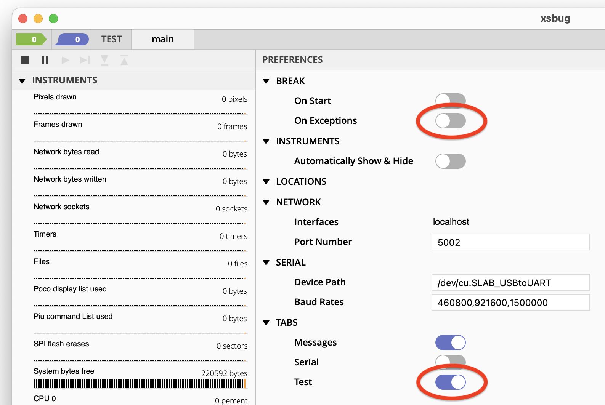
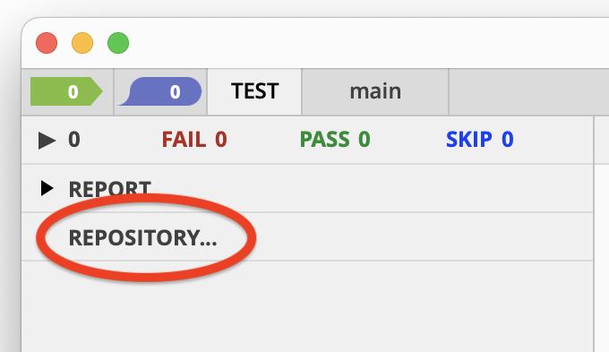
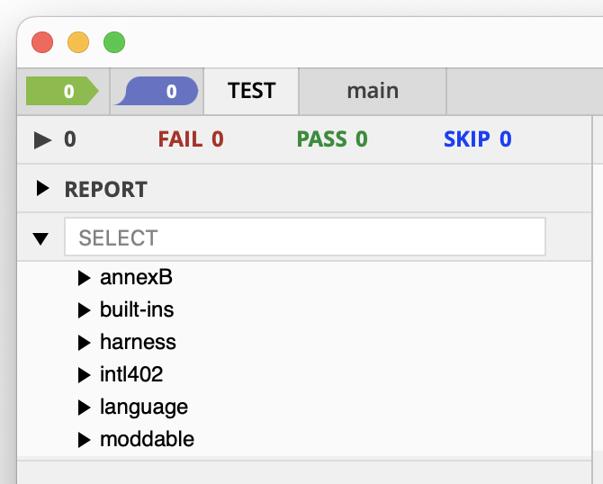
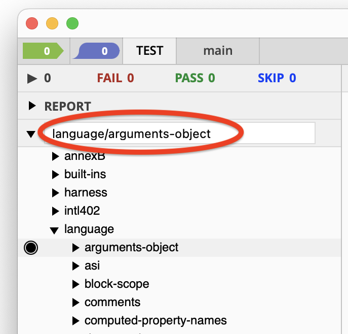
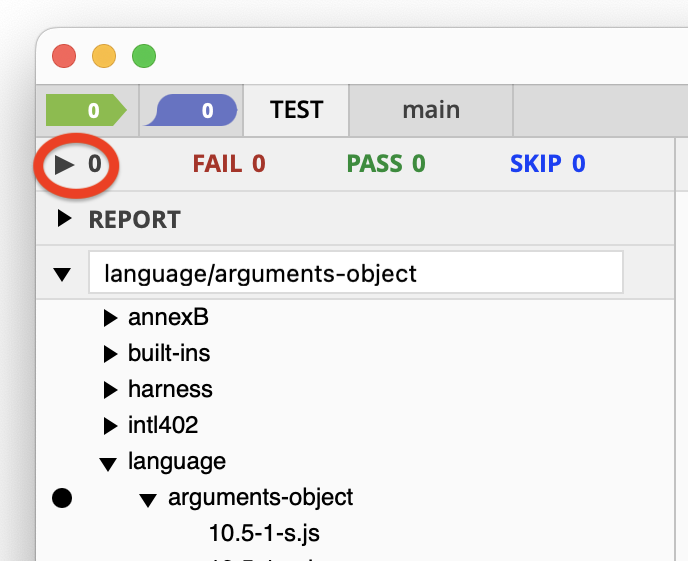
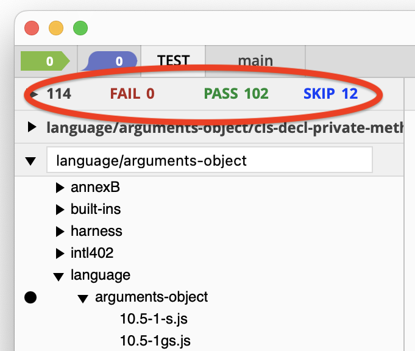
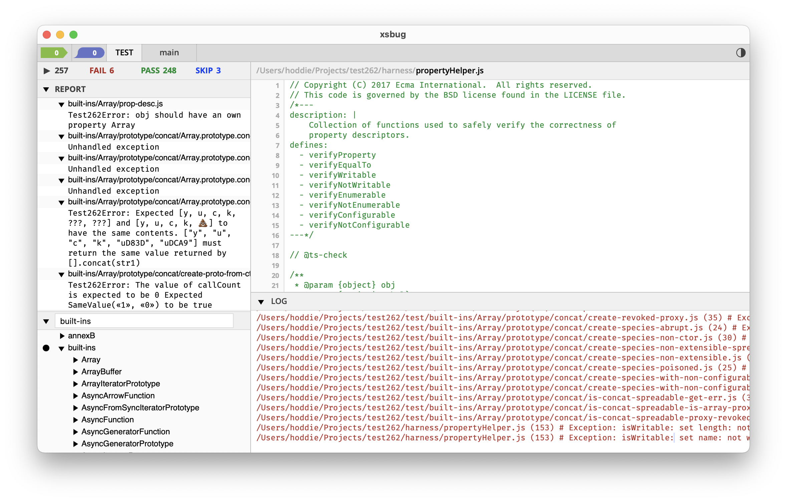
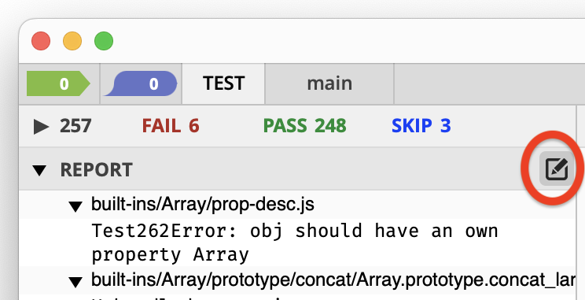

# Testing the Moddable SDK
Copyright 2020-2022 Moddable Tech, Inc.<BR>
Revised: August 31, 2022

## Table of Contents

* [Introduction](#intro)
* [Tests](#tests)
	* [JavaScript Language Tests (TEST262)](#javascript-tests)
	* [Moddable SDK Tests](#moddable-tests)
* [test262 Test App](#test262-app)
* [testmc Test App](#testmc-app)
* [Running Tests on the Simulator](#testing-on-simulator)
* [Writing Tests for the Moddable SDK](#writing-tests)
	* [Structure of a Test](#writing-structure)
	* [Importing Modules to Test](#writing-importing)
	* [Pass or Fail?](#writing-pass-fail)
	* [Asynchronous Tests](#writing-async)
	* [Assertions](#writing-assert)
	* [Test Fixtures](#writing-fixtures)
	* [Keep Tests Small](#writing-small)
	* [Minimize Assumptions about the Environment](#writing-assumptions)
	* [Network Tests](#writing-network)
	* [Graphics Tests](#writing-graphics)
	* [Piu Touch Interaction Tests](#writing-touch)
* [Reference for Writing Tests](#test-writing-reference)

<a id="intro"></a>
## Introduction
This document explains how to run unit tests implemented in JavaScript in the Moddable SDK. There are three parts to running the tests:

- **Tests**. The unit tests perform tests for success and failure conditions. They are implemented in JavaScript and their source code is stored in `.js` files.
- **Test app**. The test app is responsible for running the unit tests. It executes on the device under test.
- **Test runner**. The test runner is responsible for selecting the tests to run, coordinating with the test app to execute each test, and collecting the test results. The xsbug debugger is the test runner for the Moddable SDK.

The separation of the tests, test app, and test runner allows large test suites to run on resource constrained embedded devices.

> **Note**: The test runner uses the xsbug communication channel to coordinate test execution with the test app. A consequence of this is that release builds cannot be used to run tests.

<a id="tests"></a>
## Tests

The Moddable SDK uses two separate tests suites, one for the JavaScript language and another for the Moddable SDK runtime. The following two section introduce these test suites and how to install them.

<a id="javascript-tests"></a>
### JavaScript Language Tests (TEST262)
TEST262 is a the official suite of conformance tests from TC39, the ECMAScript (JavaScript) language committee. It is defined in the [Ecma-414](https://www.ecma-international.org/publications-and-standards/standards/ecma-414/) standard. These tests are run by all JavaScript engines to ensure compatibility, interoperability, and conformance with the specification.

The TEST262 tests are located in a repository on GitHub.

```
git clone https://github.com/tc39/test262
```

> Note: The `xst` tool may be used to [run test262 tests](../xs/xst.md#test262) on the local computer from the command line. 

<a id="moddable-tests"></a>
### Moddable SDK Tests
The Moddable SDK tests are a suite of tests created by Moddable to validate the correctness and consistency the implementations across different device targets. The tests cover a wide range of functionality including hardware I/O, networking, graphics, data, and more. Because of differences in hardware capabilities and features supported in each port, not all tests will pass in all environments. 

The Moddable SDK tests are located in the Moddable SDK repository at `$MODDABLE/tests`.

The Moddable SDK tests must be copied into test262 `test` directory.

```
cp -r $MODDABLE/tests <path-to-test262-repository>/test/moddable
```

> **Note**: To run the Moddable SDK tests you must install the TEST262 tests, even if you do not intend to run the TEST262 tests.

<a id="test262-app"></a>
## test262 Test App

The test262 test app is a Moddable app to run the tests in test262. It includes an implementation of the TEST262 test harness required by its tests. The test262 app is located in `$MODDABLE/tools/test262`.

> **Note**: The test262 test app requires a total of about 128 KB of free memory to run. It cannot run on devices with less free memory, such as the ESP8266.

### Build `test262` Test App
Build the `test262` app with the `-d` debug option as you would any other Moddable app.

```
cd $MODDABLE/tools/test262
mcconfig -d -m -p esp32
```

> Note: These instructions assume that the environment is set up to build for your target device.

> Note: The examples in this document are for the `esp32` platform. To build for other platforms, use the corresponding platform identifier.

### Configure xsbug for Tests

In `xsbug`, select the `Preferences` menu.

Turn off the `On Exceptions` slider and turn on the `Test` tab. See the circled items in the image below:



The TEST tab will appear at the top of the window.

> Note: Disabling "Break: On exception" is necessary because many tests intentionally trigger exceptions.

### Locate Tests

The first time TEST262 is run, you need to configure xsbug with the location of the test repository.



Select the `REPOSITORY...` item and a file selection dialog appears. Select the directory `test262` of the repository that you cloned from GitHub.

The `REPOSITORY...` item is replaced with a list of the test categories.



### Select Tests

Clicking to the left of a category or individual test selects that test or category to run. The bullet indicates the tests selected to run.



You may also use the `SELECT` text field to type in the name of the test(s) that you would like to run. 

### Run Tests

Click the "Play" button to start the tests:



The "Play" button turns into a "Stop" button and the number of tests run and results update as the tests run.



Press the "Stop" button to stop the tests.

While the tests run, the `REPORT` item displays the currently running test.

> **Note**: Most test262 tests run very quickly but some take a very long time.

### View Results

When the run of tests is complete, the "Stop" button changes back to a "Play" button.



Next to the "Play" button is a status line with the number of failed, passed, and skipped tests.

The `REPORT` item can be opened to view the failures. The `LOG` pane contains output including errors and exceptions.

> **Note**: The tests intentionally create failure conditions which generate exceptions that appear in the log. An exception does not necessarily indicate a test failure. The tests operate with valid and invalid inputs to verify both success conditions and failure conditions.

If you hover the mouse pointer over the `REPORT` item, an icon appears. Clicking on this icon puts the results into a text file that you can save.



<a id="testmc-app"></a>
## testmc Test App

The `testmc` test app is a Moddable app to run tests specific to the Moddable SDK. It is similar to the `test262` app and operates in the same way. However, `testmc` is configured for validation of Moddable SDK modules rather than the JavaScript language.

The `testmc` app is located in `$MODDABLE/tools/testmc`.

> **Important**: You must use the `test262` app to run the TEST262 tests. You must use the `testmc` app to run the Moddable SDK tests.

### Build `testmc` Test App

Similar to other Moddable apps, build the `testmc` app.

```
cd $MODDABLE/tools/testmc
mcconfig -d -m -p esp32
```

To run network tests, you need to include the `ssid` and `password` on the `mcconfig` line:

```
cd $MODDABLE/tools/testmc
mcconfig -d -m -p esp32 ssid=<ssid> password=<password>
```
> Note: To run tests that require a screen, use include the subplatform identifier when building (e.g. `esp32/moddable_two`, not just `esp32`) so the screen driver is included.

### Run Tests

The tests appear as a `moddable` category in the Test list.


Once the testmc test app is running and the tests are in place, selecting tests, running tests, and viewing results is done in the same way as test262 tests.

<a id="testing-on-simulator"></a>
## Running Tests on the Simulator
The test262 and testmc test apps may also be run on the mcsim, the Moddable SDK's simulator. This is useful for verifying that the simulator is providing consistent results with the target device and for developing tests. Of course, tests which depend on features the simulator does not support, such as hardware I/O, will fail.

The process of running on the simulator is the same in xsbug. When the simulator launches, there is one change that must be made to the simulator options.  Set the "Reload on Abort" switch to "on". If this is not set, testing will stall after the first test is run.


<a id="writing-tests"></a>
## Writing Tests for the Moddable SDK
Tests for the Moddable SDK are written in the same way as TEST262 tests. If you aren't yet familiar with how to write tests for TEST262, the following sections will get you started.

<a id="writing-structure"></a>
### Structure of a Test
Each test file has two parts: the frontmatter and the test script. The frontmatter uses the [YAML](https://en.wikipedia.org/wiki/YAML) mark-up format. The frontmatter appears first and contains meta-data about the test. The test script follows the frontmatter.

Here's a very basic test:

```js
/*---
flags: [module]
---*/
assert.sameValue("Java" + "Script", "JavaScript");
```

The `module` flag tells the test runner that the test should loaded as an ECMAScript module, not a program.  If the `module` flag is not present, the test is run as a program. All tests written for the Moddable SDK should include the `module` flag because nearly all scripts in the Moddable SDK are executed as modules. 

In addition to flags, the frontmatter may contain a short description of the test or a longer informational section:

```
/*---
description: concatenation of two strings
info: |
  Two strings are concatenated together using
  the plus operator to verify that the JavaScript
  engine is correctly concatenating them
  together.
flags: [module]
---*/
```

The frontmatter is required. If it is not present, the test script will not be executed. If the frontmatter is incorrect, the test script may not run correctly. 

By convention, the copyright notice appears immediately before or after the frontmatter, but always before the test script.

```
/*---js
description: https://github.com/Moddable-OpenSource/moddable/issues/452
flags: [module]
---*/

// Copyright 2022 Moddable Tech, Inc. All rights reserved.
// Redistribution and use in source and binary forms, with or without
// modification, are permitted provided.

assert.sameValue("Java" + "Script", "JavaScript");
```

The `async` field is introduced below, for creating tests that run asynchronously. See the TEST262 documentation for a [reference guide](https://github.com/tc39/test262/blob/main/INTERPRETING.md#metadata) to the frontmatter fields.

<a id="writing-importing"></a>
### Importing Modules to Test
The Moddable SDK contains an extensive collection of modules. You may write tests to verify the correct operation of those modules, or you may use those modules as part of your tests. To incorporate a module from the Moddable SDK into your test, simply import it.

```js
/*---
flags: [module]
---*/
import structuredClone from "structuredClone";
...
```

The `import` statement is available because the `module` flag is set in the frontmatter.

The modules that are available to import from the Moddable SDK are determined by the testmc application. You can review its [manifest.json](https://github.com/Moddable-OpenSource/moddable/blob/public/tools/testmc/manifest.json#L29) file to see the modules it includes. If your tests need other modules, you can add them to the testmc manifest.

<a id="writing-pass-fail"></a>
### Pass or Fail?
A test is considered to have passed if it runs to the end without generating an unhandled exception. A test is considered to have failed if it exits with an unhandled exception. The earlier example that confirmed that the concatenation of `"Java"` and `"Script"` is `"JavaScript"` passes because it does not throw an unhandled exception. The following test always fails because `undefined` is not an object.

```js
/*---
flags: [module]
---*/
undefined.toString();
```

Sometimes a test wants to verify that a failure occurs. The preceding example is expected to fail with a `TypeError`.  There are several ways to do this. One convenient way is using the frontmatter. The frontmatter has an optional `negative` item which causes the test runner to consider the test to have failed if it exits with no error and to pass only if it exits with an unhandled exception of the expected type. This modified test passes, if a `TypeError` is thrown as required by the JavaScript language.

```js
/*---
flags: [module]
negative:
  type: TypeError
---*/
undefined.toString();
```

<a id="writing-async"></a>
### Asynchronous Tests
Some tests must run asynchronously, including network operations, timers, and any test that uses Promises. The default way of determining that the test passed or failed does not work for asynchronous tests, because the test result is not known when the end of the test script is reached. The asynchronous operation must complete to know that the test has passed. Writing tests that run asynchronously is possible with a few changes to how the test is written. First, add the `async` flag to the frontmatter.

```js
/*---
flags: [module,async]
---*/
```

The test is not considered finished until the `$DONE` function is called by the tests. If `$DONE` is called with no arguments, the test is considered to have passed; if `$DONE` is called with an argument, the test is considered to have failed. Until `$DONE` is called, the test continues running. The following test shows an example:

```js
/*---
flags: [module,async]
---*/
(Promise.resolve(123)).then(value => {
	if (123 === value)
		$DONE();
	else
		$DONE("unexpected value");
});
```

You may have noticed that the above did not use the `assert.sameValue` function to test that `value` is equal to the expected `123`. That's because the test must call `$DONE` with the result of the test. To allow common asserts to be used in asynchronous tests, `testmc` provides the `$DO` function. Using `$DO` the test can be rewritten as follows:

```js
/*---
flags: [module,async]
---*/
(Promise.resolve(123)).then($DO(value => {
	assert.sameValue(value, 123);
}));
```

The above test works if the promise is resolved. But, what if the promise was rejected instead? In that case, the test runs indefinitely because it has no rejection handler. To make it easy to detect asynchronous tests that are running for too long, `testmc` provides the `$TESTMC.timeout` function, which causes an asynchronous test to fail if it runs longer than the expected number of milliseconds.

```js
/*---
flags: [module,async]
---*/
(Promise.resolve(123)).then($DO(value => {
	assert.sameValue(value, 123);
}));
$TESTMC.timeout(500, "timeout on promise resolve");
```

Asynchronous tests are more difficult to write than synchronous tests, just as asynchronous code is more challenging to write than synchronous code When getting started, take care and try to follow the patterns of existing tests that already work. 

<a id="writing-assert"></a>
### Assertions
The TEST262 runtime contains an `assert` global variable with a few basic assertions. Where possible, tests should use these for consistency and readability. All the assertion functions throw an exception if the expected condition is not met.

The most basic assertion is the `assert` function, which throws if passed a false value:

```js
assert(false);					// throws
assert(true);						// does not throw
assert(1 === 3);				// throws
assert(3 === 3);				// does not throw
assert(Array.isArray(5), "expected Array");	// throws
```

Note that `assert` accepts an optional second parameter that contains a message describing the failure. These messages are helpful when reviewing test results to understand where a failure occurred.

The `assert.sameValue` and `assert.notSameValue` are used to compare two JavaScript values, typically an expected value against an actual value. Like `assert`, there is an optional argument for a message that describes the test.

```js
assert.sameValue(result, 12, "expected result of 12");
assert.notSameValue(result, 12, "expected result different from 12");
```

By convention the first argument to `assert.sameValue` and `assert.notSameValue` is the value generated by the test. The second value is the expected result of the test.

The `assert.throws` function is used to confirm that an operation results in a specific error being thrown. The same result can be achieved using `try`/`catch` block, but the `assert.throws` function is more concise and readable. The first argument to `assert.throws` is the constructor of the expected error to be generated. The second argument is a function to execute; the function is expected to throw an instance of the error constructor passed in the first argument. The optional final argument is a message describing the failure, as with other assert functions.

```js
assert.throws(SyntaxError, () => Timer.delay(), "one argument required")
```

If `Timer.delay` throws a `SyntaxError`, the `assert.throws` catches the exception and returns, so the test passes. If `Timer.delay` does not throw the expected `SyntaxError`, `assert.throws` throws an exception which causes the test to fail.

<a id="writing-fixtures"></a>
### Test Fixtures
When writing tests for a specific module, there is often some data or code that you want to share between the several tests that are split across several files. This shared data or code is referred to as a fixture. When writing tests for testmc, test fixtures are simply additional modules. Those modules can be imported by your test using an `import` statement.

Consider a test that reads values from a temperature sensor. It wants to confirm that sensor readings taken back-to-back are stable, by comparing only the integer part and discarding the fractional portion. A test fixture could add a function to compare two values as integers. Here's the test fixture, stored in a file named "integerFixture.js" in the same directory as the tests that use it.

```js
assert.sameInteger = function (actual, expected, reason) {
	actual = Math.round(actual);
	expected = Math.round(expected);
	if (actual !== expected)
		throw new Error(reason ?? `sameInteger got ${actual}, but expected ${expected}`);
}
```

This test fixture adds a `sameInteger` function to the `assert` global. The `assert.sameInteger` can then be used as usual:

```js
/*---
flags: [module]
---*/
import "./integerFixture.js"
const sensor = device.sensor.temperature;
assert.sameInteger(sensor.sample().temperature, sensor.sample().temperature);
```

A text fixture may also export data. For example, a test fixture might provide an object for testing JSON serialization:

```js
export default {
	a: 1,
	b: "2",
	c: {three: 3}
}
```

Note that that test fixture modules are not tests, so they must not have the YAML frontmatter used to identify tests. They can, of course, still have a description and copyright notice using JavaScript comments.

<a id="writing-small"></a>
### Keep Tests Small
The primary purpose of `testmc` is to run tests on a resource-constrained microcontroller. To achieve that, the tests themselves must be kept small. The source code to the test module and any test fixtures is downloaded to the microcontroller where they are compiled to byte-code by the XS JavaScript engine. The source code uses RAM as does the compiled byte-code. And, of course, the test requires memory to run. Most of the time this is not a problem. Out-of-memory exceptions have occurred when using large existing tests designed to run on computers rather than microcontrollers. Usually the problem can be solved by breaking the test up into several different source code files, using a test fixture for code and data shared across tests.

A good rule of thumb is to keep the source code of the test script under 100 lines, and the total lines, including any fixtures, under 200. Some microcontrollers have quite a bit of memory, so much larger files will work. But, to ensure tests can run in as many environments as possible, they should be written to follow these guidelines.

The tests in TEST262 itself are are often just a few lines of code. Keeping tests small is also convenient for debugging when a problem arises. If a test file contains hundreds of tests, it is more difficult to isolate and debug test failures. A test file that is focused on exercising a particular area provides a more easily understood result in the test logs.

<a id="writing-assumptions"></a>
### Minimize Assumptions about the Environment
Each test is run in a fresh virtual machine. This helps to ensure consistent test results because each test executes independently of the tests that ran before it. But there are limits to how much a test can be isolated from those that ran earlier. 

A test for the file system will create, delete, and modify files. Such tests should clean-up after themselves, by removing any temporary files. However, this is imperfect. If the test fails, it will not have a chance to clean-up. Therefore, in general tests should be written so they work even if previous tests did not properly clean-up.

While each test is run in a separate virtual machine, the microcontroller itself does not reboot between each test because rebooting would make running a suite of tests much slower. When a virtual machine is closed, all resources it owns are freed. This releases all memory, closes all files, ends all network connections, etc. However, there is some state that remains. For example, the state of the network connection is not changed: if the microcontroller remains connected to Wi-Fi. This is convenient as it allows a sequence of network tests to run quickly without each test having to establish a Wi-Fi connection. However, a test written to assume Wi-Fi begins in a disconnected state may fail. Such a test should first explicitly disconnect from Wi-Fi.

<a id="writing-network"></a>
### Network Tests
When writing tests that use the network, the first step is to make sure the microcontroller is connected to a network. The testmc runtime includes a `$NETWORK` global to help with network tests, and it includes a `connected` property that can be used to wait for a network connection to be available.

```js
/*---
flags: [module,aync]
---*/
import {Client} from "http";
await $NETWORK.connected;
new Client(...);
...
```

If a network connection cannot be established, the promise returned by `$NETWORK.connected` will be rejected, causing an exception to be thrown and the test to fail.

See the reference section on the `$NETWORK` global below for additional support for network tests.

<a id="writing-graphics"></a>
### Graphics Tests
When writing tests to validate the correct operation of graphics rendering operations, a common challenge is determining if the image is drawn correctly. A common solution is to store an image containing the expected result to compare against the rendered image. This approach is impractical when testing on microcontroller with limited storage space. Instead, testmc provides a function to generate a checksum for the rendered image. The checksum is just a handful of bytes and so can be easily incorporated into the test script itself. In addition, because the checksum is generated as the image is sent to the output device, it requires no additional memory to buffer the expected image.

When running testmc, the standard `screen` global variable is extended to support checksums. Each time the display is updated, a checksum is automatically generated for the image drawn. The following test uses Poco to draw a 100 pixel square rectangle in blue, and confirms that it generates the expected checksum.

```js
/*---
flags: [module]
---*/
import Poco from "commodetto/Poco";
import Bitmap from "commodetto/Bitmap";

assert.sameValue(Bitmap.RGB565LE, screen.pixelFormat, "requires RGB565LE output");

const render = new Poco(screen);
const blue = render.makeColor(255, 0, 0);
render.begin(0, 0, 100, 100);
	render.fillRectangle(blue, 0, 0, render.width, render.height);
render.end();

assert.sameValue("bdae73e6e02019bdbc080589058c0135", screen.checksum, "100x100 blue square");
```

Notice that before drawing the test asserts that the screen used as an output renders 16-bit RGB565 little-endian pixels. That's because the checksum generated depends on the pixel format. If the screen uses a different pixel format, the checksum will not match. Test can be written to work with several different pixel formats by including the expected checksum for each pixel format.

If the blue color is changed from `255, 0, 0` to `128, 0, 0` the checksums don't match. But, if the blue color is changed to `254, 0, 1`, the checksums still match. That is because 565 pixels ignore the low bits of the color. If the image is rendered with 24 or 32 bit pixels, there would be a mismatch because all the colors bits are used.

Image checksums also work with screens generated by the Piu user interface framework. However, because Piu does not render immediately, a slightly different technique is required. The testmc application provides the `screen.checkImage` function to verify images rendered using Piu. The function allows Piu to render the update pending and then confirms that the image Piu rendered has the expected checksum.

```js
/*---
description: 
flags: [module]
---*/
import Bitmap from "commodetto/Bitmap";

assert.sameValue(Bitmap.RGB565LE, screen.pixelFormat, "requires RGB565LE output");
assert((240 === screen.width) && (320 === screen.height), "unexpected screen");

const redSkin = new Skin({ fill: "red" });
new Application(null, {
	skin: new Skin({
		fill: "white"
	}),
	contents: new Content(null, {
		height: 100, width: 100,
		skin: new Skin({ fill: "red" })
	})
});
screen.checkImage("b2342b9d128b17b544c8a1e7c4ff652d");
```

<a id="writing-touch"></a>
### Piu Touch Interaction Tests
Testing the correct operation of applications with an interactive user interface is done by sending simulated touch events to the application. testmc extends the `screen` object with functions to send touch begin, touch moved, and touch end events. These events are routed to Piu and handled as usual. Because delivery of touch events is asynchronous, the functions used to send touch events for testing are asynchronous.

The following test sends a touch begin event. The behavior confirms that the expected touch id and coordinates are received. If the touch began event is not received by the behavior within a half second, the test fails with a timeout.

```js
/*---
description: 
flags: [async, module]
---*/
class TouchTestBehavior extends $TESTMC.Behavior {
	onTouchBegan(content, id, x, y) {
		assert.sameValue(id, 0);
		assert.sameValue(x, 10);
		assert.sameValue(y, 20);
		$DONE();
	}	
}

new Application(null, {
	active: true, Behavior: TouchTestBehavior
});

$TESTMC.timeout(500, "timeout for doTouchBegan");
await screen.doTouchBegan(0, 10, 20);
```

When incorporating a Piu behavior in a test, the behavior's class should extend `$TESTMC.Behavior` instead of `Behavior`. This automatically wraps all methods to allow them to throw exceptions to fail the test and, consequently, for `assert` functions to be used as-is.

<a id="test-writing-reference"></a>
## Reference for Writing Tests
The testmc application adds features to the runtime environment to support test scripts. This is the same idea as the `$TEST262` global variable added by the TEST262 test harness. The following sections introduce the runtime features of testmc available for tests to use.

### `$TESTMC` Global

The `$TESTMC` global is an object with properties for many different purposes.

#### `timeout(ms [, message])`
The `timeout` function is used to cause a test to fail if it does not complete within the specified period of time. The `timeout` function only works with asynchronous tests (those marked with `async` in their front-matter).

```js
$TESTMC.timeout(5000, "dns lookup timeout");
```

#### `HostObject`, `HostObjectChunk`, `HostBuffer`
These constructors are used to create host objects to pass as arguments to functions being tested. 

```js
new $TESTMC.HostObject // host object with pointer (-1) for storage
new $TESTMC.HostObjectChunk // host object with 16 byte chunk for storage
new $TESTMC.HostBuffer(count) // host buffer of count bytes
```
See the [XS in C](../xs/XS%20in%20C.md) document for additional information on host objects.

#### `config`
The `config` property is a shortcut to the `mc/config` module's default export. It contains configuration properties for some kinds of tests (details below). This is also convenient for test scripts running as a program rather than a module.

```js
let ssid = $TESTMC.config.ssid;
```

#### `wifiInvalidConnectionTimeout`, `wifiConnectionTimeout`, `wifiScanTimeout`
These constants are used to set timeouts for Wi-Fi tests. They are provided as values on `$TESTMC` because the optimal value varies by target device and network conditions such as signal strength.

```js
$TESTMC.timeout($TESTMC.wifiScanTimeout, "wi-fi scan timeout");
```

#### `Behavior`
The `$TESTMC.Behavior` constructor extends the Piu `Behavior` class for testing. It wraps each handler in a `try`/`catch` block. If the wrapper catches an exception, it terminates the test as failed. This is convenient for writing tests for Piu events.

```js
class SampleBehavior extends $TESTMC.Behavior {
	onTouchEnded(content, id, x, y, ticks) {
		assert.sameValue(x, 10);
		assert.sameValue(y, 20);
	}
}
```

### `$NETWORK` Global
The `$NETWORK` global provides functions and values useful for testing operations that use the network.

#### `connected`
The `connected` property returns a Promise that resolves when a network connection is available. If the network is already connected (such as when running tests in the simulator), the promise resolves immediately.

Because the resolution of the promise is asynchronous, the `connected` property should only be used in tests marked `async`.

```js
await $NETWORK.connected;
```

#### `invalidDomain`
The `invalidDomain` property is a string containing a DNS hostname guaranteed to fail to resolve. This is useful for testing error handling of network code.

#### `wifi()`
The `wifi` function returns a promise which resolves to an object with the options object to establish a Wi-Fi connection for testing.

```js
let options = await $NETWORK.wifi();
new WiFi(options);
```

Note that most network tests can use `$NETWORK.connected` to establish a connection. The `$NETWORK.wifi` function is provided to test the APIs used to establish a Wi-Fi connection.

### `screen` Global
The `screen` global is a standard part of the Moddable SDK runtime environment on devices with a display. It is used by both Poco and Piu to access the display driver. The `testmc` test app adds wraps the device's `screen` global to provide additional capabilities.

##### `checksum`
The `checksum` property is a hash of the last update drawn to the screen. The value is a 32 character hexadecimal string.

```js
render.begin();
	render.fillRectangle(black, 0, 0, render.width, render.height);
	render.blendRectangle(white, 32, 10, 10, 20, 20);
render.end();

assert.sameValue("e5386bfa56b0ab7128c75199547c2178", screen.checksum, "mismatch");
```

The checksum is for the pixels sent to the display driver by the last update. It is only a checksum of the entire screen if all pixels were drawn in a single update. The checksum changes if the pixel format or software rotation changes.

#### `checkImage(checksum)`
The `checkImage` method uses `screen.checksum` to verify the correctness of rendering with Piu. If the checksum does not match, the test is terminated as failed.

```js
one.height = 50;
one.width = 50;
screen.checkImage("f1dd85eb20df5f900845e1ae8b79aa25");

one.height = 150;
one.width = 150;
screen.checkImage("4e008cd76aa8c80e480d966a8aa91228");
```

#### `doTouchBegan()`, `doTouchMoved()`, `doTouchEnded()`
These functions send touch input events as if they were generated by the touch screen driver. The arguments to each function are `id, x, y, ticks`. These `async` functions resolve once the touch event has been delivered.

```js
await screen.doTouchBegan(0, 100, 100, Time.ticks);
```

#### Test Configuration in `mc/config`
The testmc manifest contains configuration values for on-device testing, such as hardware pin numbers and I/O ports. These values are used by tests, so that they may written to be independent of the device being tested. When running testmc on a new device, the configuration values for the device must be added to the manifest. 

- `config.digital[]`

An array of ECMA-419 digital pin specifiers. 

- `config.i2c`

An object with properties for the `hz` and `address` of a device connected to the default I²C  bus to use for tests. Also has `unusedAddress` for an address that is guaranteed not to have a device connected.

- `config.pwm`

An object with properties for a PWM testing. `from` is `true` if the host implementation supports the `from` property in the constructor options object. `pins` is an array of ECMA-419 pin specifiers that may be used with PWM. `ports` is an array of ECMA-419 port specifiers that may be used with the PWM pins. `invalidPorts` is an array of invalid ECMA-419 port specifiers. `resolutions` is an array of supported PWM resolutions. `hzs` is an array of supported PWM frequencies.

- `config.spi`

An object with properties for SPI testing. `select` is the ECMA-419 pin specifier for the select pin. `ports` is an array of ECMA-419 port specifiers for SPI. `invalidPorts` is an array of invalid SPI port specifiers. `hzs` is an array of support SPI frequencies.

- `config.invalidPins`

An array of ECMA-419 pin specifiers that are invalid for the target device. 

- `config.flashParition`

The name of the flash partition to use for tests. The content of this partition will be destroyed by the tests.
