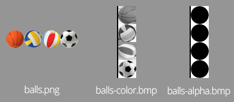
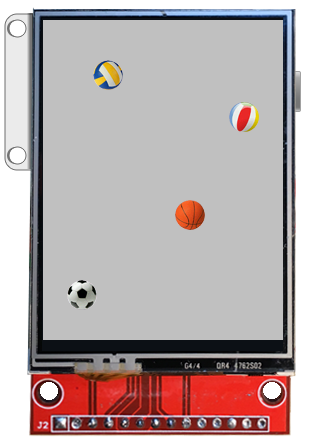

# Tools
Copyright 2017-2023 Moddable Tech, Inc.<BR>
Revised: March 23, 2023

## About this Document

This document describes the tools provided by Moddable to build, debug, and run JavaScript apps on microcontrollers or in the Moddable simulator.

The tools compile and link JavaScript modules, and prepare assets for specific platforms and specific screens. The only tools you use directly are **mcconfig**, **mcrun**, and **xsbug**. The other tools are used indirectly, through the make file generated by **mcconfig** and **mcrun**, but are nevertheless presented here to help you understand what is happening under the hood.    

To build the tools themselves, and to build and run apps in the Moddable simulator, you only need standard development tools. To build and run apps on microcontrollers, you also need the microcontrollers toolchains to compile and link C code, and to transfer apps to flash storage. See the [Getting Started document](../Moddable%20SDK%20-%20Getting%20Started.md) for full instructions on how to build the Moddable SDK tools.

## Table of Contents

* [mcconfig](#mcconfig)
* [mcrun](#mcrun)
* [mcrez](#mcrez)
* [png2bmp](#png2bmp)
* [xsc](#xsc)
* [xsl](#xsl)
* [mcbundle](#mcbundle)
* [Simulator](#simulator) (mcsim)

<a id="mcconfig"></a>
## mcconfig

**mcconfig** is a command line tool that generates a make file based on a manifest, then runs **make** to build and launch Moddable apps on microcontrollers or in the simulator. 

For example:

```shell
cd $MODDABLE/examples/piu/balls
mcconfig -d -m
```

builds and launches the [balls example](../../examples/piu/balls) in the simulator,

```shell
cd $MODDABLE/examples/piu/balls
mcconfig -d -m -p esp/moddable_two
```
		
builds and launches the balls example on Moddable Two, and

```shell
cd $MODDABLE/examples/network/http/httpgetjson
mcconfig -d -m -p esp ssid="Public Wi-Fi"
```
	
configures an ESP8266 target device to connect to an open Wi-Fi access point called "Public Wi-Fi," then build and launch the httpgetjson example on the device.

A few notes:

- The first app takes some time to build since all the ESP and XS libraries need to be compiled too.
- When running a debug build, **xsbug** needs to be running on your computer for the launch to be successful.
- See the [Manifest](./manifest.md) document for explanations about manifests.

<a id="mcconfig-arguments"></a>
### Arguments

```text
mcconfig [manifest] [-d] [-f format] [-i] [-m] [-o directory] [-p platform] [-r rotation] [-t target] [-v] [-l] [-x xsbug_host:xsbug_port] [ssid="wifi_ssid"] [password="wifi_password"] [screen=screen_driver] [touch=touch_driver]
```

- `manifest`: the manifest file. Defaults to the `manifest.json` file in the current directory or in the parent directory of the current directory.
- `-d`: to build a debug instrumented version.
- `-f format`: to select the screen pixel format: `gray16`, `gray256`, `rgb332`, `rgb565be` or `rgb565le`. Defaults to `rgb565le`. See [png2bmp](#png2bmp) for more detail.
- `-i`: to build a release instrumented version.
- `-l`: to log xsbug console output to the terminal rather than to xsbug (see note below).
- `-x`: overrides the default host and port (localhost:5002) debug builds use to connect to xsbug.
- `-m`: to run `make` automatically, otherwise **mcconfig** just generates the make file.
- `-o directory`: the output directory. Defaults to the `$MODDABLE/build` directory.
- `-p platform`: to select the platform. Consult the documentation for your device target for its platform identifier. The supported values include: `esp`, `esp/moddable_one`, `esp/moddable_three`, `esp32`, `esp32/moddable_two`, `win`, `lin`, `mac`, `sim/moddable_one`, `sim/moddable_two`, `sim/moddable_three`, and `wasm`.  Defaults to the host build platform:`mac`, `win` or `lin`. 
- `-r rotation`: to select the screen rotation: `0`, `90`, `180` or `270`. Defaults to `0`. See [png2bmp](#png2bmp) for more detail.
- `-t target`: to select the build target: `build`, `deploy`, `xsbug`, `clean`, or `all`. Defaults to `all`. See [Build Targets](#buildtargets) for more detail.
- `-v`: to trace all commands executed by `make`
- config arguments specified in the form of `key-=value` or `key="value"`. These are merged into the `config` section of the manifest. Import the `mc/config` module to access them. Moddable provided hosts that support networking and/or displays define the following config properties:
  - `ssid="wifi ssid"` and `password="wifi password"`: to specify network credentials and connect to the network before launching the app.
  - `screen=screen_driver` and `touch=touch_driver`: to specify a screen or touch driver. See the [examples readme](../../examples/readme.md) for more information on screen and touch driver configuration.

> **Note**: To generate a release build, exclude both `-d` and `-i` from the command line.

> **Note**: The `-l` option requires Node.js on your build system. You must also first run `npm install` in `$MODDABLE/tools/xsbug-log`.

<a id="buildtargets"></a>
**Build Targets**

**mcconfig** takes an optional `-t target` argument to specify a build target. The options for the target are:

- `clean`: removes build outputs for the app
- `build`: builds the app
- `deploy`: deploys the app
- `xsbug`: connects to the xsbug debugger
- `all`: performs the `build`, `deploy`, and `xsbug` steps

When the `-t` flag is omitted, the default value is `all`.

When using **mcconfig** with microcontrollers that use a serial port for JavaScript debuggging with xsbug, the `deploy`, `xsbug`, and `all` targets terminate the currently running instance of serial2xsbug, if there is one.

<a id="mcrun"></a>
## mcrun
**mcrun** is a command line tool to build [mods](../xs/mods.md), scripts that users can install on their IoT products to add new features and change existing behaviors. The inputs to build a mod are JavaScript modules, assets, data, and configuration. These are specified in a manifest. The output is an XS archive file (`.xsa` extension) containing JavaScript byte code and resource data.

There are a few important differences between `mcrun` and `mcconfig`:

- The manifest used by `mcrun` must not reference any files which build to native code (e.g. `.c` or `.cpp` files) as a mod can only contain JavaScript
- `mcrun` does not support the `-t` option
- `config` properties are available from the `mod/config` module instead of `mc/config` (see the `config` section of the [Manifest](./manifest.md) documentation for more information about `config` properties)

### Arguments

```text
mcrun [manifest] [-d] [-f format] [-i] [-m] [-o directory] [-p platform] [-r rotation] [-v] [-x xsbug_host:xsbug_port] [ssid="wifi_ssid"] [password="wifi_password"] [screen=screen_driver] [touch=touch_driver]
```

The command line arguments to `mcrun` are nearly identical to those for `mcconfig`, except that `mcrun` does not support the `-t` option. See the [`mcconfig` Arguments](#mcconfig-arguments) section for a description of each argument.

<a id="mcrez"></a>
## mcrez

**mcrez** is a command line tool that includes assets into a resources map. **mcrez** generates C code that contains the assets themselves and a way to access them.

Moddable apps do not require a file system. Assets are accessed as resources, thanks to the `Resource` module.

```js
import Resource from "Resource";
import parseBMP from "commodetto/parseBMP";
let bitmap = parseBMP(new Resource("balls-color.bmp"));
```

Notice that most assets are used directly from flash storage.

### Arguments

```text
mcrez files... [-o output] [-r name] [-p platform]
```

- `files`: the paths of the assets to include.
- `-o output`: the path of the output directory. Defaults to the current directory.
- `-r name`: the name of the generated C file. Defaults to `mc.resources.c`.
- `-p platform`: to select the platform: `esp`, `esp32`, `win`, `lin` or `mac`. Defaults to the host build platform:`mac`, `win` or `lin`. `esp8266` may be used as an alias for `esp`.

<a id="png2bmp"></a>
## png2bmp

**png2bmp** is a command line tool that converts a PNG file into BMP files that Moddable apps can use directly from flash storage.

For instance:

```shell
cd $MODDABLE/examples/piu/balls
png2bmp balls.png -o ~/Desktop
```

creates two files on your desktop:

- `balls-alpha.bmp`: a 8-bit gray bitmap that defines the alpha channel.
- `balls-color.bmp`: a 16-bit color bitmap that defines the red, green and blue channels.

To be able to use bitmaps directly from flash storage, the bitmaps need to conform to the screen pixel format and rotation. Use the `-f` option to select the screen pixel format and the `-r` option to select the screen rotation. **png2bmp** also takes care of the row bytes constraint related to the screen pixel format. For instance:

```shell
cd $MODDABLE/piu/examples/balls
png2bmp balls.png -o ~/Desktop -f gray256 -r 90
```



### Arguments

```text	
png2bmp file.png [-a] [-c] [f format] [-o directory] [-r rotation]
```

- `-a`: to create only the alpha bitmap.
- `-c`: to create only the color bitmap.
- `-f format`: to select the screen pixel format: `gray16`, `gray256`, `rgb332`, `rgb565be` or `rgb565le`. Defaults to `rgb565le`.
- `-o directory`: the output directory. Defaults to the current directory.
- `-r rotation`: to select the screen rotation: `0`, `90`, `180` or `270`. Defaults to `0`.

<a id="xsc"></a>
## xsc

**xsc** is the XS compiler, a command line tool that compiles files containing JavaScript source code (usually stored in a file with a `.js` extension) into XS binary files containing symbols and byte codes. 

By default **xsc** parses the JavaScript file as an ECMAScript module. Optionally, for compatibility and conformance, **xsc** can parse the JavaScript file as an ECMAScript program. Moddable apps only use ECMAScript modules.

With the `-c` option, **xsc** accepts the `@` constructs that reference host functions and host objects. For instance:

```c
class Point @ "Point_destructor" {
	constructor(x, y) @ "Point_constructor"
	moveBy(x, y) @ "Point_moveBy"
	get x() @ "Point_get_x"
	get y() @ "Point_get_y"
}
```

The `Point` class creates host objects. The `Point_destructor` C function is called when the garbage collector destroys such host objects. The `Point_constructor ` C function is called when `new Point(x, y)` constructs such host objects. The other C functions is be called when accessing properties and calling methods. See [**XS in C**](../xs/XS%20in%20C.md) about the implementation of the C functions.

Without the `-e` option, **xsc** generates C code that declares XS symbols and the interface of the host functions. Such C code can then be compiled and linked with the implementation of the host functions to build a dynamic library.

With the  `-e` option, **xsc** embeds the references to host functions and host objects into the XS binary file. It is the linker, **xsl**, that generates C code for all the modules. That is how Moddable apps work. 

### Arguments

```text
xsc file [-c] [-d] [-e] [-o directory] [-p] [-r name] [-t directory]
```

- `file`: the path of a `.js` file to compile.
- `-c`: to accept the `@` constructs that reference host functions and host objects. With the `-c` option and without the `-e` option, **xsc** generates C code that declares XS symbols, host functions and host objects.
- `-d`: to generate the file and line byte codes that allow to debug the JavaScript file.
- `-e`: to embed references to host functions and host objects into the XS binary files instead of generating C code. This options is required to compile a JavaScript file into an XS binary file that **xsl** can link into an XS archive file.
- `-o directory`: the path of the output directory. Defaults to the current directory.
- `-p`: to parse the JavaScript file as an ECMAScript program.
- `-r name`: the name of the output file. Defaults to the name of the input file. The output extension is always `.xsb`.
- `-t directory`: the path of the temporary directory. Defaults to the output directory. With the `-c` option and without the `-e` option, **xsc** generates C code in the temporary directory.

<a id="xsl"></a>
## xsl

**xsl** is the XS linker, a command line tool that links several XS binary files into one XS archive file, and generates C code that declares XS symbols and the interface of the host functions.

With the `-p` option, **xsl** can also preload modules and generate C code that defines a read-only XS virtual machine suitable to be cloned to run apps. That is how Moddable apps work. 

The C code can then be compiled and linked with the implementation of the host functions to build a dynamic library or an executable.

### Arguments

```text
xsl files... [-a name] [-b directory] [c creation] [-o directory] [-p modules]... [u url]
```

- `files`: the paths of the XS binary files to link.
- `-a name`: the name of the XS archive file. Defaults to `a`. 
- `-b directory`: the path of the base directory. Defaults to the output directory. The names of the modules in the archive are the paths of the XS binary files, relative to the base directory. It is an error to link XS binary files which are not directly or indirectly inside the base directory.
- `-c creation`: the parameters used to create the cloned machines. 
- `-o directory`: the path of the output directory. Defaults to the current directory.
- `-p module`: the name of a module to preload. Use one `-p module` option by module to preload.
- `-r name`: the name of the output file. Defaults to `mc`.
- `-s feature`: the name of a feature to strip. Use one `-s feature` option by feature to strip, use `s *` to strip all unused features.
- `-u url`: the base URL of the modules in the archive. Defaults to `/`.

<a id="mcbundle"></a>
## mcbundle

**mcbundle** is a command line tool to build and package app archives for the Moddable Store.

**mcbundle** uses the [`bundle` object](./manifest.md#store) of the [app manifest](./manifest.md). Here is a sample `bundle` object, taken from the `countdown` example:

```text
"bundle": {
	"id": "tech.moddable.countdown",
	"devices": [
		"esp/moddable_one",
		"com.moddable.two"
	],
	“custom”: “./store/custom”,
	“icon”: “./store/icon.png”
}
```

To bundle an app archive for the `countdown` example, you would use the following `mcbundle` command:

```shell
cd $MODDABLE/examples/piu/countdown
mcbundle -d -m -o $MODDABLE/build/tmp
```

This builds the `countdown` app for two devices and package the targets into one app archive.

**mcbundle** generates and execute a shell script, `tech.moddable.countdown.sh`. The shell script invokes **mcconfig** once for each target platform to build the app, then copies the targets, icon and custom preferences dialog boxes into the app archive folder. The name of the app archive folder matches the `id` property of the `bundle` object: `tech.moddable.countdown`.

```text
tech.moddable.countdown
	com.moddable.one
		main.bin
	com.moddable.two
		bootloader.bin
		partition-table.bin
		xs_esp32.bin
	custom
		config
			icon.png
			index.html
	icon.png
```

Eventually, the app archive folder is compressed into the app archive file, `tech.moddable.countdown.zip`

The shell script, the app archive folder, and the app archive file are located in `$MODDABLE/build/tmp`.

**mcbundle** requires the `MODDABLE` environment variable, the `IDF_PATH` environment variable for ESP32 devices and the `EMSDK` environment variable for the Wasm simulator

### Arguments

```text
mcbundle [manifest] [-d] [-m] [-o directory] 
```

- `manifest`: the manifest file. Defaults to the `manifest.json` file in the current directory.
- `-d`: to build debug instrumented versions.
- `-m`: to run `bash` automatically, otherwise **mcbundle** just generates the shell script.
- `-o directory`: the output directory. Defaults to the current directory.

<a id="simulator"></a>
## Simulator

The hardware simulator hosts an XS machine to run Moddable apps in a simulator screen on macOS, Linux, and Windows. The simulator is named `mcsim`.

A video demonstration of the simulator is available [here](https://youtu.be/W1Q2oEuuMwg).



For the Moddable simulator, Moddable apps are dynamic libraries (mc.so or mc.dll) built by mcconfig. The simulator loads such dynamic libraries and executes their `main` module.

The make file generated by **mcconfig** automatically launches Moddable apps in the simulator.

- The **Show/Hide Controls** item of the View menu toggles the controls pane on the left side of the simulator window. The controls shows depend on which device simulator is in use.
- The **Show/Hide Info** item of the View menu toggles the **Information bar** at the bottom of the simulator window. The Information bar shows the name of the currently running application, screen size, and pixel format.
- The **0° / 90° / 180° / 270°** items of the View menu rotate the device simulator. The **Rotate button** in the top-right corner also rotates the device simulator.
- The **Device pop-up** in the top-left corner of the simulator window selects the device to simulate.
- The **Mode button** in the top-right corner selects either light or dark mode.

When using the simulator for debugging, the  `xsbug` debugger shows are two tabs: one for the application running in the simulator and another for the device simulator. The device simulator tab is always named `mcsim`; the name of the application tab depends on the project running, such as `balls` or `helloworld`.
