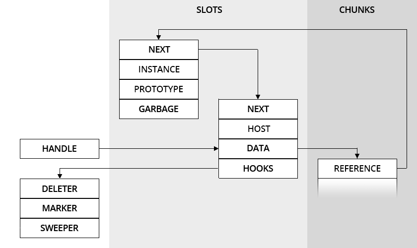

# Handle
Copyright 2016-17 Moddable Tech, Inc. 
Revised: May 17, 2017

## Objective

To develop frameworks for microcontrollers with XS, the most significant constraint is RAM. 

The XS linker prepares most classes, prototypes, functions and byte codes to be accessed straightly from ROM. All the ECMAScript 2017 features, and most modules composing the frameworks are there, instantaneously available and requiring just a few KB of RAM.

For everything that is created at runtime, applications rely on the XS garbage collector to manage memory. XS divides memory into two zones: the slots and the chunks. 

Slots have a fixed size (16 bytes on a 32-bit processor) and cannot move. Chunks have a variable size and can move. The XS garbage collector can compact chunks when necessary, which is a life saver for processors without an MMU. 

Slots are used for anything that fits: booleans, dates, instances, numbers, properties, references, symbols, etc. Chunks are used for everything else: byte codes, arrays, strings, etc.

In practice, the slot and chunk heaps works so well for reducing peak memory use that it is tempting to use JavaScript for everything. But, for critical operations, like the layout and the update of the screen, there is a second constraint: performance.

Accessing properties to get and set their values, to call functions, etc., can have significant performance overhead when it is happening at every frame (30 or 60 fps). Even in the world of web browsers, where JavaScript engines sacrifice MB of RAM to optimize such dispatching and the layout and update of the screen are implemented in C or C++.

XS handles allow C based objects implementations to access properties and to dispatch functions with native performance, while using the memory managed by XS, i.e. slots and chunks.

## Definition

As in the early days of macOS a handle is a pointer to a pointer to a memory block. A handle allows the system to move memory blocks to coalesce free space. Applications store the handle, instead of address of the pointer block, and deference the handle to access memory blocks. The value of the handle never changes, but the address of the memory block may.

In XS, it is similar: a handle is a pointer to a pointer to a chunk. Here is a schema:

The `HANDLE` is a pointer to the `DATA` part of a `HOST` slot. The `DATA` part of a `HOST` slot is a pointer to a chunk. Since slots do not move, a handle remains valid across garbage collections. The XS garbage collector updates the `DATA` part of a `HOST` slot when sweeping chunks.

C based objects are chunks. They can contain anything, for instance colors, coordinates, dimensions, etc. Notice that for such values, C based objects are also saving memory since they can pack several values into one chunk instead of using one slot for each value. The memory savings by applying this approach can be considerable as a JavaScript property requires a slot (16 bytes on a typical MCU) which is larger than a native boolean (1 byte), integer (2 or 4 bytes), or even a floating point double (8 bytes).

From JavaScript, C based objects are just host objects and are accessed thru the `INSTANCE` slot like any host objects. Thru the `PROTOTYPE` part of the `INSTANCE` slot, frameworks provides getters, setters and methods so applications can access and manipulate values as usual. 

## Implementation

C based objects reference other C based object thru handles, i.e. a chunk can contain a handle to another chunk. For instance a content accesses its container with

	(*content)->container
	
That is essential for to achieve maximum performance. For instance, the layout hierarchy is traversed a lot when animating a screen at 30 fps.

What happens when XS collects garbage if a handle inside a chunk is the only reference to a C based object?

By convention, at the beginning of each chunk corresponding to a C based object there is a pointer that is a `REFERENCE` to the `INSTANCE` slot.

C based objects implement host `HOOKS`, which are XS garbage collector callbacks. It is the responsibility of the C based object to use such callbacks to mark its references

	xsMarkSlot(the, (*((*content)->container))->reference);

## Example

Please look at the *Piu* sources, which implement part of the *KinomaJS* programming interface on microcontrollers using the *Commodetto* graphics library. 

