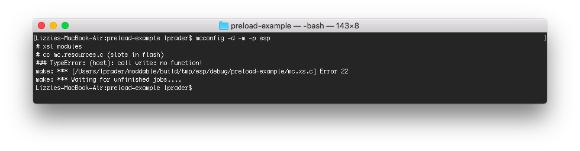
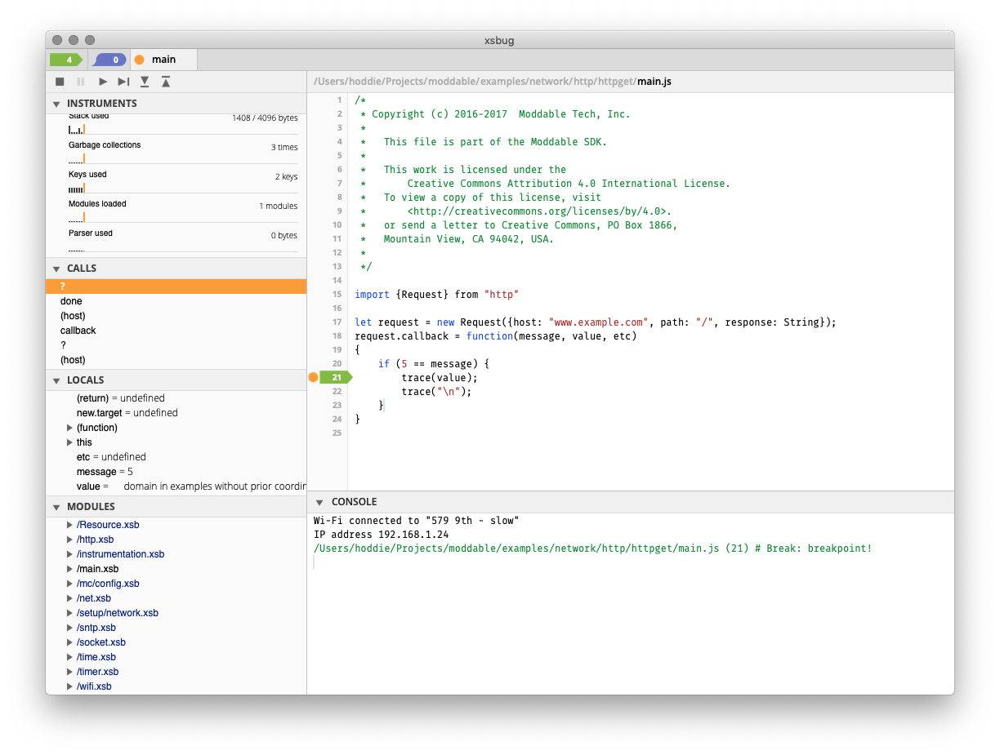

# Using XS Preload to Optimize Applications
Copyright 2019-2021 Moddable Tech, Inc.<BR>
Revised: June 7, 2021

Preloading of modules is a unique feature of the XS JavaScript engine. Preloading executes parts of a JavaScript application during the the build process, before the application is downloaded to the target device. This has two major benefits:

- It speeds start-up of the application by running initialization during the build rather than each time the application launches on the target microcontroller.

- It increases the memory available to scripts by moving memory for objects creating during preload from RAM to Flash (ROM).

Not all modules can be preloaded because not all operations may be performed on the build machine - for example, initializing a Digital pin or connecting to a Wi-FI network. Most of the modules in the Moddable SDK are designed and implemented to support preloading. This  document explains more about the preload feature of XS, how to use it in your projects, and how to apply it to your own modules.

## Specifying Modules to Preload
A project's build manifest, usually a file named `manifest.json`, lists the modules to include together with [many other options](https://github.com/Moddable-OpenSource/moddable/blob/public/documentation/tools/manifest.md). A list of modules to preload is one optional part of the manifest.

	"modules": {
		"*": [
			"./main",
			"$(MODULES)/network/http/*"
		]
	},
	"preload": [
		"http"
	]

In this example, the `http` network protocol module is preloaded but the `main` module is not. For convenience most of the examples in the Moddable SDK do not preload their `main` module, though with a little additional work they could. The details of how are described below.

## Executing a Module
To understand what it means to execute a module, let's look at a trivial module:

```js
class CountingLog {
	constructor() {
		this.count = 1;
	}
	log(msg) {
		trace(`${this.count++}: ${msg}\n`);
	}
}
	
export default CountingLog;
```

Because this module contains only a class definition it may seem that there is no benefit to be had from preloading. In JavaScript, the  class is built dynamically when the class statement is executed, not at compilation time. The JavaScript compiler outputs byte code to build the `CountingLog` class. That byte code is executed when the module is loaded. Creating the class and each of its methods executes byte code (which takes time) and allocates objects (which consume memory). By preloading the `CountingLog` module, both the time and memory are recovered.

Here's another example module, one that imports `CountingLog` and extends it to print the current date and time at the beginning of each log line.

```js
import CountingLog from "countinglog";
	
class CountingDateLog extends CountingLog {
	log(msg) {
		trace(`${new Date} `);
		super.log(msg);
	}
}
	
export default CountingDateLog;
```

When `CountingDateLog` imports `CountingLog`, the import is resolved, which takes some time and uses some memory to keep track of the import. By preloading `CountingDateLog` the import statement is executed at build time, which allows this memory to be kept in flash memory instead of RAM.

Note that when `CountingDateLog` is preloaded, `CountingLog` is also preloaded whether or not it is included in the manifest's `preload` array. Consequently, if a module is to be preloaded, all the modules that it preloads must also support preloading.

## Freezing
The JavaScript language allows objects to be changed at any time. Preloading puts objects into flash memory and flash memory is, for practical purposes, read-only memory. The XS engine allows objects stored in flash to be modified by storing the modifications in RAM. It achieves this by maintaining a pointer in RAM for each object in ROM that may be modified. Each pointer takes up 4 bytes on a typical 32-bit microcontroller.

### Freezing Classes
Because XS allows objects stored in flash to be modified, code that modifies the prototype of a class works, as in the following example.

```js
import CountingLog from "countinglog";
	
CountingLog.prototype.reset = function() {
	this.count = 0;
}
```

Assuming the above module is not preloaded, the `reset` property and the function object it references is stored in RAM. In some cases, that is desirable behavior. However, to enable that behavior XS must reserve a four byte pointer in RAM for `CountingLog` to allow it to be patched. In many, if not most, cases developers of modules do not want to have their objects modified in this way because it can lead to reliability problems and security issues.

The JavaScript language provides the `Object.freeze` function to prevent changes to existing properties and to prevent the addition of new properties. Here is the `CountingLog` module modified to use `Object.freeze` on its prototype.

```js
class CountingLog {
	constructor() {
		this.count = 1;
	}
	log(msg) {
		trace(`${this.count++}: ${msg}\n`);
	}
}
Object.freeze(CountingLog.prototype);
	
export default CountingLog;
```

With this change, the code above that patches the prototype to add the `reset` function throws an exception. The `CountingDateLog` example continues to work as it subclasses `CountingLog` which references `CountingLog.prototype` but does not change it.

The XS engine recognizes that objects which have been frozen cannot be modified, and therefore does not allocate a four byte pointer for them, reducing runtime RAM use. While four bytes may seem like a small benefit, on a device with just a few dozen KB of RAM in a project with a large number of classes, the impact is meaningful.

### Freezing Data
JavaScript applications often use objects to store data. Here's an example from a script that runs in a light bulb.

```js
const Colors = [
	{name: "blue", value: 0x0000FF},
	{name: "white", value: 0xFFFF00},	
	{name: "red", value: 0xFF0000},
	{name: "green", value: 0x00FF00},
	{name: "purple", value: 0xFF00FF},
	{name: "yellow", value: 0xFFFF00},
	{name: "cyan", value: 0x00FFFF},
];
```

The `Colors` object is an `Array` with seven entries. XS reserves a pointer to track changes to `Colors`, as described above. Freezing the `Array` eliminates that pointer:

```js
Object.freeze(Colors);
```

However, the array contains seven objects, and a pointer must also be reserved for each of those, requiring an additional 28 bytes. These objects should also be frozen. Here's one way.

```js
const Colors = [
	Object.freeze({name: "blue", value: 0x0000FF}),
	Object.freeze({white", value: 0xFFFF00}),
	*..*.
```

Unfortunately, that obscures the data. Here's another approach:

```js
const Colors = [
	{name: "blue", value: 0x0000FF},
	{name: "white", value: 0xFFFF00},	
	...
];
Object.freeze(Colors);
Colors.forEach(color => Object.freeze(color));
```

This is better, but it is more code. Further, if these objects had their own sub-objects, additional code would be required.

### Deep Freezing
Freezing objects is more common using XS than in other JavaScript environments. To make it easier for developers to reliably freeze objects, XS extends `Object.freeze` with an optional second argument that that requests the object be frozen recursively. This allows the `Colors` object above to completely frozen with a single call.

```js
const Colors = [
	{name: "blue", value: 0x0000FF},
	{name: "white", value: 0xFFFF00},	
	...
];
Object.freeze(Colors, true);
```

Because this extension is not part of the JavaScript language, care should be taken to only use it in code that is intended for exclusive use by the XS engine. If equivalent functionality becomes available in a standard way such as [`harden`](https://github.com/Agoric/Harden), XS will move to use that mechanism exclusively.

### Automatic Freezing of Built-ins
Following the preload build phase, the XS linker freezes the following:

- The prototypes of built-in objects -- e.g. `Object`, `Math`, `Date`, `Proxy`, etc -- are frozen.
- All functions, both built-in and part of preloaded modules. This include class constructors.

The result of this step generates a runtime environment with characteristics in common with the [Frozen Realms proposal](https://github.com/tc39/proposal-frozen-realms). In addition to memory savings already explained, it provides a reliable execution environment because scripts know the built-in objects are those defined by the JavaScript language specification and that will not change during execution due to runtime patching. Eliminating patching of runtime objects also contributes to providing a secure execution environment.

## Module Scope
Sometimes modules need to maintain information for their entire lifetime, independent of a single class instance. These variables are part of the module's closure, lexically scoped to the module's body. They are created when the module executes. The following revision of `CountingLog` shares a single counter variable across all instances.

```js
let count = 1;

class CountingLog {
	log(msg) {
		trace(`${count++}: ${msg}\n`);
	}
}
Object.freeze(CountingLog.prototype);
	
export default CountingLog;
```

When this module is preloaded, the value of the `count` variable is frozen in ROM as part of the module's closure. As with objects, XS allows such variables to be modified by storing the modification in RAM. It achieves this by maintaining a pointer in RAM for each variable in ROM that may be modified. Each pointer takes up 4 bytes on a typical 32-bit microcontroller.

Use `const` to declare module variables that are not intended to be modified at runtime. Declaring a module variable with `const` conveys to XS that the variable cannot be modified. This saves RAM by eliminating the pointer otherwise needed to allow the variable to be modified.

## What Cannot be Preloaded
Preloading occurs on the build machine, not the target device. That limits the operations that may be performed during preload. 

### Native Functions
Because the build is for the target device, not the build machine, any native functions cannot be executed as they expect a different environment, perhaps even a different instruction set. If a module attempts to call a native function, an error is generated during the build.

For example, the following fails to preload because `Digital.write` is a native function.

```js
import Digital from "pins/digital";
	
Digital.write(1, 0);
```

This image shows the error generated during build when this module is preloaded.



Note that it is safe to define native functions during preload, as in the following example.

```js
class Example {
	static aNativeFunction() @ "xs_nativefunction";
}
```
	
Because calling a native function is not possible, this generates an error at build time:

```js
class Example {
	static aNativeFunction() @ "xs_nativefunction";
}
Example.aNativeFunction();
```

### Some JavaScript Built-ins
Many of the basic JavaScript types and objects may be created at build time allowing the objects created be stored in flash memory. Those which may be safely used include:

- Array
- ArrayBuffer
- BigInt
- Boolean
- class
- DataView
- Date
- Error
- FinalizationGroup
- Function
- Map
- null
- Number
- Object
- Promise
- RegExp
- Set
- String
- Symbol
- TypedArrays (e.g. `Uint8Array`)
- undefined
- WeakMap
- WeakRef
- WeakSet

These objects cannot be stored in flash memory:

- AsyncGenerator
- Generator
- SharedArrayBuffer

In the future XS may support storing additional built-in objects in flash memory. For details on built-in objects stored in flash memory see the [XS Linker Warnings](./XS%20linker%20warnings.md) document. 

These objects cannot be stored in flash. However, they maybe used during preload as long as they do not need to be stored. For example, code that executes a part of preload can safely use `RegExp` as long as there are no regular expression instances remaining when the preload phase ends.

## Preloading `main`
The `main` module is the first application script executed. To do its work, the `main` module usually imports other modules. The `main` module of a project is often the only module that is not set to preload. This is done for convenience, and for small projects, like examples in the Moddable SDK, it is often not a problem. The application's `main` module invariably invokes native functions, to connect to Wi-Fi, display an image, or toggle a digital pin. As noted above native functions cannot be called during preload.

Here's a trivial example of an application that turns on one LED using a Digital pin at start-up and sets a repeating timer to toggle the state of another LED.

```js
import Digital from "pins/digital:
	
let toggle = false;
	
Digital.write(1, true);
Timer.repeat(() => {
	toggle = !toggle;
	Digital.write(2, toggle)
}
```

In the Moddable SDK runtime, if the `main` module returns a function, that function is executed immediately. This can be used to make `main` support preloading. Here is a naive example of doing that:

```js
import Digital from "pins/digital:
	
export default function() {
	let toggle = false;
	
	Digital.write(1, true);
	Timer.repeat(() => {
		toggle = !toggle;
		Digital.write(2, toggle)
	}, 1000);
}
```

It is sometimes useful to organize `main` with a simple class that is instantiated from the exported function. This structures the code more cleanly and any needed state, such as `toggle` in the above example, is part of the instance state accessed using `this`.

```js
import Digital from "pins/digital:

class App {
	constructor() {
		Digital.write(1, true);

		this.toggle = false;
		Timer.repeat(this.blink.bind(this), 1000);
	}
	blink() {
		this.toggle = !this.toggle;
		Digital.write(2, this.toggle)
	}
}

export default function() {
	new App;
}
```

## Pre-calculating During Preload
Because microcontrollers are relatively slow in performance, a common optimization technique is to use tables of pre-calculated values to minimize the complex calculations that need to be performed on the microcontroller. The values are typically calculated by another program and then entered into a data structure such as an array.

For example, the floating square root function is relatively complex and so is a good candidate for optimization when used in performance critical situations. The following example, contrived for simplicity, uses an array containing the square roots of the integers from 0 to 10 as a look-up table.

```js
const roots = [
	0,
	1,
	1.4142135624,
	1.7320508076,
	2,
	2.2360679775,
	2.4494897428, 
	2.6457513111,
	2.8284271247,
	3,
	3.1622776602
];
Object.freeze(roots);
	
function fastSquareRootToTen(x) {
	return roots[x];
}
```

With eleven elements, the table is already awkward. With 100 or 1000, it becomes unwieldy. Worse, there is no way to be certain the values are correct by visual inspection, so errors could creep in unnoticed. Taking advantage of preloading solves these problems by generating the table programmatically at build time.

```js
const roots = [];
for (let i = 0; i <= 10; i++)
	roots[i] = Math.sqrt(i)
Object.freeze(roots);
	
function fastSquareRootToTen(x) {
	return roots[x];
}
```

This technique may be applied to perform more sophisticated calculations and to generate data structures more complex than arrays.

## Using xsbug to Check Preloaded Modules 
Determining if all the modules in a project are set to preload is difficult by inspecting the source code. The xsbug debugger has two features to help.

In the Instruments pane, there is a "Modules loaded" area that shows the number of runtime loaded modules for each second of execution. In most projects this number should be either one or zero. 

The module pane shows a list of all loaded modules and indicates by color which of the modules are preloaded. Modules which are preloaded are shown in blue and those loaded at runtime are shown in black.

In the image below, the Instruments shows one module is loaded at the time of breakpoint and the Modules pane shows that the `main` module was loaded at runtime.



## Conclusion
Preloading of modules is a unique feature of the XS JavaScript engine to enable more efficient use of the limited RAM and performance of microcontrollers. It is widely supported by the modules provided in the Moddable SDK, so developers benefit from preloading even if they don't understand it fully. By understanding the preload mechanism, developers can realize its benefits for their own code. Those benefits include:

- Faster start-up time by moving initialization code from the microcontroller to build machine
- Increased free memory for their project code by moving objects created during initialization to flash (ROM) memory
- Nearly instant importing of modules
- More errors caught at build time
- Simplification of embedded look-up tables and data structures using pre-calculation techniques

#### Thank You

This document was created in response to a [request](https://twitter.com/moddabletech/status/1086084032008413184) on Twitter from @hori__hiro.

An initial draft of this document was written by Lizzie Prader, who helped edit this document.

The use of terminology at the start of the Module Scope section in the initial posting was imprecise. Thank you to Allen Wirfs-Brock for suggesting improvements.
