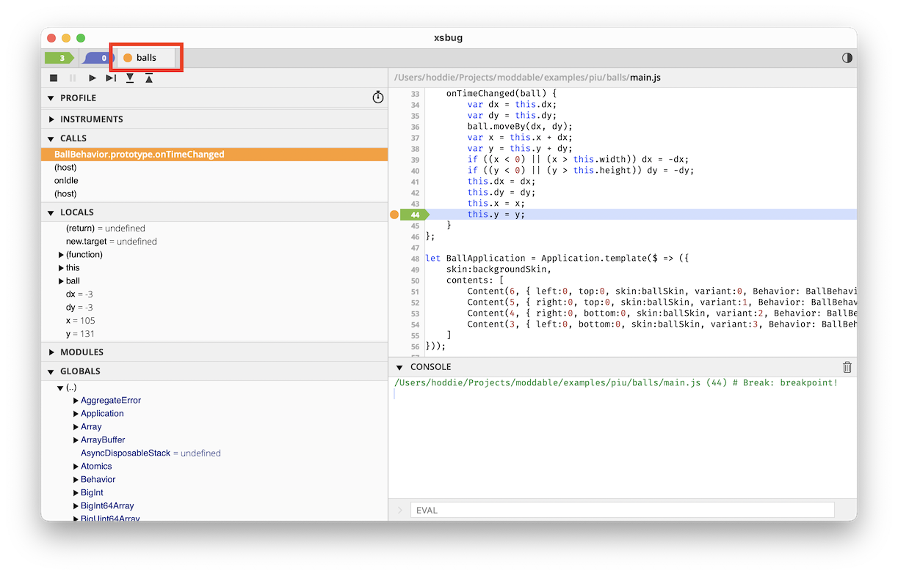
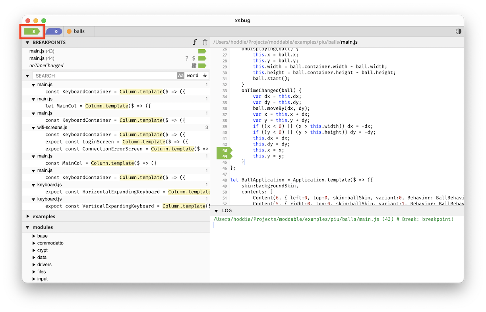
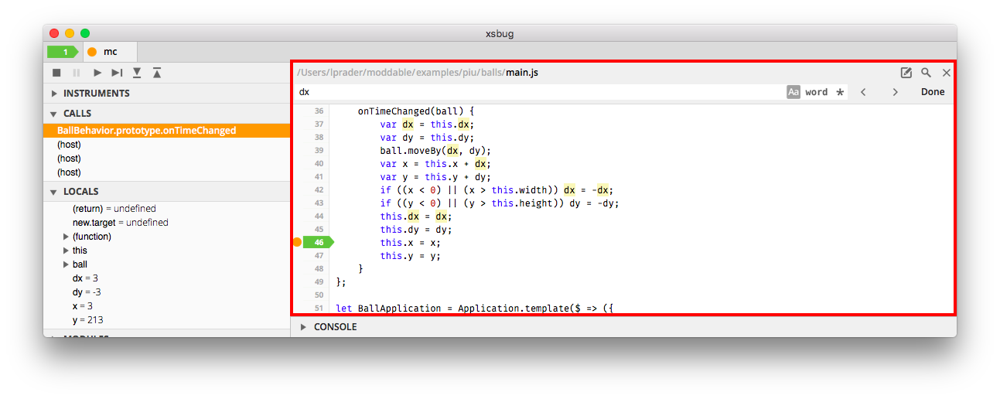
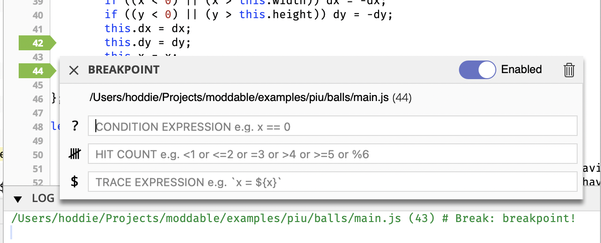
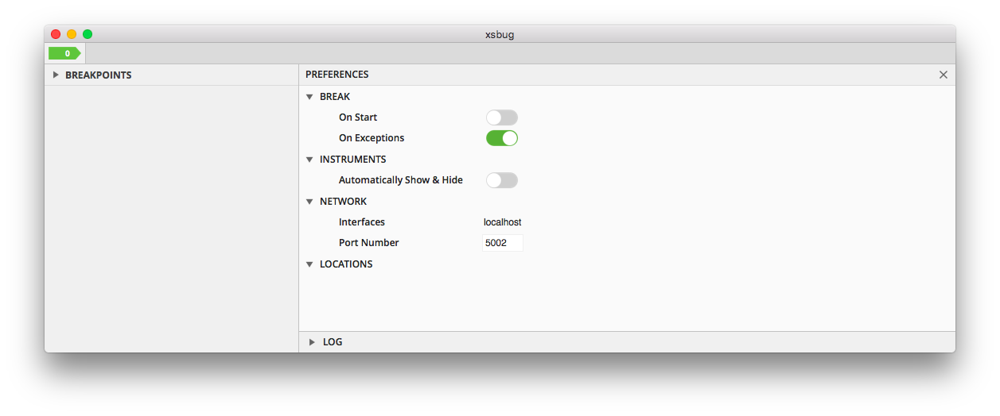
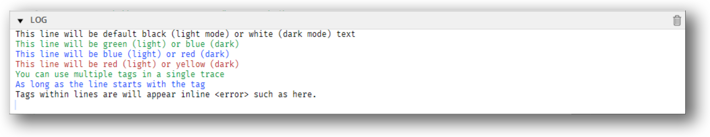

# xsbug
Updated October 2, 2023

The `xsbug` JavaScript source level debugger is a full featured debugger that supports debugging modules and applications for [XS platforms](../xs/XS%20Platforms.md). The `xsbug` debugger is automatically launched when deploying debug builds and connects to devices via USB or over Wi-Fi. Similar to other debuggers, `xsbug` supports setting breakpoints and browsing source code, the call stack, local variables, and global variables. The `xsbug` debugger additionally provides real-time instrumentation to track memory usage and profile application and resource consumption. There is also an integrated [performance profiler](#profiler) for identifying performance hot-spots.

A video demonstration of xsbug is available [here](https://youtu.be/vqu8gDV7AOo).

> Note: For developers who prefer to use a console log for debugging, xsbug-log maybe used instead of xsbug. See [below](#xsbug-log) for details.

## Machine Tabs

Figure 1 shows the machine tab view. At the top of the window, there are tabs for all XS virtual machines connected to **xsbug** (highlighted in red in the image below). The orange bullet signifies a "broken" virtual machine. Select the tab to see where and why the virtual machine is broken.

> **Note:** A virtual machine is "broken" when stopped at a breakpoint, `debugger` statement or exception.

**Figure 1.** Machine tab view



The left pane displays:

* The **Kill** , **Break** , **Run** , **Step** , **Step In**   and **Step Out**   buttons. Corresponding menu items and shortcuts are also available in the **Debug** menu to control the virtual machine.
* The **Profile** panel. Use this to activate the [performance profiler](#profiler) to locate performance hotspots in scripts.
* The **Instrumentation** panel. Use this to track memory usage and monitor resource consumption in real-time.
* The **Calls** stack panel. Select a row in this panel to see the source code line where the call was made and to inspect the local variables of that stack frame.
* The **Locals**, **Modules**, and **Globals** panels. Use these to inspect values of local and global variables and see which modules are loaded. Dictionaries and arrays have the  icon next to their name. You can inspect the values of an object's properties or an array's items by tapping the name to expand the row.

The right panes display:

* The selected file.
* The console. Each virtual machine has its own console.
* A field to enter JavaScript expressions to be evaluated. This field is labeled "EVAL" and is only available when stopped at a breakpoint. See [Interactive Console](repl) for more information.

## Breakpoints Tab

Figure 2 shows the Breakpoints tab view. Select the first tab (highlighted in red in the image below) to browse and search files and folders to set and clear breakpoints. Breakpoints can be edited even when no virtual machines are connected to **xsbug**.

To disable/enable a breakpoint, click on the breakpoint in the breakpoint tab then select the **Disable Breakpoint** or **Enable Breakpoint** option in the **Debug** menu.

To add files and folders to **xsbug**, select the **Open File...** and **Open Folder...** items in the **File** menu, or drag and drop files and folders into the **xsbug** window.

To remove files and folders from **xsbug**, use the **Close**  button in the header of a files and folders panel.

**Figure 2.** Breakpoints tab view



The left pane displays:

* The **Breakpoints** themselves. Tap a row in this panel to see where the breakpoint is. Each breakpoint row shows icons corresponding to features used by the breakpoint - a question mark for Conditional breakpoints, a tally for Hit Count breakpoints, and a "$" prompt for Trace Expressions. In the header of this panel, there are two icons. The first is an "f" button for setting Function Name breakpoints. The second is a **Trash**  button to clear all breakpoints. 

* The **Search** panel. Use this to recursively search all the files in all the folders added to **xsbug**.
* Zero or more files and folders panels. Tap folder rows to browse, select a file row to display the file.

The right pane displays:

* The selected file.
* The **xsbug** log, which merges the output of the consoles of all connected virtual machines. The log survives the disconnection of virtual machines.

## File Pane

Figure 3. shows the File pane (highlighted in red). Selecting a row in the **Breakpoints** or **Calls** panels, or selecting a file in a folder panel opens a right pane with source code.

**Figure 3.** File pane



In the header of the pane:

* Tapping the parts of the path open folders in the Finder or Explorer.
* The **Edit**  button opens the file in its default editor.
* The **Find**  button extends the header with a field to search the file.
* The **Close**  button closes the file pane.

To edit a breakpoint, tap the breakpoint's arrow in the File Pane to display the editor.



Breakpoints may be moved by dragging the breakpoint's arrow up and down.

Breakpoints may be deleted by dragging the breakpoint's arrow to the left.

## Preferences Pane

Figure 4. shows the Preferences pane. Selecting the **Preferences** item from the **xsbug** menu opens a right pane with preferences panels.

**Figure 4.** Preferences pane



The **Break** preferences panel toggles the **Break On Start** and **Break On Exceptions** flags for all virtual machines.

The **Instruments** preferences panel allows you to select whether you want the instrumentation panel to automatically show while all virtual machines are running and hide when a virtual machine breaks.

The **Network** preferences panel displays the interfaces **xsbug** is listening on, and provides an edit field to change the port number **xsbug** is listening with. The default port number is **5002**. Changing the port number kills any connected virtual machines.

<a id="repl"></a>
## Interactive Console (EVAL)

The interactive console is shown at the bottom of the File Pane when stopped at a breakpoint. Eval expressions may be used in many different ways:

- Display a value: `this`, `this.prototype`, `x`, `this.#ref`
- Perform a calculation: `x + y`, `this.bounds.width * this.bounds.height`
- Call functions: `this.update()`, `Math.round(x)`
- Set values: `this.x = 12`, `globalThis.keep = this`, `this.#ref = null`

JavaScript expressions entered into the Eval field are evaluated in the context of the current breakpoint. The evaluation context is also defined by the currently selected stack frame in the Calls panel, which changes the local variables that are visible and the value of `this`.

If an expression uses a feature of JavaScript that has been optimized out (using the strip feature of XS to minimize the size of the engine), the console displays `"dead strip"`.

Expressions may access private fields of objects with some restrictions. First, access to private fields is based on the scope. If the current scope cannot access a private field, then the Eval expression cannot either. In addition, only the private fields that are referenced by the current function may be accessed by an expressions.

<a id="profiler"></a>
## Performance Profiler

xsbug has an integrated performance profiler that is invaluable for identifying performance hotspots in JavaScript code. The profiler works on JavaScript running on embedded device targets and the simulator.

These resources will help you get started:

- [High level introduction](https://blog.moddable.com/blog/profiler/) to the profiler on the Moddable blog
- [Step-by-step walkthrough](https://blog.moddable.com/blog/optimizing-life/) showing how the XS profiler was used to identify performance hotspots, guide optimizations, and verify performance improvements
- [Technical details](./XS%20Profiler.md) on the XS performance profiler including implementation notes and how the displayed time values are calculated


<a id="colorize"></a>
## Colorizing console/log with trace

You can colorize your output in the console/log pane when using `trace` on a per-line basis by using a tag at the start a line.  Available tags are:

* `<info>`
* `<warn>`
* `<error>`

The color used is dependent upon the dark/light theme that is selected.

For example,

```js
trace('This is a standard text line\n');
trace('<info>This is an "<info>" line\n');
trace('<warn>This is a "<warn>" line\n');
trace('<error>This is an "<error>" line\n');

trace('<info>You can use multiple tags in a single trace\n<warn>As long as the line ');
trace('starts with the tag\n');
```



## Unit Test Runner

xsbug may be used to run tests262 and unit tests, such as [those included](../../tests) in the Moddable SDK,  See the [Testing the Moddable SDK](../tools/testing.md) document for instructions on using xsbug for testing.


<a id="xsbug-log"></a>
## xsbug-log

xsbug-log is an alternative to xsbug. Instead of a graphical user interface, it is a simple console log of the project's output. xsbug-log useful when running on devices without a display (so-called "headless" devices) and for developers who prefer debugging with only console output.

xsbug-log is implemented in Node.js. To use it, you must first install the dependencies:

```
cd $MODDABLE/tools/xsbug-log
npm install
```

To use xsbug-log with `mcconfig` use `-dl` (for debug log) in place of`-d` on the command line.

```
mcconfig -dl -m -p esp32/moddable_two
```

